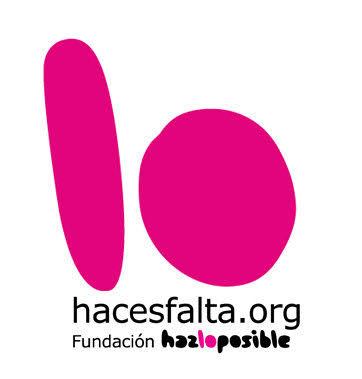
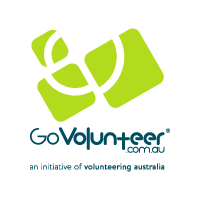
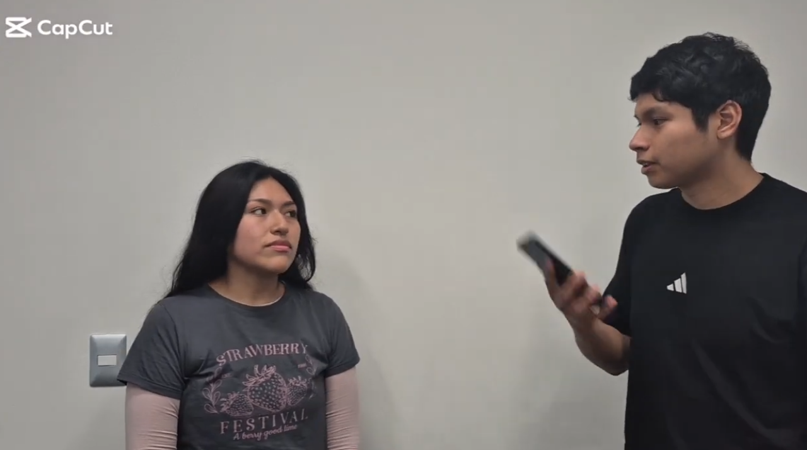

</img> 

Universidad Peruana de Ciencias Aplicadas 
Carrera de Ingeniería de Software  

<strong>1ACC0238</strong> 
<strong>Aplicaciones para Dispositivos Moviles</strong> 
NRC 
<strong>4945</strong> 
<strong>Informe del Trabajo Final</strong> 
Docente 
<strong>Jorge Luis Mayta Guillermo</strong> 
Equipo 
<strong>BlockVoluntariado</strong>  

Proyecto 
<strong>BlockVoluntariado</strong>  

<strong>Integrantes</strong>

<table>
  <thead>
    <tr>
      <th>Código</th>
      <th>Apellidos y Nombres</th>
    </tr>
  </thead>
  <tbody>
    <tr>
      <td>U20241e179</td>
      <td>Tavara Correa, Sebastian Oswaldo</td>
    </tr>
    <tr>
      <td>U20241e107</td>
      <td>Tuncar Vila, Ghorghet Saul</td>
    </tr>
    <tr>
      <td>U20241e014</td>
      <td>Cabrejos Chocco, Diego Alexander</td>
    </tr>
  </tbody>
</table>

<strong>Período 202620</strong>  

<strong>Julio 2026</strong>

## Registro de Versiones del Informe
| Versión | Fecha | Autor | Descripción de modificación |
|---|---|---|---|
| | | | |

## Project Report Collaboration Insights

## Contenido

- [Student Outcome](#student-outcome)
- [Objetivos SMART](#objetivos-smart)
- [Capítulo I: Presentación](#capítulo-i-presentación)
  - [1.1. Startup Profile](#11-startup-profile)
    - [1.1.1. Descripción de la Startup](#111-descripción-de-la-startup)
    - [1.1.2. Perfiles de integrantes del equipo](#112-perfiles-de-integrantes-del-equipo)
  - [1.2. Solution Profile](#12-solution-profile)
    - [1.2.1. Antecedentes y problemática](#121-antecedentes-y-problemática)
    - [1.2.2. Lean UX Process](#122-lean-ux-process)
  - [1.3. Segmentos objetivo](#13-segmentos-objetivo)
- [Capítulo II: Requirements Development and Software Solution Design](#capítulo-ii-requirements-development-and-software-solution-design)
  - [2.1. Competidores](#21-competidores)
    - [2.1.1. Análisis competitivo](#211-análisis-competitivo)
    - [2.1.2. Estrategias y tácticas frente a competidores](#212-estrategias-y-tácticas-frente-a-competidores)
  - [2.2. Entrevistas](#22-entrevistas)
    - [2.2.1. Diseño de entrevistas](#221-diseño-de-entrevistas)
    - [2.2.2. Registro de entrevistas](#222-registro-de-entrevistas)
    - [2.2.3. Análisis de entrevistas](#223-análisis-de-entrevistas)
  - [2.3. Needfinding](#23-needfinding)
    - [2.3.1. User Personas](#231-user-personas)
    - [2.3.2. User Task Matrix](#232-user-task-matrix)
    - [2.3.3. User Journey Mapping](#233-user-journey-mapping)
    - [2.3.4. Empathy Mapping](#234-empathy-mapping)
    - [2.3.5. Big Picture EventStorming](#235-big-picture-eventstorming)
    - [2.3.6. Ubiquitous Language](#236-ubiquitous-language)
  - [2.4. Requirements specification](#24-requirements-specification)
    - [2.4.1. User Stories](#241-user-stories)
    - [2.4.2. Impact Mapping](#242-impact-mapping)
    - [2.4.3. Product Backlog](#243-product-backlog)
  - [2.5. Strategic-Level Domain-Driven Design](#25-strategic-level-domain-driven-design)
    - [2.5.1. EventStorming](#251-eventstorming)
    - [2.5.2. Context Mapping](#252-context-mapping)
    - [2.5.3. Software Architecture](#253-software-architecture)
  - [2.6. Tactical-Level Domain-Driven Design](#26-tactical-level-domain-driven-design)
    - [2.6.x. Bounded Context: <Bounded Context Name>](#26x-bounded-context-bounded-context-name)
- [Capítulo III: Solution UI/UX Design](#capítulo-iii-solution-uiux-design)
  - [3.1. Product design](#31-product-design)
    - [3.1.1. Style Guidelines](#311-style-guidelines)
    - [3.1.2. Information Architecture](#312-information-architecture)
    - [3.1.3. Landing Page UI Design](#313-landing-page-ui-design)
    - [3.1.4. Mobile Applications UX/UI Design](#314-mobile-applications-uxui-design)
- [Capítulo IV: Product Implementation & Validation](#capítulo-iv-product-implementation--validation)
  - [4. Product Implementation & Validation](#4-product-implementation--validation)
    - [4.1. Software Configuration Management](#41-software-configuration-management)
    - [4.2. Landing Page & Mobile Application Implementation](#42-landing-page--mobile-application-implementation)
    - [4.3. Validation Interviews](#43-validation-interviews)
- [Conclusiones](#conclusiones)
  - [Conclusiones y recomendaciones](#conclusiones-y-recomendaciones)
- [Video App Validation](#video-app-validation)
- [Video About the product](#video-about-the-product)
- [Video About the team](#video-about-the-team)
- [Glosario](#glosario)
- [Bibliografía](#bibliografía)
- [Anexos](#anexos)

## Student Outcome

## Objetivos SMART

# Capítulo I: Presentación
## 1.1. Startup Profile
### 1.1.1. Descripción de la Startup

Es una plataforma en donde los ciudadanos puedan tener la oportunidad de participar en un voluntariado, estos voluntarios son ofrecidos por ONG 's, instituciones o empresas. El objetivo de esta plataforma es facilitar el acceso a voluntariados.

### 1.1.2. Perfiles de integrantes del equipo

| **Nombre Completo del integrante**    | 	**Descripcion de la carrera**                                   | **Fotografia**                                                         | **Conocimientos y habilidades**
| :------------------------------------ |:-----------------------------------------------------------------|:-----------------------------------------------------------------------|:------------------------------------ |
| Tavara Correa, Sebastian Oswaldo      | Ingeniería de Software Universidad Peruana de Ciencias Aplicadas |  | Soy Sebastian Oswaldo Tavara Correa estudiante de la carrera de ingeniería de software, actualmente cursando el 6to ciclo, me considero una persona estudiosa y muy colaborativa al trabajar en grupo. Me adapto rápidamente a cualquier entorno. Me interesa desarrollar soluciones tecnológicas que tengan un impacto positivo. Creo que el desarrollo de software no debe limitarse en buscar la mayor funcionalidad, sino que también en generar bienestar en la sociedad.
| Tuncar Vila, Ghorghet Saul      | Ingeniería de Software Universidad Peruana de Ciencias Aplicadas |                | Soy Ghorghet Saul Tuncar Vila, estudiante de 6to ciclo de Ingeniería de Software. Cuento con una base sólida en el desarrollo de algoritmos en C++, la creación de interfaces web interactivas mediante HTML, CSS y JavaScript, y el dominio de bases de datos relacionales (MySQL) y no relacionales (MongoDB). Me apasiona transformar problemas complejos en soluciones de software eficientes, escalables y con una gestión de datos versátil. Mi enfoque combina la rigurosidad técnica con habilidades blandas como la proactividad y la empatía, lo que me permite integrarme fácilmente en equipos colaborativos bajo metodologías ágiles.
| Cabrejos Chocco, Diego Alexander      | Ingeniería de Software Universidad Peruana de Ciencias Aplicadas |                | Soy Diego Alexander Cabrejos Chocco estudiante de la carrera de ingeniería de software, actualmente cursando el 6to ciclo, soy una persona sociable, creativa, que trabaja bien en equipo y busco que todo el equipo participe en las actividades activamente. Me adapto rapidamente a la modalidad de trabajo. Mi meta es poder crear y desarrollar proyectos tecnologicos que tenga un impacto positivo y que sea entretenido. Lo mas interesante de la Software es que cada vez se va expandiendo, y las opciones para poder desarrollar algun proyecto por mas interesante o loco que paresca el tema, no es impedimento para desarrollar lo que desees. (claro que siempre siguiendo el tema legal)

## 1.2. Solution Profile
### 1.2.1. Antecedentes y problemática

Según el Programa de los Voluntarios de las Naciones Unidas (VNU, 2022), la digitalización ha transformado las vías de compromiso, creando nuevos modelos de colaboración. A pesar de este avance tecnológico, muchas Organizaciones No Gubernamentales (ONG) y empresas con programas de responsabilidad social en América Latina aún dependen de canales de difusión fragmentados, como grupos de redes sociales no especializados o redes de contactos personales (CEPAL, 2021). Esto genera un ecosistema ineficiente donde las organizaciones invierten demasiados recursos en reclutamiento y los estudiantes universitarios no encuentran oportunidades confiables que se ajusten a su formación o tiempos. Aunque los estudiantes tienen una alta disposición para participar con el fin de aportar a la sociedad, ganar experiencia práctica y desarrollar habilidades blandas, se enfrentan a barreras estructurales:

Falta de centralización: No existe una plataforma unificada y de fácil acceso desde dispositivos móviles que consolide las convocatorias formales de ONG y empresas.

Gestión de tiempos y reconocimiento: Los estudiantes tienen horarios académicos rígidos y necesitan que sus horas de voluntariado sean certificadas formalmente para sus currículums o créditos universitarios. Actualmente, el proceso de seguimiento de horas y emisión de constancias es manual, burocrático y propenso a errores (VNU, 2022).

### 1.2.2. Lean UX Process
#### 1.2.2.1. Lean UX Problem Statements

La problemática fue detectada en el sector de voluntarios, nos enfocaremos principalmente en estudiantes universitarios que buscan voluntariados de forma manual por redes sociales o paneles publicitarios y ONGs que realizan convocatorias de voluntariados, nuestro enfoque inicial serán estudiantes universitarios que necesitan créditos extracurriculares para graduarse de la universidad y no cuentan con una aplicación que facilite la búsqueda de voluntarios basándose a sus preferencias y nesecidades, block voluntariado es una aplicación móvil donde después de registrarte podrás filtrar un voluntariado según tus preferencias y matricularte. Sabremos que tendremos éxito cuando veamos que el 50% de los estudiantes registrados logren matricularse en la aplicación en la primera semana de uso.

#### 1.2.2.2. Lean UX Assumptions
- Los jóvenes universitarios están interesados en realizar microvoluntariados.
- Los voluntarios valoran que su participación sea reconocida mediante certificados digitales, créditos sociales o mecanismos equivalentes.
- Las ONG confían más en una plataforma especializada y organizada que en convocatorias abiertas publicadas únicamente en redes sociales.
- Las organizaciones necesitan medir la participación social de sus miembros para realizar seguimiento, generar reportes y demostrar el impacto de sus actividades.
- Las ONG podrían estar dispuestas a contratar servicios adicionales de la plataforma si estos reducen el costo y esfuerzo de gestión de voluntarios.
- Los usuarios continuarán utilizando la plataforma si obtienen beneficios emocionales, como el sentido de pertenencia y ayuda social, y beneficios tangibles, como certificados o reconocimientos.

#### 1.2.2.3. Lean UX Hypothesis Statements
- Creemos que la aplicación incrementará la cantidad de personas interesadas en participar como voluntarios. Sabremos que hemos tenido éxito cuando observemos un crecimiento de al menos 25 % en los voluntarios registrados respecto al trimestre anterior. Esto se medirá mediante las estadísticas de registro y participación de la plataforma.
- Creemos que las ONG publicarán más convocatorias si encuentran una comunidad de estudiantes correctamente registrados y con perfiles completos. Sabremos que esto es cierto cuando aumente de forma sostenida la cantidad de organizaciones activas y convocatorias publicadas.
- Creemos que los jóvenes participarán más si encuentran voluntariados que se ajusten a su disponibilidad. Sabremos que logramos el objetivo cuando una parte importante de las postulaciones utilice los filtros de tiempo y duración. Esto se medirá mediante métricas de interacción y registros de búsqueda.
- Creemos que una interfaz fácil e intuitiva motivará a los voluntarios a utilizar con mayor frecuencia la aplicación. Sabremos que esto es cierto cuando la mayoría de usuarios califique la experiencia como “fácil” o “muy fácil” en las evaluaciones de usabilidad.
- Creemos que trabajar con ONG reconocidas aumentará la confianza de los voluntarios. Sabremos que hemos tenido éxito cuando una proporción relevante de los usuarios participe en oportunidades publicadas por organizaciones aliadas.
- Creemos que clasificar los voluntariados por categorías, ubicación, duración y otros criterios ayudará a los usuarios a encontrar oportunidades adecuadas. Lo mediremos mediante el uso de filtros y categorías en las búsquedas.
- Creemos que entregar insignias, puntos o certificados por completar correctamente un voluntariado aumentará la motivación y la responsabilidad de los usuarios. Lo mediremos mediante la cantidad de logros obtenidos y reclamados después de finalizar una actividad.

#### 1.2.2.4. Lean UX Canvas
El Lean UX Canvas de BlockVoluntariado resume el problema de negocio, los usuarios, los resultados esperados y las principales hipótesis de la solución.

**Business Problem.** Las ONG y otras organizaciones tienen dificultades para convocar y gestionar voluntarios de forma rápida y confiable. Al mismo tiempo, muchos jóvenes desean ayudar, pero no encuentran oportunidades que se adapten a sus horarios y disponibilidad.

**Business Outcomes.**
- Incrementar la participación de voluntarios activos durante los primeros meses de uso de la plataforma.
- Reducir el esfuerzo y costo que las ONG destinan a la convocatoria y gestión de voluntarios.
- Aumentar la visibilidad de las convocatorias publicadas por las organizaciones.

**Users.**
- Jóvenes universitarios que desean participar en voluntariados flexibles y compatibles con sus actividades académicas.
- ONG y fundaciones sociales que necesitan captar, organizar y dar seguimiento a voluntarios.

**User Outcomes & Benefits.**
- Los jóvenes podrán encontrar oportunidades presenciales o virtuales de forma rápida, aplicando filtros según sus necesidades.
- Las ONG podrán publicar convocatorias y gestionar postulantes desde un mismo espacio, mejorando el seguimiento y la confiabilidad del proceso.

**Solutions.**
- Aplicación móvil con listado de voluntariados y filtros por tiempo, ubicación, modalidad y categoría.
- Herramientas para publicar y administrar convocatorias.
- Gestión del historial y participación de los voluntarios.
- Mecanismos de reconocimiento, como certificados, puntos o insignias.

**Aprendizajes prioritarios.** Se necesita validar qué factores hacen que un voluntario abandone una actividad, en qué periodos existe mayor riesgo de inasistencia y qué elementos de la experiencia digital generan mayor motivación y confianza.

## 1.3. Segmentos objetivo
- Jóvenes universitarios

En esta sección se describe al segmento conformado por estudiantes de educación superior, principalmente de entre 18 y 30 años, con alta familiaridad tecnológica y disposición para participar en actividades de voluntariado de corta duración. Los cuales representan una parte importante de la población joven conectada del país, interesada en generar impacto social, fortalecer su perfil académico y profesional, y obtener reconocimiento a través de créditos sociales y certificaciones digitales.

- ONG’S y fundaciones sociales

Este segmento incluye a organizaciones sin fines de lucro que operan en distintas regiones y que requieren voluntarios confiables para tareas específicas como campañas de sensibilización, traducciones, reportes comunitarios o capacitaciones. Muchas de estas entidades trabajan con recursos limitados y necesitan optimizar su alcance y medir su impacto de forma transparente, encontrando en la plataforma una solución para acceder a voluntarios trazables y comprometidos.

# Capítulo II: Requirements Development and Software Solution Design
## 2.1. Competidores
### 2.1.1. Análisis competitivo

Nos enfrentamos a varios competidores de plataformas de voluntariado digital y presencial. Por un lado, Idealist que opera globalmente conectando personas con oportunidades en ONG’s, empleo y voluntariado (Idealist, s. f.). De igual modo, Hacesfalta facilita que organizaciones sin fines de lucro difundan vacantes de voluntariado y empleo social (Hacesfalta s. f.). Por otro lado, iniciativas como GoVolunteer se destacan en el ámbito local al facilitar la participación ciudadana a través de programas comunitarios, colaboraciones con empresas y gobiernos. Asimismo, plataformas especializadas como Catchafire compiten directamente en el nicho del voluntariado por habilidades, brindando a las organizaciones acceso a profesionales que ofrecen servicios específicos en áreas como diseño, finanzas o comunicación (Catchfire, s. f.). Además, emergen otras propuestas digitales que promueven el microvoluntariado o tareas virtuales de corta duración, las cuales responden a la demanda de nuevas generaciones que buscan experiencias más flexibles y rápidas. 

<table border="1" cellpadding="5" cellspacing="0">
  <tr>
    <th colspan="6"><b>Competitive Analysis Landscape</b></th>
  </tr>
  <tr>
    <td>¿Por qué llevar a cabo este análisis?</td>
    <td colspan="5"> Llevar a cabo este análisis nos permite entender mejor el entorno competitivo de BlockVoluntariado. Ayuda a identificar las fortalezas y debilidades de nuestra aplicación en comparación   con   otras,   lo   que   nos   permite   desarrollar   estrategias   efectivas   para destacar en el mercado. Nos ayuda a tomar decisiones informadas y a mejorar continuamente para satisfacer las necesidades de nuestros usuarios. </td>
  </tr>
  <tr>
    <td colspan="2">Nombre y logo de competidor</td>
    <td><b>Idealist  </b></td>
    <td><b> HacesFalta</b>  </td>
    <td><b>GoVolunteer</b>  </td>
    <td><b>CatchaFire</b>  </td>
  </tr>
  <tr>
    <td rowspan="2"><b>Perfil</b></td>
    <td><b>Overview</b></td>
    <td>Es una de las plataformas más grandes y antiguas a nivel mundial para conectar a las personas con oportunidades de impacto social. Allí se pueden encontrar voluntariado,empleos en ONG, tanto presenciales como virtuales </td>
    <td>Es una plataforma española, gestionada por la Fundación Hazloposible, que conecta voluntarios, ONG y profesionales. Además de voluntariado, también ofrece empleos y tiene presencia en España y en México. </td>
    <td>EEs una plataforma creada en Alemania que conecta a voluntarios, ONG y empresas. Tiene un fuerte enfoque local: permite encontrar proyectos de voluntariado según ciudad o región, y colabora con gobiernos y centros comunitarios..</td>
    <td>Es una plataforma global especializada en voluntariado por habilidades profesionales. Conecta a profesionales  con ONG que necesitan ayuda en proyectos específicos, mayormente se realizan de forma virtual.</td>
  </tr>
  <tr>
    <td><b>Ventaja competitiva ¿Qué valor ofrece a los clientes?</b></td>
    <td> Su ventaja competitiva es  que reúne en un solo lugar miles de oportunidades sociales de todo el mundo. Esto lo convierte en un punto de encuentro global para personas interesadas en ayudar y organizaciones que buscan voluntarios o profesionales. </td>
    <td> Su ventaja competitiva es que  permite encontrar voluntarios según causas específicas medioambiente, infancia, salud, etc. Lo que la hace cercana y especializada para el público local.</td>
    <td>Su ventaja competitiva es el matching local que  ayuda a los usuarios a encontrar proyectos cerca de ellos, y a las empresas a gestionar programas de voluntariado corporativo.</td>
    <td> Su ventaja competitiva es que ofrece voluntariados estructurados y de alto impacto ya que cada proyecto tiene objetivos claros, plantillas y entregables.</td>
  </tr>
  <tr>
    <td rowspan="2"><b>Perfil de Marketing</b></td>
    <td><b>Mercado objetivo</b></td>
    <td>Los jóvenes, estudiantes, profesionales con interés social y ONG de distintos países.</td>
    <td>Voluntarios como jóvenes y adultos en España y Latinoamérica, ONG que buscan apoyo, y personas interesadas en trabajar profesionalmente en proyectos sociales..</td>
    <td>Voluntarios en ciudades alemanas y europeas, ONG locales, y empresas que buscan programas de Responsabilidad Social Corporativa. </td>
    <td>Profesionales con experiencia que quieren donar su tiempo y empresas que buscan programas de voluntariado corporativo. </td>
  </tr>
  <tr>
    <td><b>Estrategias de marketing</b></td>
    <td>Se posiciona como un portal de referencia en Google (SEO), publica artículos y guías en su blog, mantiene presencia activa en redes sociales como Facebook  y hace alianzas con universidades y organizaciones internacionales.</td>
    <td>Difunde oportunidades en redes sociales, utiliza SEO local para aparecer en búsquedas en español, y trabaja en colaboración con ministerios, fundaciones y organizaciones.</td>
    <td>Realizan campañas comunitarias, alianzas con gobiernos locales y con centros de voluntariado y colaboraciones con empresas</td>
    <td>
Se apoya en alianzas con corporaciones para ofrecer voluntariado a empleados y un mayor alcance en lo digital.</td>
  </tr>
  <tr>
    <td rowspan="3"><b>Perfil de Producto</b></td>
    <td><b>Productos y Servicios</b></td>
    <td>Buscador de oportunidades de voluntariado y empleo social, espacios para que ONG publiquen sus ofertas, recursos y artículos sobre cómo involucrarse en causas sociales </td>
    <td>Buscador de voluntariados, ofertas de empleo en ONG, foros y noticias sobre el sector, recursos para procesos de selección en ONG.</td>
    <td>Buscador de oportunidades según la ciudad,recursos para ONG y programas de voluntariado para empresas.</td>
    <td>Matching de voluntarios por habilidades, proyectos estructurados, programas de voluntariado corporativo.</td>
  </tr>
  <tr>
    <td><b>Precios y Costos</b></td>
    <td> Es gratuito para voluntarios y hay cobros a ONG en empleo o servicios de publicidad. </td>
    <td> Es gratuito para voluntarios y hay cobros a ONG en empleo o servicios de publicidad. </td>
    <td>Es gratuito para voluntarios y ONG, y hay cobros para las empresas  por organizar y gestionar proyectos de voluntariado para sus empleados. </td>
    <td>Cobra a las  ONG y empresas, con foco en membresías y voluntariado corporativo.</td>
  </tr>
  <tr>
    <td><b>Canales de distribución (Web y/o móvil)</b></td>
    <td>Principalmente su página web y su página de Facebook.  </td>
    <td>Su web es el canal principal, portales regionales de  México y España, y sus redes sociales.</td>
    <td>
Principalmente su página web y alianzas con instituciones locales. </td>
    <td>Su web es su canal principal con portales específicos para empresas. </td>
  </tr>
  <tr>
    <td rowspan="5"><b>Análisis SWOT</b></td>
  </tr>
  <tr>
    <td><b>Fortalezas</b></td>
    <td> Reconocimiento mundial, mucha cantidad de ofertas y usuarios, variedad de  empleos y  voluntariados. </td>
    <td>Reconocimiento y reputación en el sector social español. Especialización en causas y accesibilidad para voluntarios locales.</td>
    <td>Apoyo total en las localidades con apoyo del gobierno y empresas. </td>
    <td>Enfoque único en voluntariado profesional, fuerte relación con empresas y proyectos. 

</td>
  </tr>
  <tr>
    <td><b>Debilidades</b></td>
    <td>El enfoque está más en voluntariados tradicionales y empleos largos, tampoco destaca por tener funciones innovadoras.</td>
    <td>No tiene  alcance global  y depende mucho de su sitio web. Tampoco ha innovado mucho en apps móviles o experiencias de voluntariado digital moderno</td>
    <td>No tiene alcance global y depende mucho de sus socios locales. </td>
    <td>No es útil para voluntarios que no tengan habilidades técnicas o que solo busquen tareas cortas y presenciales.</td>
  </tr>
  <tr>
    <td><b>Oportunidades</b></td>
    <td>Incluir voluntariados  cortos y sencillos, desarrollar aplicaciones móviles atractivas y ofrecer certificados por la participación.</td>
    <td>Podría atraer a los jóvenes con microvoluntariado, gamificación y apps móviles más interactivas.

</td>
    <td>Tener un mejor alcance global y adoptar voluntariados digitales. </td>
  <td>Podría ampliar su modelo hacia voluntariado más sencillo y gamificado para llamar más la atención de los voluntarios. </td>
  </tr>
  <tr>
    <td><b>Amenazas</b></td>
    <td>Plataformas y apps más modernas y centradas en microvoluntariado que resulten más atractivas para nuevas generaciones.</td>
    <td>Plataformas globales que entren al mercado hispano con mejor innovación. </td>
    <td>Plataformas globales y con mayor alcance tecnológico. </td>
    <td>Competidores que combinen microvoluntariado con voluntariado profesional en una misma plataforma. </td>
  </tr>
</table>

### 2.1.2. Estrategias y tácticas frente a competidores

BlockVoluntariado busca diferenciarse de competidores consolidados como Idealist, Hacesfalta, GoVolunteer y Catchafire mediante una propuesta enfocada en voluntariados flexibles y accesibles para jóvenes universitarios. Una de las principales tácticas consiste en facilitar la búsqueda de oportunidades según disponibilidad, ubicación, modalidad y tipo de causa, reduciendo el tiempo necesario para encontrar una actividad compatible con la rutina académica.

Como elemento adicional de diferenciación, la plataforma contempla mecanismos de reconocimiento como certificados digitales, puntos e insignias, que permiten hacer visible el esfuerzo de los voluntarios y reforzar su motivación. También se plantea mostrar el historial de participación y el impacto acumulado, de modo que el usuario pueda evidenciar su experiencia en futuras oportunidades académicas o profesionales.

Otra estrategia importante es establecer alianzas con universidades, ONG y empresas. En el caso de las universidades, la plataforma puede facilitar el acceso de estudiantes a actividades que requieran horas de voluntariado o participación social. Para las ONG, BlockVoluntariado busca reducir la dependencia de canales dispersos como redes sociales, correos o grupos de mensajería, ofreciendo un espacio centralizado para publicar convocatorias y gestionar postulantes.

Asimismo, se prioriza la cercanía con el usuario mediante notificaciones y opciones de búsqueda que permitan encontrar oportunidades relevantes de manera rápida. De esta forma, BlockVoluntariado busca competir no solo por la cantidad de convocatorias disponibles, sino también por ofrecer una experiencia organizada, sencilla y orientada a las necesidades específicas de los voluntarios y de las organizaciones sociales.

## 2.2. Entrevistas
### 2.2.1. Diseño de entrevistas

Preguntas en general: 
¿Cual es tu nombre?
¿Cuantos años tienes
¿Qué estudias o que estudiaste? 
¿En qué distrito vives?

Segmento 1 -  Jóvenes universitarios:

- ¿Qué tan importante es para ti realizar actividades de voluntariado durante tu etapa universitaria?

- ¿Prefieres voluntariados presenciales, virtuales o una combinación de ambos?

- ¿Qué tipo de causas sociales te motivan más (educación, medio ambiente, salud, inclusión, etc.)?

- ¿Qué tan relevante es para ti recibir certificados digitales o créditos sociales por tus horas de voluntariado?

- ¿Qué barreras encuentras actualmente para participar en voluntariados (tiempo, información, confianza)?

- ¿Qué características debería tener una app de voluntariado para que la uses frecuentemente?

- ¿Te motiva más un voluntariado de corta duración (microtareas) o de largo plazo? ¿Por qué?

- ¿Qué tanto influye en tu decisión de voluntariado el impacto en tu CV o perfil profesional?

- ¿Qué tan útil sería recibir notificaciones en tiempo real de oportunidades de voluntariado cerca de ti?

- ¿Qué te motivaría a recomendar la plataforma a tus amigos o compañeros de universidad?

Segmento 2 - ONG’S y fundaciones sociales:

- ¿Qué desafíos enfrentan actualmente para encontrar y gestionar voluntarios?s 

- ¿Prefieren voluntarios en modalidad presencial, virtual o híbrida?

- ¿Qué tareas consideran más difíciles de cubrir con voluntarios (campañas, capacitación)?

- ¿Qué tan importante es para ustedes contar con un sistema que permita verificar y dar seguimiento al historial de los voluntarios?

- ¿Qué herramientas digitales utilizan actualmente para coordinar voluntarios?

- ¿Qué tipo de apoyo esperan de una plataforma: reclutamiento, visibilidad, capacitación, gestión, medición de impacto?

- ¿Qué limitaciones económicas enfrentan al momento de acceder a servicios digitales para captar voluntarios?

- ¿Qué tan valioso sería contar con reportes sobre el impacto generado por los voluntarios en sus proyectos?

- ¿Qué elementos los harían confiar más en una nueva plataforma de voluntariado (referencias, certificaciones, seguridad)?

- ¿Qué servicios adicionales estarían dispuestos a pagar para mejorar la gestión de voluntarios (mayor visibilidad, informes de impacto, acceso prioritario)?

### 2.2.2. Registro de entrevistas

#### Segmento 1: Jovenes Universitarios

| N | Datos |Descripción |Imagen referencial
|--|--|--|--|
|1  | Nombre: Justino Garcia   Edad: 20  Distrito: Ate| |   link provicional: https://www.youtube.com/watch?v=lcTBFkdGlVA
|2  | Nombre:  Rosalia  Apellido: Maquera  Edad: 20 Distrito: Callao| |   link provicional:
|3  | Nombre: Richrad  Apellido: Lozano  Edad: 20 Distrito: San Martin de Porres ||   link provicional: https://youtu.be/wQHt7u7u8ME

### Segmento 2: ONG’S y fundaciones sociales

| N | Datos |Descripción |Imagen referencial
|--|--|--|--|
|1  | Nombre:  Apellido:  Edad:   Distrito: | |
|2  | Nombre:  Apellido:   Edad:  Distrito: | |
|3  | Nombre: Aldo Jesus  Apellido: Huaman  Edad: 25  Distrito: Manchay ||   link provicional: https://youtu.be/o8zG31C2IJI

### 2.2.3. Análisis de entrevistas
Las entrevistas permitieron identificar patrones comunes entre los jóvenes universitarios. El principal obstáculo mencionado fue la falta de tiempo debido a la carga académica. Por ello, los entrevistados valoran especialmente que los voluntariados cuenten con horarios claros, opciones flexibles y filtros que permitan encontrar actividades compatibles con su disponibilidad.

También se observó una preferencia importante por recibir certificados digitales, créditos u otros reconocimientos que puedan servir como evidencia de la experiencia adquirida. Aunque las preferencias entre voluntariados presenciales, virtuales y de corta o larga duración varían según cada estudiante, existe coincidencia en que la plataforma debe ser fácil de usar, brindar información confiable y permitir conocer con claridad la ubicación, duración y características de cada oportunidad.

En el segmento de ONG y fundaciones sociales, las entrevistas mostraron que uno de los principales retos consiste en mantener el compromiso de los voluntarios y evitar que abandonen las actividades después de inscribirse. Las organizaciones también señalaron dificultades para cubrir tareas que requieren perfiles específicos o mayor especialización.

Otro hallazgo relevante es que muchas organizaciones todavía utilizan herramientas separadas como WhatsApp, correo electrónico y hojas de cálculo para coordinar a sus voluntarios. Esto genera un proceso poco centralizado y dificulta el seguimiento del historial, la asistencia y el desempeño. Por ello, se considera valioso contar con una plataforma que permita publicar convocatorias, revisar perfiles, gestionar postulantes y generar información sobre la participación e impacto de los voluntarios.

En conjunto, los resultados respaldan la necesidad de una solución que centralice oportunidades de voluntariado, facilite la búsqueda según las necesidades del estudiante y proporcione a las ONG herramientas de gestión y seguimiento más organizadas.

## 2.3. Needfinding
Con el objetivo de comprender mejor a los usuarios y el contexto en el que participan en actividades de voluntariado, se utilizaron técnicas de investigación y análisis centradas en sus necesidades. Inicialmente, el análisis del problema permitió identificar dificultades relacionadas con la falta de información centralizada, la disponibilidad de tiempo y la gestión de voluntarios.

Posteriormente, el proceso Lean UX permitió formular supuestos e hipótesis sobre la solución y contrastarlos mediante entrevistas. A partir de los resultados obtenidos se consolidaron dos segmentos principales para esta versión del proyecto: jóvenes universitarios y ONG o fundaciones sociales.

Los hallazgos obtenidos permiten concluir que existe la necesidad de una plataforma que facilite el acceso a oportunidades de voluntariado compatibles con el estilo de vida de los estudiantes y, al mismo tiempo, permita a las organizaciones gestionar convocatorias y voluntarios de manera más ordenada y confiable.

### 2.3.1. User Personas

### 2.3.2. User Task Matrix

La matriz de tareas permite priorizar las acciones que cada segmento necesita realizar dentro de BlockVoluntariado.

**Jóvenes universitarios**

| Tarea del usuario | Frecuencia | Importancia |
|---|---|---|
| Filtrar voluntariados por horario | A menudo | Alta |
| Filtrar voluntariados por duración | A menudo | Alta |
| Recibir reconocimiento por su participación | Siempre | Alta |
| Filtrar por modalidad presencial o virtual | Siempre | Alta |
| Registrarse o postular a un voluntariado | Siempre | Alta |
| Buscar voluntariados por nombre | Siempre | Alta |
| Buscar por organización | A veces | Media |

**ONG y fundaciones sociales**

| Tarea del usuario | Frecuencia | Importancia |
|---|---|---|
| Hacer seguimiento al desempeño e historial de voluntarios | Ocasional | Alta |
| Registrar y gestionar perfiles de voluntarios | Frecuente | Alta |
| Asignar voluntarios a proyectos específicos | Ocasional | Alta |
| Capacitar a voluntarios | Ocasional | Alta |
| Comunicar novedades y actividades | Muy frecuente | Alta |
| Administrar modalidades de voluntariado | Ocasional | Alta |
| Publicar convocatorias | Frecuente | Alta |
### 2.3.3. User Journey Mapping

El User Journey Mapping permite representar el recorrido que siguen los usuarios desde que identifican una necesidad hasta que participan en una actividad de voluntariado y evalúan posteriormente su experiencia.

Para BlockVoluntariado se analizaron los recorridos correspondientes a los principales segmentos identificados durante el proceso de entrevistas y Needfinding.

#### a. Jóvenes universitarios

| Aspecto | Stage 1: Descubrimiento del problema | Stage 2: Búsqueda de información | Stage 3: Diagnóstico y análisis | Stage 4: Implementación | Stage 5: Seguimiento y evaluación |
|---|---|---|---|---|---|
| **Objectives** | Reconocer la falta de espacios donde organizar y encontrar oportunidades de voluntariado. | Investigar qué voluntariados existen y cómo puede participar. | Evaluar qué voluntariado encaja mejor con sus intereses, horarios y disponibilidad. | Inscribirse y empezar a colaborar en el voluntariado seleccionado. | Ver los resultados de su participación y decidir si desea continuar participando en nuevos voluntariados. |
| **Needs** | Identificar voluntariados cercanos en los cuales pueda participar. | Encontrar plataformas claras y confiables que centralicen las oportunidades. | Comparar de manera sencilla diferentes proyectos, horarios y beneficios. | Contar con un proceso de registro rápido, simple y con información clara. | Recibir feedback de su participación, constancias, reconocimientos y certificados. |
| **Feelings** | Desea ayudar, pero siente confusión al no saber por dónde comenzar. | Siente motivación y curiosidad al descubrir diferentes oportunidades. | Siente expectativa, entusiasmo y algunas dudas antes de tomar una decisión. | Siente emoción y orgullo al comenzar su primera experiencia de voluntariado. | Siente satisfacción y motivación al observar los resultados de su participación. |
| **Barriers** | Falta de información sobre oportunidades disponibles. | Información dispersa y poco organizada en redes sociales u otros medios. | Falta de tiempo debido a los estudios y poca flexibilidad en los horarios. | Falta de seguimiento por parte de las organizaciones y dificultad para conciliar el voluntariado con sus actividades académicas. | Falta de reconocimiento formal por la participación realizada. |

---

#### b. ONG y fundaciones sociales

| Aspecto | Stage 1: Descubrimiento del problema | Stage 2: Búsqueda de información | Stage 3: Diagnóstico y análisis | Stage 4: Implementación | Stage 5: Seguimiento y evaluación |
|---|---|---|---|---|---|
| **Objectives** | Identificar las dificultades para captar y retener voluntarios. | Explorar plataformas y canales donde puedan encontrar voluntarios de manera más rápida. | Evaluar si BlockVoluntariado puede convertirse en una alternativa adecuada para captar voluntarios. | Publicar convocatorias y gestionar voluntarios utilizando la plataforma. | Medir el impacto generado mediante la participación de los voluntarios. |
| **Needs** | Acceder a una base de voluntarios motivados y confiables. | Encontrar información clara sobre el funcionamiento de la plataforma. | Contar con evidencias de éxito como casos de uso, métricas o experiencias de otras organizaciones. | Utilizar herramientas de publicación, gestión y comunicación con los voluntarios. | Obtener reportes de participación, estadísticas de impacto social y datos relacionados con la permanencia de los voluntarios. |
| **Feelings** | Siente frustración y desconfianza debido a las dificultades para encontrar voluntarios constantes. | Siente expectativa y curiosidad frente a nuevas herramientas digitales. | Siente interés, aunque mantiene cierta cautela antes de adoptar una nueva plataforma. | Siente alivio al reducir parte de la carga operativa relacionada con la gestión de voluntarios. | Siente orgullo y motivación al observar resultados positivos en sus proyectos. |
| **Barriers** | Escasez de recursos para realizar campañas de captación de voluntarios. | Desconfianza hacia nuevas herramientas tecnológicas. | Presupuesto limitado para adoptar nuevas soluciones. | Resistencia al cambio por parte de algunos miembros de la organización. | Falta de indicadores claros y poca personalización en los reportes. |

### 2.3.4. Empathy Mapping
### 2.3.5. Big Picture EventStorming
El Big Picture EventStorming permite representar los principales eventos que ocurren dentro del dominio de BlockVoluntariado y entender la interacción general entre usuarios, procesos y resultados.

Para el proyecto se identificaron eventos relacionados con el registro de usuarios, publicación de voluntariados, postulaciones, selección de participantes, seguimiento y finalización de actividades.

Algunos eventos relevantes son:

- Usuario registrado.
- Perfil actualizado.
- ONG registrada.
- Voluntariado publicado.
- Voluntariado actualizado.
- Estudiante postulado.
- Postulación aceptada.
- Postulación rechazada.
- Voluntario inscrito.
- Actividad iniciada.
- Asistencia registrada.
- Voluntariado completado.
- Certificado generado.
- Organización calificada.
- Voluntario evaluado.

### 2.3.6. Ubiquitous Language

El Ubiquitous Language establece un vocabulario común entre los integrantes del equipo para evitar ambigüedades durante el diseño y desarrollo del sistema.

| Término | Definición |
|---|---|
| Voluntario | Usuario universitario que participa en oportunidades de voluntariado. |
| ONG | Organización que publica y administra oportunidades de voluntariado. |
| Voluntariado | Actividad social publicada por una organización y disponible para postulantes. |
| Convocatoria | Publicación mediante la cual una ONG solicita voluntarios. |
| Postulación | Solicitud realizada por un voluntario para participar en una convocatoria. |
| Postulante | Voluntario que ha enviado una solicitud a una convocatoria. |
| Participante | Voluntario cuya postulación ha sido aceptada. |
| Perfil | Información personal, académica y relacionada con intereses del usuario. |
| Certificado | Documento generado o proporcionado después de completar una actividad. |
| Historial | Registro de voluntariados realizados por el usuario. |
| Asistencia | Registro que indica la participación de un voluntario en una actividad. |
| Organización | Entidad responsable de publicar y gestionar voluntariados. |
| Evaluación | Calificación realizada al finalizar una experiencia de voluntariado. |
| Insignia | Reconocimiento digital obtenido por participación o cumplimiento de objetivos. |
| Notificación | Aviso enviado al usuario sobre cambios, recordatorios o nuevas oportunidades. |

## 2.4. Requirements specification
### 2.4.1. User Stories
Para especificar los requerimientos funcionales de BlockVoluntariado se emplearon User Stories, las cuales permiten representar las necesidades principales de los usuarios desde su propia perspectiva. Estas historias fueron planteadas tomando en consideración los dos segmentos objetivo definidos para el proyecto: jóvenes universitarios interesados en participar en actividades de voluntariado y ONG o fundaciones sociales que requieren publicar, organizar y gestionar dichas actividades.

Cada User Story sigue la estructura: **Como [tipo de usuario], quiero [acción o necesidad], para [beneficio esperado]**.

| User Story ID | Epic ID | Título | Descripción |
|---|---|---|---|
| HU01 | EP01 | Búsqueda según perfil | Como estudiante, quiero buscar oportunidades de voluntariado según mi perfil, para encontrar opciones que se ajusten a mis intereses, disponibilidad y necesidades. |
| HU02 | EP01 | Filtro por tipo de causa | Como estudiante, quiero filtrar voluntariados por tipo de causa, para encontrar actividades relacionadas con temas que realmente me motiven. |
| HU03 | EP01 | Filtro por duración | Como estudiante con horarios ajustados, quiero filtrar voluntariados según su duración, para elegir actividades compatibles con mi disponibilidad. |
| HU04 | EP01 | Filtro por ubicación | Como estudiante, quiero filtrar oportunidades de voluntariado según mi ubicación, para evitar trasladarme a lugares demasiado alejados. |
| HU05 | EP01 | Filtro por carrera universitaria | Como estudiante, quiero encontrar voluntariados relacionados con mi carrera universitaria, para obtener experiencia y desarrollar habilidades relacionadas con mi formación profesional. |
| HU06 | EP01 | Filtro por especialización | Como estudiante próximo a finalizar su carrera, quiero buscar voluntariados relacionados con mi especialización, para fortalecer mi experiencia profesional y mi CV. |
| HU07 | EP02 | Registro de usuario | Como estudiante, quiero registrarme en la aplicación, para acceder a las funcionalidades disponibles para voluntarios. |
| HU08 | EP02 | Registro mediante cuenta externa | Como estudiante universitario, quiero registrarme utilizando mi cuenta de Google, para ahorrar tiempo y evitar completar formularios extensos. |
| HU09 | EP02 | Inicio de sesión | Como usuario registrado, quiero iniciar sesión en mi cuenta, para acceder a mi información y actividades de voluntariado. |
| HU10 | EP02 | Recuperación de contraseña | Como usuario, quiero recuperar mi contraseña mediante mi correo electrónico, para recuperar el acceso a mi cuenta en caso de olvidarla. |
| HU11 | EP02 | Validación de identidad | Como voluntario, quiero verificar mi identidad, para generar mayor confianza en las organizaciones antes de participar en sus actividades. |
| HU12 | EP03 | Perfil del voluntario | Como estudiante voluntario, quiero editar mi perfil con mis datos, intereses y habilidades, para mostrar información relevante a las organizaciones. |
| HU13 | EP03 | Historial de voluntariados | Como estudiante, quiero visualizar mi historial de voluntariados realizados, para llevar un registro de mi participación. |
| HU14 | EP03 | Visualización de progreso | Como estudiante, quiero visualizar mi progreso dentro de cada voluntariado, para conocer las actividades y días que he completado. |
| HU15 | EP03 | Calendario de actividades | Como estudiante, quiero visualizar mis voluntariados programados en un calendario, para organizar mejor mi tiempo. |
| HU16 | EP04 | Visualización de impacto personal | Como estudiante, quiero visualizar el impacto acumulado de mis acciones, para conocer los resultados generados mediante mi participación. |
| HU17 | EP04 | Sistema de logros | Como estudiante voluntario, quiero obtener logros al completar actividades, para sentirme motivado a continuar participando. |
| HU18 | EP04 | Insignias por participación | Como voluntario, quiero recibir insignias por completar voluntariados, para obtener reconocimiento por mi esfuerzo. |
| HU19 | EP04 | Certificado digital | Como estudiante, quiero descargar un certificado al finalizar correctamente un voluntariado, para utilizarlo como evidencia de mi participación. |
| HU20 | EP04 | Registro de horas | Como estudiante universitario, quiero mantener un registro de las horas realizadas en voluntariados, para acreditar mi participación en actividades sociales. |
| HU21 | EP05 | Postulación a voluntariado | Como voluntario, quiero postularme a una oportunidad de voluntariado mediante un botón, para participar fácilmente en una actividad. |
| HU22 | EP05 | Inscripción rápida | Como estudiante, quiero inscribirme rápidamente en un voluntariado, para evitar procedimientos innecesariamente largos. |
| HU23 | EP05 | Horarios flexibles | Como estudiante con poca disponibilidad, quiero escoger horarios compatibles con mis actividades académicas, para evitar afectar mis estudios. |
| HU24 | EP05 | Detalle del voluntariado | Como estudiante, quiero revisar la información detallada de un voluntariado antes de inscribirme, para conocer los requisitos, duración, ubicación y organización responsable. |
| HU25 | EP06 | Recomendaciones según perfil | Como estudiante, quiero recibir recomendaciones según mis intereses y perfil, para descubrir oportunidades que puedan resultarme relevantes. |
| HU26 | EP06 | Recomendaciones por ubicación | Como estudiante, quiero recibir recomendaciones de voluntariados cercanos a mi ubicación, para reducir el tiempo de traslado. |
| HU27 | EP06 | Voluntariados favoritos | Como estudiante, quiero guardar oportunidades de voluntariado que me interesan, para revisarlas posteriormente. |
| HU28 | EP07 | Notificaciones de nuevas oportunidades | Como estudiante, quiero recibir notificaciones cuando aparezcan nuevos voluntariados relacionados con mis intereses, para no perder oportunidades. |
| HU29 | EP07 | Recordatorio de actividad | Como estudiante, quiero recibir un recordatorio antes del inicio de una actividad, para evitar olvidar mi compromiso o llegar tarde. |
| HU30 | EP07 | Notificación de cambios | Como estudiante inscrito en un voluntariado, quiero recibir alertas cuando la organización modifique información importante, para mantenerme informado. |
| HU31 | EP07 | Preferencias de notificaciones | Como usuario, quiero seleccionar qué tipos de notificaciones deseo recibir, para evitar recibir información que no sea relevante para mí. |
| HU32 | EP08 | Comentarios de voluntarios | Como estudiante, quiero dejar un comentario después de finalizar un voluntariado, para compartir mi experiencia con otros usuarios. |
| HU33 | EP08 | Calificación de ONG | Como estudiante, quiero calificar a la organización responsable de un voluntariado, para ayudar a otros usuarios a conocer la calidad de la experiencia. |
| HU34 | EP08 | Testimonios de participantes | Como estudiante interesado en un voluntariado, quiero visualizar experiencias de otros voluntarios, para sentir mayor confianza antes de inscribirme. |
| HU35 | EP09 | Crear convocatoria | Como organización, quiero crear una convocatoria de voluntariado indicando título, descripción, requisitos y fechas, para encontrar personas interesadas en participar. |
| HU36 | EP09 | Editar convocatoria | Como organización, quiero editar una convocatoria publicada, para corregir o actualizar información cuando sea necesario. |
| HU37 | EP09 | Cerrar convocatoria | Como organización, quiero cerrar una convocatoria cuando se hayan cubierto las vacantes disponibles, para evitar recibir nuevas postulaciones. |
| HU38 | EP09 | Gestionar convocatorias | Como organización, quiero visualizar todas mis convocatorias publicadas, para administrar fácilmente mis actividades de voluntariado. |
| HU39 | EP10 | Visualizar postulantes | Como organización, quiero consultar los perfiles de los estudiantes postulantes, para evaluar quiénes cumplen mejor con los requisitos de la actividad. |
| HU40 | EP10 | Filtrar postulantes | Como organización, quiero filtrar postulantes por características como carrera, habilidades o experiencia, para encontrar voluntarios adecuados más rápidamente. |
| HU41 | EP10 | Aceptar postulantes | Como organización, quiero aceptar la postulación de un voluntario, para incorporarlo oficialmente a una actividad. |
| HU42 | EP10 | Rechazar postulantes | Como organización, quiero rechazar una postulación cuando el perfil no se ajuste a los requisitos, para mantener una selección adecuada de participantes. |
| HU43 | EP10 | Perfil verificado del voluntario | Como organización, quiero visualizar si un voluntario posee un perfil verificado, para aumentar la confianza durante el proceso de selección. |
| HU44 | EP11 | Seguimiento de voluntarios | Como organización, quiero realizar seguimiento de los voluntarios participantes, para conocer su asistencia y cumplimiento de las actividades asignadas. |
| HU45 | EP11 | Registro de asistencia | Como organización, quiero registrar la asistencia de los voluntarios, para mantener evidencia de su participación. |
| HU46 | EP11 | Calificación de voluntarios | Como organización, quiero evaluar el desempeño de los voluntarios al finalizar una actividad, para registrar referencias sobre su participación. |
| HU47 | EP11 | Comentario sobre voluntario | Como organización, quiero dejar comentarios sobre la participación de un voluntario, para complementar su historial dentro de la plataforma. |
| HU48 | EP12 | Reportes de participación | Como organización, quiero visualizar reportes sobre la participación de los voluntarios, para analizar el desempeño y alcance de mis convocatorias. |
| HU49 | EP12 | Estadísticas de voluntariado | Como organización, quiero consultar estadísticas de mis actividades publicadas, para conocer la cantidad de postulantes, participantes y actividades completadas. |
| HU50 | EP12 | Medición de impacto | Como organización, quiero visualizar indicadores relacionados con el impacto generado por mis proyectos, para evaluar los resultados obtenidos mediante los voluntarios. |

### 2.4.2. Impact Mapping
### 2.4.3. Product Backlog
## 2.5. Strategic-Level Domain-Driven Design
### 2.5.1. EventStorming
#### 2.5.1.1. Candidate Context Discovery
#### 2.5.1.2. Domain Message Flows Modeling
#### 2.5.1.3. Bounded Context Canvases
### 2.5.2. Context Mapping
### 2.5.3. Software Architecture
#### 2.5.3.1. Software Architecture Context Level Diagrams
#### 2.5.3.2. Software Architecture Container Level Diagrams
#### 2.5.3.3. Software Architecture Deployment Diagrams
## 2.6. Tactical-Level Domain-Driven Design
### 2.6.x. Bounded Context: <Bounded Context Name>
#### 2.6.x.1. Domain Layer
#### 2.6.x.2. Interface Layer
#### 2.6.x.3. Application Layer
#### 2.6.x.4. Infrastructure Layer
#### 2.6.x.5. Bounded Context Software Architecture Component Level Diagrams
#### 2.6.x.6. Bounded Context Software Architecture Code Level Diagrams
##### 2.6.x.6.1. Bounded Context Domain Layer Class Diagrams
##### 2.6.x.6.2. Bounded Context Database Design Diagram

# Capítulo III: Solution UI/UX Design
## 3.1. Product design
### 3.1.1. Style Guidelines
#### 3.1.1.1. General Style Guidelines
### 3.1.2. Information Architecture
#### 3.1.2.1. Organization Systems
#### 3.1.2.2. Labelling Systems
#### 3.1.2.3. SEO Tags and Meta Tags
#### 3.1.2.4. Searching Systems
#### 3.1.2.5. Navigation Systems
### 3.1.3. Landing Page UI Design
#### 3.1.3.1. Landing Page Wireframe
#### 3.1.3.2. Landing Page Mock-up
### 3.1.4. Mobile Applications UX/UI Design
#### 3.1.4.1. Mobile Applications Wireframes
#### 3.1.4.2. Mobile Applications Wireflow Diagrams
#### 3.1.4.3. Mobile Applications Mock-ups
#### 3.1.4.4. Mobile Applications User Flow Diagrams
#### 3.1.4.5. Mobile Applications Prototyping

# Capítulo IV: Product Implementation & Validation
## 4. Product Implementation & Validation
### 4.1. Software Configuration Management
#### 4.1.1. Software Development Environment Configuration
#### 4.1.2. Source Code Management
#### 4.1.3. Source Code Style Guide & Conventions
#### 4.1.4. Software Deployment Configuration
### 4.2. Landing Page & Mobile Application Implementation
#### 4.2.1. Sprint n
##### 4.2.1.1. Sprint Planning n
##### 4.2.1.2. Aspect Leaders and Collaborators
##### 4.2.1.3. Sprint Backlog n
##### 4.2.1.4. Development Evidence for Sprint Review
##### 4.2.1.5. Testing Suite Evidence for Sprint Review
##### 4.2.1.6. Execution Evidence for Sprint Review
##### 4.2.1.7. Services Documentation Evidence for Sprint Review
##### 4.2.1.8. Software Deployment Evidence for Sprint Review
##### 4.2.1.9. Team Collaboration Insights during Sprint
### 4.3. Validation Interviews
#### 4.3.1. Diseño de Entrevistas
#### 4.3.2. Registro de Entrevistas
#### 4.3.3. Evaluaciones según heurísticas

# Conclusiones
## Conclusiones y recomendaciones

# Video App Validation
# Video About the product
# Video About the team

# Glosario

# Bibliografía

- Comisión Económica para América Latina y el Caribe (CEPAL). (2021). *El rol del voluntariado y la participación juvenil en la recuperación y el desarrollo en América Latina*. Naciones Unidas.

- Programa de los Voluntarios de las Naciones Unidas (VNU). (2022). *Informe sobre el estado del voluntariado en el mundo 2022: Crear sociedades igualitarias e inclusivas*. Naciones Unidas.

- Idealist. (s. f.). Tiempo de Cambios.
             https://www.idealist.org

- Hacesfalta. (s. f.). Voluntariado y Empleo en ONG.
            https://www.hacesfalta.org

- Catchafire. (s. f.). ¿Que es Catchafire y como puedo unirme?.
             https://help.catchafire.org

# Anexos
