

</img> 

Universidad Peruana de Ciencias Aplicadas 
Carrera de Ingeniería de Software  

<strong>1ACC0238</strong> 
<strong>Aplicaciones para Dispositivos Móviles</strong> 
NRC 
<strong>4945</strong> 
<strong>Informe del Trabajo Final</strong> 
Docente 
<strong>Jorge Luis Mayta Guillermo</strong> 
Equipo 
<strong>BlockVoluntariado</strong>  

Proyecto 
<strong>BlockVoluntariado</strong>  

<strong>Integrantes</strong>

<table>
  <thead>
    <tr>
      <th>Código</th>
      <th>Apellidos y Nombres</th>
    </tr>
  </thead>
  <tbody>
    <tr>
      <td>U20241e179</td>
      <td>Tavara Correa, Sebastian Oswaldo</td>
    </tr>
    <tr>
      <td>U20241e107</td>
      <td>Tuncar Vila, Ghorghet Saul</td>
    </tr>
    <tr>
      <td>U20241e014</td>
      <td>Cabrejos Chocco, Diego Alexander</td>
    </tr>
  </tbody>
</table>

<strong>Período 202620</strong>  

<strong>Julio 2026</strong>

## Registro de Versiones del Informe
| Versión | Fecha | Autor(es) | Descripción de Modificación |
| :---: | :---: | :--- | :--- |
| **1.1** | 08/10/2026 | Equipo BlockVoluntariado | **Revisión de observaciones AV1:** presentación, trazabilidad de historias, explicación de EventStorming, flujos de mensajes, canvas, justificación de Context Mapping, alcance del sistema C4 y descripción individual de los siete contextos candidatos y su consolidación. |
| **1.0** | 18/09/2026 | Todos los integrantes | **Entrega Oficial Hito 1 (AV1):** Consolidación de Student Outcome 7, Objetivos SMART, Big Picture EventStorming (Miro), Impact Mapping, Product Backlog, Diseño Estratégico y Táctico DDD, Arquitectura C4 (Nivel 1, 2, 3 y Despliegue en PlantUML) y Diseño de Base de Datos relacional en MySQL. |

## Project Report Collaboration Insights

El informe registra la participación del equipo a través de evidencias de investigación de usuarios, especificación de requerimientos y decisiones de arquitectura. Las contribuciones individuales se sintetizan en Student Outcome 7, mientras que los artefactos técnicos de las secciones 2.3 a 2.6 permiten verificar su aplicación.

> **Nota de edición:** esta versión incluye correcciones narrativas del AV1 y figuras reordenadas para lectura e impresión. Los modelos del diseño inicial se presentan como antecedentes cuando han sido reemplazados; las decisiones que requieran validación del equipo continúan indicadas como propuestas.

## Contenido

- [Student Outcome](#student-outcome)
- [Objetivos SMART](#objetivos-smart)
- [Capítulo I: Presentación](#capítulo-i-presentación)
  - [1.1. Startup Profile](#11-startup-profile)
    - [1.1.1. Descripción de la Startup](#111-descripción-de-la-startup)
    - [1.1.2. Perfiles de integrantes del equipo](#112-perfiles-de-integrantes-del-equipo)
  - [1.2. Solution Profile](#12-solution-profile)
    - [1.2.1. Antecedentes y problemática](#121-antecedentes-y-problemática)
    - [1.2.2. Lean UX Process](#122-lean-ux-process)
  - [1.3. Segmentos objetivo](#13-segmentos-objetivo)
- [Capítulo II: Requirements Development and Software Solution Design](#capítulo-ii-requirements-development-and-software-solution-design)
  - [2.1. Competidores](#21-competidores)
    - [2.1.1. Análisis competitivo](#211-análisis-competitivo)
    - [2.1.2. Estrategias y tácticas frente a competidores](#212-estrategias-y-tácticas-frente-a-competidores)
  - [2.2. Entrevistas](#22-entrevistas)
    - [2.2.1. Diseño de entrevistas](#221-diseño-de-entrevistas)
    - [2.2.2. Registro de entrevistas](#222-registro-de-entrevistas)
    - [2.2.3. Análisis de entrevistas](#223-análisis-de-entrevistas)
  - [2.3. Needfinding](#23-needfinding)
    - [2.3.1. User Personas](#231-user-personas)
    - [2.3.2. User Task Matrix](#232-user-task-matrix)
    - [2.3.3. User Journey Mapping](#233-user-journey-mapping)
    - [2.3.4. Empathy Mapping](#234-empathy-mapping)
    - [2.3.5. Big Picture EventStorming](#235-big-picture-eventstorming)
    - [2.3.6. Ubiquitous Language](#236-ubiquitous-language)
  - [2.4. Requirements specification](#24-requirements-specification)
    - [2.4.1. User Stories](#241-user-stories)
    - [2.4.2. Impact Mapping](#242-impact-mapping)
    - [2.4.3. Product Backlog](#243-product-backlog)
  - [2.5. Strategic-Level Domain-Driven Design](#25-strategic-level-domain-driven-design)
    - [2.5.1. EventStorming](#251-eventstorming)
    - [2.5.1.1.1. Descripción de los Bounded Context candidatos](#25111-descripción-de-los-bounded-context-candidatos-identificados)
    - [2.5.1.1.2. Consolidación de contextos](#25112-consolidación-de-los-candidatos-en-el-mapa-av1)
    - [2.5.2. Context Mapping](#252-context-mapping)
    - [2.5.3. Software Architecture](#253-software-architecture)
  - [2.6. Tactical-Level Domain-Driven Design](#26-tactical-level-domain-driven-design)
    - [2.6.1. Bounded Context: Volunteering Management Core](#261-bounded-context-volunteering-management-core)
- [Capítulo III: Solution UI/UX Design](#capítulo-iii-solution-uiux-design)
  - [3.1. Product design](#31-product-design)
    - [3.1.1. Style Guidelines](#311-style-guidelines)
    - [3.1.2. Information Architecture](#312-information-architecture)
    - [3.1.3. Landing Page UI Design](#313-landing-page-ui-design)
    - [3.1.4. Mobile Applications UX/UI Design](#314-mobile-applications-uxui-design)
- [Capítulo IV: Product Implementation & Validation](#capítulo-iv-product-implementation--validation)
  - [4. Product Implementation & Validation](#4-product-implementation--validation)
    - [4.1. Software Configuration Management](#41-software-configuration-management)
    - [4.2. Landing Page & Mobile Application Implementation](#42-landing-page--mobile-application-implementation)
    - [4.3. Validation Interviews](#43-validation-interviews)
- [Conclusiones](#conclusiones)
  - [Conclusiones y recomendaciones](#conclusiones-y-recomendaciones)
- [Video App Validation](#video-app-validation)
- [Video About the product](#video-about-the-product)
- [Video About the team](#video-about-the-team)
- [Glosario](#glosario)
- [Bibliografía](#bibliografía)
- [Anexos](#anexos)

## Student Outcome
### ABET EAC - Student Outcome 7
**Criterio:** Capacidad de adquirir y aplicar nuevos conocimientos según sea necesario, utilizando estrategias de aprendizaje apropiadas (*An ability to acquire and apply new knowledge as needed, using appropriate learning strategies*).

Para la entrega del **Avance 1 (AV1)**, identificamos los vacíos conceptuales y desafíos técnicos requeridos para diseñar una arquitectura de software móvil escalable, mantenible y fundamentada en principios de ingeniería rigurosos. A continuación se presentan las evidencias de aprendizaje autónomo y aplicación técnica individual:

| Integrante | Acciones Realizadas para AV1 | Evidencia / Aporte al Proyecto |
| :--- | :--- | :--- |
| **Tavara Correa, Sebastian Oswaldo** *(U20241e179)* | **Acción 1:** Investigó la literatura canónica de **Domain-Driven Design (DDD)** estratégico (Evans, 2003; Vernon, 2013), estudiando patrones de delimitación de subdominios y mapeo de contextos acotados (*Bounded Contexts*) para separar el núcleo del negocio (*Core Domain*) de los contextos de soporte e identidad.  **Acción 2:** Investigó la sintaxis del **C4 Model** y herramientas de *Diagram-as-Code* (PlantUML y Structurizr DSL), formulando los diagramas de Nivel 1 (Contexto) y Nivel 2 (Contenedores) considerando la plataforma como sistema de interés y la aplicación Android y el backend Spring Boot como contenedores. | Elaboración de las secciones de Context Mapping, C4 Model (Contexto, Contenedores, Despliegue) y diseño de la arquitectura modular del informe. |
| **Tuncar Vila, Ghorghet Saul** *(U20241e107)* | **Acción 1:** Investigó técnicas avanzadas de modelado relacional y normalización (3FN) en **MySQL 8.0**, analizando el diseño de esquemas transaccionales que garanticen la integridad referencial en entidades altamente interconectadas (organizaciones, convocatorias, postulaciones, registros de asistencia y certificados).  **Acción 2:** Estudió patrones de persistencia táctica DDD desacoplada (patrón Repository, Data Mapper y Value Objects inmutables), diseñando esquemas de índices B-Tree y restricciones foráneas para optimizar consultas de geolocalización y búsqueda de convocatorias. | Diseño del Diagrama Entidad-Relación (DER) de MySQL, elaboración del script DDL estructurado y modelado de datos de la capa de infraestructura del Core Domain. |
| **Cabrejos Chocco, Diego Alexander** *(U20241e014)* | **Acción 1:** Profundizó en metodologías de **Needfinding y Lean UX** aplicadas a soluciones móviles, investigando técnicas de entrevista semiestructurada para extraer dolores de estudiantes universitarios y coordinadores sociales, traduciéndolos a artefactos de empatía y journey mapping.  **Acción 2:** Investigó guías oficiales de Google Android Developers sobre diseño declarativo moderno en **Kotlin con Jetpack Compose** y **Material Design 3**, comprendiendo la reactividad de interfaces mediante `StateFlow` y componentes accesibles adaptados a la interacción móvil en campo. | Construcción de las fichas de User Personas, mapas de empatía, matriz de tareas y redacción de User Stories críticas con criterios de aceptación en formato Given-When-Then. |

### Conclusiones del Student Outcome 7

1. **Efectividad del Autoaprendizaje Dirigido:** Demostramos autonomía y rigor técnico al acudir a fuentes oficiales de la industria (documentación de Android, manuales de MySQL, bibliografía de Eric Evans y Simon Brown). Esta investigación permitió superar las limitaciones de partida y tomar decisiones arquitectónicas fundamentadas para una plataforma con aplicación móvil, servicios backend e integraciones.
2. **Transferencia Técnica Inmediata:** Cada conocimiento adquirido se aplicó directamente a los artefactos de ingeniería del Hito 1: los conceptos de DDD se tradujeron en límites de contexto claros y diagramas C4 en código ejecutable; los principios de bases de datos se plasmaron en un esquema SQL normalizado; y las técnicas de Lean UX sustentaron historias de usuario verificables.

---

## Objetivos SMART
### 1. Tavara Correa, Sebastian Oswaldo
* **Objetivo SMART 1 (Certificación Cloud & Arquitectura):**
  * **Declaración:** Obtener la certificación oficial **AWS Certified Solutions Architect – Associate** en un lapso no mayor a **6 meses** posteriores a la graduación universitaria, dedicando 10 horas semanales a cursos oficiales y laboratorios prácticos en AWS, con la finalidad de consolidar su perfil profesional en diseño de infraestructuras distribuidas y de alta disponibilidad.
  * **S (Específico):** Aprobar la certificación AWS Certified Solutions Architect - Associate.
  * **M (Medible):** Obtener un puntaje mínimo de 750/1000 en el examen oficial SAA-C03.
  * **A (Alcanzable):** Asignar un horario fijo de 10 horas de autoestudio semanal y desplegar 5 arquitecturas serverless/contenedores en sandbox de AWS.
  * **R (Relevante):** Clave para ejercer el rol de Arquitecto de Software y diseñar sistemas escalables desacoplados.
  * **T (Temporal):** Culminar y certificar dentro de los primeros 6 meses post-titulación.
* **Objetivo SMART 2 (Liderazgo Técnico en Proyectos Móviles):**
  * **Declaración:** Liderar como **Mobile Tech Lead** o **Senior Software Engineer** el diseño e implementación de una aplicación móvil corporativa con Clean Architecture y DDD que logre una cobertura de pruebas unitarias superior al **80%** y cero vulnerabilidades críticas en SonarQube, durante sus primeros **12 meses** en el mercado laboral profesional.
  * **S (Específico):** Liderar el diseño de módulos de software móvil aplicando Clean Architecture y DDD.
  * **M (Medible):** Mantener un *code coverage* $\ge 80\%$ y cumplir con estándares de calidad de código estricto.
  * **A (Alcanzable):** Respaldado en la experiencia adquirida en el curso y en la arquitectura de BlockVoluntariado.
  * **R (Relevante):** Garantizar la mantenibilidad y calidad del software a escala empresarial.
  * **T (Temporal):** En un plazo de 12 meses de ejercicio profesional continuo.

### 2. Tuncar Vila, Ghorghet Saul
* **Objetivo SMART 1 (Certificación Profesional en Bases de Datos):**
  * **Declaración:** Aprobar la certificación internacional **Oracle Certified Professional: MySQL 8.0 Database Administrator** en un plazo máximo de **9 meses** tras graduarse de la universidad, completando un programa de preparación técnica de 8 horas semanales enfocado en indexación InnoDB, particionamiento, replicación y alta disponibilidad.
  * **S (Específico):** Obtener la certificación OCP MySQL 8.0 Database Administrator (Examen 1Z0-908).
  * **M (Medible):** Aprobar el examen oficial con una calificación igual o superior al 80%.
  * **A (Alcanzable):** Cimentado en su experiencia en optimización SQL relacional y laboratorios de administración de bases de datos.
  * **R (Relevante):** Validar internacionalmente competencias técnicas para la administración y tuning de motores de base de datos críticos.
  * **T (Temporal):** Meta a cumplirse dentro de los primeros 9 meses post-graduación.
* **Objetivo SMART 2 (Optimización de Rendimiento Backend y Datos):**
  * **Declaración:** Diseñar y desplegar una arquitectura de base de datos relacional y capa de cacheo en memoria (Redis + MySQL) en un entorno productivo que logre reducir el tiempo promedio de respuesta (*latency*) de transacciones concurrentes en un **35%**, durante sus primeros **12 meses** como ingeniero backend o de datos.
  * **S (Específico):** Optimizar la capa de persistencia y ejecución de queries complejas en producción.
  * **M (Medible):** Disminución medible del 35% en los tiempos de respuesta según métricas de APM (New Relic / Datadog).
  * **A (Alcanzable):** Mediante profiling de consultas lentas, normalización estratégica e indexación balanceada.
  * **R (Relevante):** Generar eficiencia operativa y ahorro en costos de infraestructura cloud.
  * **T (Temporal):** Durante el primer año de ejercicio laboral.

### 3. Cabrejos Chocco, Diego Alexander
* **Objetivo SMART 1 (Certificación en Desarrollo Móvil Google):**
  * **Declaración:** Obtener la certificación oficial **Google Associate Android Developer** en un plazo de **6 meses** posteriores a la graduación universitaria, dedicando 10 horas semanales a proyectos prácticos en Kotlin, Jetpack Compose, Coroutines y arquitectura modular.
  * **S (Específico):** Rendir y aprobar el examen oficial de Google para desarrolladores Android.
  * **M (Medible):** Superar la prueba práctica de codificación y la entrevista de validación técnica de Google.
  * **A (Alcanzable):** Apoyado en la experiencia de codificación nativa en Kotlin del proyecto de curso.
  * **R (Relevante):** Acreditar formalmente competencias de desarrollo móvil moderno ante la industria global.
  * **T (Temporal):** En un plazo de 6 meses tras culminar los estudios universitarios.
* **Objetivo SMART 2 (Impacto en Experiencia de Usuario y Calidad Móvil):**
  * **Declaración:** Diseñar y publicar en Google Play Store una aplicación móvil nativa con impacto social o educativo que alcance una valoración promedio mínima de **4.5 estrellas** (con al menos 150 reseñas de usuarios) y una tasa de retención a 30 días superior al **25%**, dentro de los primeros **10 meses** post-graduación.
  * **S (Específico):** Desarrollar y lanzar al mercado una app móvil intuitiva, accesible y de alta usabilidad.
  * **M (Medible):** Mantener $\ge 4.5$ estrellas y tasa de retención D30 $\ge 25\%$.
  * **A (Alcanzable):** Aplicando metodologías rigurosas de Lean UX y arquitectura reactiva libre de bloqueos de interfaz.
  * **R (Relevante):** Demostrar la capacidad de alinear el valor percibido por el usuario final con ingeniería móvil de primer nivel.
  * **T (Temporal):** En un lapso de 10 meses tras el lanzamiento.

---

# Capítulo I: Presentación
## 1.1. Startup Profile
### 1.1.1. Descripción de la Startup

Es una plataforma en donde los ciudadanos puedan tener la oportunidad de participar en un voluntariado, estos voluntarios son ofrecidos por ONG 's, instituciones o empresas. El objetivo de esta plataforma es facilitar el acceso a voluntariados.

### 1.1.2. Perfiles de integrantes del equipo

| **Nombre Completo del integrante**    |   **Descripcion de la carrera**                                   | **Fotografia**                                                         | **Conocimientos y habilidades**
| :------------------------------------ |:-----------------------------------------------------------------|:-----------------------------------------------------------------------|:------------------------------------ |
| Tavara Correa, Sebastian Oswaldo      | Ingeniería de Software Universidad Peruana de Ciencias Aplicadas |  | Soy Sebastian Oswaldo Tavara Correa estudiante de la carrera de ingeniería de software, actualmente cursando el 6to ciclo, me considero una persona estudiosa y muy colaborativa al trabajar en grupo. Me adapto rápidamente a cualquier entorno. Me interesa desarrollar soluciones tecnológicas que tengan un impacto positivo. Creo que el desarrollo de software no debe limitarse en buscar la mayor funcionalidad, sino que también en generar bienestar en la sociedad.
| Tuncar Vila, Ghorghet Saul      | Ingeniería de Software Universidad Peruana de Ciencias Aplicadas |                | Soy Ghorghet Saul Tuncar Vila, estudiante de 6to ciclo de Ingeniería de Software. Cuento con una base sólida en el desarrollo de algoritmos en C++, la creación de interfaces web interactivas mediante HTML, CSS y JavaScript, y el dominio de bases de datos relacionales (MySQL) y no relacionales (MongoDB). Me apasiona transformar problemas complejos en soluciones de software eficientes, escalables y con una gestión de datos versátil. Mi enfoque combina la rigurosidad técnica con habilidades blandas como la proactividad y la empatía, lo que me permite integrarme fácilmente en equipos colaborativos bajo metodologías ágiles.
| Cabrejos Chocco, Diego Alexander      | Ingeniería de Software Universidad Peruana de Ciencias Aplicadas |                | Soy Diego Alexander Cabrejos Chocco estudiante de la carrera de ingeniería de software, actualmente cursando el 6to ciclo, soy una persona sociable, creativa, que trabaja bien en equipo y busco que todo el equipo participe en las actividades activamente. Me adapto rapidamente a la modalidad de trabajo. Mi meta es poder crear y desarrollar proyectos tecnologicos que tenga un impacto positivo y que sea entretenido. Lo mas interesante de la Software es que cada vez se va expandiendo, y las opciones para poder desarrollar algun proyecto por mas interesante o loco que paresca el tema, no es impedimento para desarrollar lo que desees. (claro que siempre siguiendo el tema legal)

## 1.2. Solution Profile
### 1.2.1. Antecedentes y problemática

Según el Programa de los Voluntarios de las Naciones Unidas (VNU, 2022), la digitalización ha transformado las vías de compromiso, creando nuevos modelos de colaboración. A pesar de este avance tecnológico, muchas Organizaciones No Gubernamentales (ONG) y empresas con programas de responsabilidad social en América Latina aún dependen de canales de difusión fragmentados, como grupos de redes sociales no especializados o redes de contactos personales (CEPAL, 2021). Esto genera un ecosistema ineficiente donde las organizaciones invierten demasiados recursos en reclutamiento y los estudiantes universitarios no encuentran oportunidades confiables que se ajusten a su formación o tiempos. Aunque los estudiantes tienen una alta disposición para participar con el fin de aportar a la sociedad, ganar experiencia práctica y desarrollar habilidades blandas, se enfrentan a barreras estructurales:

Falta de centralización: No existe una plataforma unificada y de fácil acceso desde dispositivos móviles que consolide las convocatorias formales de ONG y empresas.

Gestión de tiempos y reconocimiento: Los estudiantes tienen horarios académicos rígidos y necesitan que sus horas de voluntariado sean certificadas formalmente para sus currículums o créditos universitarios. Actualmente, el proceso de seguimiento de horas y emisión de constancias es manual, burocrático y propenso a errores (VNU, 2022).

### 1.2.2. Lean UX Process

#### 1.2.2.1. Lean UX Problem Statements

La problemática fue detectada en el sector de voluntarios, nos enfocaremos principalmente en estudiantes universitarios que buscan voluntariados de forma manual por redes sociales o paneles publicitarios y ONGs que realizan convocatorias de voluntariados, nuestro enfoque inicial serán estudiantes universitarios que necesitan créditos extracurriculares para graduarse de la universidad y no cuentan con una aplicación que facilite la búsqueda de voluntarios basándose a sus preferencias y nesecidades, block voluntariado es una aplicación móvil donde después de registrarte podrás filtrar un voluntariado según tus preferencias y matricularte. Sabremos que tendremos éxito cuando veamos que el 50% de los estudiantes registrados logren matricularse en la aplicación en la primera semana de uso.

#### 1.2.2.2. Lean UX Assumptions
- Los jóvenes universitarios están interesados en realizar microvoluntariados.
- Los voluntarios valoran que su participación sea reconocida mediante certificados digitales, créditos sociales o mecanismos equivalentes.
- Las ONG confían más en una plataforma especializada y organizada que en convocatorias abiertas publicadas únicamente en redes sociales.
- Las organizaciones necesitan medir la participación social de sus miembros para realizar seguimiento, generar reportes y demostrar el impacto de sus actividades.
- Las ONG podrían estar dispuestas a contratar servicios adicionales de la plataforma si estos reducen el costo y esfuerzo de gestión de voluntarios.
- Los usuarios continuarán utilizando la plataforma si obtienen beneficios emocionales, como el sentido de pertenencia y ayuda social, y beneficios tangibles, como certificados o reconocimientos.

#### 1.2.2.3. Lean UX Hypothesis Statements
- Creemos que la aplicación incrementará la cantidad de personas interesadas en participar como voluntarios. Sabremos que hemos tenido éxito cuando observemos un crecimiento de al menos 25 % en los voluntarios registrados respecto al trimestre anterior. Esto se medirá mediante las estadísticas de registro y participación de la plataforma.
- Creemos que las ONG publicarán más convocatorias si encuentran una comunidad de estudiantes correctamente registrados y con perfiles completos. Sabremos que esto es cierto cuando aumente de forma sostenida la cantidad de organizaciones activas y convocatorias publicadas.
- Creemos que los jóvenes participarán más si encuentran voluntariados que se ajusten a su disponibilidad. Sabremos que logramos el objetivo cuando una parte importante de las postulaciones utilice los filtros de tiempo y duración. Esto se medirá mediante métricas de interacción y registros de búsqueda.
- Creemos que una interfaz fácil e intuitiva motivará a los voluntarios a utilizar con mayor frecuencia la aplicación. Sabremos que esto es cierto cuando la mayoría de usuarios califique la experiencia como “fácil” o “muy fácil” en las evaluaciones de usabilidad.
- Creemos que trabajar con ONG reconocidas aumentará la confianza de los voluntarios. Sabremos que hemos tenido éxito cuando una proporción relevante de los usuarios participe en oportunidades publicadas por organizaciones aliadas.
- Creemos que clasificar los voluntariados por categorías, ubicación, duración y otros criterios ayudará a los usuarios a encontrar oportunidades adecuadas. Lo mediremos mediante el uso de filtros y categorías en las búsquedas.
- Creemos que entregar insignias, puntos o certificados por completar correctamente un voluntariado aumentará la motivación y la responsabilidad de los usuarios. Lo mediremos mediante la cantidad de logros obtenidos y reclamados después de finalizar una actividad.

#### 1.2.2.4. Lean UX Canvas
El Lean UX Canvas de BlockVoluntariado resume el problema de negocio, los usuarios, los resultados esperados y las principales hipótesis de la solución.

**Business Problem.** Las ONG y otras organizaciones tienen dificultades para convocar y gestionar voluntarios de forma rápida y confiable. Al mismo tiempo, muchos jóvenes desean ayudar, pero no encuentran oportunidades que se adapten a sus horarios y disponibilidad.

**Business Outcomes.**
- Incrementar la participación de voluntarios activos durante los primeros meses de uso de la plataforma.
- Reducir el esfuerzo y costo que las ONG destinan a la convocatoria y gestión de voluntarios.
- Aumentar la visibilidad de las convocatorias publicadas por las organizaciones.

**Users.**
- Jóvenes universitarios que desean participar en voluntariados flexibles y compatibles con sus actividades académicas.
- ONG y fundaciones sociales que necesitan captar, organizar y dar seguimiento a voluntarios.

**User Outcomes & Benefits.**
- Los jóvenes podrán encontrar oportunidades presenciales o virtuales de forma rápida, aplicando filtros según sus necesidades.
- Las ONG podrán publicar convocatorias y gestionar postulantes desde un mismo espacio, mejorando el seguimiento y la confiabilidad del proceso.

**Solutions.**
- Aplicación móvil con listado de voluntariados y filtros por tiempo, ubicación, modalidad y categoría.
- Herramientas para publicar y administrar convocatorias.
- Gestión del historial y participación de los voluntarios.
- Mecanismos de reconocimiento, como certificados, puntos o insignias.

**Aprendizajes prioritarios.** Se necesita validar qué factores hacen que un voluntario abandone una actividad, en qué periodos existe mayor riesgo de inasistencia y qué elementos de la experiencia digital generan mayor motivación y confianza.

## 1.3. Segmentos objetivo
- Jóvenes universitarios

En esta sección se describe al segmento conformado por estudiantes de educación superior, principalmente de entre 18 y 30 años, con alta familiaridad tecnológica y disposición para participar en actividades de voluntariado de corta duración. Los cuales representan una parte importante de la población joven conectada del país, interesada en generar impacto social, fortalecer su perfil académico y profesional, y obtener reconocimiento a través de créditos sociales y certificaciones digitales.

- ONG y fundaciones sociales

Este segmento incluye a organizaciones sin fines de lucro que operan en distintas regiones y que requieren voluntarios confiables para tareas específicas como campañas de sensibilización, traducciones, reportes comunitarios o capacitaciones. Muchas de estas entidades trabajan con recursos limitados y necesitan optimizar su alcance y medir su impacto de forma transparente, encontrando en la plataforma una solución para acceder a voluntarios trazables y comprometidos.

# Capítulo II: Requirements Development and Software Solution Design
## 2.1. Competidores
### 2.1.1. Análisis competitivo

Nos enfrentamos a varios competidores de plataformas de voluntariado digital y presencial. Por un lado, Idealist que opera globalmente conectando personas con oportunidades en ONG’s, empleo y voluntariado (Idealist, s. f.). De igual modo, Hacesfalta facilita que organizaciones sin fines de lucro difundan vacantes de voluntariado y empleo social (Hacesfalta s. f.). Por otro lado, iniciativas como GoVolunteer se destacan en el ámbito local al facilitar la participación ciudadana a través de programas comunitarios, colaboraciones con empresas y gobiernos. Asimismo, plataformas especializadas como Catchafire compiten directamente en el nicho del voluntariado por habilidades, brindando a las organizaciones acceso a profesionales que ofrecen servicios específicos en áreas como diseño, finanzas o comunicación (Catchfire, s. f.). Además, emergen otras propuestas digitales que promueven el microvoluntariado o tareas virtuales de corta duración, las cuales responden a la demanda de nuevas generaciones que buscan experiencias más flexibles y rápidas.

**Análisis competitivo — parte 1**

<table style="width:100%; border-collapse:collapse; font-size:8.5pt; table-layout:fixed;">
<thead><tr><th style="width:17%">Criterio</th><th>Idealist</th><th>HacesFalta</th><th>GoVolunteer</th><th>Catchafire</th></tr></thead><tbody>
<tr style="break-inside:avoid;page-break-inside:avoid;"><td><strong>Overview</strong></td><td>Es una de las plataformas más grandes y antiguas a nivel mundial para conectar a las personas con oportunidades de impacto social. Allí se pueden encontrar voluntariado,empleos en ONG, tanto presenciales como virtuales </td><td>Es una plataforma española, gestionada por la Fundación Hazloposible, que conecta voluntarios, ONG y profesionales. Además de voluntariado, también ofrece empleos y tiene presencia en España y en México. </td><td>Es una plataforma creada en Alemania que conecta a voluntarios, ONG y empresas. Tiene un fuerte enfoque local: permite encontrar proyectos de voluntariado según ciudad o región, y colabora con gobiernos y centros comunitarios..</td><td>Es una plataforma global especializada en voluntariado por habilidades profesionales. Conecta a profesionales  con ONG que necesitan ayuda en proyectos específicos, mayormente se realizan de forma virtual.</td></tr>
<tr style="break-inside:avoid;page-break-inside:avoid;"><td><strong>Ventaja competitiva ¿Qué valor ofrece a los clientes?</strong></td><td> Su ventaja competitiva es  que reúne en un solo lugar miles de oportunidades sociales de todo el mundo. Esto lo convierte en un punto de encuentro global para personas interesadas en ayudar y organizaciones que buscan voluntarios o profesionales. </td><td> Su ventaja competitiva es que  permite encontrar voluntarios según causas específicas medioambiente, infancia, salud, etc. Lo que la hace cercana y especializada para el público local.</td><td>Su ventaja competitiva es el matching local que  ayuda a los usuarios a encontrar proyectos cerca de ellos, y a las empresas a gestionar programas de voluntariado corporativo.</td><td> Su ventaja competitiva es que ofrece voluntariados estructurados y de alto impacto ya que cada proyecto tiene objetivos claros, plantillas y entregables.</td></tr>
<tr style="break-inside:avoid;page-break-inside:avoid;"><td><strong>Mercado objetivo</strong></td><td>Los jóvenes, estudiantes, profesionales con interés social y ONG de distintos países.</td><td>Voluntarios como jóvenes y adultos en España y Latinoamérica, ONG que buscan apoyo, y personas interesadas en trabajar profesionalmente en proyectos sociales..</td><td>Voluntarios en ciudades alemanas y europeas, ONG locales, y empresas que buscan programas de Responsabilidad Social Corporativa. </td><td>Profesionales con experiencia que quieren donar su tiempo y empresas que buscan programas de voluntariado corporativo. </td></tr>
</tbody></table>

**Análisis competitivo — parte 2**

<table style="width:100%; border-collapse:collapse; font-size:8.5pt; table-layout:fixed;">
<thead><tr><th style="width:17%">Criterio</th><th>Idealist</th><th>HacesFalta</th><th>GoVolunteer</th><th>Catchafire</th></tr></thead><tbody>
<tr style="break-inside:avoid;page-break-inside:avoid;"><td><strong>Estrategias de marketing</strong></td><td>Se posiciona como un portal de referencia en Google (SEO), publica artículos y guías en su blog, mantiene presencia activa en redes sociales como Facebook  y hace alianzas con universidades y organizaciones internacionales.</td><td>Difunde oportunidades en redes sociales, utiliza SEO local para aparecer en búsquedas en español, y trabaja en colaboración con ministerios, fundaciones y organizaciones.</td><td>Realizan campañas comunitarias, alianzas con gobiernos locales y con centros de voluntariado y colaboraciones con empresas</td><td>
Se apoya en alianzas con corporaciones para ofrecer voluntariado a empleados y un mayor alcance en lo digital.</td></tr>
<tr style="break-inside:avoid;page-break-inside:avoid;"><td><strong>Productos y Servicios</strong></td><td>Buscador de oportunidades de voluntariado y empleo social, espacios para que ONG publiquen sus ofertas, recursos y artículos sobre cómo involucrarse en causas sociales </td><td>Buscador de voluntariados, ofertas de empleo en ONG, foros y noticias sobre el sector, recursos para procesos de selección en ONG.</td><td>Buscador de oportunidades según la ciudad,recursos para ONG y programas de voluntariado para empresas.</td><td>Matching de voluntarios por habilidades, proyectos estructurados, programas de voluntariado corporativo.</td></tr>
<tr style="break-inside:avoid;page-break-inside:avoid;"><td><strong>Precios y Costos</strong></td><td> Es gratuito para voluntarios y hay cobros a ONG en empleo o servicios de publicidad. </td><td> Es gratuito para voluntarios y hay cobros a ONG en empleo o servicios de publicidad. </td><td>Es gratuito para voluntarios y ONG, y hay cobros para las empresas  por organizar y gestionar proyectos de voluntariado para sus empleados. </td><td>Cobra a las  ONG y empresas, con foco en membresías y voluntariado corporativo.</td></tr>
</tbody></table>

**Análisis competitivo — parte 3**

<table style="width:100%; border-collapse:collapse; font-size:8.5pt; table-layout:fixed;">
<thead><tr><th style="width:17%">Criterio</th><th>Idealist</th><th>HacesFalta</th><th>GoVolunteer</th><th>Catchafire</th></tr></thead><tbody>
<tr style="break-inside:avoid;page-break-inside:avoid;"><td><strong>Canales de distribución (Web y/o móvil)</strong></td><td>Principalmente su página web y su página de Facebook.  </td><td>Su web es el canal principal, portales regionales de  México y España, y sus redes sociales.</td><td>
Principalmente su página web y alianzas con instituciones locales. </td><td>Su web es su canal principal con portales específicos para empresas. </td></tr>
<tr style="break-inside:avoid;page-break-inside:avoid;"><td><strong>Fortalezas</strong></td><td> Reconocimiento mundial, mucha cantidad de ofertas y usuarios, variedad de  empleos y  voluntariados. </td><td>Reconocimiento y reputación en el sector social español. Especialización en causas y accesibilidad para voluntarios locales.</td><td>Apoyo total en las localidades con apoyo del gobierno y empresas. </td><td>Enfoque único en voluntariado profesional, fuerte relación con empresas y proyectos. 

</td></tr>
<tr style="break-inside:avoid;page-break-inside:avoid;"><td><strong>Debilidades</strong></td><td>El enfoque está más en voluntariados tradicionales y empleos largos, tampoco destaca por tener funciones innovadoras.</td><td>No tiene  alcance global  y depende mucho de su sitio web. Tampoco ha innovado mucho en apps móviles o experiencias de voluntariado digital moderno</td><td>No tiene alcance global y depende mucho de sus socios locales. </td><td>No es útil para voluntarios que no tengan habilidades técnicas o que solo busquen tareas cortas y presenciales.</td></tr>
</tbody></table>

**Análisis competitivo — parte 4**

<table style="width:100%; border-collapse:collapse; font-size:8.5pt; table-layout:fixed;">
<thead><tr><th style="width:17%">Criterio</th><th>Idealist</th><th>HacesFalta</th><th>GoVolunteer</th><th>Catchafire</th></tr></thead><tbody>
<tr style="break-inside:avoid;page-break-inside:avoid;"><td><strong>Oportunidades</strong></td><td>Incluir voluntariados  cortos y sencillos, desarrollar aplicaciones móviles atractivas y ofrecer certificados por la participación.</td><td>Podría atraer a los jóvenes con microvoluntariado, gamificación y apps móviles más interactivas.

</td><td>Tener un mejor alcance global y adoptar voluntariados digitales. </td><td>Podría ampliar su modelo hacia voluntariado más sencillo y gamificado para llamar más la atención de los voluntarios. </td></tr>
<tr style="break-inside:avoid;page-break-inside:avoid;"><td><strong>Amenazas</strong></td><td>Plataformas y apps más modernas y centradas en microvoluntariado que resulten más atractivas para nuevas generaciones.</td><td>Plataformas globales que entren al mercado hispano con mejor innovación. </td><td>Plataformas globales y con mayor alcance tecnológico. </td><td>Competidores que combinen microvoluntariado con voluntariado profesional en una misma plataforma. </td></tr>
</tbody></table>

### 2.1.2. Estrategias y tácticas frente a competidores

BlockVoluntariado busca diferenciarse de competidores consolidados como Idealist, Hacesfalta, GoVolunteer y Catchafire mediante una propuesta enfocada en voluntariados flexibles y accesibles para jóvenes universitarios. Una de las principales tácticas consiste en facilitar la búsqueda de oportunidades según disponibilidad, ubicación, modalidad y tipo de causa, reduciendo el tiempo necesario para encontrar una actividad compatible con la rutina académica.

Como elemento adicional de diferenciación, la plataforma contempla mecanismos de reconocimiento como certificados digitales, puntos e insignias, que permiten hacer visible el esfuerzo de los voluntarios y reforzar su motivación. También se plantea mostrar el historial de participación y el impacto acumulado, de modo que el usuario pueda evidenciar su experiencia en futuras oportunidades académicas o profesionales.

Otra estrategia importante es establecer alianzas con universidades, ONG y empresas. En el caso de las universidades, la plataforma puede facilitar el acceso de estudiantes a actividades que requieran horas de voluntariado o participación social. Para las ONG, BlockVoluntariado busca reducir la dependencia de canales dispersos como redes sociales, correos o grupos de mensajería, ofreciendo un espacio centralizado para publicar convocatorias y gestionar postulantes.

Asimismo, se prioriza la cercanía con el usuario mediante notificaciones y opciones de búsqueda que permitan encontrar oportunidades relevantes de manera rápida. De esta forma, BlockVoluntariado busca competir no solo por la cantidad de convocatorias disponibles, sino también por ofrecer una experiencia organizada, sencilla y orientada a las necesidades específicas de los voluntarios y de las organizaciones sociales.

## 2.2. Entrevistas
### 2.2.1. Diseño de entrevistas

Preguntas en general:
¿Cual es tu nombre?
¿Cuantos años tienes?
¿Qué estudias o que estudiaste?
¿En qué distrito vives?

Segmento 1 -  Jóvenes universitarios:

- ¿Qué tan importante es para ti realizar actividades de voluntariado durante tu etapa universitaria?

- ¿Prefieres voluntariados presenciales, virtuales o una combinación de ambos?

- ¿Qué tipo de causas sociales te motivan más (educación, medio ambiente, salud, inclusión, etc.)?

- ¿Qué tan relevante es para ti recibir certificados digitales o créditos sociales por tus horas de voluntariado?

- ¿Qué barreras encuentras actualmente para participar en voluntariados (tiempo, información, confianza)?

- ¿Qué características debería tener una app de voluntariado para que la uses frecuentemente?

- ¿Te motiva más un voluntariado de corta duración (microtareas) o de largo plazo? ¿Por qué?

- ¿Qué tanto influye en tu decisión de voluntariado el impacto en tu CV o perfil profesional?

- ¿Qué tan útil sería recibir notificaciones en tiempo real de oportunidades de voluntariado cerca de ti?

- ¿Qué te motivaría a recomendar la plataforma a tus amigos o compañeros de universidad?

Segmento 2 - ONG y fundaciones sociales:

- ¿Qué desafíos enfrentan actualmente para encontrar y gestionar voluntarios?

- ¿Prefieren voluntarios en modalidad presencial, virtual o híbrida?

- ¿Qué tareas consideran más difíciles de cubrir con voluntarios (campañas, capacitación)?

- ¿Qué tan importante es para ustedes contar con un sistema que permita verificar y dar seguimiento al historial de los voluntarios?

- ¿Qué herramientas digitales utilizan actualmente para coordinar voluntarios?

- ¿Qué tipo de apoyo esperan de una plataforma: reclutamiento, visibilidad, capacitación, gestión, medición de impacto?

- ¿Qué limitaciones económicas enfrentan al momento de acceder a servicios digitales para captar voluntarios?

- ¿Qué tan valioso sería contar con reportes sobre el impacto generado por los voluntarios en sus proyectos?

- ¿Qué elementos los harían confiar más en una nueva plataforma de voluntariado (referencias, certificaciones, seguridad)?

- ¿Qué servicios adicionales estarían dispuestos a pagar para mejorar la gestión de voluntarios (mayor visibilidad, informes de impacto, acceso prioritario)?

### 2.2.2. Registro de entrevistas

#### Segmento 1: Jóvenes universitarios

| N | Datos |Descripción |Imagen referencial
|--|--|--|--|
|1  | Nombre: Justino Garcia   Edad: 20  Distrito: Ate| Justin, estudiante de ingeniería de software de 19 años, prefiere voluntariados presenciales y de largo plazo enfocados en el medio ambiente y la educación. Le motivan ayudar a los demás y conseguir créditos extracurriculares y certificados para su CV. Su principal obstáculo es la falta de tiempo, por lo que busca una app con filtros horarios y alertas en tiempo real, y la recomendaría justamente por facilitar estos beneficios académicos y sociales. |   enlace del video: https://www.youtube.com/watch?v=lcTBFkdGlVA
|2  | Nombre:  Rosalia  Apellido: Maquera  Edad: 20 Distrito: Callao| Rosalía, estudiante de 21 años, prefiere voluntariados virtuales y de largo plazo enfocados en educación e inclusión para mejorar su CV y conseguir becas. Considera clave recibir certificados y que la app sea fácil de usar, incluya testimonios y filtre oportunidades por tiempo y lugar, ya que le frena la falta de información y confianza. |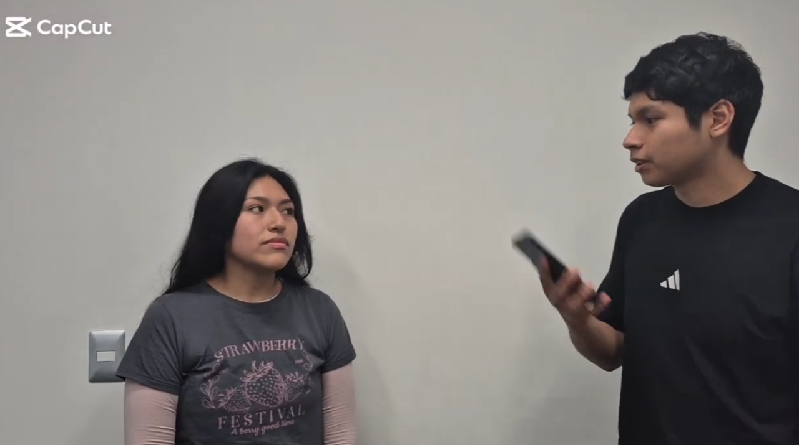 link del video: https://youtu.be/x08H55_hld8
|3  | Nombre: Richard  Apellido: Lozano  Edad: 20  Distrito: San Martin de Porres |  Richard Lozano es un joven interesado en participar en actividades de voluntariado que le permitan ayudar a otras personas y, al mismo tiempo, adquirir nuevas experiencias. Busca una plataforma sencilla donde pueda encontrar oportunidades de acuerdo con sus intereses, disponibilidad de tiempo y ubicación, para así elegir un voluntariado que se adapte a sus necesidades. | Link del Video: https://youtu.be/wQHt7u7u8ME

#### Segmento 2: ONG y fundaciones sociales

| N | Datos |Descripción |Imagen referencial
|--|--|--|--|
|1  | Nombre: Eduardo  Apellido: Sullon  Edad: 22  Distrito: Pachacamac | Eduardo, de una ONG, busca voluntarios presenciales o híbridos, siendo su mayor reto la falta de información para llegar a más gente y las capacitaciones iniciales. Necesita un sistema con historial y busca en una plataforma visibilidad y gestión, estando dispuesto a pagar por ello y por reportes de impacto.  |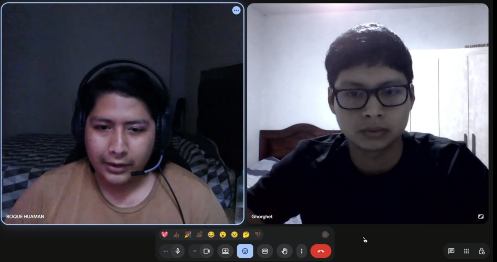 Link del video: https://youtu.be/vFKFP6NsK4U
|2  | Nombre:  Aldo Jesus  Apellido: Huaman   Edad: 25  Distrito: Manchay|Aldo Jesús Huamán es un trabajador con experiencia en ONG y fundaciones sociales, acostumbrado a participar en actividades orientadas al apoyo comunitario y la organización de iniciativas sociales. Debido a su experiencia, conoce de cerca las dificultades para coordinar voluntarios, mantener su compromiso y gestionar adecuadamente las actividades, por lo que valora herramientas que faciliten la comunicación, el seguimiento y la organización de los proyectos.  | Link del Video: https://youtu.be/o8zG31C2IJI

### 2.2.3. Análisis de entrevistas
Las entrevistas permitieron identificar patrones comunes entre los jóvenes universitarios. El principal obstáculo mencionado fue la falta de tiempo debido a la carga académica. Por ello, los entrevistados valoran especialmente que los voluntariados cuenten con horarios claros, opciones flexibles y filtros que permitan encontrar actividades compatibles con su disponibilidad.

También se observó una preferencia importante por recibir certificados digitales, créditos u otros reconocimientos que puedan servir como evidencia de la experiencia adquirida. Aunque las preferencias entre voluntariados presenciales, virtuales y de corta o larga duración varían según cada estudiante, existe coincidencia en que la plataforma debe ser fácil de usar, brindar información confiable y permitir conocer con claridad la ubicación, duración y características de cada oportunidad.

En el segmento de ONG y fundaciones sociales, las entrevistas mostraron que uno de los principales retos consiste en mantener el compromiso de los voluntarios y evitar que abandonen las actividades después de inscribirse. Las organizaciones también señalaron dificultades para cubrir tareas que requieren perfiles específicos o mayor especialización.

Otro hallazgo relevante es que muchas organizaciones todavía utilizan herramientas separadas como WhatsApp, correo electrónico y hojas de cálculo para coordinar a sus voluntarios. Esto genera un proceso poco centralizado y dificulta el seguimiento del historial, la asistencia y el desempeño. Por ello, se considera valioso contar con una plataforma que permita publicar convocatorias, revisar perfiles, gestionar postulantes y generar información sobre la participación e impacto de los voluntarios.

En conjunto, los resultados respaldan la necesidad de una solución que centralice oportunidades de voluntariado, facilite la búsqueda según las necesidades del estudiante y proporcione a las ONG herramientas de gestión y seguimiento más organizadas.

## 2.3. Needfinding
Con el objetivo de comprender mejor a los usuarios y el contexto en el que participan en actividades de voluntariado, se utilizaron técnicas de investigación y análisis centradas en sus necesidades. Inicialmente, el análisis del problema permitió identificar dificultades relacionadas con la falta de información centralizada, la disponibilidad de tiempo y la gestión de voluntarios.

Posteriormente, el proceso Lean UX permitió formular supuestos e hipótesis sobre la solución y contrastarlos mediante entrevistas. A partir de los resultados obtenidos se consolidaron dos segmentos principales para esta versión del proyecto: jóvenes universitarios y ONG o fundaciones sociales.

Los hallazgos obtenidos permiten concluir que existe la necesidad de una plataforma que facilite el acceso a oportunidades de voluntariado compatibles con el estilo de vida de los estudiantes y, al mismo tiempo, permita a las organizaciones gestionar convocatorias y voluntarios de manera más ordenada y confiable.

### 2.3.1. User Personas

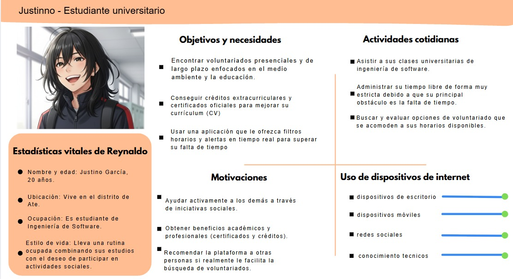

### 2.3.2. User Task Matrix

La matriz de tareas permite priorizar las acciones que cada segmento necesita realizar dentro de BlockVoluntariado.

**Jóvenes universitarios**

| Tarea del usuario | Frecuencia | Importancia |
|---|---|---|
| Filtrar voluntariados por horario | A menudo | Alta |
| Filtrar voluntariados por duración | A menudo | Alta |
| Recibir reconocimiento por su participación | Siempre | Alta |
| Filtrar por modalidad presencial o virtual | Siempre | Alta |
| Registrarse o postular a un voluntariado | Siempre | Alta |
| Buscar voluntariados por nombre | Siempre | Alta |
| Buscar por organización | A veces | Media |

**ONG y fundaciones sociales**

| Tarea del usuario | Frecuencia | Importancia |
|---|---|---|
| Hacer seguimiento al desempeño e historial de voluntarios | Ocasional | Alta |
| Registrar y gestionar perfiles de voluntarios | Frecuente | Alta |
| Asignar voluntarios a proyectos específicos | Ocasional | Alta |
| Capacitar a voluntarios | Ocasional | Alta |
| Comunicar novedades y actividades | Muy frecuente | Alta |
| Administrar modalidades de voluntariado | Ocasional | Alta |
| Publicar convocatorias | Frecuente | Alta |

### 2.3.3. User Journey Mapping
El User Journey Mapping permite representar el recorrido que siguen los usuarios desde que identifican una necesidad hasta que participan en una actividad de voluntariado y evalúan posteriormente su experiencia.

Para BlockVoluntariado se analizaron los recorridos correspondientes a los principales segmentos identificados durante el proceso de entrevistas y Needfinding.

#### a. Jóvenes universitarios

| Aspecto | Stage 1: Descubrimiento del problema | Stage 2: Búsqueda de información | Stage 3: Diagnóstico y análisis | Stage 4: Implementación | Stage 5: Seguimiento y evaluación |
|---|---|---|---|---|---|
| **Objectives** | Reconocer la falta de espacios donde organizar y encontrar oportunidades de voluntariado. | Investigar qué voluntariados existen y cómo puede participar. | Evaluar qué voluntariado encaja mejor con sus intereses, horarios y disponibilidad. | Inscribirse y empezar a colaborar en el voluntariado seleccionado. | Ver los resultados de su participación y decidir si desea continuar participando en nuevos voluntariados. |
| **Needs** | Identificar voluntariados cercanos en los cuales pueda participar. | Encontrar plataformas claras y confiables que centralicen las oportunidades. | Comparar de manera sencilla diferentes proyectos, horarios y beneficios. | Contar con un proceso de registro rápido, simple y con información clara. | Recibir feedback de su participación, constancias, reconocimientos y certificados. |
| **Feelings** | Desea ayudar, pero siente confusión al no saber por dónde comenzar. | Siente motivación y curiosidad al descubrir diferentes oportunidades. | Siente expectativa, entusiasmo y algunas dudas antes de tomar una decisión. | Siente emoción y orgullo al comenzar su primera experiencia de voluntariado. | Siente satisfacción y motivación al observar los resultados de su participación. |
| **Barriers** | Falta de información sobre oportunidades disponibles. | Información dispersa y poco organizada en redes sociales u otros medios. | Falta de tiempo debido a los estudios y poca flexibilidad en los horarios. | Falta de seguimiento por parte de las organizaciones y dificultad para conciliar el voluntariado con sus actividades académicas. | Falta de reconocimiento formal por la participación realizada. |

---

#### b. ONG y fundaciones sociales
| Aspecto | Stage 1: Descubrimiento del problema | Stage 2: Búsqueda de información | Stage 3: Diagnóstico y análisis | Stage 4: Implementación | Stage 5: Seguimiento y evaluación |
|---|---|---|---|---|---|
| **Objectives** | Identificar las dificultades para captar y retener voluntarios. | Explorar plataformas y canales donde puedan encontrar voluntarios de manera más rápida. | Evaluar si BlockVoluntariado puede convertirse en una alternativa adecuada para captar voluntarios. | Publicar convocatorias y gestionar voluntarios utilizando la plataforma. | Medir el impacto generado mediante la participación de los voluntarios. |
| **Needs** | Acceder a una base de voluntarios motivados y confiables. | Encontrar información clara sobre el funcionamiento de la plataforma. | Contar con evidencias de éxito como casos de uso, métricas o experiencias de otras organizaciones. | Utilizar herramientas de publicación, gestión y comunicación con los voluntarios. | Obtener reportes de participación, estadísticas de impacto social y datos relacionados con la permanencia de los voluntarios. |
| **Feelings** | Siente frustración y desconfianza debido a las dificultades para encontrar voluntarios constantes. | Siente expectativa y curiosidad frente a nuevas herramientas digitales. | Siente interés, aunque mantiene cierta cautela antes de adoptar una nueva plataforma. | Siente alivio al reducir parte de la carga operativa relacionada con la gestión de voluntarios. | Siente orgullo y motivación al observar resultados positivos en sus proyectos. |
| **Barriers** | Escasez de recursos para realizar campañas de captación de voluntarios. | Desconfianza hacia nuevas herramientas tecnológicas. | Presupuesto limitado para adoptar nuevas soluciones. | Resistencia al cambio por parte de algunos miembros de la organización. | Falta de indicadores claros y poca personalización en los reportes. |

### 2.3.4. Empathy Mapping
El Empathy Mapping permite comprender las necesidades, motivaciones, preocupaciones y comportamientos de los segmentos objetivo de BlockVoluntariado. Para elaborar los mapas se sintetizaron los hallazgos de las entrevistas descritas en la sección 2.2 y del proceso de Needfinding. Las afirmaciones de los mapas son interpretaciones del equipo, no citas textuales de los participantes.

### 2.3.4.1. Mapa de empatía: jóvenes universitarios
Este mapa representa a estudiantes que desean participar en actividades sociales mientras compatibilizan sus horarios académicos. Los hallazgos resaltan la necesidad de convocatorias confiables, búsqueda por disponibilidad y reconocimiento de la participación.

  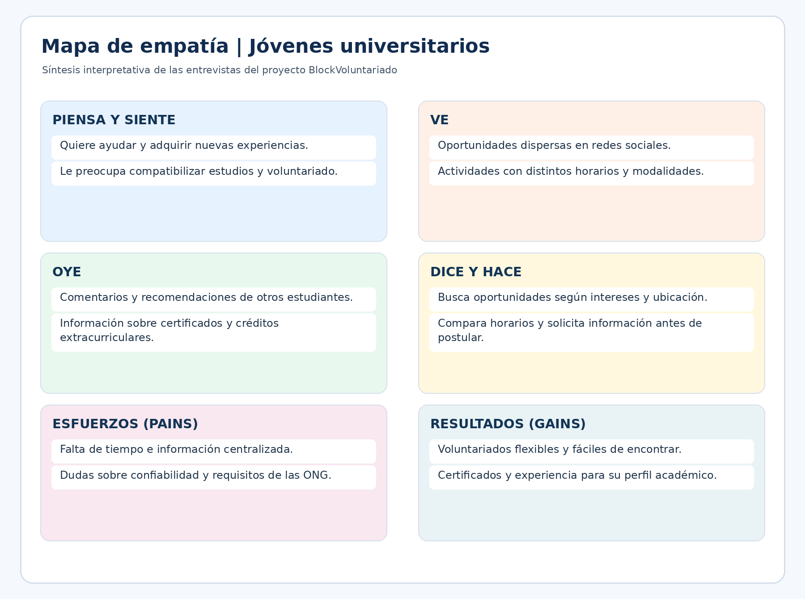
  
<em>Figura 2.3.4.1. Mapa de empatía del segmento jóvenes universitarios. Elaboración propia a partir del análisis de entrevistas.</em>

Hallazgos para el diseño: se priorizan filtros de horario, ubicación, modalidad y tipo de causa; información clara de las organizaciones; un proceso de postulación sencillo; y un historial de participación con reconocimientos cuando corresponda. Estas necesidades se relacionan con las historias HU01–HU04, HU19, HU21 y HU24.

### 2.3.4.2. Mapa de empatía: ONG y fundaciones sociales
Este mapa sintetiza los problemas de las organizaciones para convocar, seleccionar, coordinar y dar seguimiento a voluntarios. Se evidencia la importancia de centralizar información y reducir el trabajo manual.

  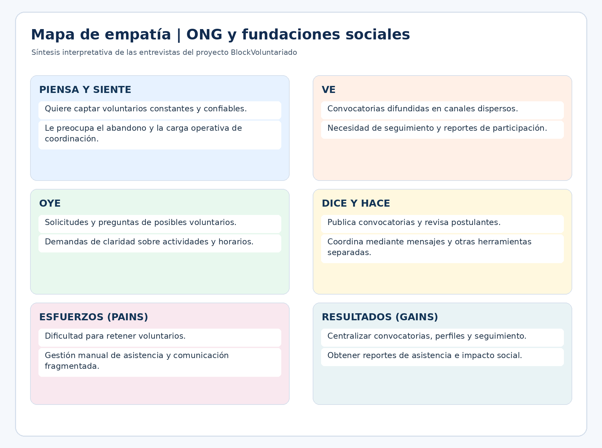
  
<em>Figura 2.3.4.2. Mapa de empatía del segmento ONG y fundaciones sociales. Elaboración propia a partir del análisis de entrevistas.</em>

Hallazgos para el diseño: las organizaciones necesitan publicar y actualizar convocatorias, revisar postulantes, registrar asistencia y consultar indicadores de participación. Estas necesidades se relacionan con las historias HU35–HU42, HU44–HU45 y HU48–HU50.
Síntesis: ambos mapas respaldan una plataforma que conecta oportunidades con estudiantes y facilita la gestión de las organizaciones. Los hallazgos constituyen insumos para validar prioridades, no resultados de pruebas de usabilidad ni evidencia de funcionalidades ya implementadas.

### 2.3.5. Big Picture EventStorming
El Big Picture EventStorming permite representar los principales eventos que ocurren dentro del dominio de BlockVoluntariado y entender la interacción general entre usuarios, procesos y resultados.

Para el proyecto se identificaron eventos relacionados con el registro de usuarios, publicación de voluntariados, postulaciones, selección de participantes, seguimiento y finalización de actividades.

Algunos eventos relevantes son:

- Usuario registrado.
- Perfil actualizado.
- ONG registrada.
- Voluntariado publicado.
- Voluntariado actualizado.
- Estudiante postulado.
- Postulación aceptada.
- Postulación rechazada.
- Voluntario inscrito.
- Actividad iniciada.
- Asistencia registrada.
- Voluntariado completado.
- Certificado generado.
- Organización calificada.
- Voluntario evaluado.

### 2.3.6. Ubiquitous Language

El Ubiquitous Language establece un vocabulario común entre los integrantes del equipo para evitar ambigüedades durante el diseño y desarrollo del sistema.

| Término | Definición |
|---|---|
| Voluntario | Usuario universitario que participa en oportunidades de voluntariado. |
| ONG | Organización que publica y administra oportunidades de voluntariado. |
| Voluntariado | Actividad social publicada por una organización y disponible para postulantes. |
| Convocatoria | Publicación mediante la cual una ONG solicita voluntarios. |
| Postulación | Solicitud realizada por un voluntario para participar en una convocatoria. |
| Postulante | Voluntario que ha enviado una solicitud a una convocatoria. |
| Participante | Voluntario cuya postulación ha sido aceptada. |
| Perfil | Información personal, académica y relacionada con intereses del usuario. |
| Certificado | Documento generado o proporcionado después de completar una actividad. |
| Historial | Registro de voluntariados realizados por el usuario. |
| Asistencia | Registro que indica la participación de un voluntario en una actividad. |
| Organización | Entidad responsable de publicar y gestionar voluntariados. |
| Evaluación | Calificación realizada al finalizar una experiencia de voluntariado. |
| Insignia | Reconocimiento digital obtenido por participación o cumplimiento de objetivos. |
| Notificación | Aviso enviado al usuario sobre cambios, recordatorios o nuevas oportunidades. |

## 2.4. Requirements specification
### 2.4.1. User Stories
Para especificar los requerimientos funcionales de BlockVoluntariado se emplearon User Stories, las cuales permiten representar las necesidades principales de los usuarios desde su propia perspectiva. Estas historias fueron planteadas tomando en consideración los dos segmentos objetivo definidos para el proyecto: jóvenes universitarios interesados en participar en actividades de voluntariado y ONG o fundaciones sociales que requieren publicar, organizar y gestionar dichas actividades.

Cada User Story sigue la estructura: **Como [tipo de usuario], quiero [acción o necesidad], para [beneficio esperado]**.

| User Story ID | Epic ID | Título | Descripción |
|---|---|---|---|
| HU01 | EP01 | Búsqueda según perfil | Como estudiante, quiero buscar oportunidades de voluntariado según mi perfil, para encontrar opciones que se ajusten a mis intereses, disponibilidad y necesidades. |
| HU02 | EP01 | Filtro por tipo de causa | Como estudiante, quiero filtrar voluntariados por tipo de causa, para encontrar actividades relacionadas con temas que realmente me motiven. |
| HU03 | EP01 | Filtro por duración | Como estudiante con horarios ajustados, quiero filtrar voluntariados según su duración, para elegir actividades compatibles con mi disponibilidad. |
| HU04 | EP01 | Filtro por ubicación | Como estudiante, quiero filtrar oportunidades de voluntariado según mi ubicación, para evitar trasladarme a lugares demasiado alejados. |
| HU05 | EP01 | Filtro por carrera universitaria | Como estudiante, quiero encontrar voluntariados relacionados con mi carrera universitaria, para obtener experiencia y desarrollar habilidades relacionadas con mi formación profesional. |
| HU06 | EP01 | Filtro por especialización | Como estudiante próximo a finalizar su carrera, quiero buscar voluntariados relacionados con mi especialización, para fortalecer mi experiencia profesional y mi CV. |
| HU07 | EP02 | Registro de usuario | Como estudiante, quiero registrarme en la aplicación, para acceder a las funcionalidades disponibles para voluntarios. |
| HU08 | EP02 | Registro mediante cuenta externa | Como estudiante universitario, quiero registrarme utilizando mi cuenta de Google, para ahorrar tiempo y evitar completar formularios extensos. |
| HU09 | EP02 | Inicio de sesión | Como usuario registrado, quiero iniciar sesión en mi cuenta, para acceder a mi información y actividades de voluntariado. |
| HU10 | EP02 | Recuperación de contraseña | Como usuario, quiero recuperar mi contraseña mediante mi correo electrónico, para recuperar el acceso a mi cuenta en caso de olvidarla. |
| HU11 | EP02 | Validación de identidad | Como voluntario, quiero verificar mi identidad, para generar mayor confianza en las organizaciones antes de participar en sus actividades. |
| HU12 | EP03 | Perfil del voluntario | Como estudiante voluntario, quiero editar mi perfil con mis datos, intereses y habilidades, para mostrar información relevante a las organizaciones. |
| HU13 | EP03 | Historial de voluntariados | Como estudiante, quiero visualizar mi historial de voluntariados realizados, para llevar un registro de mi participación. |
| HU14 | EP03 | Visualización de progreso | Como estudiante, quiero visualizar mi progreso dentro de cada voluntariado, para conocer las actividades y días que he completado. |
| HU15 | EP03 | Calendario de actividades | Como estudiante, quiero visualizar mis voluntariados programados en un calendario, para organizar mejor mi tiempo. |
| HU16 | EP04 | Visualización de impacto personal | Como estudiante, quiero visualizar el impacto acumulado de mis acciones, para conocer los resultados generados mediante mi participación. |
| HU17 | EP04 | Sistema de logros | Como estudiante voluntario, quiero obtener logros al completar actividades, para sentirme motivado a continuar participando. |
| HU18 | EP04 | Insignias por participación | Como voluntario, quiero recibir insignias por completar voluntariados, para obtener reconocimiento por mi esfuerzo. |
| HU19 | EP04 | Certificado digital | Como estudiante, quiero descargar un certificado al finalizar correctamente un voluntariado, para utilizarlo como evidencia de mi participación. |
| HU20 | EP04 | Registro de horas | Como estudiante universitario, quiero mantener un registro de las horas realizadas en voluntariados, para acreditar mi participación en actividades sociales. |
| HU21 | EP05 | Postulación a voluntariado | Como voluntario, quiero postularme a una oportunidad de voluntariado mediante un botón, para participar fácilmente en una actividad. |
| HU22 | EP05 | Inscripción rápida | Como estudiante, quiero inscribirme rápidamente en un voluntariado, para evitar procedimientos innecesariamente largos. |
| HU23 | EP05 | Horarios flexibles | Como estudiante con poca disponibilidad, quiero escoger horarios compatibles con mis actividades académicas, para evitar afectar mis estudios. |
| HU24 | EP05 | Detalle del voluntariado | Como estudiante, quiero revisar la información detallada de un voluntariado antes de inscribirme, para conocer los requisitos, duración, ubicación y organización responsable. |
| HU25 | EP06 | Recomendaciones según perfil | Como estudiante, quiero recibir recomendaciones según mis intereses y perfil, para descubrir oportunidades que puedan resultarme relevantes. |
| HU26 | EP06 | Recomendaciones por ubicación | Como estudiante, quiero recibir recomendaciones de voluntariados cercanos a mi ubicación, para reducir el tiempo de traslado. |
| HU27 | EP06 | Voluntariados favoritos | Como estudiante, quiero guardar oportunidades de voluntariado que me interesan, para revisarlas posteriormente. |
| HU28 | EP07 | Notificaciones de nuevas oportunidades | Como estudiante, quiero recibir notificaciones cuando aparezcan nuevos voluntariados relacionados con mis intereses, para no perder oportunidades. |
| HU29 | EP07 | Recordatorio de actividad | Como estudiante, quiero recibir un recordatorio antes del inicio de una actividad, para evitar olvidar mi compromiso o llegar tarde. |
| HU30 | EP07 | Notificación de cambios | Como estudiante inscrito en un voluntariado, quiero recibir alertas cuando la organización modifique información importante, para mantenerme informado. |
| HU31 | EP07 | Preferencias de notificaciones | Como usuario, quiero seleccionar qué tipos de notificaciones deseo recibir, para evitar recibir información que no sea relevante para mí. |
| HU32 | EP08 | Comentarios de voluntarios | Como estudiante, quiero dejar un comentario después de finalizar un voluntariado, para compartir mi experiencia con otros usuarios. |
| HU33 | EP08 | Calificación de ONG | Como estudiante, quiero calificar a la organización responsable de un voluntariado, para ayudar a otros usuarios a conocer la calidad de la experiencia. |
| HU34 | EP08 | Testimonios de participantes | Como estudiante interesado en un voluntariado, quiero visualizar experiencias de otros voluntarios, para sentir mayor confianza antes de inscribirme. |
| HU35 | EP09 | Crear convocatoria | Como organización, quiero crear una convocatoria de voluntariado indicando título, descripción, requisitos y fechas, para encontrar personas interesadas en participar. |
| HU36 | EP09 | Editar convocatoria | Como organización, quiero editar una convocatoria publicada, para corregir o actualizar información cuando sea necesario. |
| HU37 | EP09 | Cerrar convocatoria | Como organización, quiero cerrar una convocatoria cuando se hayan cubierto las vacantes disponibles, para evitar recibir nuevas postulaciones. |
| HU38 | EP09 | Gestionar convocatorias | Como organización, quiero visualizar todas mis convocatorias publicadas, para administrar fácilmente mis actividades de voluntariado. |
| HU39 | EP10 | Visualizar postulantes | Como organización, quiero consultar los perfiles de los estudiantes postulantes, para evaluar quiénes cumplen mejor con los requisitos de la actividad. |
| HU40 | EP10 | Filtrar postulantes | Como organización, quiero filtrar postulantes por características como carrera, habilidades o experiencia, para encontrar voluntarios adecuados más rápidamente. |
| HU41 | EP10 | Aceptar postulantes | Como organización, quiero aceptar la postulación de un voluntario, para incorporarlo oficialmente a una actividad. |
| HU42 | EP10 | Rechazar postulantes | Como organización, quiero rechazar una postulación cuando el perfil no se ajuste a los requisitos, para mantener una selección adecuada de participantes. |
| HU43 | EP10 | Perfil verificado del voluntario | Como organización, quiero visualizar si un voluntario posee un perfil verificado, para aumentar la confianza durante el proceso de selección. |
| HU44 | EP11 | Seguimiento de voluntarios | Como organización, quiero realizar seguimiento de los voluntarios participantes, para conocer su asistencia y cumplimiento de las actividades asignadas. |
| HU45 | EP11 | Registro de asistencia | Como organización, quiero registrar la asistencia de los voluntarios, para mantener evidencia de su participación. |
| HU46 | EP11 | Calificación de voluntarios | Como organización, quiero evaluar el desempeño de los voluntarios al finalizar una actividad, para registrar referencias sobre su participación. |
| HU47 | EP11 | Comentario sobre voluntario | Como organización, quiero dejar comentarios sobre la participación de un voluntario, para complementar su historial dentro de la plataforma. |
| HU48 | EP12 | Reportes de participación | Como organización, quiero visualizar reportes sobre la participación de los voluntarios, para analizar el desempeño y alcance de mis convocatorias. |
| HU49 | EP12 | Estadísticas de voluntariado | Como organización, quiero consultar estadísticas de mis actividades publicadas, para conocer la cantidad de postulantes, participantes y actividades completadas. |
| HU50 | EP12 | Medición de impacto | Como organización, quiero visualizar indicadores relacionados con el impacto generado por mis proyectos, para evaluar los resultados obtenidos mediante los voluntarios. |

### 2.4.2. Impact Mapping
 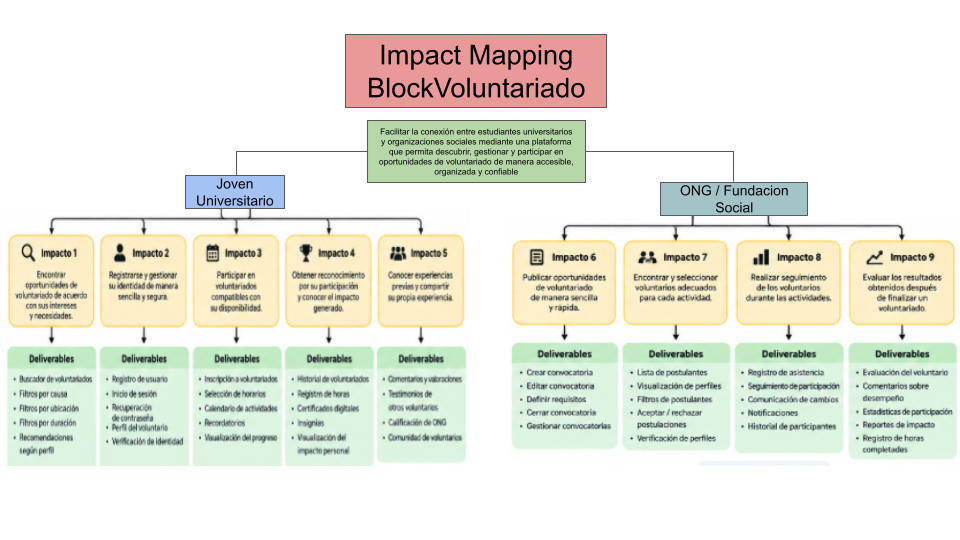

### 2.4.3. Product Backlog

**Trazabilidad:** los identificadores de las 30 prioridades se han alineado con la tabla de User Stories de la sección 2.4.1, manteniendo la redacción y los Story Points originales del backlog. Antes de implementación deben revisarse alcance y duplicidades funcionales (por ejemplo, postulación/inscripción rápida).

El Product Backlog de BlockVoluntariado reúne y prioriza las principales funcionalidades identificadas a partir de las necesidades de los usuarios, entrevistas, User Stories e Impact Mapping.

Cada elemento del backlog representa una funcionalidad que aporta valor a uno de los segmentos objetivo del proyecto. La prioridad fue establecida considerando la importancia de la funcionalidad para el funcionamiento básico de la plataforma y su relación con los principales objetivos del producto.

Los Story Points representan una estimación relativa del esfuerzo necesario para desarrollar cada User Story, considerando su complejidad, cantidad de componentes involucrados y posibles dependencias técnicas.

| # Orden | User Story ID | Descripción | Story Points |
|---:|---|---|---:|
| 1 | HU07 | Como estudiante, quiero crear una cuenta para utilizar las funcionalidades disponibles dentro de BlockVoluntariado. | 3 |
| 2 | HU09 | Como usuario registrado, quiero iniciar sesión para acceder a mi información y actividades de voluntariado. | 3 |
| 3 | HU12 | Como voluntario, quiero actualizar mi perfil para mantener actualizados mis datos, intereses y habilidades. | 3 |
| 4 | HU01 | Como estudiante, quiero buscar oportunidades de voluntariado según mi perfil para encontrar opciones relacionadas con mis intereses. | 5 |
| 5 | HU02 | Como estudiante, quiero filtrar los voluntariados por tipo de causa para encontrar actividades que realmente me motiven. | 3 |
| 6 | HU03 | Como estudiante, quiero filtrar los voluntariados por duración para encontrar actividades compatibles con mi disponibilidad. | 3 |
| 7 | HU04 | Como estudiante, quiero encontrar voluntariados cercanos a mi ubicación para evitar desplazamientos innecesarios. | 5 |
| 8 | HU05 | Como estudiante, quiero encontrar voluntariados relacionados con mi carrera universitaria para desarrollar experiencia profesional. | 3 |
| 9 | HU24 | Como estudiante, quiero consultar los detalles de una actividad antes de inscribirme para conocer sus requisitos, horario, ubicación y organización responsable. | 3 |
| 10 | HU21 | Como estudiante, quiero postularme rápidamente a una convocatoria para participar en un voluntariado. | 3 |
| 11 | HU35 | Como ONG, quiero crear y publicar una convocatoria para encontrar voluntarios interesados en participar en mis actividades. | 5 |
| 12 | HU36 | Como ONG, quiero modificar una convocatoria publicada para mantener actualizada su información. | 3 |
| 13 | HU37 | Como ONG, quiero cerrar una convocatoria cuando ya no necesite recibir más postulantes. | 2 |
| 14 | HU39 | Como ONG, quiero revisar los perfiles de los postulantes para seleccionar participantes adecuados. | 5 |
| 15 | HU41 | Como ONG, quiero aceptar la postulación de un voluntario para incorporarlo oficialmente a una actividad. | 3 |
| 16 | HU42 | Como ONG, quiero rechazar postulaciones que no cumplan con los requisitos establecidos. | 3 |
| 17 | HU30 | Como estudiante, quiero recibir notificaciones sobre cambios importantes en mis voluntariados para mantenerme informado. | 3 |
| 18 | HU29 | Como estudiante, quiero recibir recordatorios antes de una actividad para evitar olvidar mis compromisos. | 3 |
| 19 | HU15 | Como estudiante, quiero visualizar mis actividades programadas en un calendario para organizar mejor mi tiempo. | 5 |
| 20 | HU45 | Como ONG, quiero registrar la asistencia de los voluntarios para mantener evidencia de su participación. | 5 |
| 21 | HU13 | Como voluntario, quiero consultar mi historial de voluntariados para mantener un registro de mis participaciones. | 3 |
| 22 | HU19 | Como voluntario, quiero descargar un certificado al completar correctamente una actividad para demostrar mi participación. | 5 |
| 23 | HU18 | Como voluntario, quiero obtener insignias por completar actividades para sentirme motivado a continuar participando. | 5 |
| 24 | HU33 | Como estudiante, quiero calificar una organización al finalizar un voluntariado para compartir mi experiencia. | 3 |
| 25 | HU32 | Como estudiante, quiero dejar comentarios después de completar un voluntariado para orientar a futuros participantes. | 3 |
| 26 | HU46 | Como ONG, quiero evaluar a los voluntarios al finalizar una actividad para registrar información relacionada con su desempeño. | 3 |
| 27 | HU49 | Como ONG, quiero consultar estadísticas de mis convocatorias para conocer su alcance y participación. | 5 |
| 28 | HU48 | Como ONG, quiero generar reportes de participación para analizar los resultados obtenidos en mis actividades. | 5 |
| 29 | HU25 | Como estudiante, quiero recibir recomendaciones basadas en mi perfil para descubrir oportunidades relevantes. | 5 |
| 30 | HU10 | Como usuario, quiero recuperar mi contraseña mediante correo electrónico para recuperar el acceso a mi cuenta. | 3 |

## 2.5. Strategic-Level Domain-Driven Design
El Strategic-Level Domain-Driven Design permite analizar el sistema desde una perspectiva de alto nivel, identificando las principales áreas funcionales del negocio y estableciendo límites claros entre ellas.

Para BlockVoluntariado, este análisis parte de los procesos principales identificados previamente mediante entrevistas, User Stories, Impact Mapping y Big Picture EventStorming.

El objetivo es reconocer las responsabilidades principales del sistema y determinar qué partes del dominio pueden ser agrupadas posteriormente en posibles Bounded Contexts.

De esta manera, se busca evitar que todas las funcionalidades del sistema se encuentren mezcladas dentro de un único modelo, permitiendo una mejor organización del dominio y facilitando el desarrollo futuro de la solución.

---

### 2.5.1. EventStorming
#### Procedimiento aplicado para la elaboración del EventStorming

El modelo recoge eventos de negocio propuestos para BlockVoluntariado. Para que el diagrama sea reproducible, el equipo debe documentar las siguientes fases y contrastarlas con el tablero original:

1. **Definir el alcance y los participantes.** Delimitar el ciclo de vida de una convocatoria, desde su creación por una ONG hasta la certificación de la participación, considerando estudiantes y organizaciones.
2. **Descubrir eventos de dominio.** Escribir hechos relevantes en tiempo pasado, por ejemplo `Convocatoria publicada`, `Postulación enviada`, `Postulación aceptada` y `Asistencia registrada`.
3. **Ordenar los eventos temporalmente.** Organizar la secuencia principal, añadir ramificaciones como `Postulación rechazada` y detectar situaciones alternativas.
4. **Incorporar comandos y actores.** Asociar acciones que originan los eventos: `Publicar convocatoria` (ONG), `Enviar postulación` (estudiante), `Aceptar postulante` (ONG) y `Registrar asistencia` (ONG).
5. **Identificar reglas, políticas y agregados.** Describir restricciones, como no superar vacantes y no emitir certificados sin participación validada; asociarlas a `Convocatoria`, `Postulación` y `Participación`.
6. **Detectar puntos críticos y preguntas abiertas.** Determinar cómo se validan horas, quién aprueba certificados y cuándo se notifica un cambio; registrar decisiones pendientes sin presentarlas como reglas implementadas.
7. **Agrupar eventos por capacidad de negocio.** Detectar contextos candidatos y contrastar los límites con el lenguaje ubicuo y los casos de uso.
8. **Revisar y refinar el modelo.** Verificar consistencia con entrevistas, User Stories y el mapa de contextos, documentando los cambios.

**Ejemplo de secuencia de negocio:** `Convocatoria creada` → `Convocatoria publicada` → `Postulación enviada` → (`Postulación aceptada` o `Postulación rechazada`) → `Asistencia registrada` → `Voluntariado completado` → `Certificado generado`.

*La secuencia representa un modelo de análisis y debe validarse con el equipo respecto del flujo real del producto.*

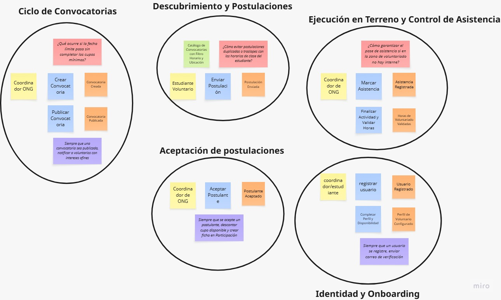

*Figura 2.5.1. Tablero de EventStorming del proyecto (archivo original del equipo).*

#### 2.5.1.1. Candidate Context Discovery

A partir del EventStorming realizado para BlockVoluntariado se identificaron diferentes grupos de eventos, comandos y entidades que presentan responsabilidades relacionadas entre sí.

El objetivo del Candidate Context Discovery es detectar posibles límites dentro del dominio para separar las funcionalidades del sistema en áreas con responsabilidades específicas. Estos límites servirán posteriormente como base para definir los Bounded Contexts de la solución.

Para BlockVoluntariado se identificaron los siguientes candidatos:

| Candidate Context | Responsabilidad principal | Eventos relacionados |
|---|---|---|
| **Identity and Access Management** | Gestionar el registro, autenticación y acceso de los usuarios al sistema. | Estudiante registrado, ONG registrada, sesión iniciada, perfil actualizado. |
| **Volunteer Management** | Gestionar la información, intereses, habilidades y perfil de los voluntarios. | Perfil de voluntario actualizado, preferencias registradas, historial consultado. |
| **Volunteering Management** | Gestionar la creación, publicación, edición y cierre de oportunidades de voluntariado. | Convocatoria creada, requisitos definidos, voluntariado publicado, convocatoria actualizada, convocatoria cerrada. |
| **Application Management** | Gestionar las postulaciones realizadas por los estudiantes y la evaluación por parte de las ONG. | Postulación enviada, postulación revisada, postulación aceptada, postulación rechazada. |
| **Participation Management** | Gestionar la participación de los voluntarios durante el desarrollo de las actividades. | Participación confirmada, asistencia registrada, actividad iniciada, actividad finalizada. |
| **Recognition and Evaluation** | Gestionar las evaluaciones, certificados, horas registradas y reconocimiento de los participantes. | Voluntario evaluado, ONG calificada, horas registradas, certificado generado, insignia otorgada. |
| **Communication and Notifications** | Gestionar avisos, recordatorios y comunicaciones relacionadas con las actividades y postulaciones. | Resultado enviado al estudiante, recordatorio enviado, notificación generada. |

Los candidatos identificados permiten organizar el dominio de BlockVoluntariado según las responsabilidades de cada proceso.

Esta división facilita que las funcionalidades relacionadas se mantengan agrupadas y reduce el acoplamiento entre diferentes partes del sistema.

Asimismo, los Candidate Contexts permiten establecer una primera aproximación a los Bounded Contexts que serán utilizados posteriormente en el diseño estratégico y táctico de la solución.

#### 2.5.1.1.1. Descripción de los Bounded Context candidatos identificados

Los siete contextos que se muestran a continuación **se identificaron como candidatos durante el EventStorming**. Un candidato representa una propuesta de límite del modelo, no necesariamente un microservicio ni una unidad ya implementada. La descripción distingue los conceptos del negocio, las reglas que debe proteger y los eventos con los que colaboraría con otros contextos.

**1. Identity and Access Management — Identidad y acceso (Supporting Domain).**

Su propósito es reconocer a los usuarios de BlockVoluntariado y controlar su acceso a las funcionalidades autorizadas. Administra el registro, inicio de sesión, recuperación de acceso, roles (por ejemplo, estudiante y representante de ONG) y asociación entre la identidad autenticada y el identificador interno de usuario. Sus reglas incluyen impedir accesos no autorizados y no compartir credenciales con contextos consumidores. Publica información estrictamente necesaria sobre identidades y cambios de estado de cuenta. **Límite:** autenticar a una persona no equivale a gestionar toda la información de su perfil de voluntario. Se relaciona con *Volunteer Management* y con los módulos que necesitan verificar permisos.

**2. Volunteer Management — Gestión de voluntarios (Supporting Domain).**

Se encarga del perfil del voluntario: datos de presentación, intereses, habilidades, disponibilidad y preferencias relevantes para encontrar oportunidades. El perfil se asocia a una identidad, pero mantiene reglas propias: solo las personas autorizadas deben poder modificarlo; el contenido disponible para las ONG debe respetar los permisos del usuario. Los eventos candidatos incluyen `PerfilVoluntarioActualizado` y `PreferenciasRegistradas`. Proporciona datos de perfil a *Application Management* para apoyar la evaluación de postulantes y al catálogo para facilitar búsquedas. **Límite:** no acepta ni rechaza postulaciones y no decide la validez de certificados.

**3. Volunteering Management — Gestión de convocatorias (Core Domain, propuesto).**

Modela el ciclo de vida de las convocatorias: creación en borrador, definición de requisitos, cupos, modalidad, ubicación y horarios, publicación, actualización y cierre. La organización que publica es responsable de los datos de su convocatoria. Sus invariantes candidatas son no admitir convocatorias sin información obligatoria y no permitir postulaciones a una convocatoria cerrada o no publicada. Los eventos comprenden `ConvocatoriaCreada`, `ConvocatoriaPublicada`, `ConvocatoriaActualizada` y `ConvocatoriaCerrada`. Suministra datos sobre oportunidades a *Application Management*. **Límite:** la convocatoria no es la postulación individual de un estudiante.

**4. Application Management — Gestión de postulaciones (Core Domain, propuesto).**

Controla el envío, seguimiento y evaluación de solicitudes para una convocatoria. Se ocupa de la relación entre voluntario, convocatoria y estado de la solicitud (`PENDIENTE`, `ACEPTADA` o `RECHAZADA`). Sus reglas candidatas son evitar una postulación duplicada del mismo voluntario a la misma convocatoria y autorizar la decisión de aceptación o rechazo únicamente a la organización responsable. Debe consultar la vigencia y las condiciones de la convocatoria; la validación de cupos exige una coordinación consistente con el contexto que los administra. Emite `PostulacionEnviada`, `PostulacionAceptada` y `PostulacionRechazada`. **Límite:** una postulación aceptada no acredita por sí sola asistencia u horas realizadas.

**5. Participation Management — Gestión de participación (Core o Supporting Domain, a validar).**

Administra lo que ocurre después de aceptar una postulación: incorporación del participante, sesiones o actividades programadas, control de asistencia, registro de horas y finalización de la participación. Sus reglas candidatas exigen que una asistencia esté vinculada a una participación autorizada y que las horas contabilizadas se basen en registros verificables. Entre los eventos están `ParticipacionConfirmada`, `AsistenciaRegistrada`, `HorasValidadas` y `ActividadFinalizada`. Proporciona evidencia a *Recognition and Evaluation*. **Límite:** no debe emitir certificados sin pasar por las reglas del contexto de reconocimiento.

**6. Recognition and Evaluation — Evaluación y reconocimiento (Supporting Domain).**

Gestiona evaluaciones recíprocas, seguimiento de logros, insignias, constancias y certificados derivados de una participación completada. Debe recibir información confiable sobre asistencia y cumplimiento, y aplicar reglas para evitar reconocimientos duplicados o no sustentados. Sus eventos propuestos son `VoluntarioEvaluado`, `OrganizacionCalificada`, `CertificadoGenerado` e `InsigniaOtorgada`. Consume información de *Participation Management* y entrega resultados consultables al usuario. **Límite:** una valoración del voluntario o de la ONG no cambia retroactivamente el estado de una postulación.

**7. Communication and Notifications — Comunicación y notificaciones (Generic/Supporting Domain).**

Su responsabilidad consiste en enviar avisos pertinentes sobre nuevas oportunidades, resoluciones de postulaciones, cambios en actividades y recordatorios. Consume eventos de otros contextos, gestiona preferencias de recepción y prepara mensajes para proveedores externos como correo electrónico o notificaciones push. Entre sus resultados se encuentran `NotificacionGenerada`, `ResultadoNotificado` y `RecordatorioEnviado`. Una regla fundamental es respetar las preferencias y evitar envíos duplicados cuando sea posible. **Límite:** entregar una notificación no significa ejecutar la decisión de negocio que la originó; esa decisión pertenece al contexto emisor.

**Criterio de clasificación:** las etiquetas *Core*, *Supporting* y *Generic* son una **propuesta de análisis**, no una clasificación ratificada por el equipo. Se consideran centrales las capacidades que diferencian a la plataforma al conectar convocatorias y postulaciones; el nivel de especialización de participación debe validarse con el alcance real del producto.

#### 2.5.1.1.2. Consolidación de los candidatos en el mapa AV1

El mapa y los canvas originales del AV1 muestran **cuatro áreas de mayor nivel**. Para conservar la trazabilidad con los siete candidatos del EventStorming, la siguiente tabla indica cómo se propone agruparlos. No significa que los siete límites se hayan eliminado del modelo ni que existan cuatro implementaciones independientes.

| Contexto consolidado del AV1 | Contextos candidatos asociados | Razón de la agrupación y límite pendiente |
|---|---|---|
| **Perfil y autenticación** | Identity and Access Management; Volunteer Management | Presenta de forma conjunta la identificación y la información de los usuarios. En el diseño detallado conviene distinguir autenticación de perfil, pues poseen reglas y datos sensibles diferentes. |
| **Publicaciones y convocatorias** | Volunteering Management | Mantiene el ciclo de vida de las oportunidades y es fuente de información sobre requisitos, fechas y cupos. |
| **Matrículas y postulaciones** | Application Management | Gestiona las solicitudes y sus estados. El nombre «matrícula» proviene del mapa AV1, pero en el lenguaje del dominio se prefiere «postulación» y, tras la aceptación, «participación». |
| **Evaluación y reconocimiento** | Participation Management; Recognition and Evaluation | Agrupa el seguimiento de participación, las horas validadas y los reconocimientos. La separación futura es conveniente si la gestión de asistencia gana reglas y complejidad propias. |

**Contexto transversal no representado como caja independiente en el mapa AV1:** *Communication and Notifications*. Su comportamiento aparece distribuido como efecto de eventos de postulación o actividad. Se propone visualizarlo como contexto de soporte separado en una siguiente revisión del Context Map, porque tiene responsabilidades y proveedores externos propios.

**Conclusión de la delimitación:** el resultado del EventStorming es una primera hipótesis de límites. El siguiente paso consiste en revisar los flujos de mensajes, las reglas de cada agregado y los canvas con el equipo para confirmar dónde conviene mantener o separar modelos. Esto evita equiparar automáticamente un módulo, una pantalla o una tabla de base de datos con un *Bounded Context*.

#### 2.5.1.2. Domain Message Flow Modelling
Esta técnica representa **mensajes entre actores y bounded contexts** para un escenario específico. A diferencia de un *user flow* de pantallas, muestra comandos, consultas y eventos de dominio, su emisor, destinatario y orden. El escenario propuesto es **postulación de un estudiante a una convocatoria y decisión de la ONG**. Se utiliza como referencia la guía de [DDD Crew – Domain Message Flow Modelling](https://github.com/ddd-crew/domain-message-flow-modelling).

| N.º | Emisor | Tipo | Mensaje y datos principales | Receptor | Resultado esperado |
|---:|---|---|---|---|---|
| 1 | Estudiante | Consulta | `BuscarConvocatorias` (causa, ubicación, disponibilidad) | Publicaciones y convocatorias | Listado de convocatorias vigentes |
| 2 | Estudiante | Consulta | `ConsultarConvocatoria` (convocatoriaId) | Publicaciones y convocatorias | Requisitos, fechas y vacantes |
| 3 | Estudiante | Comando | `EnviarPostulacion` (convocatoriaId, voluntarioId) | Matrículas y postulaciones | Solicitud evaluable |
| 4 | Matrículas y postulaciones | Evento | `PostulacionEnviada` (postulacionId, convocatoriaId) | Notificaciones / organización | Aviso de una nueva solicitud |
| 5 | Representante ONG | Comando | `AceptarORechazarPostulacion` (postulacionId, decisión) | Matrículas y postulaciones | Estado de la solicitud actualizado |
| 6 | Matrículas y postulaciones | Evento | `PostulacionAceptada` o `PostulacionRechazada` | Comunicaciones y notificaciones | Aviso de resolución al estudiante |
| 7 | Estudiante | Consulta | `ConsultarEstadoPostulacion` (postulacionId) | Matrículas y postulaciones | Estado y detalle de respuesta |

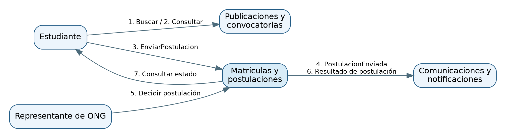

*Figura 2.5.2. Flujo de mensajes propuesto. Los números coinciden con la tabla. Las consultas requieren su respuesta correspondiente; las reglas de negocio se ejecutan dentro del contexto receptor.*

El material anterior denominado *Domain Storytelling* se conserva como antecedente de recorrido de usuario, pero **no sustituye** este diagrama de intercambios entre contextos.

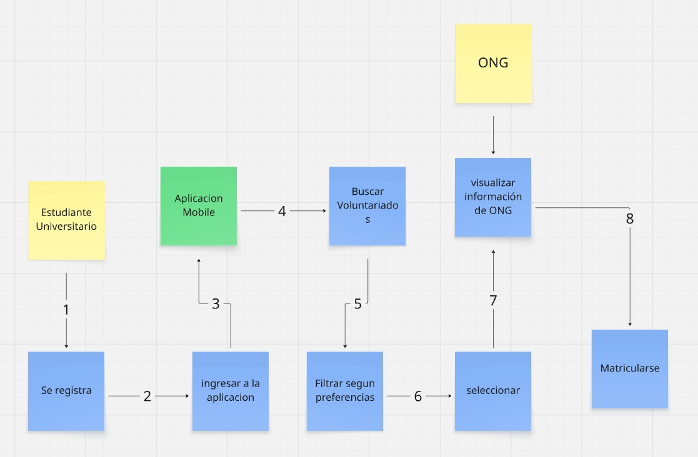

#### 2.5.1.3. Bounded Context Canvases
Un *Bounded Context Canvas* describe el propósito y las fronteras de un contexto, sus responsabilidades, su lenguaje, dependencias e interfaces de comunicación. La presentación se reorganiza tomando como referencia [DDD Crew – Bounded Context Canvas](https://github.com/ddd-crew/bounded-context-canvas). El material de cuatro áreas del AV1 se interpreta como **agrupación inicial propuesta**, y no como prueba de que todos los candidatos se hayan implementado independientemente.

| Contexto del mapa AV1 | Propósito y responsabilidades | Entradas | Salidas / reglas relevantes |
|---|---|---|---|
| **Publicaciones y convocatorias** | Administrar las convocatorias de voluntariado, requisitos, fechas y cupos | Crear, publicar, actualizar, cerrar y consultar | `ConvocatoriaPublicada`; solo se puede postular a una convocatoria vigente |
| **Matrículas y postulaciones** | Registrar solicitudes y resoluciones de selección | `EnviarPostulacion`, `AceptarPostulacion`, `RechazarPostulacion` | `PostulacionEnviada`, `PostulacionAceptada`, `PostulacionRechazada`; evitar duplicados y respetar cupos |
| **Perfil y autenticación** | Administrar acceso e información básica de perfiles | Registro, inicio de sesión y actualización de perfil | Identificador de usuario y datos autorizados; evitar exponer credenciales a otros contextos |
| **Evaluación y reconocimiento** | Registrar participación evaluada, horas y certificados | Resultado de participación y validación de asistencia | `CertificadoGenerado`; no emitir reconocimiento sin validación correspondiente |

**Decisiones y límites.** Los siete contextos candidatos detectados en la exploración incluyen comunicación, seguimiento y perfiles especializados. En esta versión del mapa se consolidan en cuatro áreas para simplificar la vista; sin embargo, **Comunicaciones y notificaciones** puede mantenerse como contexto de soporte independiente cuando sus reglas propias lo justifiquen. Del mismo modo, `Participación` debe separarse si la gestión de asistencias crece en complejidad.

**Aspectos que se deben validar con el equipo:** responsables reales de cada modelo, eventos publicados, invariantes de las entidades, contratos expuestos y razones de integración o separación de los siete candidatos. La tabla sintetiza información documentada y propone su ampliación; no acredita la implementación completa.

**Lienzos originales del AV1 (referencia histórica):**

### 2.5.2. Context Mapping
El *Context Mapping* establece relaciones entre modelos de dominio y permite documentar quién produce información, quién depende de ella y qué acuerdos deben existir entre equipos o módulos. Se utilizó como referencia [DDD Crew – Context Mapping](https://github.com/ddd-crew/context-mapping).

| Relación propuesta | Patrón y dirección | Justificación | Riesgo / acuerdo requerido |
|---|---|---|---|
| Publicaciones y convocatorias → Matrículas y postulaciones | **Customer/Supplier** (Publicaciones: *upstream*; Postulaciones: *downstream*) | Postulaciones necesita identificar una convocatoria vigente, sus requisitos y cupos; el proveedor ofrece esos datos mediante un contrato explícito | Pactar cambios de campos, estados y disponibilidad sin romper la recepción de solicitudes |
| Matrículas y postulaciones → Evaluación y reconocimiento | **Customer/Supplier** (Postulaciones: *upstream*; Reconocimiento: *downstream*) | La evaluación requiere conocer que una solicitud fue admitida y dio lugar a una participación | La aceptación no demuestra asistencia: validar horas y cumplimiento en un flujo posterior |
| Perfil y autenticación → otros contextos | **Conformist o API/ACL, según control real de contratos** | Los demás módulos necesitan una identidad validada, pero no deben compartir indiscriminadamente el modelo interno de autenticación | Autorización, mínimo acceso a datos personales y estabilidad de interfaces |

**Revisión del patrón Shared Kernel.** El informe inicial etiqueta como `Shared Kernel` las conexiones con Perfil y autenticación. No obstante, compartir un identificador de usuario, consumir un servicio de identidad o validar tokens **no basta** para justificar este patrón: Shared Kernel implica compartir deliberadamente una parte del modelo entre contextos y coordinar sus cambios. Por tanto, se recomienda **no mantener Shared Kernel como patrón confirmado** hasta encontrar evidencia de modelo compartido, propiedad conjunta y proceso coordinado de modificaciones.

**Conclusión de diseño.** La propuesta minimiza el acoplamiento mediante contratos explícitos. Los patrones descritos son hipótesis arquitectónicas para validar frente a las implementaciones y acuerdos de los integrantes del equipo; el diagrama inicial se conserva para comparación.

### 2.5.3. Software Architecture
#### 2.5.3.1. Software Architecture Context Level Diagrams

**Alcance de la solución.** El sistema de interés del C4 Nivel 1 es la **Plataforma BlockVoluntariado**, no únicamente la aplicación móvil. La solución integra el cliente Android, la API backend, la persistencia relacional y los servicios externos de autenticación y notificaciones. En Nivel 1, Android y backend se representan dentro del sistema; en Nivel 2 se descomponen como contenedores tecnológicos.

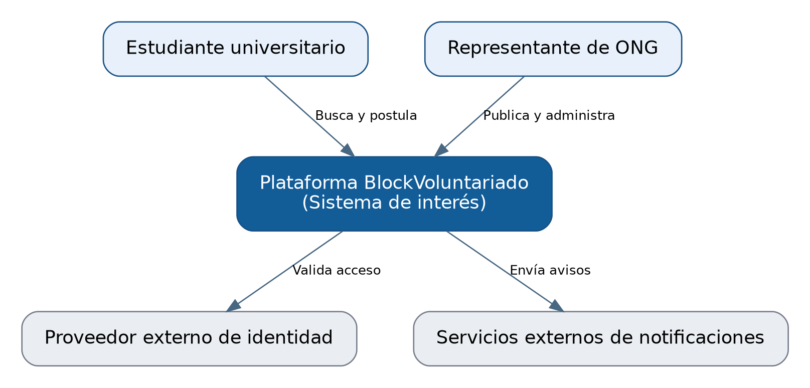

*Figura 2.5.3. Propuesta corregida del diagrama de contexto C4 (Nivel 1). Los componentes internos no se detallan en este nivel.*

**Nivel 2 — contenedores esperados:** aplicación Android en Kotlin/Jetpack Compose; API REST de backend Spring Boot; base de datos MySQL. Los proveedores externos se ubican fuera del límite de la plataforma. El nivel de despliegue debe reflejar la misma estructura lógica.

**Diagrama previo del AV1 — pendiente de actualizar en el archivo de imagen original:**

**Diagrama histórico del AV1 (sustituido):** la versión anterior centrada únicamente en el cliente móvil se conserva en el repositorio histórico, pero no se utiliza como arquitectura vigente.

#### 2.5.3.2. Software Architecture Container Level Diagrams
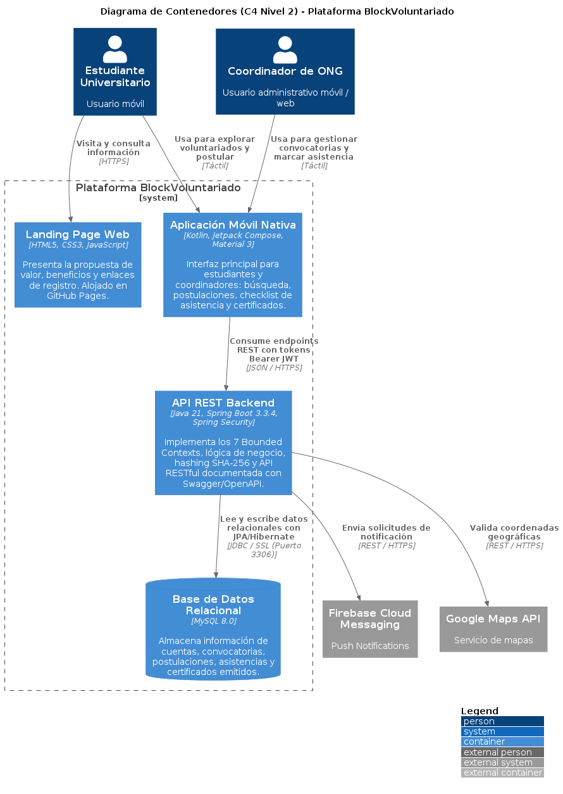

#### 2.5.3.3. Software Architecture Deployment Diagrams
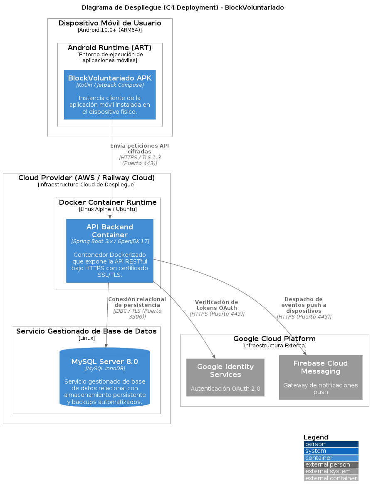

## 2.6. Tactical-Level Domain-Driven Design
### 2.6.1. Bounded Context: Volunteering Management Core
#### 2.6.1.1. Domain Layer

* **Aggregate Root 1: `Convocatoria`**
  * Atributos: `ConvocatoriaId` (VO), `OrganizacionId` (VO), `Titulo` (VO), `Descripcion` (VO), `LimiteVacantes` (VO), `VacantesOcupadas` (VO), `Horario` (VO con fecha inicio/fin y rango de horas), `Ubicacion` (VO con distrito y dirección), `EstadoConvocatoria` (Enum: `BORRADOR`, `PUBLICADA`, `CERRADA`).
  * Métodos de Dominio: `publicar()`, `postular(VoluntarioId)`, `ocuparVacante()`, `cerrarPorCupos()`.
* **Aggregate Root 2: `Postulacion`**
  * Atributos: `PostulacionId` (VO), `ConvocatoriaId` (VO), `VoluntarioId` (VO), `FechaPostulacion` (VO), `EstadoPostulacion` (Enum: `PENDIENTE`, `ACEPTADA`, `RECHAZADA`).
  * Métodos de Dominio: `aceptar()`, `rechazar(Motivo)`.
* **Value Objects (VOs):** `Horario`, `Ubicacion`, `LimiteVacantes`.
* **Domain Events:** `ConvocatoriaPublicadaEvent`, `PostulacionCreadaEvent`, `PostulanteAceptadoEvent`.
* **Repository Interfaces:** `ConvocatoriaRepository`, `PostulacionRepository`.

#### 2.6.1.2. Interface Layer

* `ConvocatoriasController`:
  * `POST /api/v1/convocatorias`: Crear convocatoria (solo rol `REPRESENTANTE_ONG`).
  * `GET /api/v1/convocatorias`: Catálogo de convocatorias con query params de filtros (`horario`, `distrito`, `causa`).
  * `GET /api/v1/convocatorias/{id}`: Detalle de la oportunidad.
  * `PUT /api/v1/convocatorias/{id}/publicar`: Publicar convocatoria.
* `PostulacionesController`:
  * `POST /api/v1/convocatorias/{id}/postulaciones`: Registrar postulación (rol `ESTUDIANTE`).
  * `GET /api/v1/convocatorias/{id}/postulantes`: Listar postulantes (rol `REPRESENTANTE_ONG`).
  * `PUT /api/v1/postulaciones/{id}/aceptar`: Aceptar voluntario.
  * `PUT /api/v1/postulaciones/{id}/rechazar`: Rechazar postulación.

#### 2.6.1.3. Application Layer

* **Commands:** `CreateConvocatoriaCommand`, `PublishConvocatoriaCommand`, `SubmitApplicationCommand`, `AcceptApplicantCommand`.
* **Handlers:** `ConvocatoriaCommandHandler`, `ApplicationCommandHandler`.
* **Queries:** `GetFilteredConvocatoriasQuery`, `GetApplicantListQuery`.
* **Event Handlers:** `PostulanteAceptadoEventHandler` (despacha la inicialización del registro de asistencia).

#### 2.6.1.4. Infrastructure Layer

* **Entidades JPA:** `ConvocatoriaJpaEntity`, `PostulacionJpaEntity`, `OrganizacionJpaEntity`.
* **Repositorios Spring Data:** `SpringDataConvocatoriaRepository`, `SpringDataPostulacionRepository`.
* **Mappers:** `ConvocatoriaMapper` (convierte entre `Convocatoria` de dominio y `ConvocatoriaJpaEntity` de persistencia relacional).

#### 2.6.1.5. Bounded Context Software Architecture Component Level Diagrams
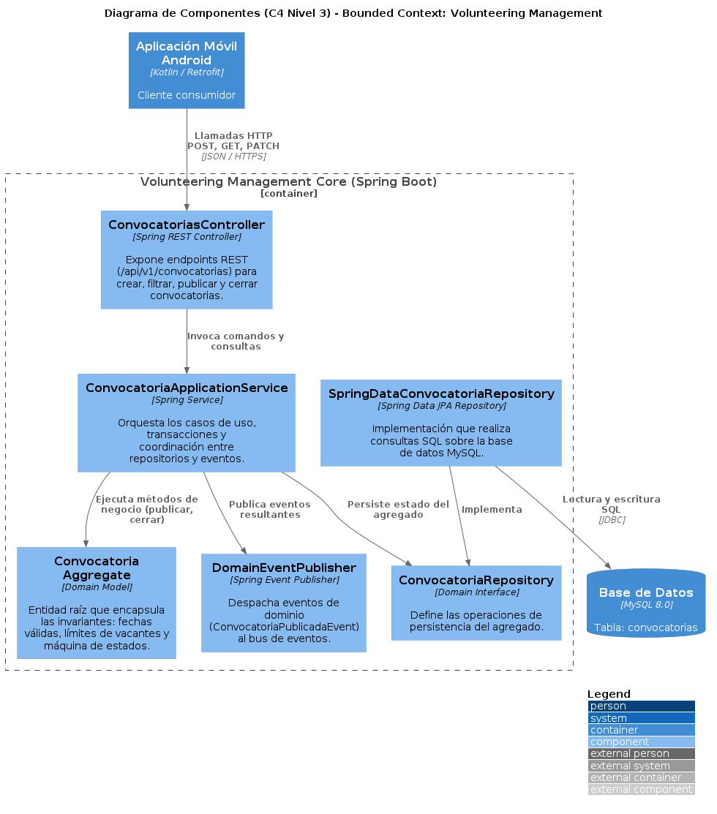

#### 2.6.1.6. Bounded Context Software Architecture Code Level Diagrams

##### 2.6.1.6.1. Bounded Context Domain Layer Class Diagrams
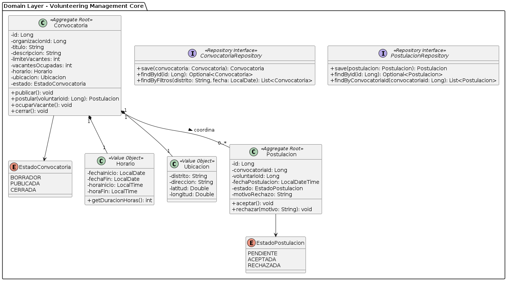

##### 2.6.1.6.2. Bounded Context Database Design Diagram
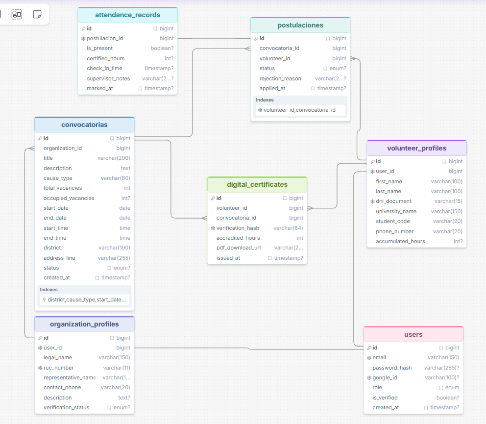

# Capítulo III: Solution UI/UX Design

## 3.1. Product design

### 3.1.1. Style Guidelines

#### 3.1.1.1. General Style Guidelines

El diseño visual de BlockVoluntariado busca facilitar la interacción de estudiantes universitarios y organizaciones sociales. Para el TB1 se analizaron 27 pantallas exportadas de Figma que ilustran procesos de autenticación, perfil, descubrimiento de convocatorias, gestión de postulaciones, control de asistencia y reconocimiento. Las pantallas constituyen **propuestas visuales**; su presencia en Figma no acredita que el flujo esté implementado o probado.

**Identidad y comunicación.** El onboarding utiliza una ilustración de colaboración y el mensaje «Conecta tu talento con causas que importan», asociando el producto con participación social. Los textos de las interfaces son breves y orientados a acciones concretas como «Empezar», «Entrar», «Crear nueva convocatoria», «Postularme ahora» y «Guardar asistencia». Se busca un tono cercano para el voluntario y claro para las tareas administrativas de las ONG.

    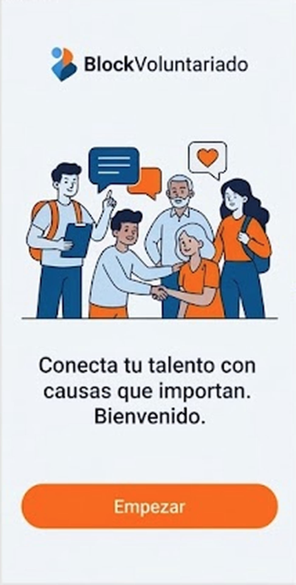

*Figura 3.1. Propuesta de onboarding de BlockVoluntariado. Fuente: diseño del equipo en Figma.*

**Colores.** En las pantallas de onboarding, registro, perfil, descubrimiento y convocatorias predominan un azul oscuro en barras y acciones secundarias, naranja en botones de acción principal y etiquetas destacadas, fondos claros y tarjetas blancas. En los diseños de seguimiento, asistencia, logros y notificaciones aparecen además verde para confirmaciones, rojo para rechazos o errores y tonos neutros. Los códigos HEX definitivos deberán verificarse con los estilos o variables del archivo de Figma; no deben deducirse únicamente de las capturas PNG.

**Tipografía.** Se observa una jerarquía entre títulos, subtítulos, etiquetas de formularios, textos de tarjetas y botones. Las capturas no permiten identificar con certeza la familia tipográfica ni todos sus pesos. El equipo incorporará esos valores desde las propiedades del archivo de Figma antes de cerrar el sistema tipográfico.

**Componentes y espaciado.** Se emplean tarjetas con bordes y esquinas redondeadas, campos de formulario con etiqueta visible, botones destacados, chips de categorías, listas, pestañas y navegación inferior. La repetición visual de estos elementos favorece la consistencia. La escala exacta de espaciado, los radios de borde y las dimensiones de controles deberán extraerse de los diseños originales.

    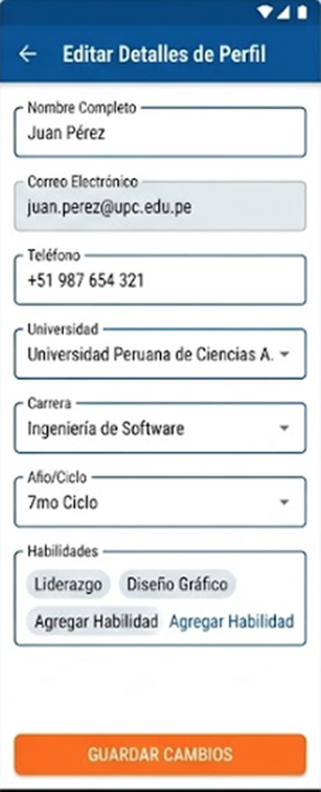

*Figura 3.2. Uso de campos, etiquetas y botón de acción en el perfil. Fuente: diseño del equipo en Figma.*

**Accesibilidad y coherencia.** La versión final deberá comprobar contraste cromático, tamaño de controles táctiles, legibilidad, textos de error y estados accesibles. Se identifican variantes visuales entre los primeros diseños, con cabeceras azul oscuro y acentos naranja, y las pantallas posteriores, con controles y barras de navegación de otro estilo; el equipo debe unificar ambas antes de considerar aprobadas las General Style Guidelines.

### 3.1.2. Information Architecture

La propuesta móvil agrupa las tareas por objetivos de usuario. Los estudiantes pueden registrarse, completar su perfil, filtrar oportunidades, revisar convocatorias, postularse, consultar solicitudes y revisar actividades. Las organizaciones cuentan con vistas para publicar convocatorias, revisar postulantes y gestionar asistencia. Otras pantallas proponen el seguimiento de logros y notificaciones.

**Organización.** Se observa una estructura principalmente jerárquica para el perfil y la configuración; secuencial para los formularios de nueva convocatoria en dos pasos; y de catálogo para el descubrimiento de oportunidades. El diseño permite agrupar información por usuario, convocatoria, postulación, actividad y reconocimiento.

**Etiquetas.** Las pantallas emplean denominaciones como «Mi perfil», «Mis solicitudes», «Mis convocatorias», «Gestión de postulantes», «Control de asistencia» y «Notificaciones». Deben revisarse para mantener nombres coherentes a lo largo de los flujos.

**Búsqueda y filtros.** El catálogo de oportunidades incluye un campo de búsqueda y opciones para filtrar voluntariados. La sección de intereses y disponibilidad permite expresar preferencias de usuario, aunque las imágenes no demuestran por sí solas que esos filtros estén conectados funcionalmente.

**Navegación.** Algunas vistas presentan una barra inferior para módulos frecuentes y flechas de retorno en tareas secundarias. Las pantallas de registro y publicación se organizan por pasos o acciones focalizadas. Debe verificarse que todas las vistas correspondan a un mapa de navegación coherente.

    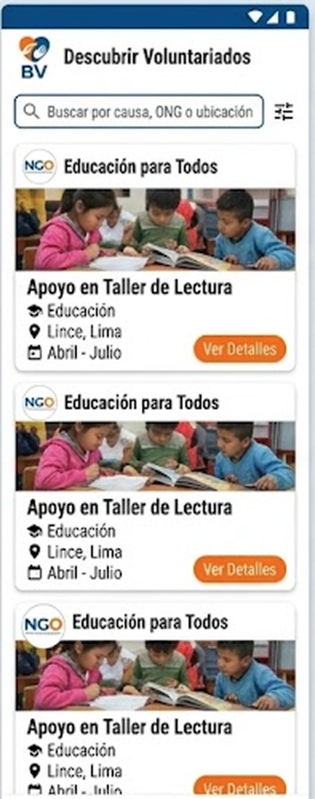

*Figura 3.3. Pantalla de descubrimiento de voluntariados. Fuente: diseño del equipo en Figma.*

    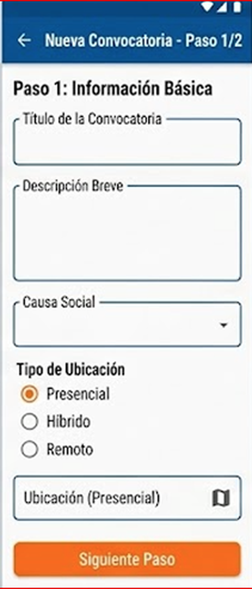

*Figura 3.4. Formulario secuencial para crear una convocatoria. Fuente: diseño del equipo en Figma.*

### 3.1.3. Landing Page UI Design
#### 3.1.3.1. Landing Page Wireframe
Los wireframes de la Landing Page de BlockVoluntariado representan la estructura preliminar de la interfaz web, definiendo la distribución de los contenidos, la jerarquía visual y los mecanismos de navegación que orientan a los visitantes hacia las principales funcionalidades de la plataforma.
La propuesta se organiza en frames que, en conjunto, representan el recorrido de la Landing Page para navegadores de escritorio.

### Este es el modelo del boceto de como se veria en PC, MAC, y pantalla grande

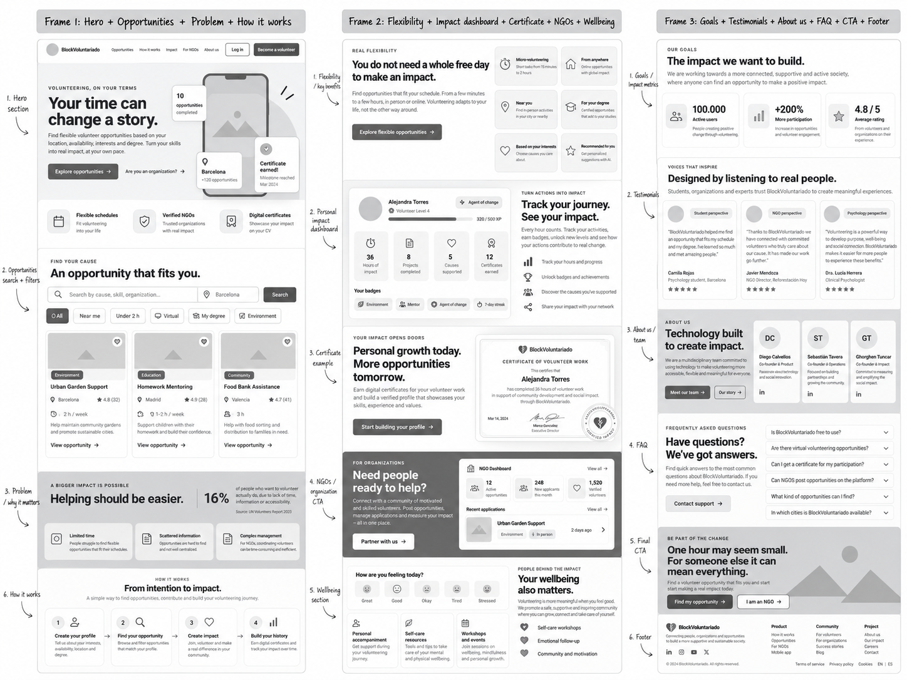

**Figura 3.5 Wireframe de escritorio de la Landing Page de BlockVoluntariado.
*Nota. Elaboración del equipo. El diagrama representa la organización estructural de la Landing Page en PCs.*

### Este es el modelo del boceto de como se veria en Android o celular

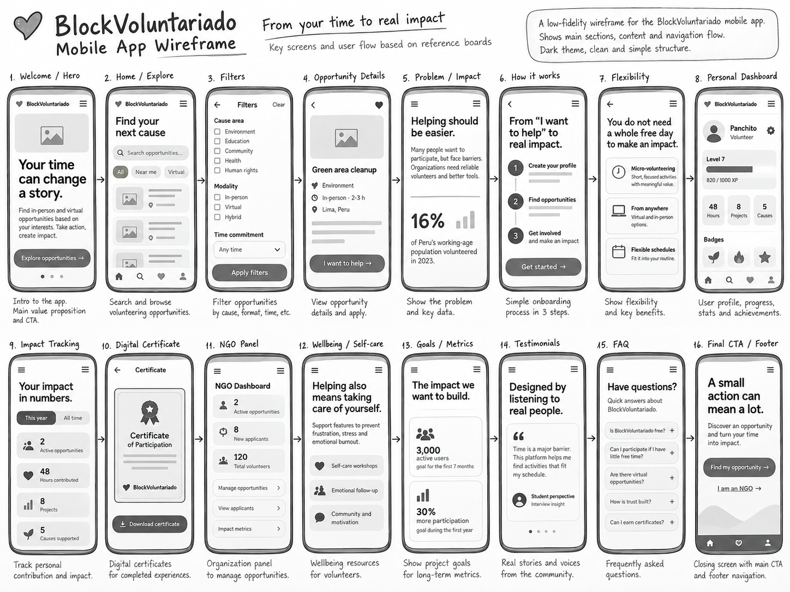
**Figura 3.6 Wireframe de escritorio de la Landing Page de BlockVoluntariado.
*Nota. Elaboración del equipo. El diagrama representa la organización estructural de la Landing Page en celulares.*

Los wireframes de la Landing Page de BlockVoluntariado presentan la distribución estructural de sus versiones para escritorio y dispositivos móviles, priorizando una navegación intuitiva, organizada y adaptable. Ambos diseños incluyen secciones de presentación, búsqueda de oportunidades, beneficios del voluntariado, seguimiento del impacto, certificados, herramientas para ONG, testimonios y preguntas frecuentes. Mientras que la versión de escritorio utiliza una distribución horizontal con múltiples columnas, la versión móvil reorganiza los contenidos verticalmente y simplifica la navegación mediante controles adaptados a pantallas pequeñas. Esta propuesta aplica principios de jerarquía visual, consistencia, diseño inclusivo y arquitectura de información, facilitando el acceso a las funcionalidades según el dispositivo utilizado.

#### 3.1.3.2. Landing Page Mock-up

Es hora de mostrar los diseños de como se veria la landing Page en los distintos dispositivos

### El respectivo diseño de la landing en la PC, MAC y en pantalla grande

    
    
<em>Figura 3.7.01 Diseño visual de escritorio de la Landing Page.</em>

    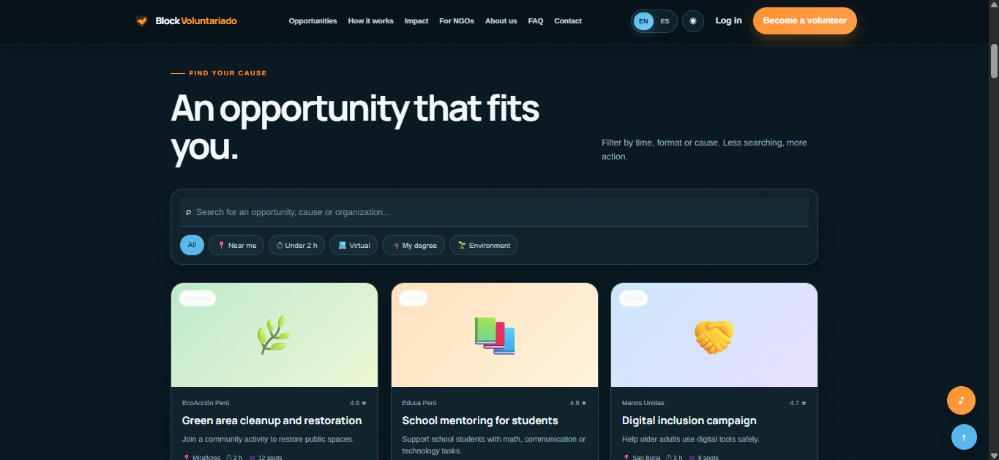
    
<em>Figura 3.7.02 Diseño visual de escritorio de la Landing Page.</em>

    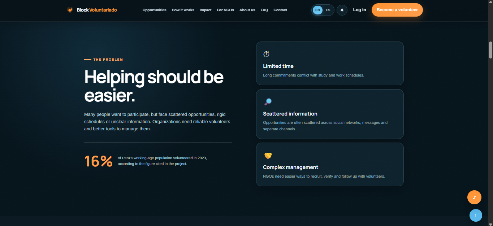
    
<em>Figura 3.7.03 Diseño visual de escritorio de la Landing Page.</em>

    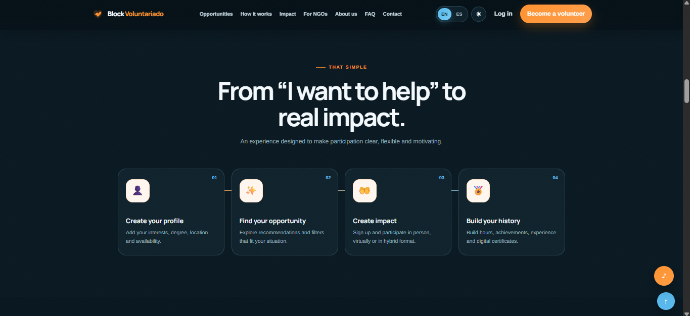
    
<em>Figura 3.7.04 Diseño visual de escritorio de la Landing Page.</em>

    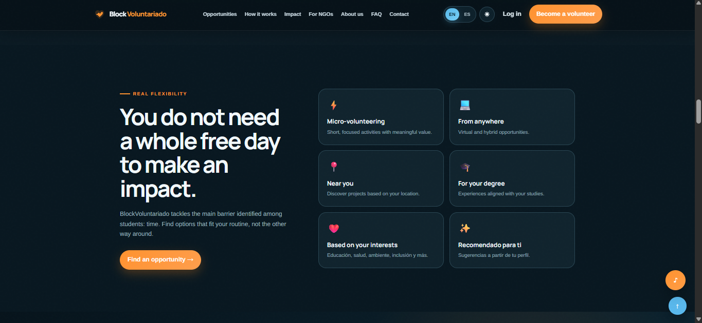
    
<em>Figura 3.7.05 Diseño visual de escritorio de la Landing Page.</em>

    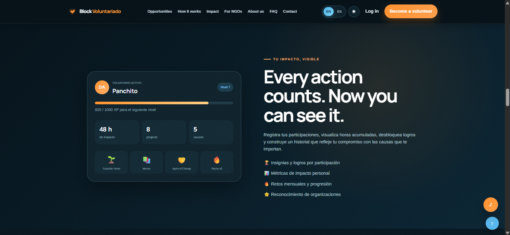
    
<em>Figura 3.7.06 Diseño visual de escritorio de la Landing Page.</em>

    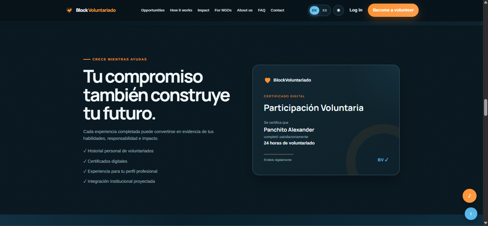
    
<em>Figura 3.7.07 Diseño visual de escritorio de la Landing Page.</em>

    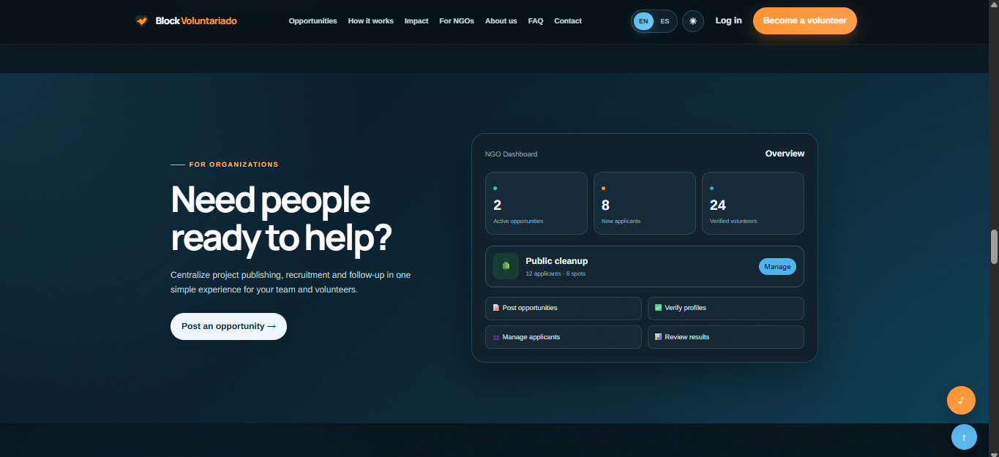
    
<em>Figura 3.7.08 Diseño visual de escritorio de la Landing Page.</em>

    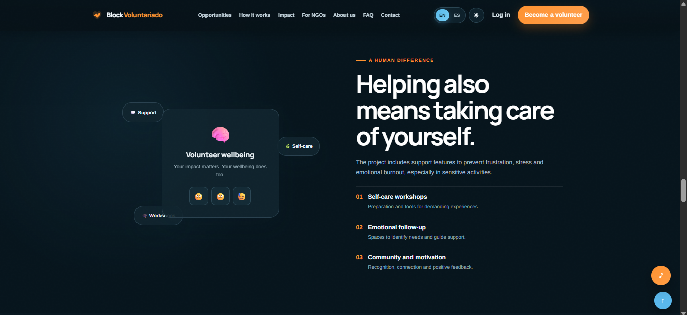
    
<em>Figura 3.7.09 Diseño visual de escritorio de la Landing Page.</em>

    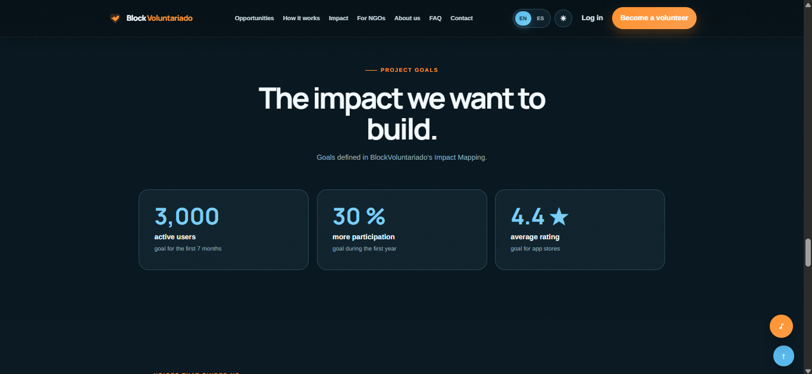
    
<em>Figura 3.7.10 Diseño visual de escritorio de la Landing Page.</em>

    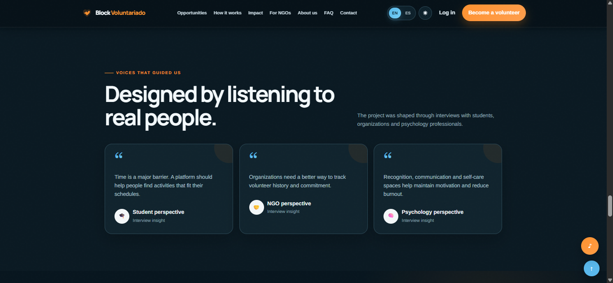
    
<em>Figura 3.7.11 Diseño visual de escritorio de la Landing Page.</em>

    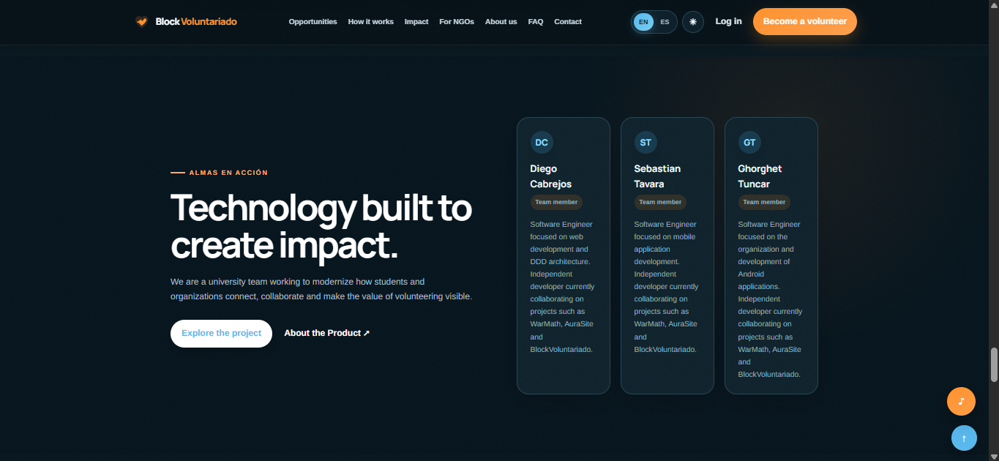
    
<em>Figura 3.7.12 Diseño visual de escritorio de la Landing Page.</em>

    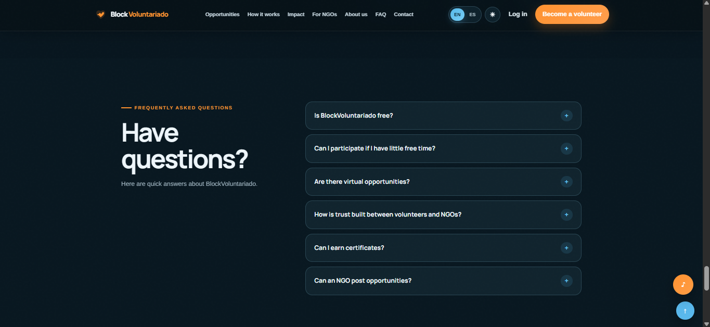
    
<em>Figura 3.7.13 Diseño visual de escritorio de la Landing Page.</em>

    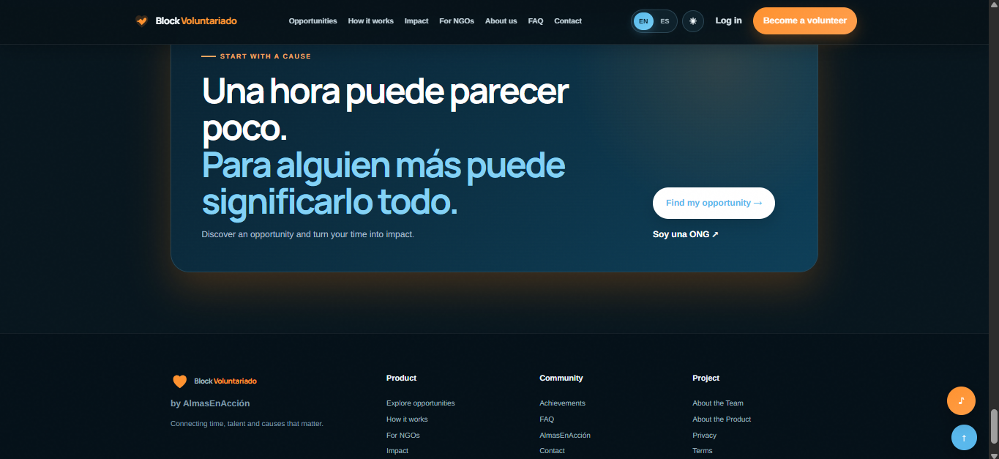
    
<em>Figura 3.7.14 Diseño visual de escritorio de la Landing Page.</em>

### Y El respectivo diseño de la landing en el celular

    
    
<em>Figura 3.7.15 Diseño visual móvil de la Landing Page.</em>

    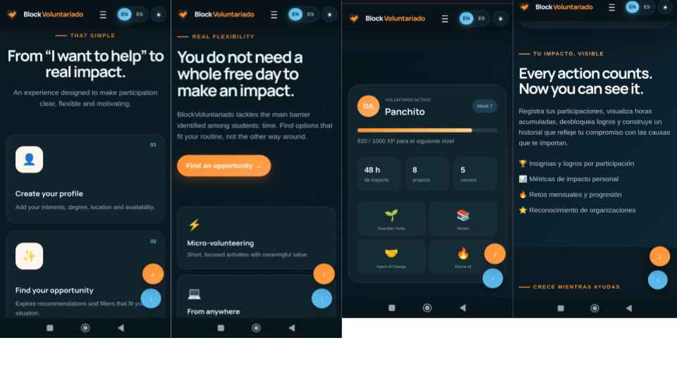
    
<em>Figura 3.7.16 Diseño visual móvil de la Landing Page.</em>

    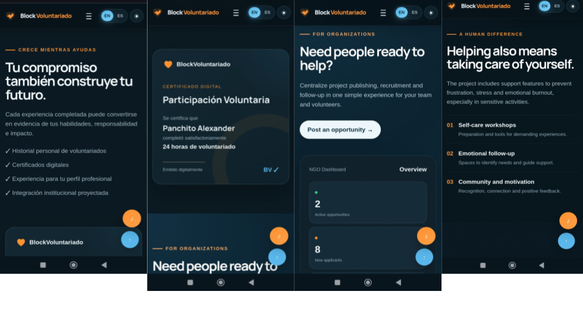
    
<em>Figura 3.7.17 Diseño visual móvil de la Landing Page.</em>

    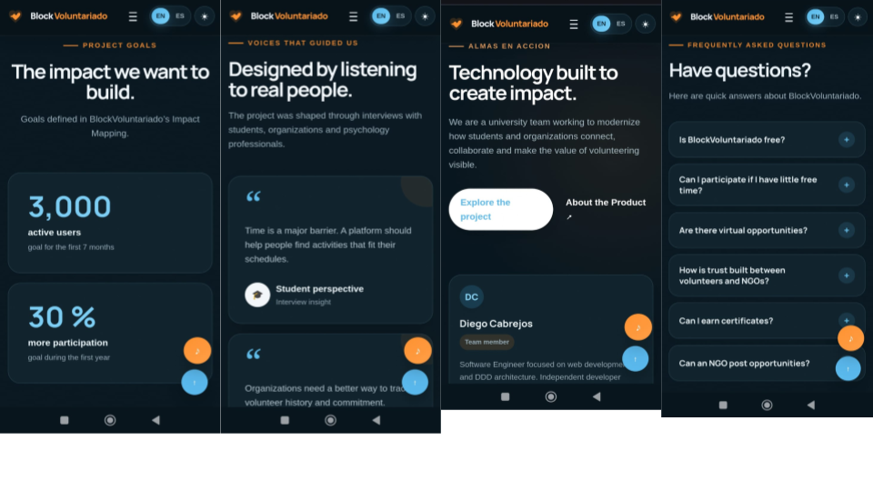
    
<em>Figura 3.7.19 Diseño visual móvil de la Landing Page.</em>

    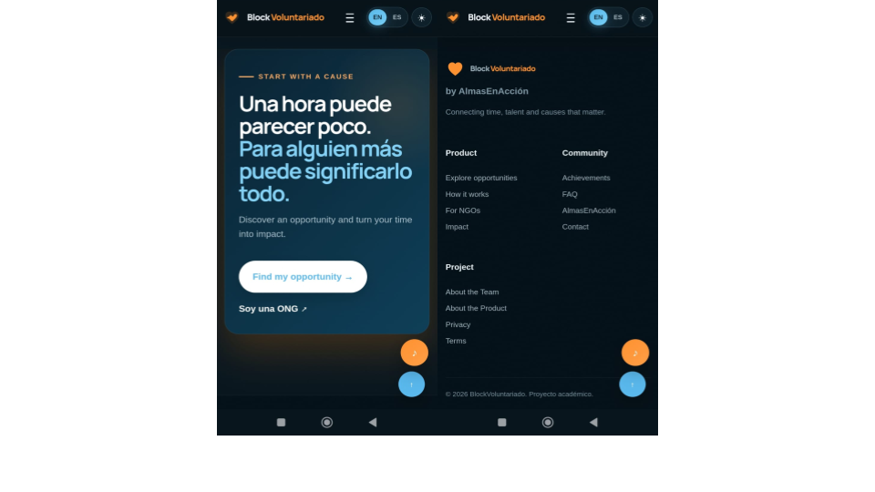
    
<em>Figura 3.7.20 Diseño visual móvil de la Landing Page.</em>

Los mock-ups de la Landing Page de BlockVoluntariado representan la propuesta visual para navegadores de escritorio y dispositivos móviles, aplicando una identidad gráfica basada en tonos azul oscuro, naranja y blanco. Ambos diseños presentan las principales secciones de la plataforma mediante una jerarquía tipográfica clara, tarjetas informativas, iconografía y botones de llamada a la acción. La versión de escritorio distribuye los contenidos en múltiples columnas, mientras que la versión móvil adapta los componentes a una disposición vertical para favorecer la lectura y navegación. Estas decisiones buscan mantener la consistencia del sistema visual, facilitar la identificación de funcionalidades y considerar principios de diseño inclusivo y arquitectura de información.

### 3.1.4. Mobile Applications UX/UI Design
El equipo dispone de un conjunto preliminar de 27 mock-ups de la experiencia móvil de BlockVoluntariado. Las pantallas cubren los recorridos de voluntarios y representantes de ONG, aunque la evidencia gráfica todavía debe complementarse con wireframes, wireflows, user flows y demostraciones del prototipo según el enunciado del curso.

#### 3.1.4.1. Mobile Applications Wireframes

  Los wireframes de la Mobile Applications de BlockVoluntariado representan la estructura preliminar de la interfaz de ususario, definiendo la distribución de los contenidos, la jerarquía visual de la plataforma.

### Este es el modelo del boceto de como se veria la aplicacion

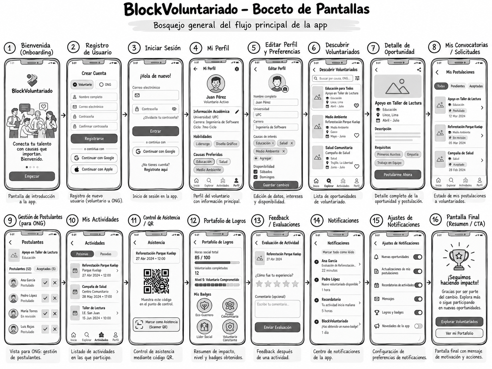

**Figura 3.8 Wireframe del Mobile Application de BlockVoluntariado.
*Nota. Elaboración del equipo. El diagrama representa la organización estructural del Mobile Application.*

#### 3.1.4.2. Mobile Applications Wireflow Diagrams

Los wireflows diagrams del Mobile Applications de BlockVoluntariado muestran la relación entre las principales interfaces y las decisiones que puede realizar el usuario durante su interacción con la aplicación. 
Permite visualizar cómo se conectan procesos como el registro, búsqueda de voluntariados, postulación, participación, seguimiento de actividades y gestión por parte de las ONG.ual de la plataforma.

### Este es el Wireflow Diagram de la aplicacion

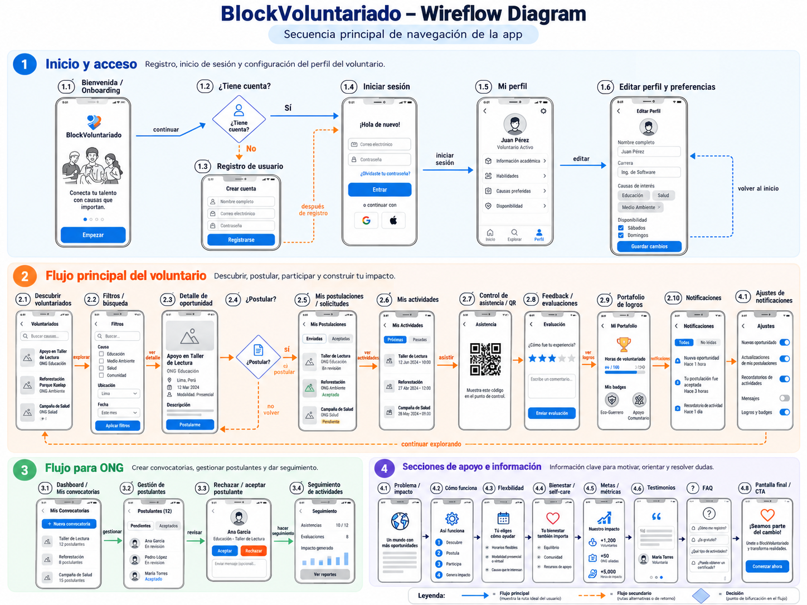

**Figura 3.9 Wireflow del Mobile Application de BlockVoluntariado.
*Nota. Elaboración del equipo. El diagrama representa la organización estructural y los pasos a seguir del Mobile Application.*

#### 3.1.4.3. Mobile Applications Mock-ups

Los mock-ups de BlockVoluntariado representan la propuesta visual de la aplicación móvil para estudiantes universitarios y representantes de organizaciones sociales. Su diseño incorpora una identidad gráfica basada en tonos azules, naranjas y blancos, empleando tarjetas informativas, formularios, iconografía y botones diferenciados para facilitar la interacción.

Las pantallas se organizan según los principales procesos de la plataforma: autenticación, personalización del perfil, búsqueda y postulación a voluntariados, administración de convocatorias, control de asistencia, seguimiento de actividades, reconocimientos y notificaciones.

La propuesta aplica principios de jerarquía visual, consistencia y agrupación de información relacionada. Asimismo, incorpora etiquetas descriptivas, controles identificables y mensajes de confirmación que buscan favorecer la comprensión de las acciones realizadas.

**Registro e inicio de sesión**

Se presentan las pantallas de bienvenida, selección del tipo de usuario e inicio de sesión. Estas vistas permiten diferenciar los perfiles de estudiante voluntario y representante de ONG, estableciendo el punto de acceso a las principales funcionalidades.

    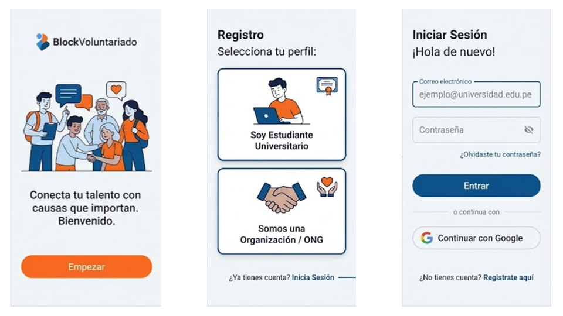

**Figura 4.0.01 Mock-ups de bienvenida, registro e inicio de sesión.

**Gestión del perfil y disponibilidad**

Los diseños presentan la información académica, habilidades, intereses y disponibilidad del estudiante. Se incorporan formularios de edición, etiquetas de causas sociales y una cuadrícula de horarios que facilita la personalización de las preferencias de voluntariado.

    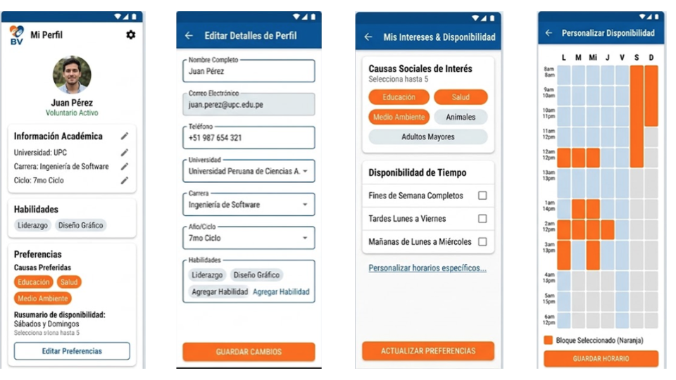

**Figura 4.0.02 Mock-ups de gestión del perfil, intereses y disponibilidad.

**Exploración y gestión de convocatorias**

Estas pantallas muestran la búsqueda de oportunidades, la consulta de detalles y el proceso de creación de convocatorias por parte de las organizaciones. La información se distribuye en tarjetas y formularios organizados por etapas, permitiendo identificar requisitos, fechas y características de las actividades.

    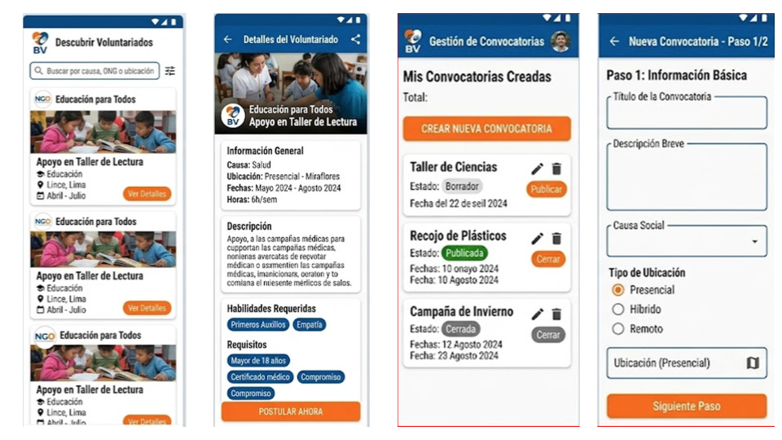

**Figura 4.0.03 Mock-ups de exploración de voluntariados y gestión de convocatorias.

**Postulaciones y evaluación de candidatos**

Se presentan las interfaces de envío de solicitudes, seguimiento de postulaciones y revisión de candidatos. Los estados de las solicitudes se distinguen mediante etiquetas visuales, mientras que las acciones de aceptación y rechazo se acompañan de controles específicos.

    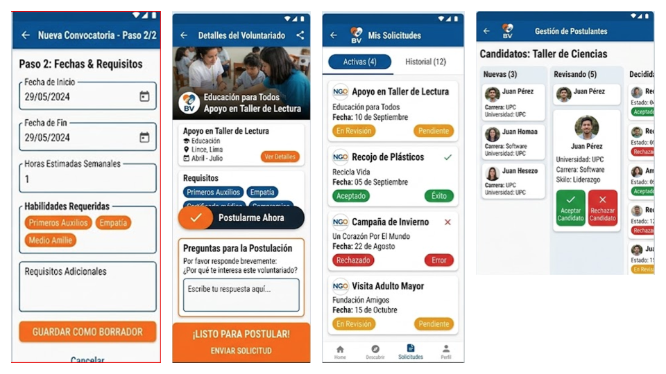

**Figura 4.0.04 Mock-ups de postulaciones y gestión de candidatos.

**Agenda y actividades**

Las pantallas de calendario y actividades permiten visualizar las fechas programadas y consultar información relacionada con la participación en voluntariados, favoreciendo la organización de las actividades.

    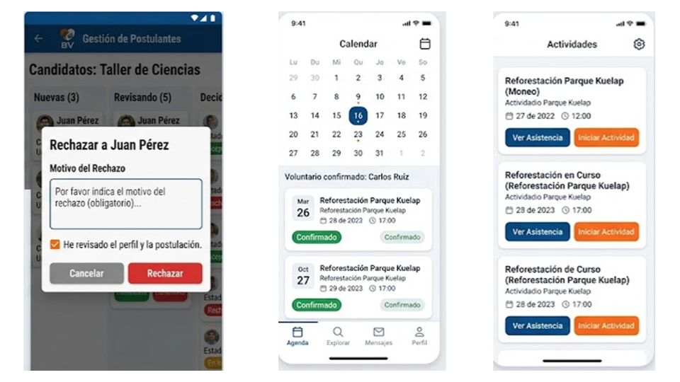

**Figura 4.0.05 Mock-ups de agenda y actividades.

**Registro y control de asistencia**

Los diseños incluyen la lista de participantes, el escaneo de códigos QR y la confirmación de asistencia. Se utilizan indicadores de estado y mensajes de retroalimentación para comunicar el resultado de las operaciones.

    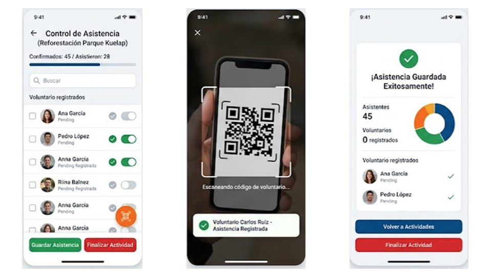

**Figura 4.0.06 Mock-ups de registro y control de asistencia.

**Logros, certificados y evaluaciones**

Las interfaces presentan el historial de participación, las insignias obtenidas, los certificados y los formularios de evaluación. Esta organización permite visualizar el progreso del voluntario y los reconocimientos asociados a sus actividades.

    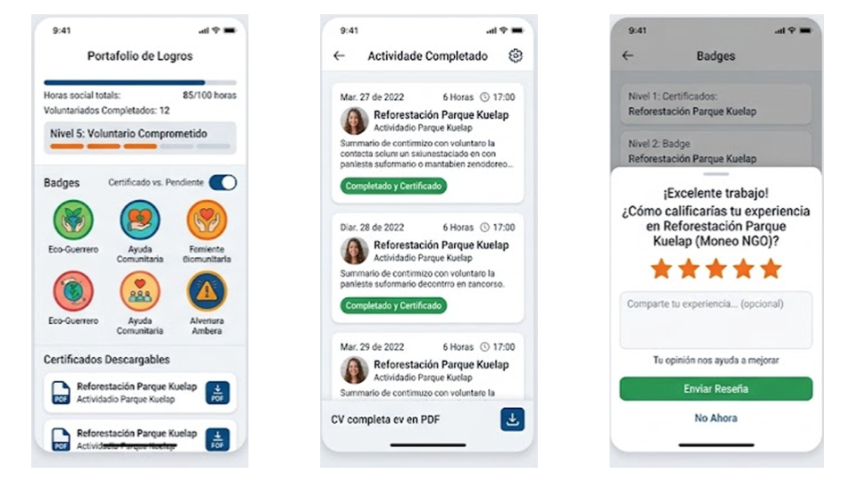

**Figura 4.0.07 Mock-ups de reconocimientos y evaluaciones.

**Notificaciones y configuración**

Finalmente, se presentan las pantallas de notificaciones y preferencias, que permiten consultar mensajes relacionados con las actividades y seleccionar categorías de avisos.

    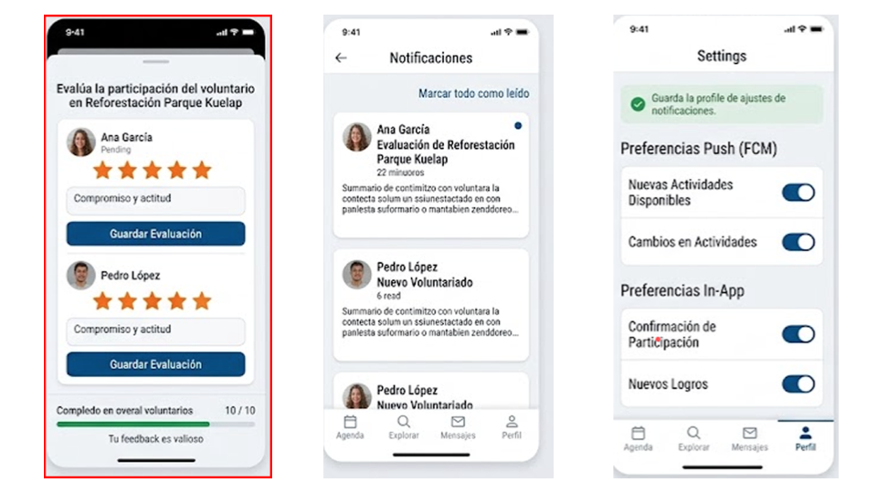

**Figura 4.0.08 Mock-ups de notificaciones y configuración.

En conjunto, los mock-ups reflejan una propuesta de interfaz que busca mantener coherencia visual y facilitar el acceso a las funcionalidades principales de BlockVoluntariado. Las decisiones de diseño inclusivo y usabilidad deberán comprobarse mediante pruebas con representantes de los segmentos objetivo.

#### 3.1.4.4. Mobile Applications User Flow Diagrams

El Mobile Applications User Flow Diagram representa la secuencia de navegación de BlockVoluntariado, mostrando cómo los usuarios acceden a la aplicación, gestionan su perfil, buscan y postulan a oportunidades de voluntariado, registran su participación y consultan sus logros. También incluye el flujo correspondiente a las organizaciones y las principales secciones informativas y de apoyo de la aplicación.

    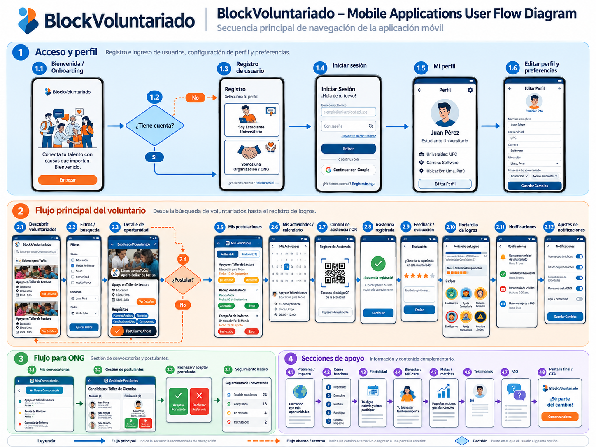

**Figura 4.1 User Flow Diagrams.

#### 3.1.4.5. Mobile Applications Prototyping

El Mobile Applications Prototyping presenta de forma visual la interacción entre las principales pantallas de BlockVoluntariado. El prototipo organiza los recorridos de autenticación, perfil, descubrimiento de voluntariados, seguimiento de actividades, retroalimentación y gestión para ONG, mostrando mediante conexiones la secuencia de navegación esperada dentro de la aplicación móvil.

    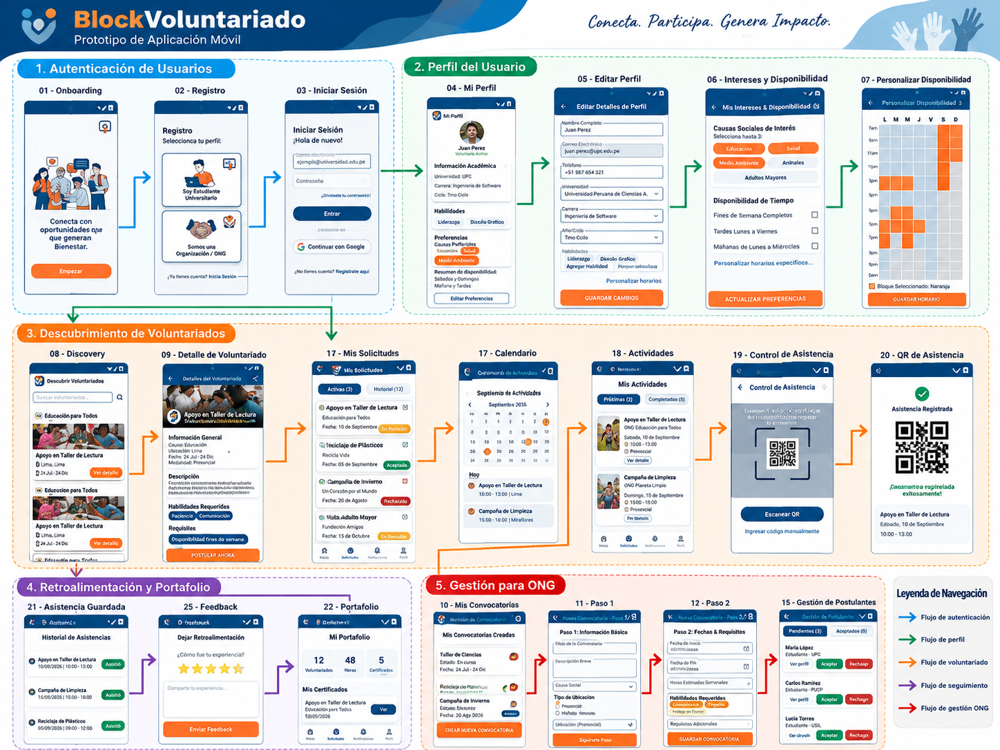

**Figura 4.2 Mobile Applications Prototyping.

# Capítulo IV: Product Implementation & Validation

## 4. Product Implementation & Validation

El presente capítulo documenta la configuración, construcción, pruebas, ejecución y despliegue de los productos digitales de **BlockVoluntariado** durante el **Sprint 1 (TB1)**. La solución contempla una Landing Page informativa, servicios backend para los procesos de negocio y una aplicación Android orientada a estudiantes voluntarios y representantes de organizaciones sociales. Se distingue expresamente entre **diseños de Figma**, **código desarrollado**, **funcionalidades verificadas** y **despliegues accesibles**, puesto que representan evidencias diferentes.

Al momento de elaborar esta versión, el equipo ha indicado que la Landing Page, los servicios backend, la aplicación Android y los diseños de Figma se encuentran **parcialmente desarrollados**. Se dispone de capturas de la Landing Page y cuatro repositorios públicos (web, Android, backend e informe). La existencia del código fuente no implica que las funcionalidades, pruebas o despliegues estén terminados. El estado específico de cada funcionalidad, prueba y despliegue backend/móvil permanece **pendiente de comprobación**.

### 4.1. Software Configuration Management

Esta sección presenta las decisiones de configuración y colaboración propuestas para mantener trazabilidad de cambios y coherencia entre los diferentes productos digitales. Las convenciones que aún no se hayan aplicado deben aprobarse y utilizarse efectivamente antes de declararlas como prácticas consolidadas.

#### 4.1.1. Software Development Environment Configuration

Se identifican las herramientas relacionadas con el diseño, desarrollo, revisión, control de versiones y pruebas. La tabla debe contrastarse con los entornos efectivamente utilizados por cada integrante.

| Actividad | Herramienta / tecnología | Propósito en BlockVoluntariado | Evidencia o fuente |
|---|---|---|---|
| Diseño UI/UX | Figma | Diseño de pantallas y prototipos móviles | Imágenes de pantallas facilitadas por el equipo; enlace editable pendiente |
| Landing Page | HTML5, CSS3, JavaScript | Estructura, presentación e interacciones del sitio | ZIP original de `BlockVoluntariado-website` |
| Desarrollo web | WebStorm u otro editor utilizado por el equipo | Edición de HTML, CSS, JS y Markdown | Captura/configuración pendiente |
| Desarrollo móvil | Android Studio; Kotlin / Jetpack Compose | Implementación nativa para Android | Repositorio GitHub público disponible; compilación y ejecución pendientes de evidenciar |
| Backend | [Framework y versión por confirmar] | Servicios RESTful para el dominio | Repositorio GitHub público disponible; framework, documentación y pruebas por confirmar |
| Control de versiones | Git y GitHub | Ramas, commits, revisiones y colaboración | Cuatro URLs públicas confirmadas; faltan capturas de branches, commits y colaboración |
| Gestión de Sprint | [Trello, Jira o YouTrack utilizado] | Product Backlog, Sprint Backlog y seguimiento | URL del tablero pendiente |
| Pruebas API | [Postman, Swagger UI u otro, si se utilizó] | Verificación de endpoints | Evidencia pendiente |
| Despliegue de Landing Page | GitHub Pages | Publicación del sitio estático | URL pública indicada a continuación |

La Landing Page se encuentra asociada a la dirección pública: https://upc-pre-202620-1acc0238-4945-bv.github.io/BlockVoluntariado-website/ . La accesibilidad y el funcionamiento de cada interacción deben validarse en la fecha de entrega y respaldarse mediante capturas de ejecución.

**Información que falta completar:** versiones de IDE, JDK/Android SDK/Gradle, tecnología y versión del backend, gestor de base de datos, herramientas de pruebas, sistema operativo, URLs de descarga o documentación de cada herramienta y responsables de configuración.

#### 4.1.2. Source Code Management

BlockVoluntariado utiliza GitHub para el control de versiones. La estrategia de trabajo **debe documentarse y verificarse** según GitFlow, incluyendo ramas de integración, ramas de funcionalidades y convenciones de entrega. La rama personal `dev/diego`, empleada en el repositorio del informe, no sustituye por sí sola una rama compartida de integración.

| Producto | Repositorio | Rama principal / integración | Estado de evidencia |
|---|---|---|---|
| Informe del proyecto | [BlockVoluntariado-report](https://github.com/upc-pre-202620-1ACC0238-4945-BV/BlockVoluntariado-report) | `main` visible; integración por confirmar | README y carpeta `assets` públicos; `dev/diego` mencionada por integrante, confirmar política del equipo |
| Landing Page | [BlockVoluntariado-website](https://github.com/upc-pre-202620-1ACC0238-4945-BV/BlockVoluntariado-website) | `main` visible; integración por confirmar | `index.html`, `css/`, `js/`, `html/` e imágenes visibles; página publicada indicada por el equipo |
| Backend REST API | [Blockvoluntariado-platform](https://github.com/upc-pre-202620-1ACC0238-4945-BV/Blockvoluntariado-platform) | `main` visible; integración por confirmar | Directorio de proyecto y README visibles; endpoints, pruebas y despliegue aún por validar |
| Aplicación Android | [BlockVoluntariado-android](https://github.com/upc-pre-202620-1ACC0238-4945-BV/BlockVoluntariado-android) | `main` visible; integración por confirmar | `app/`, archivos Gradle y README visibles; pantallas en ejecución aún por validar |
| Aplicación cross-platform, si corresponde al Sprint | [URL del repositorio cuando exista] | [Confirmar] | No se proporcionó repositorio |

**Revisión pública de repositorios (08/10/2026):** en la vista principal se observaron `main` y la estructura general de los cuatro proyectos. GitHub mostraba 18 commits en Website, 6 en Android, 3 en Platform y 68 en Report en el momento de la consulta. Son contadores de las ramas/vistas públicas en ese momento y **no** permiten atribuir trabajos al Sprint 1 ni a integrantes concretos. Se deben recoger IDs, fechas, autoría y ramas reales directamente desde el historial del período que corresponda. El README del repositorio Platform todavía titula la página como `BlockVoluntariado-website`, aspecto documental que debe revisarse.

**Convención propuesta — aplicar solo después de validarla con el equipo:** `main` para versiones estables, `develop` para integración, `feature/<descripcion>` para funcionalidades, `release/<version>` para preparación de entregas y `hotfix/<descripcion>` para correcciones urgentes. Usar mensajes de commits del tipo `feat:`, `fix:`, `docs:`, `test:` y `chore:`; asignar versiones conforme a Semantic Versioning (`MAJOR.MINOR.PATCH`).

**Evidencias por insertar:** captura de ramas remotas, historial de commits por producto, ejemplos reales de Conventional Commits y URL de las solicitudes de integración utilizadas.

#### 4.1.3. Source Code Style Guide & Conventions

Para mejorar la legibilidad y facilitar la colaboración, el equipo debe emplear nomenclatura en inglés y convenciones coherentes con cada lenguaje. Las pautas siguientes son criterios para comprobar sobre el código real, no una certificación de cumplimiento.

| Producto | Convenciones a documentar y comprobar |
|---|---|
| HTML5 | Etiquetas semánticas, atributos `alt`, etiquetas accesibles, indentación consistente y estructura comprensible |
| CSS3 | Selectores descriptivos, separación de estilos por responsabilidad y variables para colores y espaciado |
| JavaScript | Identificadores en `camelCase`, constantes bien nombradas y separación de eventos y lógica reutilizable |
| Kotlin/Android | Clases y componentes en `PascalCase`, funciones/variables en `camelCase` y organización de paquetes por responsabilidad |
| Backend | Convenciones oficiales del lenguaje/framework efectivamente empleado, contratos REST consistentes y manejo explícito de errores |
| Pruebas BDD | Historias/escenarios Gherkin con `Given`, `When` y `Then` para comportamientos verificables |

Se debe documentar además cómo se aplican el idioma inglés como valor predeterminado, la internacionalización inglés/español y los criterios de accesibilidad establecidos para los productos. **No afirmar cumplimiento sin revisión de código o pruebas.**

#### 4.1.4. Software Deployment Configuration

El despliegue de los productos debe describirse con pasos reproducibles, dependencias, requisitos de configuración y evidencia del resultado.

**Landing Page — código en [BlockVoluntariado-website](https://github.com/upc-pre-202620-1ACC0238-4945-BV/BlockVoluntariado-website) y publicación indicada en GitHub Pages; flujo que debe contrastarse con la configuración real:**

1. Integrar los cambios autorizados del sitio estático en el repositorio correspondiente.
2. Configurar GitHub Pages para publicar desde la rama y ruta definidas por el equipo, o mediante el workflow adoptado.
3. Verificar la URL pública y el funcionamiento del menú, vínculos, controles de idioma, apariencia y navegación responsive.
4. Registrar captura del sitio publicado y capturas de la configuración de despliegue.

**Backend:** [Especificar proveedor cloud, variables de entorno sin revelar secretos, almacenamiento, base de datos, dominio y proceso de despliegue]. Adjuntar captura de estado y documentación OpenAPI publicada o local según corresponda.

**Aplicación Android:** [Especificar configuración del proyecto, build y ejecución, método de instalación en dispositivo/emulador y evidencia de las pantallas core funcionando]. Los mock-ups de Figma no equivalen a ejecución de la aplicación.

**Diagrama solicitado:** insertar el C4 Deployment Diagram coherente con la infraestructura realmente utilizada o planeada, identificando explícitamente qué nodos ya están desplegados.

---

### 4.2. Landing Page & Mobile Application Implementation

La sección presenta los incrementos del Sprint 1. El Sprint Backlog y la información de desarrollo deben corresponder a actividades registradas en el gestor del proyecto y en los repositorios. No se asignan fechas, Story Points, responsables, porcentajes de avance ni funcionalidades terminadas sin evidencias verificables.

**Repositorios fuente para capturar evidencias del Sprint:**

- Website: [https://github.com/upc-pre-202620-1ACC0238-4945-BV/BlockVoluntariado-website](https://github.com/upc-pre-202620-1ACC0238-4945-BV/BlockVoluntariado-website/commits/main)
- Android: [https://github.com/upc-pre-202620-1ACC0238-4945-BV/BlockVoluntariado-android](https://github.com/upc-pre-202620-1ACC0238-4945-BV/BlockVoluntariado-android/commits/main)
- Platform: [https://github.com/upc-pre-202620-1ACC0238-4945-BV/Blockvoluntariado-platform](https://github.com/upc-pre-202620-1ACC0238-4945-BV/Blockvoluntariado-platform/commits/main)
- Report: [https://github.com/upc-pre-202620-1ACC0238-4945-BV/BlockVoluntariado-report](https://github.com/upc-pre-202620-1ACC0238-4945-BV/BlockVoluntariado-report/commits/main)

*Nota:* comprobar las ramas realmente utilizadas y filtrar por fechas del Sprint 1 antes de completar las tablas de commits y colaboración.

#### 4.2.1. Sprint 1

El Sprint 1 se orienta a obtener un primer incremento observable de BlockVoluntariado y dejar preparadas las bases de integración entre Landing Page, backend y experiencia móvil. **Este enfoque es una propuesta de redacción; el Sprint Goal definitivo debe coincidir con el objetivo aprobado por el equipo.**

##### 4.2.1.1. Sprint Planning 1

| Campo | Información para TB1 |
|---|---|
| Sprint | Sprint 1 |
| Fecha y hora | [Completar con acta real] |
| Modalidad / lugar | [Completar] |
| Preparado por | [Integrante responsable] |
| Participantes | [Integrantes asistentes] |
| Sprint anterior — Review | No aplica al primer Sprint, salvo que el equipo use otra secuencia |
| Sprint anterior — Retrospective | No aplica al primer Sprint, salvo que el equipo use otra secuencia |
| Sprint Goal | [Insertar objetivo de negocio validado por el equipo] |
| Métrica de cumplimiento | [Criterio observable y medible] |
| Velocity prevista | [Cantidad de Story Points acordada] |
| Suma de Story Points comprometidos | [Total calculado del Sprint Backlog] |

**Ejemplo de formulación para discusión (no constituye un resultado comprometido):** "Facilitar que una persona descubra la propuesta de valor de BlockVoluntariado y consulte las oportunidades de voluntariado a través de una primera experiencia web y móvil demostrable". El equipo debe precisar qué experiencia y qué criterios efectivamente comprometió.

##### 4.2.1.2. Aspect Leaders and Collaborators

El equipo debe incorporar una matriz LACX que identifique al líder (`L`) y los colaboradores (`C`) por aspecto del Sprint. Los roles se completarán según la distribución real de responsabilidades.

| Integrante y GitHub username | Landing Page | Backend | Android | UX/UI y prototipos | Pruebas / despliegue |
|---|---|---|---|---|---|
| [Apellido, nombre — usuario] | [L/C] | [L/C] | [L/C] | [L/C] | [L/C] |
| [Apellido, nombre — usuario] | [L/C] | [L/C] | [L/C] | [L/C] | [L/C] |
| [Apellido, nombre — usuario] | [L/C] | [L/C] | [L/C] | [L/C] | [L/C] |

La asignación debe guardar coherencia con las tareas, los commits y las evidencias presentadas en el resto del capítulo.

##### 4.2.1.3. Sprint Backlog 1

El Sprint Backlog descompone las historias comprometidas en tareas trazables y registra esfuerzo, responsables y estado. Se incluirá la **captura del tablero real y su URL pública**.

**Tablero del Sprint 1:** [URL pendiente].  
**Figura 4.x.** Captura de Sprint Backlog 1 [pendiente].

| User Story ID y título | Task ID | Tarea | Descripción / entregable | Estimación (h) | Responsable | Estado |
|---|---|---|---|---|---|---|
| [US validada] | [TASK] | [Nombre] | [Resultado verificable] | [h] | [Integrante] | [To-do / In-Process / To-Review / Done] |

**Importante:** no inventar IDs, estados, estimaciones ni compromisos; tomar estos datos del tablero y del Product Backlog aprobados.

##### 4.2.1.4. Development Evidence for Sprint Review

Las evidencias de desarrollo deben vincular cambios reales con sus correspondientes repositorios, ramas, fechas y commits. La tabla se completará usando el historial de GitHub, sin inferir autoría a partir de imágenes de interfaz.

| Repository | Branch | Commit ID | Commit Message | Commit Message Body | Committed on (Date) |
|---|---|---|---|---|---|
| [user/repository] | [branch] | [hash] | [mensaje real] | [cuerpo o no aplica] | [YYYY-MM-DD] |

Para cada producto, agregar un párrafo que explique qué incremento funcional produjo la secuencia de commits y qué User Story satisface.

##### 4.2.1.5. Testing Suite Evidence for Sprint Review

Esta sección debe presentar las pruebas automatizadas de unidad, integración y aceptación relacionadas con las User Stories del Sprint, particularmente para los Web Services. **El estado actual de la suite no ha sido documentado**, por lo que no se declaran pruebas aprobadas.

| ID de prueba | Tipo | Funcionalidad / clase / endpoint | User Story | Resultado | Evidencia |
|---|---|---|---|---|---|
| [ID] | [Unit / Integration / Acceptance] | [Elemento probado] | [US] | [Pass / Fail / Not run] | [Enlace o captura] |

Para escenarios BDD, adjuntar los archivos `.feature`, sus steps, los criterios Given–When–Then y enlaces a commits de pruebas. Describir de forma explícita los problemas encontrados y las correcciones aplicadas, si corresponde.

##### 4.2.1.6. Execution Evidence for Sprint Review

El diseño presentado en Figma y el sitio web publicado permiten ilustrar la experiencia propuesta. Sin embargo, cada imagen debe clasificarse correctamente según su origen.

**Evidencia visual de la Landing Page en escritorio:**

  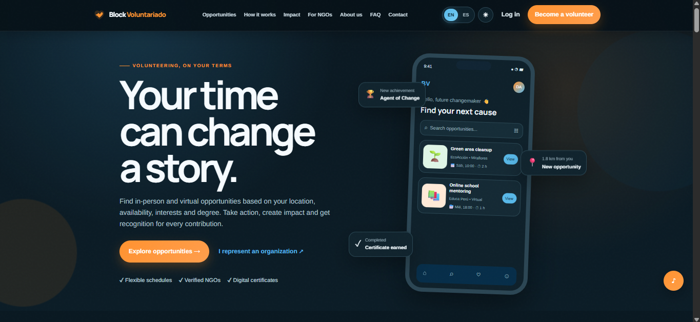
  
<em>Figura 4.1. Vista de la Landing Page de BlockVoluntariado en navegador de escritorio. Fuente: captura compartida por el equipo.</em>

**Evidencia visual de la Landing Page en móvil:**

  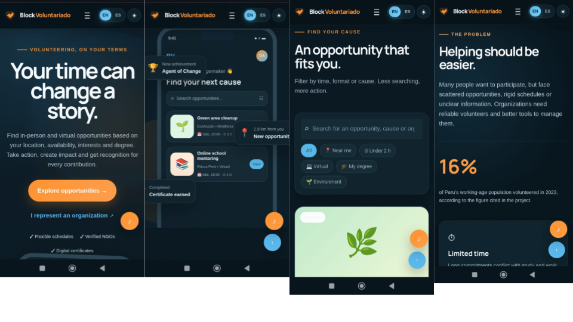
  
<em>Figura 4.2. Adaptación móvil del sitio publicada por el equipo. Fuente: capturas compartidas por el equipo.</em>

**Aplicación Android:** [Insertar capturas tomadas desde el emulador o dispositivo con la aplicación ejecutándose, indicando pantalla, funcionalidad y estado; no reutilizar collages Figma como prueba de ejecución].  
**Video de ejecución del Sprint:** [URL del video y breve explicación de navegación].

##### 4.2.1.7. Services Documentation Evidence for Sprint Review

Para los servicios implementados, incluir documentación OpenAPI/Swagger y ejemplos verificables de solicitudes y respuestas. El nombre, disponibilidad y cantidad de endpoints aún no se han confirmado.

| Método HTTP | Endpoint | Funcionalidad y parámetros | Respuesta de ejemplo | Estado de implementación | Evidencia OpenAPI |
|---|---|---|---|---|---|
| [GET/POST/PATCH/etc.] | [ruta real] | [Descripción] | [Código HTTP y JSON de ejemplo] | [Implementado / En desarrollo] | [URL o captura] |

Agregar capturas de Swagger UI con datos de prueba, URL del repositorio backend y commits relacionados con la documentación del Sprint. No incluir datos personales reales ni secretos en las capturas.

##### 4.2.1.8. Software Deployment Evidence for Sprint Review

Se documentarán por producto las acciones de preparación, configuración, publicación y comprobación realizadas durante el Sprint 1.

| Producto | Entorno / servicio | Evidencia solicitada | Estado documentable |
|---|---|---|---|
| Landing Page | GitHub Pages | URL pública, configuración del despliegue, captura y prueba de acceso | URL y capturas disponibles; verificar configuración de publicación |
| Backend | [Cloud provider o entorno utilizado] | Endpoint accesible, logs/capturas, configuración y documentación API | Sin evidencia de despliegue aportada aún |
| Android | [Dispositivo/emulador/distribución] | Captura de instalación, compilación y ejecución | Diseños aportados; ejecución pendiente de evidenciar |

La rúbrica del TB1 solicita un backend desplegado al **70 %**. Para sustentar este requisito debe definirse la base de cálculo (por ejemplo, endpoints o historias del alcance acordado) y comprobar el avance con evidencias reales; no basta asignar un porcentaje estimado.

##### 4.2.1.9. Team Collaboration Insights during Sprint

Esta sección interpreta la colaboración real del equipo durante Sprint 1. Deben insertarse capturas de analíticas GitHub de cada repositorio (Contributors, Commits, Pull Requests, cuando corresponda), junto con la distribución de tareas del tablero. El análisis debe reflejar quién contribuyó, a qué funcionalidades, en qué fechas y cómo se resolvieron dependencias o bloqueos.

| Producto | Evidencia de colaboración | Interpretación pendiente |
|---|---|---|
| Landing Page | [Captura de commits y contribuciones] | [Explicar contribuciones comprobadas] |
| Backend | [Captura de commits y contribuciones] | [Explicar contribuciones comprobadas] |
| Aplicación Android | [Captura de commits y contribuciones] | [Explicar contribuciones comprobadas] |
| Documentación del proyecto | [Captura del repositorio del informe] | [Relacionar con el Registro de Versiones] |

---

### 4.3. Validation Interviews

La validación busca recoger observaciones de representantes de ambos segmentos objetivo mediante tareas realizadas sobre las experiencias disponibles de BlockVoluntariado. **No se han proporcionado entrevistas de validación del TB1**, por lo que esta sección se plantea como preparación del trabajo y no como una actividad ya ejecutada. Su alcance y fecha deben confirmarse según la planificación del curso.

#### 4.3.1. Diseño de Entrevistas

Se propone preparar tareas alineadas con los objetivos de cada segmento: identificar una oportunidad de voluntariado y revisar sus requisitos (estudiante); localizar información para publicar una convocatoria y comprender el proceso de gestión (representante de ONG). Para cada tarea, definir guion, criterios observables, preguntas de seguimiento y formato de evaluación heurística establecido en el Anexo E de la rúbrica.

#### 4.3.2. Registro de Entrevistas

[Pendiente de ejecutar y documentar]. Para cada entrevista realizada se deberá incluir nombre, edad, distrito, segmento objetivo, captura del video, enlace a OneDrive, tiempo de inicio y duración, más un resumen descriptivo de las observaciones. La guía del curso establece **entre tres y cinco entrevistas por segmento** para esta sección.

#### 4.3.3. Evaluaciones según heurísticas

[Pendiente de evidencia]. Documentar los problemas realmente observados, asignando severidad del 1 al 4 según el Anexo E, identificar el principio de usabilidad, diseño inclusivo o arquitectura de información comprometido, adjuntar captura y formular una mejora justificable. No inventar hallazgos ni resultados de usuarios.

---

**Nota de cierre del Capítulo IV para TB1.** Esta versión constituye una base documental estructurada. Para considerarla lista para evaluación, deben sustituirse los campos `[pendiente]` por evidencias del equipo, confirmar el Sprint Goal y el tablero, incorporar datos y pruebas reales del backend y Android, y comprobar el alcance exigido para el TB1.

**Nota de cierre del Capítulo IV para TB1.** Esta versión constituye una base documental estructurada. Para considerarla lista para evaluación, deben sustituirse los campos `[pendiente]` por evidencias del equipo, confirmar el Sprint Goal y el tablero, incorporar datos y pruebas reales del backend y Android, y comprobar el alcance exigido para el TB1.

# Conclusiones
## Conclusiones y recomendaciones

El análisis de BlockVoluntariado identifica como principales necesidades la centralización de oportunidades, la búsqueda compatible con horarios de estudiantes y la gestión trazable de postulaciones por las organizaciones. Las entrevistas y el análisis de tareas fundamentan una plataforma que combine experiencia móvil, servicios de negocio y persistencia.

Desde el diseño técnico, la revisión evidencia la importancia de diferenciar los contextos candidatos de los definitivos, documentar contratos entre capacidades y emplear correctamente los patrones de DDD. Se recomienda validar las reglas de negocio con los interesados, enlazar cada decisión a historias y pruebas, y mantener los modelos C4 coherentes entre niveles.

Las métricas de adopción, certificación y retención del producto son hipótesis y objetivos por validar; no se presentan como resultados alcanzados.

# Video App Validation
# Video About the product
# Video About the team

# Glosario

- **Bounded Context:** límite donde un modelo de dominio mantiene significado consistente.
- **Comando:** solicitud de ejecutar una acción de negocio.
- **Evento de dominio:** hecho relevante ocurrido en el negocio.
- **Context Map:** representación de dependencias y acuerdos entre contextos.
- **C4:** modelo para describir arquitectura mediante contexto, contenedores, componentes y código.

# Bibliografía
- DDD Crew. (s. f.). *Domain Message Flow Modelling*. https://github.com/ddd-crew/domain-message-flow-modelling
- DDD Crew. (s. f.). *Bounded Context Canvas*. https://github.com/ddd-crew/bounded-context-canvas
- DDD Crew. (s. f.). *Context Mapping*. https://github.com/ddd-crew/context-mapping

- Comisión Económica para América Latina y el Caribe (CEPAL). (2021). *El rol del voluntariado y la participación juvenil en la recuperación y el desarrollo en América Latina*. Naciones Unidas.

- Programa de los Voluntarios de las Naciones Unidas (VNU). (2022). *Informe sobre el estado del voluntariado en el mundo 2022: Crear sociedades igualitarias e inclusivas*. Naciones Unidas.

- Idealist. (s. f.). Tiempo de Cambios.
  https://www.idealist.org

- Hacesfalta. (s. f.). Voluntariado y Empleo en ONG.
  https://www.hacesfalta.org

- Catchafire. (s. f.). ¿Que es Catchafire y como puedo unirme?.
  https://help.catchafire.org

# Anexos

#### Codecito

