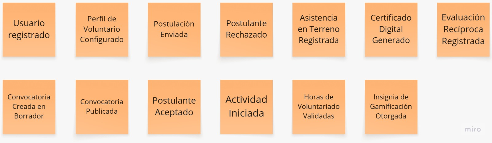
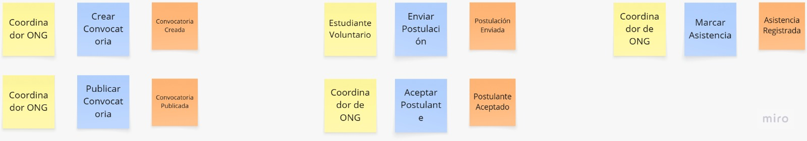
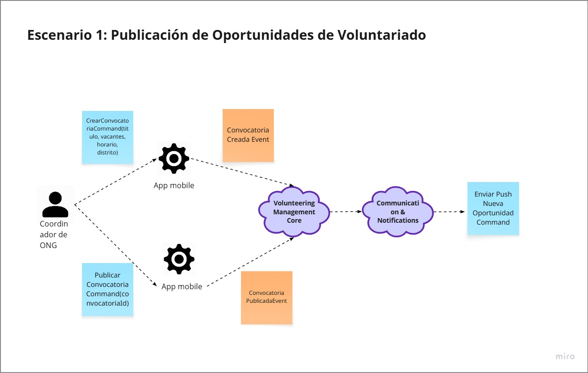
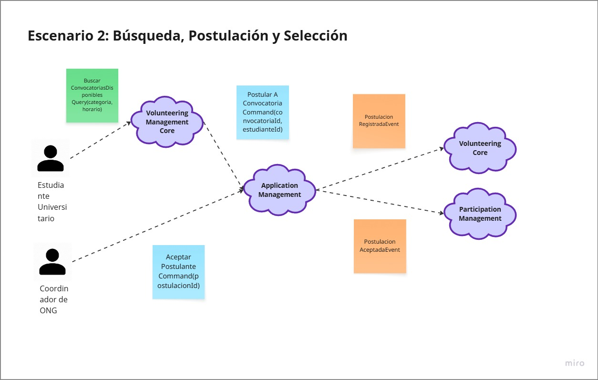
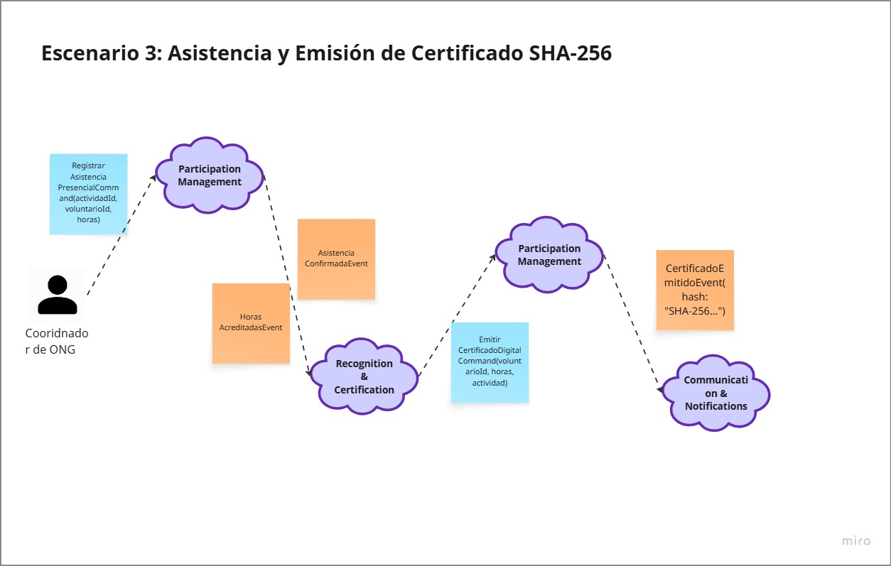
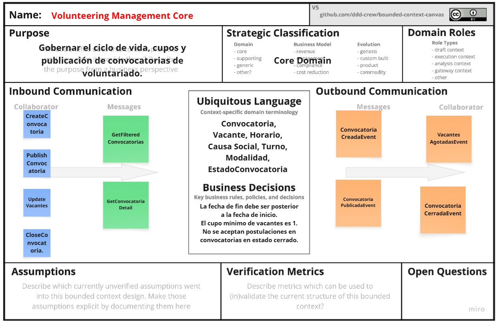
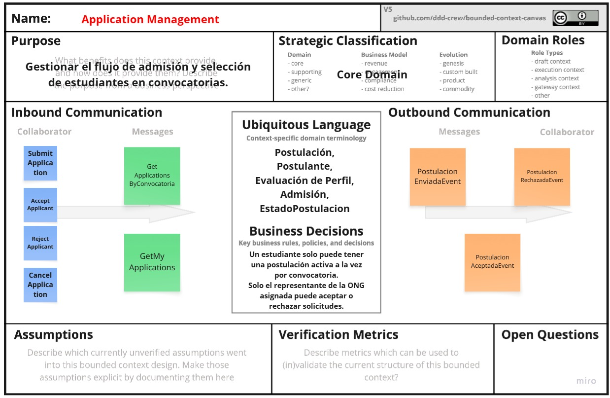
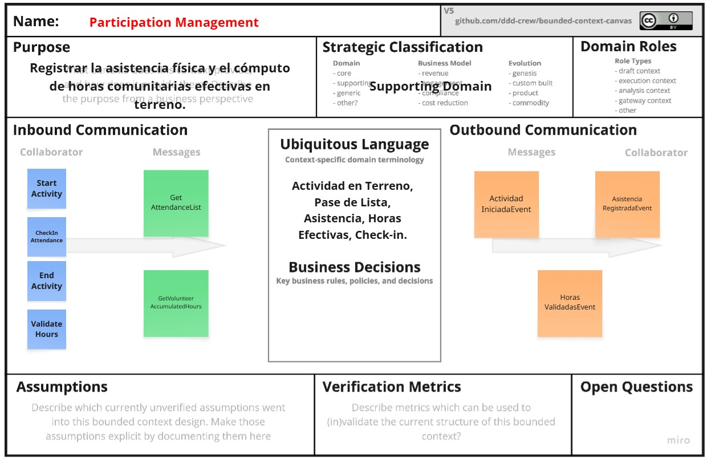
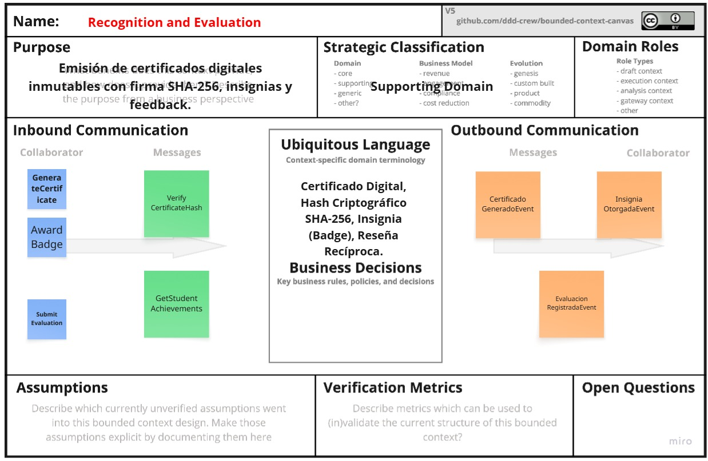
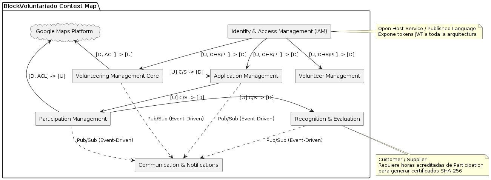

<div align="center">

</img><br>

Universidad Peruana de Ciencias Aplicadas<br>
Carrera de Ingeniería de Software<br><br>

<strong>1ACC0238</strong><br>
<strong>Aplicaciones para Dispositivos Móviles</strong><br>
NRC<br>
<strong>4945</strong><br>
<strong>Informe del Trabajo Final - Trabajo Parcial (TB1)</strong><br>
Docente<br>
<strong>Jorge Luis Mayta Guillermo</strong><br>
Equipo<br>
<strong>BlockVoluntariado</strong><br><br>

Proyecto<br>
<strong>BlockVoluntariado</strong><br><br>

<strong>Integrantes</strong>

<table>
  <thead>
    <tr>
      <th>Código</th>
      <th>Apellidos y Nombres</th>
    </tr>
  </thead>
  <tbody>
    <tr>
      <td>U20241e014</td>
      <td>Cabrejos Chocco, Diego Alexander</td>
    </tr>
    <tr>
      <td>U20241e179</td>
      <td>Tavara Correa, Sebastian Oswaldo</td>
    </tr>
    <tr>
      <td>U20241e107</td>
      <td>Tuncar Vila, Ghorghet Saul</td>
    </tr>
  </tbody>
</table>

<strong>Período 202620</strong><br><br>

<strong>Octubre 2026</strong>
</div>
<div style="page-break-after: always;"></div>

## Registro de Versiones del Informe
| Versión | Fecha | Autor(es) | Descripción de Modificación |
| :---: | :---: | :--- | :--- |
| **2.0** | 09/10/2026 | Todos los integrantes | **Entrega Oficial Trabajo Parcial (TB1):** Adecuación integral conforme a la rúbrica de evaluación y retroalimentación docente: orden alfabético estricto de carátula; reestructuración formal del Student Outcome 7 por criterios específicos del Anexo A (AV1 y TB1); formalización de Bounded Context Canvases (DDD Crew); modelado detallado de Domain Message Flow Modelling; justificación técnica y diagrama de Context Mapping; diagramas C4 nivel Contexto (plataforma integral), Contenedores y Despliegue; normalización de títulos UI/UX; e incorporación de evidencias reales de desarrollo, servicios RESTful y configuración de despliegue para el Sprint 1. |
| **1.1** | 08/10/2026 | Equipo BlockVoluntariado | **Revisión de observaciones AV1:** Presentación, trazabilidad de historias, explicación de fases de EventStorming, flujos de mensajes, canvases preliminares, justificación de Context Mapping y descripción de contextos candidatos. |
| **1.0** | 18/09/2026 | Todos los integrantes | **Entrega Oficial Hito 1 (AV1):** Consolidación de Student Outcome 7 inicial, Objetivos SMART, Big Picture EventStorming, Impact Mapping, Product Backlog, Diseño Estratégico y Táctico DDD, Arquitectura C4 y Esquema Relacional MySQL. |

## Project Report Collaboration Insights

El presente informe ha sido desarrollado de forma colaborativa continua mediante el repositorio oficial de GitHub del equipo:
* **Repositorio del Project Report:** [https://github.com/upc-pre-202620-1ACC0238-4945-BV/BlockVoluntariado-report](https://github.com/upc-pre-202620-1ACC0238-4945-BV/BlockVoluntariado-report)

El flujo de trabajo se fundamenta en la adopción estricta de **GitFlow Workflow** y el estándar **Conventional Commits**:
- **Rama `main`:** Aloja versiones de producción y entregas oficiales formalmente cerradas (AV1, TB1).
- **Rama `develop`:** Rama de integración continua donde convergen las contribuciones validadas mediante Pull Requests con revisión entre pares (*peer review*).
- **Ramas de trabajo individual:** Ramas activas de cada integrante (`dev/diego`, `dev/sebastian`, `dev/ghorghet`) para aislar el desarrollo de secciones, artefactos y diagramas.

A lo largo del ciclo correspondiente al Trabajo Parcial (TB1), el equipo registra más de 50 commits en el repositorio documental, garantizando la trazabilidad entre el Registro de Versiones del Informe y las contribuciones individuales sustentadas en el Student Outcome 7.

<div style="page-break-before: always;"></div>

## Contenido

- [Student Outcome](#student-outcome)
- [Objetivos SMART](#objetivos-smart)
- [Capítulo I: Presentación](#capítulo-i-presentación)
  - [1.1. Startup Profile](#11-startup-profile)
    - [1.1.1. Descripción de la Startup](#111-descripción-de-la-startup)
    - [1.1.2. Perfiles de integrantes del equipo](#112-perfiles-de-integrantes-del-equipo)
  - [1.2. Solution Profile](#12-solution-profile)
    - [1.2.1. Antecedentes y problemática](#121-antecedentes-y-problemática)
    - [1.2.2. Lean UX Process](#122-lean-ux-process)
  - [1.3. Segmentos objetivo](#13-segmentos-objetivo)
- [Capítulo II: Requirements Development and Software Solution Design](#capítulo-ii-requirements-development-and-software-solution-design)
  - [2.1. Competidores](#21-competidores)
    - [2.1.1. Análisis competitivo](#211-análisis-competitivo)
    - [2.1.2. Estrategias y tácticas frente a competidores](#212-estrategias-y-tácticas-frente-a-competidores)
  - [2.2. Entrevistas](#22-entrevistas)
    - [2.2.1. Diseño de entrevistas](#221-diseño-de-entrevistas)
    - [2.2.2. Registro de entrevistas](#222-registro-de-entrevistas)
    - [2.2.3. Análisis de entrevistas](#223-análisis-de-entrevistas)
  - [2.3. Needfinding](#23-needfinding)
    - [2.3.1. User Personas](#231-user-personas)
    - [2.3.2. User Task Matrix](#232-user-task-matrix)
    - [2.3.3. User Journey Mapping](#233-user-journey-mapping)
    - [2.3.4. Empathy Mapping](#234-empathy-mapping)
    - [2.3.5. Big Picture EventStorming](#235-big-picture-eventstorming)
    - [2.3.6. Ubiquitous Language](#236-ubiquitous-language)
  - [2.4. Requirements specification](#24-requirements-specification)
    - [2.4.1. User Stories](#241-user-stories)
    - [2.4.2. Impact Mapping](#242-impact-mapping)
    - [2.4.3. Product Backlog](#243-product-backlog)
  - [2.5. Strategic-Level Domain-Driven Design](#25-strategic-level-domain-driven-design)
    - [2.5.1. EventStorming](#251-eventstorming)
      - [2.5.1.1. Candidate Context Discovery](#2511-candidate-context-discovery)
      - [2.5.1.2. Domain Message Flow Modelling](#2512-domain-message-flow-modelling)
      - [2.5.1.3. Bounded Context Canvases](#2513-bounded-context-canvases)
    - [2.5.2. Context Mapping](#252-context-mapping)
    - [2.5.3. Software Architecture](#253-software-architecture)
      - [2.5.3.1. Software Architecture Context Level Diagrams](#2531-software-architecture-context-level-diagrams)
      - [2.5.3.2. Software Architecture Container Level Diagrams](#2532-software-architecture-container-level-diagrams)
      - [2.5.3.3. Software Architecture Deployment Diagrams](#2533-software-architecture-deployment-diagrams)
  - [2.6. Tactical-Level Domain-Driven Design](#26-tactical-level-domain-driven-design)
    - [2.6.1. Bounded Context: Volunteering Management Core](#261-bounded-context-volunteering-management-core)
- [Capítulo III: Solution UI/UX Design](#capítulo-iii-solution-uiux-design)
  - [3.1. Product design](#31-product-design)
    - [3.1.1. Style Guidelines](#311-style-guidelines)
    - [3.1.2. Information Architecture](#312-information-architecture)
    - [3.1.3. Landing Page UI Design](#313-landing-page-ui-design)
      - [3.1.3.1. Landing Page Wireframes](#3131-landing-page-wireframes)
      - [3.1.3.2. Landing Page Mock-ups](#3132-landing-page-mock-ups)
    - [3.1.4. Mobile Applications UX/UI Design](#314-mobile-applications-uxui-design)
      - [3.1.4.1. Mobile Applications Wireframes](#3141-mobile-applications-wireframes)
      - [3.1.4.2. Mobile Applications Wireflow Diagrams](#3142-mobile-applications-wireflow-diagrams)
      - [3.1.4.3. Mobile Applications Mock-ups](#3143-mobile-applications-mock-ups)
      - [3.1.4.4. Mobile Applications User Flow Diagrams](#3144-mobile-applications-user-flow-diagrams)
      - [3.1.4.5. Mobile Applications Prototyping](#3145-mobile-applications-prototyping)
- [Capítulo IV: Product Implementation & Validation](#capítulo-iv-product-implementation--validation)
  - [4. Product Implementation & Validation](#4-product-implementation--validation)
    - [4.1. Software Configuration Management](#41-software-configuration-management)
    - [4.2. Landing Page & Mobile Application Implementation](#42-landing-page--mobile-application-implementation)
      - [4.2.1. Sprint 1](#421-sprint-1)
    - [4.3. Validation Interviews](#43-validation-interviews)
- [Conclusiones](#conclusiones)
  - [Conclusiones y recomendaciones](#conclusiones-y-recomendaciones)
- [Video de Exposición del Trabajo Parcial](#video-de-exposición-del-trabajo-parcial)
- [Glosario](#glosario)
- [Bibliografía](#bibliografía)
- [Anexos](#anexos)

<div style="page-break-before: always;"></div>

## Student Outcome

El curso contribuye al cumplimiento del **Student Outcome ABET: ABET – EAC – Student Outcome 7**:
> **Criterio General:** *La capacidad de adquirir y aplicar nuevos conocimientos según sea necesario, utilizando estrategias de aprendizaje apropiadas.*

En el siguiente cuadro se describen las acciones realizadas y enunciados de conclusiones por parte del grupo, que permiten sustentar el haber alcanzado el logro del ABET – EAC – Student Outcome 7 para las entregas del proyecto:

| Criterio Específico | Acciones Realizadas (Por participante y por entrega) | Conclusiones (Grupales y acumulativas) |
| :--- | :--- | :--- |
| **Criterio 1:**<br>Actualiza conceptos y conocimientos necesarios para su desarrollo profesional y en especial para su proyecto en soluciones de software. | **Cabrejos Chocco, Diego Alexander**<br>• *AV1:* Desarrolló competencias en metodologías de Needfinding y Lean UX aplicadas a soluciones móviles, traduciendo dolores de estudiantes y ONGs en User Personas y mapas de empatía.<br>• *TB1:* Investigó e integró arquitectura declarativa moderna con **Jetpack Compose y Material Design 3**, aprendiendo la gestión de estados reactivos con `StateFlow` y navegación mediante Navigation Compose para las pantallas de autenticación y catálogo.<br><br>**Tavara Correa, Sebastian Oswaldo**<br>• *AV1:* Investigó la literatura canónica de **Domain-Driven Design (DDD)** estratégico (Evans, Vernon) y la notación de C4 Model (Contexto y Contenedores) para diseñar la arquitectura del sistema.<br>• *TB1:* Profundizó en la implementación de **Clean Architecture y Web Services RESTful en Spring Boot 3 con Java 21**, investigando patrones de separación de responsabilidades (Controllers, Services, Repositories, DTOs y Mappers) y documentación automatizada con Springdoc OpenAPI / Swagger.<br><br>**Tuncar Vila, Ghorghet Saul**<br>• *AV1:* Investigó técnicas avanzadas de normalización en **MySQL 8.0** (3FN) y diseño de esquemas transaccionales con integridad referencial.<br>• *TB1:* Investigó la capa de persistencia ORM con **Spring Data JPA y Hibernate**, analizando la optimización de queries relacionales, configuración de índices B-Tree en llaves foráneas y scripts DDL reproducibles para el despliegue del backend. | **Conclusiones Grupales sobre el Criterio 1:**<br>1. El equipo demostró solvencia para identificar vacíos técnicos y acudir a documentación oficial de nivel profesional (Android Developers, Spring.io, Oracle MySQL y DDD Crew), transformando conceptos teóricos en software funcional demostrable.<br>2. La adquisición de estos conocimientos permitió construir una solución cohesiva: mientras la capa visual Android utiliza paradigmas declarativos de vanguardia, el backend garantiza consistencia transaccional y apego a los límites arquitectónicos de DDD. |
| **Criterio 2:**<br>Reconoce la necesidad del aprendizaje permanente para el desempeño profesional y el desarrollo de proyectos en soluciones de software. | **Cabrejos Chocco, Diego Alexander**<br>• *AV1 y TB1:* Reconoce que los estándares de diseño y frameworks móviles evolucionan de forma constante (transición de XML a Jetpack Compose), lo cual demanda que el ingeniero de software móvil mantenga un hábito de aprendizaje continuo de guías oficiales de Google para asegurar interfaces accesibles, óptimas y fluidas.<br><br>**Tavara Correa, Sebastian Oswaldo**<br>• *AV1 y TB1:* Reconoce que los patrones arquitectónicos y las tecnologías empresariales en la nube cambian aceleradamente, requiriendo actualización constante en contenedores (Docker), despliegue continuo (CI/CD) y diseño guiado por el dominio para liderar soluciones corporativas robustas.<br><br>**Tuncar Vila, Ghorghet Saul**<br>• *AV1 y TB1:* Reconoce que la administración y modelado de datos exige estudio sostenido de mecanismos de optimización de motores relacionales, seguridad de datos y técnicas de persistencia desacoplada para responder a las demandas de escalabilidad de proyectos reales. | **Conclusiones Grupales sobre el Criterio 2:**<br>1. Los integrantes comprenden que la ingeniería de software es una disciplina de cambio tecnológico permanente, donde las habilidades autodidactas adquiridas durante el desarrollo de BlockVoluntariado son indispensables para el ejercicio profesional a largo plazo.<br>2. La experiencia del proyecto evidenció que el valor de una solución de software reside en la capacidad del equipo para adaptarse, investigar estándares rigurosos y aplicarlos proactivamente para resolver problemas sociales reales. |

---
<div class="print-page-break" style="break-before: page; page-break-before: always; height: 0;"></div>

## Objetivos SMART
### 1. Cabrejos Chocco, Diego Alexander
* **Objetivo SMART 1 (Certificación en Desarrollo Móvil Google):**
  * **Declaración:** Obtener la certificación oficial **Google Associate Android Developer** en un plazo de **6 meses** posteriores a la graduación universitaria, dedicando 10 horas semanales a proyectos prácticos en Kotlin, Jetpack Compose, Coroutines y arquitectura modular.
  * **S (Específico):** Rendir y aprobar el examen oficial de Google para desarrolladores Android.
  * **M (Medible):** Superar la prueba práctica de codificación y la entrevista de validación técnica de Google.
  * **A (Alcanzable):** Apoyado en la experiencia de codificación nativa en Kotlin del proyecto de curso.
  * **R (Relevante):** Acreditar formalmente competencias de desarrollo móvil moderno ante la industria global.
  * **T (Temporal):** En un plazo de 6 meses tras culminar los estudios universitarios.
* **Objetivo SMART 2 (Impacto en Experiencia de Usuario y Calidad Móvil):**
  * **Declaración:** Diseñar y publicar en Google Play Store una aplicación móvil nativa con impacto social o educativo que alcance una valoración promedio mínima de **4.5 estrellas** (con al menos 150 reseñas de usuarios) y una tasa de retención a 30 días superior al **25%**, dentro de los primeros **10 meses** post-graduación.
  * **S (Específico):** Desarrollar y lanzar al mercado una app móvil intuitiva, accesible y de alta usabilidad.
  * **M (Medible):** Mantener $\ge 4.5$ estrellas y tasa de retención D30 $\ge 25\%$.
  * **A (Alcanzable):** Aplicando metodologías rigurosas de Lean UX y arquitectura reactiva libre de bloqueos de interfaz.
  * **R (Relevante):** Demostrar la capacidad de alinear el valor percibido por el usuario final con ingeniería móvil de primer nivel.
  * **T (Temporal):** En un lapso de 10 meses tras el lanzamiento.

### 2. Tavara Correa, Sebastian Oswaldo
* **Objetivo SMART 1 (Certificación Cloud & Arquitectura):**
  * **Declaración:** Obtener la certificación oficial **AWS Certified Solutions Architect – Associate** en un lapso no mayor a **6 meses** posteriores a la graduación universitaria, dedicando 10 horas semanales a cursos oficiales y laboratorios prácticos en AWS, con la finalidad de consolidar su perfil profesional en diseño de infraestructuras distribuidas y de alta disponibilidad.
  * **S (Específico):** Aprobar la certificación AWS Certified Solutions Architect - Associate.
  * **M (Medible):** Obtener un puntaje mínimo de 750/1000 en el examen oficial SAA-C03.
  * **A (Alcanzable):** Asignar un horario fijo de 10 horas de autoestudio semanal y desplegar 5 arquitecturas serverless/contenedores en sandbox de AWS.
  * **R (Relevante):** Clave para ejercer el rol de Arquitecto de Software y diseñar sistemas escalables desacoplados.
  * **T (Temporal):** Culminar y certificar dentro de los primeros 6 meses post-titulación.
* **Objetivo SMART 2 (Liderazgo Técnico en Proyectos Móviles):**
  * **Declaración:** Liderar como **Mobile Tech Lead** o **Senior Software Engineer** el diseño e implementación de una aplicación móvil corporativa con Clean Architecture y DDD que logre una cobertura de pruebas unitarias superior al **80%** y cero vulnerabilidades críticas en SonarQube, durante sus primeros **12 meses** en el mercado laboral profesional.
  * **S (Específico):** Liderar el diseño de módulos de software móvil aplicando Clean Architecture y DDD.
  * **M (Medible):** Mantener un *code coverage* $\ge 80\%$ y cumplir con estándares de calidad de código estricto.
  * **A (Alcanzable):** Respaldado en la experiencia adquirida en el curso y en la arquitectura de BlockVoluntariado.
  * **R (Relevante):** Garantizar la mantenibilidad y calidad del software a escala empresarial.
  * **T (Temporal):** En un plazo de 12 meses de ejercicio profesional continuo.

### 3. Tuncar Vila, Ghorghet Saul
* **Objetivo SMART 1 (Certificación Profesional en Bases de Datos):**
  * **Declaración:** Aprobar la certificación internacional **Oracle Certified Professional: MySQL 8.0 Database Administrator** en un plazo máximo de **9 meses** tras graduarse de la universidad, completando un programa de preparación técnica de 8 horas semanales enfocado en indexación InnoDB, particionamiento, replicación y alta disponibilidad.
  * **S (Específico):** Obtener la certificación OCP MySQL 8.0 Database Administrator (Examen 1Z0-908).
  * **M (Medible):** Aprobar el examen oficial con una calificación igual o superior al 80%.
  * **A (Alcanzable):** Cimentado en su experiencia en optimización SQL relacional y laboratorios de administración de bases de datos.
  * **R (Relevante):** Validar internacionalmente competencias técnicas para la administración y tuning de motores de base de datos críticos.
  * **T (Temporal):** Meta a cumplirse dentro de los primeros 9 meses post-graduación.
* **Objetivo SMART 2 (Optimización de Rendimiento Backend y Datos):**
  * **Declaración:** Diseñar y desplegar una arquitectura de base de datos relacional y capa de cacheo en memoria (Redis + MySQL) en un entorno productivo que logre reducir el tiempo promedio de respuesta (*latency*) de transacciones concurrentes en un **35%**, durante sus primeros **12 meses** como ingeniero backend o de datos.
  * **S (Específico):** Optimizar la capa de persistencia y ejecución de queries complejas en producción.
  * **M (Medible):** Disminución medible del 35% en los tiempos de respuesta según métricas de APM (New Relic / Datadog).
  * **A (Alcanzable):** Mediante profiling de consultas lentas, normalización estratégica e indexación balanceada.
  * **R (Relevante):** Generar eficiencia operativa y ahorro en costos de infraestructura cloud.
  * **T (Temporal):** Durante el primer año de ejercicio laboral.

---
<div class="print-page-break" style="break-before: page; page-break-before: always; height: 0;"></div>

# Capítulo I: Presentación
## 1.1. Startup Profile
### 1.1.1. Descripción de la Startup

Es una plataforma en donde los ciudadanos puedan tener la oportunidad de participar en un voluntariado, estos voluntarios son ofrecidos por ONG 's, instituciones o empresas. El objetivo de esta plataforma es facilitar el acceso a voluntariados.

### 1.1.2. Perfiles de integrantes del equipo

| **Nombre Completo del integrante**    |   **Descripcion de la carrera**                                   | **Fotografia**                                                         | **Conocimientos y habilidades**
| :------------------------------------ |:-----------------------------------------------------------------|:-----------------------------------------------------------------------|:------------------------------------ |
| Cabrejos Chocco, Diego Alexander      | Ingeniería de Software Universidad Peruana de Ciencias Aplicadas |                | Soy Diego Alexander Cabrejos Chocco estudiante de la carrera de ingeniería de software, actualmente cursando el 6to ciclo, soy una persona sociable, creativa, que trabaja bien en equipo y busco que todo el equipo participe en las actividades activamente. Me adapto rapidamente a la modalidad de trabajo. Mi meta es poder crear y desarrollar proyectos tecnologicos que tenga un impacto positivo y que sea entretenido. Lo mas interesante de la Software es que cada vez se va expandiendo, y las opciones para poder desarrollar algun proyecto por mas interesante o loco que paresca el tema, no es impedimento para desarrollar lo que desees. (claro que siempre siguiendo el tema legal)
| Tavara Correa, Sebastian Oswaldo      | Ingeniería de Software Universidad Peruana de Ciencias Aplicadas |  | Soy Sebastian Oswaldo Tavara Correa estudiante de la carrera de ingeniería de software, actualmente cursando el 6to ciclo, me considero una persona estudiosa y muy colaborativa al trabajar en grupo. Me adapto rápidamente a cualquier entorno. Me interesa desarrollar soluciones tecnológicas que tengan un impacto positivo. Creo que el desarrollo de software no debe limitarse en buscar la mayor funcionalidad, sino que también en generar bienestar en la sociedad.
| Tuncar Vila, Ghorghet Saul      | Ingeniería de Software Universidad Peruana de Ciencias Aplicadas |                | Soy Ghorghet Saul Tuncar Vila, estudiante de 6to ciclo de Ingeniería de Software. Cuento con una base sólida en el desarrollo de algoritmos en C++, la creación de interfaces web interactivas mediante HTML, CSS y JavaScript, y el dominio de bases de datos relacionales (MySQL) y no relacionales (MongoDB). Me apasiona transformar problemas complejos en soluciones de software eficientes, escalables y con una gestión de datos versátil. Mi enfoque combina la rigurosidad técnica con habilidades blandas como la proactividad y la empatía, lo que me permite integrarme fácilmente en equipos colaborativos bajo metodologías ágiles.

<div class="print-page-break" style="break-before: page; page-break-before: always; height: 0;"></div>

## 1.2. Solution Profile
### 1.2.1. Antecedentes y problemática

Según el Programa de los Voluntarios de las Naciones Unidas (VNU, 2022), la digitalización ha transformado las vías de compromiso, creando nuevos modelos de colaboración. A pesar de este avance tecnológico, muchas Organizaciones No Gubernamentales (ONG) y empresas con programas de responsabilidad social en América Latina aún dependen de canales de difusión fragmentados, como grupos de redes sociales no especializados o redes de contactos personales (CEPAL, 2021). Esto genera un ecosistema ineficiente donde las organizaciones invierten demasiados recursos en reclutamiento y los estudiantes universitarios no encuentran oportunidades confiables que se ajusten a su formación o tiempos. Aunque los estudiantes tienen una alta disposición para participar con el fin de aportar a la sociedad, ganar experiencia práctica y desarrollar habilidades blandas, se enfrentan a barreras estructurales:

Falta de centralización: No existe una plataforma unificada y de fácil acceso desde dispositivos móviles que consolide las convocatorias formales de ONG y empresas.

Gestión de tiempos y reconocimiento: Los estudiantes tienen horarios académicos rígidos y necesitan que sus horas de voluntariado sean certificadas formalmente para sus currículums o créditos universitarios. Actualmente, el proceso de seguimiento de horas y emisión de constancias es manual, burocrático y propenso a errores (VNU, 2022).

### 1.2.2. Lean UX Process

#### 1.2.2.1. Lean UX Problem Statements

La problemática fue detectada en el sector de voluntarios, nos enfocaremos principalmente en estudiantes universitarios que buscan voluntariados de forma manual por redes sociales o paneles publicitarios y ONGs que realizan convocatorias de voluntariados, nuestro enfoque inicial serán estudiantes universitarios que necesitan créditos extracurriculares para graduarse de la universidad y no cuentan con una aplicación que facilite la búsqueda de voluntarios basándose a sus preferencias y nesecidades, block voluntariado es una aplicación móvil donde después de registrarte podrás filtrar un voluntariado según tus preferencias y matricularte. Sabremos que tendremos éxito cuando veamos que el 50% de los estudiantes registrados logren matricularse en la aplicación en la primera semana de uso.

#### 1.2.2.2. Lean UX Assumptions
- Los jóvenes universitarios están interesados en realizar microvoluntariados.
- Los voluntarios valoran que su participación sea reconocida mediante certificados digitales, créditos sociales o mecanismos equivalentes.
- Las ONG confían más en una plataforma especializada y organizada que en convocatorias abiertas publicadas únicamente en redes sociales.
- Las organizaciones necesitan medir la participación social de sus miembros para realizar seguimiento, generar reportes y demostrar el impacto de sus actividades.
- Las ONG podrían estar dispuestas a contratar servicios adicionales de la plataforma si estos reducen el costo y esfuerzo de gestión de voluntarios.
- Los usuarios continuarán utilizando la plataforma si obtienen beneficios emocionales, como el sentido de pertenencia y ayuda social, y beneficios tangibles, como certificados o reconocimientos.

#### 1.2.2.3. Lean UX Hypothesis Statements
- Creemos que la aplicación incrementará la cantidad de personas interesadas en participar como voluntarios. Sabremos que hemos tenido éxito cuando observemos un crecimiento de al menos 25 % en los voluntarios registrados respecto al trimestre anterior. Esto se medirá mediante las estadísticas de registro y participación de la plataforma.
- Creemos que las ONG publicarán más convocatorias si encuentran una comunidad de estudiantes correctamente registrados y con perfiles completos. Sabremos que esto es cierto cuando aumente de forma sostenida la cantidad de organizaciones activas y convocatorias publicadas.
- Creemos que los jóvenes participarán más si encuentran voluntariados que se ajusten a su disponibilidad. Sabremos que logramos el objetivo cuando una parte importante de las postulaciones utilice los filtros de tiempo y duración. Esto se medirá mediante métricas de interacción y registros de búsqueda.
- Creemos que una interfaz fácil e intuitiva motivará a los voluntarios a utilizar con mayor frecuencia la aplicación. Sabremos que esto es cierto cuando la mayoría de usuarios califique la experiencia como “fácil” o “muy fácil” en las evaluaciones de usabilidad.
- Creemos que trabajar con ONG reconocidas aumentará la confianza de los voluntarios. Sabremos que hemos tenido éxito cuando una proporción relevante de los usuarios participe en oportunidades publicadas por organizaciones aliadas.
- Creemos que clasificar los voluntariados por categorías, ubicación, duración y otros criterios ayudará a los usuarios a encontrar oportunidades adecuadas. Lo mediremos mediante el uso de filtros y categorías en las búsquedas.
- Creemos que entregar insignias, puntos o certificados por completar correctamente un voluntariado aumentará la motivación y la responsabilidad de los usuarios. Lo mediremos mediante la cantidad de logros obtenidos y reclamados después de finalizar una actividad.

#### 1.2.2.4. Lean UX Canvas
El Lean UX Canvas de BlockVoluntariado resume el problema de negocio, los usuarios, los resultados esperados y las principales hipótesis de la solución.

**Business Problem.** Las ONG y otras organizaciones tienen dificultades para convocar y gestionar voluntarios de forma rápida y confiable. Al mismo tiempo, muchos jóvenes desean ayudar, pero no encuentran oportunidades que se adapten a sus horarios y disponibilidad.

**Business Outcomes.**
- Incrementar la participación de voluntarios activos durante los primeros meses de uso de la plataforma.
- Reducir el esfuerzo y costo que las ONG destinan a la convocatoria y gestión de voluntarios.
- Aumentar la visibilidad de las convocatorias publicadas por las organizaciones.

**Users.**
- Jóvenes universitarios que desean participar en voluntariados flexibles y compatibles con sus actividades académicas.
- ONG y fundaciones sociales que necesitan captar, organizar y dar seguimiento a voluntarios.

**User Outcomes & Benefits.**
- Los jóvenes podrán encontrar oportunidades presenciales o virtuales de forma rápida, aplicando filtros según sus necesidades.
- Las ONG podrán publicar convocatorias y gestionar postulantes desde un mismo espacio, mejorando el seguimiento y la confiabilidad del proceso.

**Solutions.**
- Aplicación móvil con listado de voluntariados y filtros por tiempo, ubicación, modalidad y categoría.
- Herramientas para publicar y administrar convocatorias.
- Gestión del historial y participación de los voluntarios.
- Mecanismos de reconocimiento, como certificados, puntos o insignias.

**Aprendizajes prioritarios.** Se necesita validar qué factores hacen que un voluntario abandone una actividad, en qué periodos existe mayor riesgo de inasistencia y qué elementos de la experiencia digital generan mayor motivación y confianza.

<div class="print-page-break" style="break-before: page; page-break-before: always; height: 0;"></div>

## 1.3. Segmentos objetivo
- Jóvenes universitarios

En esta sección se describe al segmento conformado por estudiantes de educación superior, principalmente de entre 18 y 30 años, con alta familiaridad tecnológica y disposición para participar en actividades de voluntariado de corta duración. Los cuales representan una parte importante de la población joven conectada del país, interesada en generar impacto social, fortalecer su perfil académico y profesional, y obtener reconocimiento a través de créditos sociales y certificaciones digitales.

- ONG y fundaciones sociales

Este segmento incluye a organizaciones sin fines de lucro que operan en distintas regiones y que requieren voluntarios confiables para tareas específicas como campañas de sensibilización, traducciones, reportes comunitarios o capacitaciones. Muchas de estas entidades trabajan con recursos limitados y necesitan optimizar su alcance y medir su impacto de forma transparente, encontrando en la plataforma una solución para acceder a voluntarios trazables y comprometidos.

<div class="print-page-break" style="break-before: page; page-break-before: always; height: 0;"></div>

# Capítulo II: Requirements Development and Software Solution Design
## 2.1. Competidores
### 2.1.1. Análisis competitivo

Nos enfrentamos a varios competidores de plataformas de voluntariado digital y presencial. Por un lado, Idealist que opera globalmente conectando personas con oportunidades en ONG’s, empleo y voluntariado (Idealist, s. f.). De igual modo, Hacesfalta facilita que organizaciones sin fines de lucro difundan vacantes de voluntariado y empleo social (Hacesfalta s. f.). Por otro lado, iniciativas como GoVolunteer se destacan en el ámbito local al facilitar la participación ciudadana a través de programas comunitarios, colaboraciones con empresas y gobiernos. Asimismo, plataformas especializadas como Catchafire compiten directamente en el nicho del voluntariado por habilidades, brindando a las organizaciones acceso a profesionales que ofrecen servicios específicos en áreas como diseño, finanzas o comunicación (Catchfire, s. f.). Además, emergen otras propuestas digitales que promueven el microvoluntariado o tareas virtuales de corta duración, las cuales responden a la demanda de nuevas generaciones que buscan experiencias más flexibles y rápidas.

**Análisis competitivo — parte 1**

<table style="width:100%; border-collapse:collapse; font-size:8.5pt; table-layout:fixed;">
<thead><tr><th style="width:17%">Criterio</th><th>Idealist</th><th>HacesFalta</th><th>GoVolunteer</th><th>Catchafire</th></tr></thead><tbody>
<tr style="break-inside:avoid;page-break-inside:avoid;"><td><strong>Overview</strong></td><td>Es una de las plataformas más grandes y antiguas a nivel mundial para conectar a las personas con oportunidades de impacto social. Allí se pueden encontrar voluntariado,empleos en ONG, tanto presenciales como virtuales </td><td>Es una plataforma española, gestionada por la Fundación Hazloposible, que conecta voluntarios, ONG y profesionales. Además de voluntariado, también ofrece empleos y tiene presencia en España y en México. </td><td>Es una plataforma creada en Alemania que conecta a voluntarios, ONG y empresas. Tiene un fuerte enfoque local: permite encontrar proyectos de voluntariado según ciudad o región, y colabora con gobiernos y centros comunitarios..</td><td>Es una plataforma global especializada en voluntariado por habilidades profesionales. Conecta a profesionales  con ONG que necesitan ayuda en proyectos específicos, mayormente se realizan de forma virtual.</td></tr>
<tr style="break-inside:avoid;page-break-inside:avoid;"><td><strong>Ventaja competitiva ¿Qué valor ofrece a los clientes?</strong></td><td> Su ventaja competitiva es  que reúne en un solo lugar miles de oportunidades sociales de todo el mundo. Esto lo convierte en un punto de encuentro global para personas interesadas en ayudar y organizaciones que buscan voluntarios o profesionales. </td><td> Su ventaja competitiva es que  permite encontrar voluntarios según causas específicas medioambiente, infancia, salud, etc. Lo que la hace cercana y especializada para el público local.</td><td>Su ventaja competitiva es el matching local que  ayuda a los usuarios a encontrar proyectos cerca de ellos, y a las empresas a gestionar programas de voluntariado corporativo.</td><td> Su ventaja competitiva es que ofrece voluntariados estructurados y de alto impacto ya que cada proyecto tiene objetivos claros, plantillas y entregables.</td></tr>
<tr style="break-inside:avoid;page-break-inside:avoid;"><td><strong>Mercado objetivo</strong></td><td>Los jóvenes, estudiantes, profesionales con interés social y ONG de distintos países.</td><td>Voluntarios como jóvenes y adultos en España y Latinoamérica, ONG que buscan apoyo, y personas interesadas en trabajar profesionalmente en proyectos sociales..</td><td>Voluntarios en ciudades alemanas y europeas, ONG locales, y empresas que buscan programas de Responsabilidad Social Corporativa. </td><td>Profesionales con experiencia que quieren donar su tiempo y empresas que buscan programas de voluntariado corporativo. </td></tr>
</tbody></table>

<div class="print-page-break" style="break-before: page; page-break-before: always; height: 0;"></div>

**Análisis competitivo — parte 2**

<table style="width:100%; border-collapse:collapse; font-size:8.5pt; table-layout:fixed;">
<thead><tr><th style="width:17%">Criterio</th><th>Idealist</th><th>HacesFalta</th><th>GoVolunteer</th><th>Catchafire</th></tr></thead><tbody>
<tr style="break-inside:avoid;page-break-inside:avoid;"><td><strong>Estrategias de marketing</strong></td><td>Se posiciona como un portal de referencia en Google (SEO), publica artículos y guías en su blog, mantiene presencia activa en redes sociales como Facebook  y hace alianzas con universidades y organizaciones internacionales.</td><td>Difunde oportunidades en redes sociales, utiliza SEO local para aparecer en búsquedas en español, y trabaja en colaboración con ministerios, fundaciones y organizaciones.</td><td>Realizan campañas comunitarias, alianzas con gobiernos locales y con centros de voluntariado y colaboraciones con empresas</td><td>
Se apoya en alianzas con corporaciones para ofrecer voluntariado a empleados y un mayor alcance en lo digital.</td></tr>
<tr style="break-inside:avoid;page-break-inside:avoid;"><td><strong>Productos y Servicios</strong></td><td>Buscador de oportunidades de voluntariado y empleo social, espacios para que ONG publiquen sus ofertas, recursos y artículos sobre cómo involucrarse en causas sociales </td><td>Buscador de voluntariados, ofertas de empleo en ONG, foros y noticias sobre el sector, recursos para procesos de selección en ONG.</td><td>Buscador de oportunidades según la ciudad,recursos para ONG y programas de voluntariado para empresas.</td><td>Matching de voluntarios por habilidades, proyectos estructurados, programas de voluntariado corporativo.</td></tr>
<tr style="break-inside:avoid;page-break-inside:avoid;"><td><strong>Precios y Costos</strong></td><td> Es gratuito para voluntarios y hay cobros a ONG en empleo o servicios de publicidad. </td><td> Es gratuito para voluntarios y hay cobros a ONG en empleo o servicios de publicidad. </td><td>Es gratuito para voluntarios y ONG, y hay cobros para las empresas  por organizar y gestionar proyectos de voluntariado para sus empleados. </td><td>Cobra a las  ONG y empresas, con foco en membresías y voluntariado corporativo.</td></tr>
</tbody></table>

<div class="print-page-break" style="break-before: page; page-break-before: always; height: 0;"></div>

**Análisis competitivo — parte 3**

<table style="width:100%; border-collapse:collapse; font-size:8.5pt; table-layout:fixed;">
<thead><tr><th style="width:17%">Criterio</th><th>Idealist</th><th>HacesFalta</th><th>GoVolunteer</th><th>Catchafire</th></tr></thead><tbody>
<tr style="break-inside:avoid;page-break-inside:avoid;"><td><strong>Canales de distribución (Web y/o móvil)</strong></td><td>Principalmente su página web y su página de Facebook.  </td><td>Su web es el canal principal, portales regionales de  México y España, y sus redes sociales.</td><td>
Principalmente su página web y alianzas con instituciones locales. </td><td>Su web es su canal principal con portales específicos para empresas. </td></tr>
<tr style="break-inside:avoid;page-break-inside:avoid;"><td><strong>Fortalezas</strong></td><td> Reconocimiento mundial, mucha cantidad de ofertas y usuarios, variedad de  empleos y  voluntariados. </td><td>Reconocimiento y reputación en el sector social español. Especialización en causas y accesibilidad para voluntarios locales.</td><td>Apoyo total en las localidades con apoyo del gobierno y empresas. </td><td>Enfoque único en voluntariado profesional, fuerte relación con empresas y proyectos. 

</td></tr>
<tr style="break-inside:avoid;page-break-inside:avoid;"><td><strong>Debilidades</strong></td><td>El enfoque está más en voluntariados tradicionales y empleos largos, tampoco destaca por tener funciones innovadoras.</td><td>No tiene  alcance global  y depende mucho de su sitio web. Tampoco ha innovado mucho en apps móviles o experiencias de voluntariado digital moderno</td><td>No tiene alcance global y depende mucho de sus socios locales. </td><td>No es útil para voluntarios que no tengan habilidades técnicas o que solo busquen tareas cortas y presenciales.</td></tr>
</tbody></table>

<div class="print-page-break" style="break-before: page; page-break-before: always; height: 0;"></div>

**Análisis competitivo — parte 4**

<table style="width:100%; border-collapse:collapse; font-size:8.5pt; table-layout:fixed;">
<thead><tr><th style="width:17%">Criterio</th><th>Idealist</th><th>HacesFalta</th><th>GoVolunteer</th><th>Catchafire</th></tr></thead><tbody>
<tr style="break-inside:avoid;page-break-inside:avoid;"><td><strong>Oportunidades</strong></td><td>Incluir voluntariados  cortos y sencillos, desarrollar aplicaciones móviles atractivas y ofrecer certificados por la participación.</td><td>Podría atraer a los jóvenes con microvoluntariado, gamificación y apps móviles más interactivas.

</td><td>Tener un mejor alcance global y adoptar voluntariados digitales. </td><td>Podría ampliar su modelo hacia voluntariado más sencillo y gamificado para llamar más la atención de los voluntarios. </td></tr>
<tr style="break-inside:avoid;page-break-inside:avoid;"><td><strong>Amenazas</strong></td><td>Plataformas y apps más modernas y centradas en microvoluntariado que resulten más atractivas para nuevas generaciones.</td><td>Plataformas globales que entren al mercado hispano con mejor innovación. </td><td>Plataformas globales y con mayor alcance tecnológico. </td><td>Competidores que combinen microvoluntariado con voluntariado profesional en una misma plataforma. </td></tr>
</tbody></table>


### 2.1.2. Estrategias y tácticas frente a competidores

BlockVoluntariado busca diferenciarse de competidores consolidados como Idealist, Hacesfalta, GoVolunteer y Catchafire mediante una propuesta enfocada en voluntariados flexibles y accesibles para jóvenes universitarios. Una de las principales tácticas consiste en facilitar la búsqueda de oportunidades según disponibilidad, ubicación, modalidad y tipo de causa, reduciendo el tiempo necesario para encontrar una actividad compatible con la rutina académica.

Como elemento adicional de diferenciación, la plataforma contempla mecanismos de reconocimiento como certificados digitales, puntos e insignias, que permiten hacer visible el esfuerzo de los voluntarios y reforzar su motivación. También se plantea mostrar el historial de participación y el impacto acumulado, de modo que el usuario pueda evidenciar su experiencia en futuras oportunidades académicas o profesionales.

Otra estrategia importante es establecer alianzas con universidades, ONG y empresas. En el caso de las universidades, la plataforma puede facilitar el acceso de estudiantes a actividades que requieran horas de voluntariado o participación social. Para las ONG, BlockVoluntariado busca reducir la dependencia de canales dispersos como redes sociales, correos o grupos de mensajería, ofreciendo un espacio centralizado para publicar convocatorias y gestionar postulantes.

Asimismo, se prioriza la cercanía con el usuario mediante notificaciones y opciones de búsqueda que permitan encontrar oportunidades relevantes de manera rápida. De esta forma, BlockVoluntariado busca competir no solo por la cantidad de convocatorias disponibles, sino también por ofrecer una experiencia organizada, sencilla y orientada a las necesidades específicas de los voluntarios y de las organizaciones sociales.

<div class="print-page-break" style="break-before: page; page-break-before: always; height: 0;"></div>

## 2.2. Entrevistas
### 2.2.1. Diseño de entrevistas

Preguntas en general:
¿Cual es tu nombre?
¿Cuantos años tienes?
¿Qué estudias o que estudiaste?
¿En qué distrito vives?

Segmento 1 -  Jóvenes universitarios:

- ¿Qué tan importante es para ti realizar actividades de voluntariado durante tu etapa universitaria?

- ¿Prefieres voluntariados presenciales, virtuales o una combinación de ambos?

- ¿Qué tipo de causas sociales te motivan más (educación, medio ambiente, salud, inclusión, etc.)?

- ¿Qué tan relevante es para ti recibir certificados digitales o créditos sociales por tus horas de voluntariado?

- ¿Qué barreras encuentras actualmente para participar en voluntariados (tiempo, información, confianza)?

- ¿Qué características debería tener una app de voluntariado para que la uses frecuentemente?

- ¿Te motiva más un voluntariado de corta duración (microtareas) o de largo plazo? ¿Por qué?

- ¿Qué tanto influye en tu decisión de voluntariado el impacto en tu CV o perfil profesional?

- ¿Qué tan útil sería recibir notificaciones en tiempo real de oportunidades de voluntariado cerca de ti?

- ¿Qué te motivaría a recomendar la plataforma a tus amigos o compañeros de universidad?


Segmento 2 - ONG y fundaciones sociales:

- ¿Qué desafíos enfrentan actualmente para encontrar y gestionar voluntarios?

- ¿Prefieren voluntarios en modalidad presencial, virtual o híbrida?

- ¿Qué tareas consideran más difíciles de cubrir con voluntarios (campañas, capacitación)?

- ¿Qué tan importante es para ustedes contar con un sistema que permita verificar y dar seguimiento al historial de los voluntarios?

- ¿Qué herramientas digitales utilizan actualmente para coordinar voluntarios?

- ¿Qué tipo de apoyo esperan de una plataforma: reclutamiento, visibilidad, capacitación, gestión, medición de impacto?

- ¿Qué limitaciones económicas enfrentan al momento de acceder a servicios digitales para captar voluntarios?

- ¿Qué tan valioso sería contar con reportes sobre el impacto generado por los voluntarios en sus proyectos?

- ¿Qué elementos los harían confiar más en una nueva plataforma de voluntariado (referencias, certificaciones, seguridad)?

- ¿Qué servicios adicionales estarían dispuestos a pagar para mejorar la gestión de voluntarios (mayor visibilidad, informes de impacto, acceso prioritario)?

<div class="print-page-break" style="break-before: page; page-break-before: always; height: 0;"></div>

### 2.2.2. Registro de entrevistas

#### Segmento 1: Jóvenes universitarios

| N | Datos |Descripción |Imagen referencial
|--|--|--|--|
|1  | Nombre: Justino Garcia  <br>Edad: 20 <br>Distrito: Ate| Justin, estudiante de ingeniería de software de 19 años, prefiere voluntariados presenciales y de largo plazo enfocados en el medio ambiente y la educación. Le motivan ayudar a los demás y conseguir créditos extracurriculares y certificados para su CV. Su principal obstáculo es la falta de tiempo, por lo que busca una app con filtros horarios y alertas en tiempo real, y la recomendaría justamente por facilitar estos beneficios académicos y sociales. | <br> enlace del video: https://www.youtube.com/watch?v=lcTBFkdGlVA
|2  | Nombre:  Rosalia <br>Apellido: Maquera <br>Edad: 20<br>Distrito: Callao| Rosalía, estudiante de 21 años, prefiere voluntariados virtuales y de largo plazo enfocados en educación e inclusión para mejorar su CV y conseguir becas. Considera clave recibir certificados y que la app sea fácil de usar, incluya testimonios y filtre oportunidades por tiempo y lugar, ya que le frena la falta de información y confianza. |<br>link del video:<br>https://youtu.be/x08H55_hld8
|3  | Nombre: Richard <br>Apellido: Lozano <br>Edad: 20 <br>Distrito: San Martin de Porres |  Richard Lozano es un joven interesado en participar en actividades de voluntariado que le permitan ayudar a otras personas y, al mismo tiempo, adquirir nuevas experiencias. Busca una plataforma sencilla donde pueda encontrar oportunidades de acuerdo con sus intereses, disponibilidad de tiempo y ubicación, para así elegir un voluntariado que se adapte a sus necesidades. |<br>Link del Video: https://youtu.be/wQHt7u7u8ME

<div class="print-page-break" style="break-before: page; page-break-before: always; height: 0;"></div>

#### Segmento 2: ONG y fundaciones sociales

| N | Datos |Descripción |Imagen referencial
|--|--|--|--|
|1  | Nombre: Eduardo <br>Apellido: Sullon <br>Edad: 22 <br>Distrito: Pachacamac | Eduardo, de una ONG, busca voluntarios presenciales o híbridos, siendo su mayor reto la falta de información para llegar a más gente y las capacitaciones iniciales. Necesita un sistema con historial y busca en una plataforma visibilidad y gestión, estando dispuesto a pagar por ello y por reportes de impacto.  |<br>Link del video: https://youtu.be/vFKFP6NsK4U
|2  | Nombre:  Aldo Jesus <br>Apellido: Huaman  <br>Edad: 25 <br>Distrito: Manchay|Aldo Jesús Huamán es un trabajador con experiencia en ONG y fundaciones sociales, acostumbrado a participar en actividades orientadas al apoyo comunitario y la organización de iniciativas sociales. Debido a su experiencia, conoce de cerca las dificultades para coordinar voluntarios, mantener su compromiso y gestionar adecuadamente las actividades, por lo que valora herramientas que faciliten la comunicación, el seguimiento y la organización de los proyectos.  |<br>Link del Video:<br>https://youtu.be/o8zG31C2IJI

### 2.2.3. Análisis de entrevistas
Las entrevistas permitieron identificar patrones comunes entre los jóvenes universitarios. El principal obstáculo mencionado fue la falta de tiempo debido a la carga académica. Por ello, los entrevistados valoran especialmente que los voluntariados cuenten con horarios claros, opciones flexibles y filtros que permitan encontrar actividades compatibles con su disponibilidad.

También se observó una preferencia importante por recibir certificados digitales, créditos u otros reconocimientos que puedan servir como evidencia de la experiencia adquirida. Aunque las preferencias entre voluntariados presenciales, virtuales y de corta o larga duración varían según cada estudiante, existe coincidencia en que la plataforma debe ser fácil de usar, brindar información confiable y permitir conocer con claridad la ubicación, duración y características de cada oportunidad.

En el segmento de ONG y fundaciones sociales, las entrevistas mostraron que uno de los principales retos consiste en mantener el compromiso de los voluntarios y evitar que abandonen las actividades después de inscribirse. Las organizaciones también señalaron dificultades para cubrir tareas que requieren perfiles específicos o mayor especialización.

Otro hallazgo relevante es que muchas organizaciones todavía utilizan herramientas separadas como WhatsApp, correo electrónico y hojas de cálculo para coordinar a sus voluntarios. Esto genera un proceso poco centralizado y dificulta el seguimiento del historial, la asistencia y el desempeño. Por ello, se considera valioso contar con una plataforma que permita publicar convocatorias, revisar perfiles, gestionar postulantes y generar información sobre la participación e impacto de los voluntarios.

En conjunto, los resultados respaldan la necesidad de una solución que centralice oportunidades de voluntariado, facilite la búsqueda según las necesidades del estudiante y proporcione a las ONG herramientas de gestión y seguimiento más organizadas.

## 2.3. Needfinding
Con el objetivo de comprender mejor a los usuarios y el contexto en el que participan en actividades de voluntariado, se utilizaron técnicas de investigación y análisis centradas en sus necesidades. Inicialmente, el análisis del problema permitió identificar dificultades relacionadas con la falta de información centralizada, la disponibilidad de tiempo y la gestión de voluntarios.

Posteriormente, el proceso Lean UX permitió formular supuestos e hipótesis sobre la solución y contrastarlos mediante entrevistas. A partir de los resultados obtenidos se consolidaron dos segmentos principales para esta versión del proyecto: jóvenes universitarios y ONG o fundaciones sociales.

Los hallazgos obtenidos permiten concluir que existe la necesidad de una plataforma que facilite el acceso a oportunidades de voluntariado compatibles con el estilo de vida de los estudiantes y, al mismo tiempo, permita a las organizaciones gestionar convocatorias y voluntarios de manera más ordenada y confiable.

### 2.3.1. User Personas


<div class="print-page-break" style="break-before: page; page-break-before: always; height: 0;"></div>

### 2.3.2. User Task Matrix

La matriz de tareas permite priorizar las acciones que cada segmento necesita realizar dentro de BlockVoluntariado.

**Jóvenes universitarios**

| Tarea del usuario | Frecuencia | Importancia |
|---|---|---|
| Filtrar voluntariados por horario | A menudo | Alta |
| Filtrar voluntariados por duración | A menudo | Alta |
| Recibir reconocimiento por su participación | Siempre | Alta |
| Filtrar por modalidad presencial o virtual | Siempre | Alta |
| Registrarse o postular a un voluntariado | Siempre | Alta |
| Buscar voluntariados por nombre | Siempre | Alta |
| Buscar por organización | A veces | Media |

**ONG y fundaciones sociales**

| Tarea del usuario | Frecuencia | Importancia |
|---|---|---|
| Hacer seguimiento al desempeño e historial de voluntarios | Ocasional | Alta |
| Registrar y gestionar perfiles de voluntarios | Frecuente | Alta |
| Asignar voluntarios a proyectos específicos | Ocasional | Alta |
| Capacitar a voluntarios | Ocasional | Alta |
| Comunicar novedades y actividades | Muy frecuente | Alta |
| Administrar modalidades de voluntariado | Ocasional | Alta |
| Publicar convocatorias | Frecuente | Alta |

<div class="print-page-break" style="break-before: page; page-break-before: always; height: 0;"></div>

### 2.3.3. User Journey Mapping
El User Journey Mapping permite representar el recorrido que siguen los usuarios desde que identifican una necesidad hasta que participan en una actividad de voluntariado y evalúan posteriormente su experiencia.

Para BlockVoluntariado se analizaron los recorridos correspondientes a los principales segmentos identificados durante el proceso de entrevistas y Needfinding.

#### a. Jóvenes universitarios

| Aspecto | Stage 1: Descubrimiento del problema | Stage 2: Búsqueda de información | Stage 3: Diagnóstico y análisis | Stage 4: Implementación | Stage 5: Seguimiento y evaluación |
|---|---|---|---|---|---|
| **Objectives** | Reconocer la falta de espacios donde organizar y encontrar oportunidades de voluntariado. | Investigar qué voluntariados existen y cómo puede participar. | Evaluar qué voluntariado encaja mejor con sus intereses, horarios y disponibilidad. | Inscribirse y empezar a colaborar en el voluntariado seleccionado. | Ver los resultados de su participación y decidir si desea continuar participando en nuevos voluntariados. |
| **Needs** | Identificar voluntariados cercanos en los cuales pueda participar. | Encontrar plataformas claras y confiables que centralicen las oportunidades. | Comparar de manera sencilla diferentes proyectos, horarios y beneficios. | Contar con un proceso de registro rápido, simple y con información clara. | Recibir feedback de su participación, constancias, reconocimientos y certificados. |
| **Feelings** | Desea ayudar, pero siente confusión al no saber por dónde comenzar. | Siente motivación y curiosidad al descubrir diferentes oportunidades. | Siente expectativa, entusiasmo y algunas dudas antes de tomar una decisión. | Siente emoción y orgullo al comenzar su primera experiencia de voluntariado. | Siente satisfacción y motivación al observar los resultados de su participación. |
| **Barriers** | Falta de información sobre oportunidades disponibles. | Información dispersa y poco organizada en redes sociales u otros medios. | Falta de tiempo debido a los estudios y poca flexibilidad en los horarios. | Falta de seguimiento por parte de las organizaciones y dificultad para conciliar el voluntariado con sus actividades académicas. | Falta de reconocimiento formal por la participación realizada. |


---

<div class="print-page-break" style="break-before: page; page-break-before: always; height: 0;"></div>

#### b. ONG y fundaciones sociales
| Aspecto | Stage 1: Descubrimiento del problema | Stage 2: Búsqueda de información | Stage 3: Diagnóstico y análisis | Stage 4: Implementación | Stage 5: Seguimiento y evaluación |
|---|---|---|---|---|---|
| **Objectives** | Identificar las dificultades para captar y retener voluntarios. | Explorar plataformas y canales donde puedan encontrar voluntarios de manera más rápida. | Evaluar si BlockVoluntariado puede convertirse en una alternativa adecuada para captar voluntarios. | Publicar convocatorias y gestionar voluntarios utilizando la plataforma. | Medir el impacto generado mediante la participación de los voluntarios. |
| **Needs** | Acceder a una base de voluntarios motivados y confiables. | Encontrar información clara sobre el funcionamiento de la plataforma. | Contar con evidencias de éxito como casos de uso, métricas o experiencias de otras organizaciones. | Utilizar herramientas de publicación, gestión y comunicación con los voluntarios. | Obtener reportes de participación, estadísticas de impacto social y datos relacionados con la permanencia de los voluntarios. |
| **Feelings** | Siente frustración y desconfianza debido a las dificultades para encontrar voluntarios constantes. | Siente expectativa y curiosidad frente a nuevas herramientas digitales. | Siente interés, aunque mantiene cierta cautela antes de adoptar una nueva plataforma. | Siente alivio al reducir parte de la carga operativa relacionada con la gestión de voluntarios. | Siente orgullo y motivación al observar resultados positivos en sus proyectos. |
| **Barriers** | Escasez de recursos para realizar campañas de captación de voluntarios. | Desconfianza hacia nuevas herramientas tecnológicas. | Presupuesto limitado para adoptar nuevas soluciones. | Resistencia al cambio por parte de algunos miembros de la organización. | Falta de indicadores claros y poca personalización en los reportes. |

<div class="print-page-break" style="break-before: page; page-break-before: always; height: 0;"></div>

### 2.3.4. Empathy Mapping
El Empathy Mapping permite comprender las necesidades, motivaciones, preocupaciones y comportamientos de los segmentos objetivo de BlockVoluntariado. Para elaborar los mapas se sintetizaron los hallazgos de las entrevistas descritas en la sección 2.2 y del proceso de Needfinding. Las afirmaciones de los mapas son interpretaciones del equipo, no citas textuales de los participantes.

### 2.3.4.1. Mapa de empatía: jóvenes universitarios
Este mapa representa a estudiantes que desean participar en actividades sociales mientras compatibilizan sus horarios académicos. Los hallazgos resaltan la necesidad de convocatorias confiables, búsqueda por disponibilidad y reconocimiento de la participación.
<div style="break-inside: avoid; page-break-inside: avoid; text-align: center;">
  
  <p><em>Figura 2.3.4.1. Mapa de empatía del segmento jóvenes universitarios. Elaboración propia a partir del análisis de entrevistas.</em></p>
</div>

Hallazgos para el diseño: se priorizan filtros de horario, ubicación, modalidad y tipo de causa; información clara de las organizaciones; un proceso de postulación sencillo; y un historial de participación con reconocimientos cuando corresponda. Estas necesidades se relacionan con las historias HU01–HU04, HU19, HU21 y HU24.
<div style="break-before: page; page-break-before: always;"></div>

### 2.3.4.2. Mapa de empatía: ONG y fundaciones sociales
Este mapa sintetiza los problemas de las organizaciones para convocar, seleccionar, coordinar y dar seguimiento a voluntarios. Se evidencia la importancia de centralizar información y reducir el trabajo manual.
<div style="break-inside: avoid; page-break-inside: avoid; text-align: center;">
  
  <p><em>Figura 2.3.4.2. Mapa de empatía del segmento ONG y fundaciones sociales. Elaboración propia a partir del análisis de entrevistas.</em></p>
</div>

Hallazgos para el diseño: las organizaciones necesitan publicar y actualizar convocatorias, revisar postulantes, registrar asistencia y consultar indicadores de participación. Estas necesidades se relacionan con las historias HU35–HU42, HU44–HU45 y HU48–HU50.
Síntesis: ambos mapas respaldan una plataforma que conecta oportunidades con estudiantes y facilita la gestión de las organizaciones. Los hallazgos constituyen insumos para validar prioridades, no resultados de pruebas de usabilidad ni evidencia de funcionalidades ya implementadas.

<div class="print-page-break" style="break-before: page; page-break-before: always; height: 0;"></div>

### 2.3.5. Big Picture EventStorming
El **Big Picture EventStorming** es un taller de modelado colaborativo rápido y visual que reúne a los integrantes del equipo para explorar y comprender el dominio completo del negocio de **BlockVoluntariado**, descubriendo eventos significativos, dependencias, roles y puntos críticos sin sesgos tecnológicos prematuros.

Para la ejecución del proceso se siguió la guía metodológica canónica (*Step-by-Step Guide for Big Picture EventStorming* - [bpes-guide](https://bit.ly/bpes-guide)), estructurada en las siguientes etapas consecutivas:

1. **Paso 1: Generación Caótica de Eventos de Dominio (Domain Events):** Cada integrante redactó en post-its de color naranja todos los eventos relevantes que ocurren en el ciclo de vida del voluntariado, formulados estrictamente en tiempo pasado (ej. `Convocatoria Publicada`, `Postulación Enviada`, `Asistencia Registrada`).

<div align="center" style="break-inside: avoid;">
  
  <p><em>Figura 2.3.5.1. Big Picture EventStorming - Paso 1: Generación Caótica de Eventos de Dominio en Miro.</em></p>
</div>

2. **Paso 2: Línea de Tiempo y Ordenamiento Temporal (Timeline):** Se eliminaron duplicados y se organizaron los eventos en un eje temporal secuencial de izquierda a derecha, estableciendo bifurcaciones paralelas y caminos alternativos (ej. `Postulación Aceptada` vs `Postulación Rechazada`).
3. **Paso 3: Eventos Pivote (Pivotal Events):** Se identificaron los eventos de mayor relevancia y cambio de estado dentro del negocio que marcan fronteras naturales entre fases: `UsuarioRegistrado` (Identidad), `ConvocatoriaPublicada` (Publicación), `PostulacionAceptada` (Admisión) y `CertificadoGenerado` (Reconocimiento).
4. **Paso 4: Disparadores de Eventos (Commands y Actores):** Se asociaron los comandos (post-its azules, en modo imperativo) que provocan los eventos y los roles de usuario (post-its amarillos) que los ejecutan: `Estudiante Universitario` ejecutando `Enviar Postulación`, y `Coordinador de ONG` ejecutando `Publicar Convocatoria`, `Aceptar Postulante` y `Registrar Asistencia`.

<div align="center" style="break-inside: avoid;">
  
  <p><em>Figura 2.3.5.2. Big Picture EventStorming - Paso 4: Disparadores de Eventos (Commands y Actores) en Miro.</em></p>
</div>

5. **Paso 5: Puntos Críticos y Preguntas Abiertas (Hotspots):** Se colocaron post-its rojos/rosados sobre las zonas de incertidumbre o fricción del negocio: validación de horas reales en campo, prevención de postulaciones duplicadas y criterios de emisión de constancias verificables.
6. **Paso 6: Oportunidades y Políticas de Negocio (Policies / Read Models):** Se establecieron las reglas automáticas reactivas (post-its lilas): *«Siempre que una postulación sea aceptada, notificar al estudiante y actualizar vacantes disponibles»*.

<div align="center" style="break-inside: avoid;">
  
  <p><em>Figura 2.3.5.3. Big Picture EventStorming - Paso Final: Delimitación de Bounded Contexts candidatos en Miro.</em></p>
</div>

A continuación, se listan los eventos de dominio consolidados por área funcional:

* **Gestión de Identidad y Perfil:** `UsuarioRegistrado`, `PerfilActualizado`, `IdentidadVerificada`, `SesiónIniciada`.
* **Ciclo de Convocatorias:** `ConvocatoriaCreada`, `RequisitosDefinidos`, `ConvocatoriaPublicada`, `ConvocatoriaActualizada`, `ConvocatoriaCerrada`.
* **Proceso de Postulación:** `PostulacionEnviada`, `PerfilPostulanteRevisado`, `PostulacionAceptada`, `PostulacionRechazada`.
* **Ejecución y Asistencia en Campo:** `VoluntarioIncorporado`, `ActividadIniciada`, `AsistenciaRegistrada`, `HorasEfectivasAcreditadas`, `ActividadFinalizada`.
* **Reconocimiento y Evaluación:** `VoluntariadoCompletado`, `CertificadoGenerado`, `InsigniaOtorgada`, `OrganizacionCalificada`, `VoluntarioEvaluado`.

<div style="page-break-before: always;"></div>

### 2.3.6. Ubiquitous Language

El Ubiquitous Language establece un vocabulario común entre los integrantes del equipo para evitar ambigüedades durante el diseño y desarrollo del sistema.

| Término | Definición |
|---|---|
| Voluntario | Usuario universitario que participa en oportunidades de voluntariado. |
| ONG | Organización que publica y administra oportunidades de voluntariado. |
| Voluntariado | Actividad social publicada por una organización y disponible para postulantes. |
| Convocatoria | Publicación mediante la cual una ONG solicita voluntarios. |
| Postulación | Solicitud realizada por un voluntario para participar en una convocatoria. |
| Postulante | Voluntario que ha enviado una solicitud a una convocatoria. |
| Participante | Voluntario cuya postulación ha sido aceptada. |
| Perfil | Información personal, académica y relacionada con intereses del usuario. |
| Certificado | Documento generado o proporcionado después de completar una actividad. |
| Historial | Registro de voluntariados realizados por el usuario. |
| Asistencia | Registro que indica la participación de un voluntario en una actividad. |
| Organización | Entidad responsable de publicar y gestionar voluntariados. |
| Evaluación | Calificación realizada al finalizar una experiencia de voluntariado. |
| Insignia | Reconocimiento digital obtenido por participación o cumplimiento de objetivos. |
| Notificación | Aviso enviado al usuario sobre cambios, recordatorios o nuevas oportunidades. |

<div style="page-break-before: always;"></div>

## 2.4. Requirements specification
### 2.4.1. User Stories
Para especificar los requisitos funcionales de BlockVoluntariado se emplearon User Stories, las cuales permiten representar las necesidades principales de los usuarios desde su propia perspectiva. Estas historias fueron planteadas tomando en consideración los dos segmentos objetivo definidos para el proyecto: jóvenes universitarios interesados en participar en actividades de voluntariado y ONG o fundaciones sociales que requieren publicar, organizar y gestionar dichas actividades.

Cada User Story sigue la estructura estándar: **Como [tipo de usuario], quiero [acción o necesidad], para [beneficio esperado]**.

| User Story ID | Epic ID | Título | Descripción |
|---|---|---|---|
| HU01 | EP01 | Búsqueda según perfil | Como estudiante, quiero buscar oportunidades de voluntariado según mi perfil, para encontrar opciones que se ajusten a mis intereses, disponibilidad y necesidades. |
| HU02 | EP01 | Filtro por tipo de causa | Como estudiante, quiero filtrar voluntariados por tipo de causa, para encontrar actividades relacionadas con temas que realmente me motiven. |
| HU03 | EP01 | Filtro por duración | Como estudiante con horarios ajustados, quiero filtrar voluntariados según su duración, para elegir actividades compatibles con mi disponibilidad. |
| HU04 | EP01 | Filtro por ubicación | Como estudiante, quiero filtrar oportunidades de voluntariado según mi ubicación, para evitar trasladarme a lugares demasiado alejados. |
| HU05 | EP01 | Filtro por carrera universitaria | Como estudiante, quiero encontrar voluntariados relacionados con mi carrera universitaria, para obtener experiencia y desarrollar habilidades relacionadas con mi formación profesional. |
| HU06 | EP01 | Filtro por especialización | Como estudiante próximo a finalizar su carrera, quiero buscar voluntariados relacionados con mi especialización, para fortalecer mi experiencia profesional y mi CV. |
| HU07 | EP02 | Registro de usuario | Como estudiante, quiero registrarme en la aplicación, para acceder a las funcionalidades disponibles para voluntarios. |
| HU08 | EP02 | Registro mediante cuenta externa | Como estudiante universitario, quiero registrarme utilizando mi cuenta de Google, para ahorrar tiempo y evitar completar formularios extensos. |
| HU09 | EP02 | Inicio de sesión | Como usuario registrado, quiero iniciar sesión en mi cuenta, para acceder a mi información y actividades de voluntariado. |
| HU10 | EP02 | Recuperación de contraseña | Como usuario, quiero recuperar mi contraseña mediante mi correo electrónico, para recuperar el acceso a mi cuenta en caso de olvidarla. |
| HU11 | EP02 | Validación de identidad | Como voluntario, quiero verificar mi identidad, para generar mayor confianza en las organizaciones antes de participar en sus actividades. |
| HU12 | EP03 | Perfil del voluntario | Como estudiante voluntario, quiero editar mi perfil con mis datos, intereses y habilidades, para mostrar información relevante a las organizaciones. |
| HU13 | EP03 | Historial de voluntariados | Como estudiante, quiero visualizar mi historial de voluntariados realizados, para llevar un registro de mi participación. |
| HU14 | EP03 | Visualización de progreso | Como estudiante, quiero visualizar mi progreso dentro de cada voluntariado, para conocer las actividades y días que he completado. |
| HU15 | EP03 | Calendario de actividades | Como estudiante, quiero visualizar mis voluntariados programados en un calendario, para organizar mejor mi tiempo. |
| HU16 | EP04 | Visualización de impacto personal | Como estudiante, quiero visualizar el impacto acumulado de mis acciones, para conocer los resultados generados mediante mi participación. |
| HU17 | EP04 | Sistema de logros | Como estudiante voluntario, quiero obtener logros al completar actividades, para sentirme motivado a continuar participando. |
| HU18 | EP04 | Insignias por participación | Como voluntario, quiero recibir insignias por completar voluntariados, para obtener reconocimiento por mi esfuerzo. |
| HU19 | EP04 | Certificado digital | Como estudiante, quiero descargar un certificado al finalizar correctamente un voluntariado, para utilizarlo como evidencia de mi participación. |
| HU20 | EP04 | Registro de horas | Como estudiante universitario, quiero mantener un registro de las horas realizadas en voluntariados, para acreditar mi participación en actividades sociales. |
| HU21 | EP05 | Postulación a voluntariado | Como voluntario, quiero postularme a una oportunidad de voluntariado mediante un botón, para participar fácilmente en una actividad. |
| HU22 | EP05 | Inscripción rápida | Como estudiante, quiero inscribirme rápidamente en un voluntariado, para evitar procedimientos innecesariamente largos. |
| HU23 | EP05 | Horarios flexibles | Como estudiante con poca disponibilidad, quiero escoger horarios compatibles con mis actividades académicas, para evitar afectar mis estudios. |
| HU24 | EP05 | Detalle del voluntariado | Como estudiante, quiero revisar la información detallada de un voluntariado antes de inscribirme, para conocer los requisitos, duración, ubicación y organización responsable. |
| HU25 | EP06 | Recomendaciones según perfil | Como estudiante, quiero recibir recomendaciones según mis intereses y perfil, para descubrir oportunidades que puedan resultarme relevantes. |
| HU26 | EP06 | Recomendaciones por ubicación | Como estudiante, quiero recibir recomendaciones de voluntariados cercanos a mi ubicación, para reducir el tiempo de traslado. |
| HU27 | EP06 | Voluntariados favoritos | Como estudiante, quiero guardar oportunidades de voluntariado que me interesan, para revisarlas posteriormente. |
| HU28 | EP07 | Notificaciones de nuevas oportunidades | Como estudiante, quiero recibir notificaciones cuando aparezcan nuevos voluntariados relacionados con mis intereses, para no perder oportunidades. |
| HU29 | EP07 | Recordatorio de actividad | Como estudiante, quiero recibir un recordatorio antes del inicio de una actividad, para evitar olvidar mi compromiso o llegar tarde. |
| HU30 | EP07 | Notificación de cambios | Como estudiante inscrito en un voluntariado, quiero recibir alertas cuando la organización modifique información importante, para mantenerme informado. |
| HU31 | EP07 | Preferencias de notificaciones | Como usuario, quiero seleccionar qué tipos de notificaciones deseo recibir, para evitar recibir información que no sea relevante para mí. |
| HU32 | EP08 | Comentarios de voluntarios | Como estudiante, quiero dejar un comentario después de finalizar un voluntariado, para compartir mi experiencia con otros usuarios. |
| HU33 | EP08 | Calificación de ONG | Como estudiante, quiero calificar a la organización responsable de un voluntariado, para ayudar a otros usuarios a conocer la calidad de la experiencia. |
| HU34 | EP08 | Testimonios de participantes | Como estudiante interesado en un voluntariado, quiero visualizar experiencias de otros voluntarios, para sentir mayor confianza antes de inscribirme. |
| HU35 | EP09 | Crear convocatoria | Como organización, quiero crear una convocatoria de voluntariado indicando título, descripción, requisitos y fechas, para encontrar personas interesadas en participar. |
| HU36 | EP09 | Editar convocatoria | Como organización, quiero editar una convocatoria publicada, para corregir o actualizar información cuando sea necesario. |
| HU37 | EP09 | Cerrar convocatoria | Como organización, quiero cerrar una convocatoria cuando se hayan cubierto las vacantes disponibles, para evitar recibir nuevas postulaciones. |
| HU38 | EP09 | Gestionar convocatorias | Como organización, quiero visualizar todas mis convocatorias publicadas, para administrar fácilmente mis actividades de voluntariado. |
| HU39 | EP10 | Visualizar postulantes | Como organización, quiero consultar los perfiles de los estudiantes postulantes, para evaluar quiénes cumplen mejor con los requisitos de la actividad. |
| HU40 | EP10 | Filtrar postulantes | Como organización, quiero filtrar postulantes por características como carrera, habilidades o experiencia, para encontrar voluntarios adecuados más rápidamente. |
| HU41 | EP10 | Aceptar postulantes | Como organización, quiero aceptar la postulación de un voluntario, para incorporarlo oficialmente a una actividad. |
| HU42 | EP10 | Rechazar postulantes | Como organización, quiero rechazar una postulación cuando el perfil no se ajuste a los requisitos, para mantener una selección adecuada de participantes. |
| HU43 | EP10 | Perfil verificado del voluntario | Como organización, quiero visualizar si un voluntario posee un perfil verificado, para aumentar la confianza durante el proceso de selección. |
| HU44 | EP11 | Seguimiento de voluntarios | Como organización, quiero realizar seguimiento de los voluntarios participantes, para conocer su asistencia y cumplimiento de las actividades asignadas. |
| HU45 | EP11 | Registro de asistencia | Como organización, quiero registrar la asistencia de los voluntarios, para mantener evidencia de su participación. |
| HU46 | EP11 | Calificación de voluntarios | Como organización, quiero evaluar el desempeño de los voluntarios al finalizar una actividad, para registrar referencias sobre su participación. |
| HU47 | EP11 | Comentario sobre voluntario | Como organización, quiero dejar comentarios sobre la participación de un voluntario, para complementar su historial dentro de la plataforma. |
| HU48 | EP12 | Reportes de participación | Como organización, quiero visualizar reportes sobre la participación de los voluntarios, para analizar el desempeño y alcance de mis convocatorias. |
| HU49 | EP12 | Estadísticas de voluntariado | Como organización, quiero consultar estadísticas de mis actividades publicadas, para conocer la cantidad de postulantes, participantes y actividades completadas. |
| HU50 | EP12 | Medición de impacto | Como organización, quiero visualizar indicadores relacionados con el impacto generado por mis proyectos, para evaluar los resultados obtenidos mediante los voluntarios. |

#### Especificación Gherkin de Historias Nucleares (Criterios de Aceptación)

A continuación, se formalizan los criterios de aceptación bajo la sintaxis **Given-When-Then (Gherkin)** para las historias más críticas del Core Domain:

```gherkin
Feature: Autenticación y Seguridad Móvil (HU09, HU11)
  Scenario: Inicio de sesión exitoso con Google OAuth
    Given que el estudiante tiene una cuenta registrada vinculada a su correo universitario
    When presiona el botón "Continuar con Google" en la pantalla de bienvenida móvil
    And el servicio Google Identity Services retorna un token de identidad válido
    Then la aplicación móvil almacena el token JWT de sesión de forma cifrada
    And redirige al estudiante a la pantalla principal del catálogo de voluntariados.

Feature: Búsqueda y Filtrado por Horario (HU03)
  Scenario: Filtrado exitoso por ventana horaria compatible
    Given que el estudiante se encuentra en la pantalla de catálogo de voluntariados
    When selecciona el filtro de día "Sábado" y rango horario "08:00 - 13:00"
    And pulsa el botón "Aplicar Filtros"
    Then el sistema consulta el backend y muestra únicamente las convocatorias activas dentro de ese rango
    And muestra el número total de vacantes disponibles para cada opción.

Feature: Postulación Rápida a Oportunidad (HU21, HU22)
  Scenario: Postulación confirmada con un solo toque
    Given que el voluntario visualiza el detalle de una convocatoria con vacantes disponibles
    And su perfil contiene nombre, teléfono y correo verificado
    When presiona el botón "Postular Ahora"
    Then el sistema registra la postulación con estado "PENDIENTE"
    And actualiza la interfaz mostrando un mensaje de confirmación
    And despacha una notificación a la organización responsable.

Feature: Marcado de Asistencia en Campo (HU45)
  Scenario: Registro de asistencia exitoso por la ONG desde el smartphone
    Given que el coordinador de la ONG se encuentra en el lugar de la actividad
    And accede a la sección "Control de Asistencia" de la convocatoria en curso
    When marca la casilla de asistencia junto al nombre del estudiante participante
    And confirma las horas efectivas realizadas (ejemplo: "4 horas")
    Then el sistema guarda el registro de asistencia en la base de datos con marca de tiempo
    And actualiza el estado de participación a "ASISTENCIA_CONFIRMADA".

Feature: Emisión y Descarga de Certificado Digital (HU19)
  Scenario: Generación inmediata de certificado con verificación digital
    Given que el estudiante tiene su asistencia confirmada en una actividad finalizada
    When accede a la pestaña "Mis Certificados" en su aplicación móvil
    Then visualiza la tarjeta del certificado con el nombre de la ONG, fecha y horas cumplidas
    And al presionar "Descargar Certificado", el sistema genera el documento oficial con código QR y firma digital.
```

<div style="page-break-before: always;"></div>

### 2.4.2. Impact Mapping
 

### 2.4.3. Product Backlog

**Trazabilidad:** los identificadores de las 30 prioridades se han alineado con la tabla de User Stories de la sección 2.4.1, manteniendo la redacción y los Story Points originales del backlog. Antes de implementación deben revisarse alcance y duplicidades funcionales (por ejemplo, postulación/inscripción rápida).

El Product Backlog de BlockVoluntariado reúne y prioriza las principales funcionalidades identificadas a partir de las necesidades de los usuarios, entrevistas, User Stories e Impact Mapping.

Cada elemento del backlog representa una funcionalidad que aporta valor a uno de los segmentos objetivo del proyecto. La prioridad fue establecida considerando la importancia de la funcionalidad para el funcionamiento básico de la plataforma y su relación con los principales objetivos del producto.

Los Story Points representan una estimación relativa del esfuerzo necesario para desarrollar cada User Story, considerando su complejidad, cantidad de componentes involucrados y posibles dependencias técnicas.


<div class="print-page-break" style="break-before: page; page-break-before: always; height: 0;"></div>

| # Orden | User Story ID | Descripción | Story Points |
|---:|---|---|---:|
| 1 | HU07 | Como estudiante, quiero crear una cuenta para utilizar las funcionalidades disponibles dentro de BlockVoluntariado. | 3 |
| 2 | HU09 | Como usuario registrado, quiero iniciar sesión para acceder a mi información y actividades de voluntariado. | 3 |
| 3 | HU12 | Como voluntario, quiero actualizar mi perfil para mantener actualizados mis datos, intereses y habilidades. | 3 |
| 4 | HU01 | Como estudiante, quiero buscar oportunidades de voluntariado según mi perfil para encontrar opciones relacionadas con mis intereses. | 5 |
| 5 | HU02 | Como estudiante, quiero filtrar los voluntariados por tipo de causa para encontrar actividades que realmente me motiven. | 3 |
| 6 | HU03 | Como estudiante, quiero filtrar los voluntariados por duración para encontrar actividades compatibles con mi disponibilidad. | 3 |
| 7 | HU04 | Como estudiante, quiero encontrar voluntariados cercanos a mi ubicación para evitar desplazamientos innecesarios. | 5 |
| 8 | HU05 | Como estudiante, quiero encontrar voluntariados relacionados con mi carrera universitaria para desarrollar experiencia profesional. | 3 |
| 9 | HU24 | Como estudiante, quiero consultar los detalles de una actividad antes de inscribirme para conocer sus requisitos, horario, ubicación y organización responsable. | 3 |
| 10 | HU21 | Como estudiante, quiero postularme rápidamente a una convocatoria para participar en un voluntariado. | 3 |
| 11 | HU35 | Como ONG, quiero crear y publicar una convocatoria para encontrar voluntarios interesados en participar en mis actividades. | 5 |
| 12 | HU36 | Como ONG, quiero modificar una convocatoria publicada para mantener actualizada su información. | 3 |
| 13 | HU37 | Como ONG, quiero cerrar una convocatoria cuando ya no necesite recibir más postulantes. | 2 |
| 14 | HU39 | Como ONG, quiero revisar los perfiles de los postulantes para seleccionar participantes adecuados. | 5 |
| 15 | HU41 | Como ONG, quiero aceptar la postulación de un voluntario para incorporarlo oficialmente a una actividad. | 3 |
| 16 | HU42 | Como ONG, quiero rechazar postulaciones que no cumplan con los requisitos establecidos. | 3 |
| 17 | HU30 | Como estudiante, quiero recibir notificaciones sobre cambios importantes en mis voluntariados para mantenerme informado. | 3 |
| 18 | HU29 | Como estudiante, quiero recibir recordatorios antes de una actividad para evitar olvidar mis compromisos. | 3 |
| 19 | HU15 | Como estudiante, quiero visualizar mis actividades programadas en un calendario para organizar mejor mi tiempo. | 5 |
| 20 | HU45 | Como ONG, quiero registrar la asistencia de los voluntarios para mantener evidencia de su participación. | 5 |
| 21 | HU13 | Como voluntario, quiero consultar mi historial de voluntariados para mantener un registro de mis participaciones. | 3 |
| 22 | HU19 | Como voluntario, quiero descargar un certificado al completar correctamente una actividad para demostrar mi participación. | 5 |
| 23 | HU18 | Como voluntario, quiero obtener insignias por completar actividades para sentirme motivado a continuar participando. | 5 |
| 24 | HU33 | Como estudiante, quiero calificar una organización al finalizar un voluntariado para compartir mi experiencia. | 3 |
| 25 | HU32 | Como estudiante, quiero dejar comentarios después de completar un voluntariado para orientar a futuros participantes. | 3 |
| 26 | HU46 | Como ONG, quiero evaluar a los voluntarios al finalizar una actividad para registrar información relacionada con su desempeño. | 3 |
| 27 | HU49 | Como ONG, quiero consultar estadísticas de mis convocatorias para conocer su alcance y participación. | 5 |
| 28 | HU48 | Como ONG, quiero generar reportes de participación para analizar los resultados obtenidos en mis actividades. | 5 |
| 29 | HU25 | Como estudiante, quiero recibir recomendaciones basadas en mi perfil para descubrir oportunidades relevantes. | 5 |
| 30 | HU10 | Como usuario, quiero recuperar mi contraseña mediante correo electrónico para recuperar el acceso a mi cuenta. | 3 |

<div class="print-page-break" style="break-before: page; page-break-before: always; height: 0;"></div>

## 2.5. Strategic-Level Domain-Driven Design
El Strategic-Level Domain-Driven Design permite analizar el sistema desde una perspectiva de alto nivel, identificando las principales áreas funcionales del negocio y estableciendo límites claros entre ellas.

Para BlockVoluntariado, este análisis parte de los procesos principales identificados previamente mediante entrevistas, User Stories, Impact Mapping y Big Picture EventStorming.

El objetivo es reconocer las responsabilidades principales del sistema y determinar qué partes del dominio pueden ser agrupadas posteriormente en posibles Bounded Contexts.

De esta manera, se busca evitar que todas las funcionalidades del sistema se encuentren mezcladas dentro de un único modelo, permitiendo una mejor organización del dominio y facilitando el desarrollo futuro de la solución.

---

### 2.5.1. EventStorming
#### Procedimiento aplicado para la elaboración del EventStorming

El modelo recoge eventos de negocio propuestos para BlockVoluntariado. Para que el diagrama sea reproducible, el equipo debe documentar las siguientes fases y contrastarlas con el tablero original:

1. **Definir el alcance y los participantes.** Delimitar el ciclo de vida de una convocatoria, desde su creación por una ONG hasta la certificación de la participación, considerando estudiantes y organizaciones.
2. **Descubrir eventos de dominio.** Escribir hechos relevantes en tiempo pasado, por ejemplo `Convocatoria publicada`, `Postulación enviada`, `Postulación aceptada` y `Asistencia registrada`.
3. **Ordenar los eventos temporalmente.** Organizar la secuencia principal, añadir ramificaciones como `Postulación rechazada` y detectar situaciones alternativas.
4. **Incorporar comandos y actores.** Asociar acciones que originan los eventos: `Publicar convocatoria` (ONG), `Enviar postulación` (estudiante), `Aceptar postulante` (ONG) y `Registrar asistencia` (ONG).
5. **Identificar reglas, políticas y agregados.** Describir restricciones, como no superar vacantes y no emitir certificados sin participación validada; asociarlas a `Convocatoria`, `Postulación` y `Participación`.
6. **Detectar puntos críticos y preguntas abiertas.** Determinar cómo se validan horas, quién aprueba certificados y cuándo se notifica un cambio; registrar decisiones pendientes sin presentarlas como reglas implementadas.
7. **Agrupar eventos por capacidad de negocio.** Detectar contextos candidatos y contrastar los límites con el lenguaje ubicuo y los casos de uso.
8. **Revisar y refinar el modelo.** Verificar consistencia con entrevistas, User Stories y el mapa de contextos, documentando los cambios.

**Ejemplo de secuencia de negocio:** `Convocatoria creada` → `Convocatoria publicada` → `Postulación enviada` → (`Postulación aceptada` o `Postulación rechazada`) → `Asistencia registrada` → `Voluntariado completado` → `Certificado generado`.

*La secuencia representa un modelo de análisis y debe validarse con el equipo respecto del flujo real del producto.*


*Figura 2.5.1. Tablero de EventStorming del proyecto (archivo original del equipo).*

#### 2.5.1.1. Candidate Context Discovery

A partir del EventStorming realizado para BlockVoluntariado se identificaron diferentes grupos de eventos, comandos y entidades que presentan responsabilidades relacionadas entre sí.

El objetivo del Candidate Context Discovery es detectar posibles límites dentro del dominio para separar las funcionalidades del sistema en áreas con responsabilidades específicas. Estos límites servirán posteriormente como base para definir los Bounded Contexts de la solución.

Para BlockVoluntariado se identificaron los siguientes candidatos:

| Candidate Context | Responsabilidad principal | Eventos relacionados |
|---|---|---|
| **Identity and Access Management** | Gestionar el registro, autenticación y acceso de los usuarios al sistema. | Estudiante registrado, ONG registrada, sesión iniciada, perfil actualizado. |
| **Volunteer Management** | Gestionar la información, intereses, habilidades y perfil de los voluntarios. | Perfil de voluntario actualizado, preferencias registradas, historial consultado. |
| **Volunteering Management** | Gestionar la creación, publicación, edición y cierre de oportunidades de voluntariado. | Convocatoria creada, requisitos definidos, voluntariado publicado, convocatoria actualizada, convocatoria cerrada. |
| **Application Management** | Gestionar las postulaciones realizadas por los estudiantes y la evaluación por parte de las ONG. | Postulación enviada, postulación revisada, postulación aceptada, postulación rechazada. |
| **Participation Management** | Gestionar la participación de los voluntarios durante el desarrollo de las actividades. | Participación confirmada, asistencia registrada, actividad iniciada, actividad finalizada. |
| **Recognition and Evaluation** | Gestionar las evaluaciones, certificados, horas registradas y reconocimiento de los participantes. | Voluntario evaluado, ONG calificada, horas registradas, certificado generado, insignia otorgada. |
| **Communication and Notifications** | Gestionar avisos, recordatorios y comunicaciones relacionadas con las actividades y postulaciones. | Resultado enviado al estudiante, recordatorio enviado, notificación generada. |

Los candidatos identificados permiten organizar el dominio de BlockVoluntariado según las responsabilidades de cada proceso.

Esta división facilita que las funcionalidades relacionadas se mantengan agrupadas y reduce el acoplamiento entre diferentes partes del sistema.

Asimismo, los Candidate Contexts permiten establecer una primera aproximación a los Bounded Contexts que serán utilizados posteriormente en el diseño estratégico y táctico de la solución.

#### 2.5.1.1.1. Descripción de los Bounded Context identificados

A partir de la descomposicion del dominio y del análisis estratégico, se formalizan los **siete Bounded Contexts** que estructuran la arquitectura de **BlockVoluntariado**:

**1. Identity and Access Management — Identidad y Acceso (Supporting Domain)**
* **Propósito:** Responsable del ciclo de autenticación, autorización y seguridad de credenciales para estudiantes universitarios y coordinadores de ONGs.
* **Entidades y Agregados:** `User`, `Role` (`ROLE_VOLUNTEER`, `ROLE_ORGANIZATION`), `Credential`.
* **Eventos Publicados:** `UserRegisteredEvent`, `UserAuthenticatedEvent`, `UserRoleAssignedEvent`.
* **Límites:** Gestiona la identidad y el token JWT de sesión; no administra la información de perfil personal, hoja de vida ni preferencias de voluntariado.

**2. Volunteer Management — Gestión de Voluntarios (Supporting Domain)**
* **Propósito:** Administra el perfil extendido del voluntario, registrando sus intereses, habilidades, carrera universitaria, disponibilidad horaria y ubicación de residencia.
* **Entidades y Agregados:** `VolunteerProfile`, `Skill`, `Interest`, `AvailabilityWindow`.
* **Eventos Publicados:** `VolunteerProfileUpdatedEvent`, `VolunteerPreferencesConfiguredEvent`.
* **Límites:** Suministra información del voluntario para procesos de matching y evaluación; no decide la admisión a convocatorias ni emite reconocimientos.

**3. Volunteering Management Core — Gestión de Convocatorias (Core Domain)**
* **Propósito:** Modela el corazón de la plataforma mediante la creación, configuración, publicación, actualización de cupos y cierre de oportunidades de voluntariado social.
* **Entidades y Agregados:** `Convocatoria` (Aggregate Root), `Vacante`, `HorarioActividad`, `Ubicacion`.
* **Eventos Publicados:** `ConvocatoriaCreadaEvent`, `ConvocatoriaPublicadaEvent`, `VacantesAgotadasEvent`, `ConvocatoriaCerradaEvent`.
* **Límites:** Protege las invariantes de las convocatorias (fechas válidas, cupos no negativos, organización verificada). No gestiona las solicitudes individuales de los postulantes.

**4. Application Management — Gestión de Postulaciones (Core Domain)**
* **Propósito:** Administra el flujo de admisión, emparejamiento y selección entre los voluntarios postulantes y las oportunidades activas de las organizaciones.
* **Entidades y Agregados:** `Postulacion` (Aggregate Root), `EstadoPostulacion` (`PENDIENTE`, `ACEPTADA`, `RECHAZADA`), `MotivoRechazo`.
* **Eventos Publicados:** `PostulacionEnviadaEvent`, `PostulacionAceptadaEvent`, `PostulacionRechazadaEvent`.
* **Límites:** Controla que no existan postulaciones duplicadas y que solo la ONG propietaria de la convocatoria pueda decidir la admisión. La aceptación no certifica por sí misma la asistencia.

**5. Participation & Attendance Tracking — Gestión de Participación y Asistencia (Supporting Domain)**
* **Propósito:** Supervisa la ejecución en campo de las actividades de voluntariado, controlando el pase de asistencia mediante geolocalización o listas digitales y contabilizando las horas efectivas realizadas.
* **Entidades y Agregados:** `Participacion`, `RegistroAsistencia` (Aggregate Root), `HorasEfectivas`.
* **Eventos Publicados:** `ParticipacionIniciadaEvent`, `AsistenciaMarcadaEvent`, `HorasValidadasEvent`, `ActividadFinalizadaEvent`.
* **Límites:** Acredita formalmente el cumplimiento en campo de los voluntarios; proporciona la evidencia auditable que habilita la emisión posterior de reconocimientos.

**6. Recognition & Certification — Evaluación y Reconocimiento (Supporting Domain)**
* **Propósito:** Gestiona la gamificación de la plataforma mediante la entrega de insignias por hitos, valoraciones recíprocas entre partes y la generación de certificados digitales oficiales verificables.
* **Entidades y Agregados:** `Certificado` (Aggregate Root), `Insignia`, `Calificacion` (Feedback cuantitativo y cualitativo).
* **Eventos Publicados:** `CertificadoGeneradoEvent`, `InsigniaDesbloqueadaEvent`, `FeedbackRegistradoEvent`.
* **Límites:** Valida que exista evidencia de asistencia aprobada en el contexto de participación antes de firmar digitalmente cualquier certificado.

**7. Communication & Notifications — Comunicación y Notificaciones (Generic Domain)**
* **Propósito:** Gestiona el despacho reactivo de alertas en tiempo real, recordatorios de inicio de actividades y notificaciones push hacia los dispositivos móviles.
* **Entidades y Agregados:** `Notificacion`, `PreferenciaNotificacion`, `DispositivoToken`.
* **Eventos Publicados:** `NotificacionPushEnviadaEvent`, `AlertaGeneradaEvent`.
* **Límites:** Es un canal desacoplado que reacciona a eventos de otros contextos; no toma decisiones de negocio sobre convocatorias ni admisiones.

<div style="page-break-before: always;"></div>

#### 2.5.1.2. Domain Message Flow Modelling
La técnica de **Domain Message Flow Modelling** (siguiendo los lineamientos de [DDD Crew – Domain Message Flow Modelling](https://github.com/ddd-crew/domain-message-flow-modelling)) describe la coreografía de mensajes entre actores externos y Bounded Contexts, clasificando cada interacción en **Commands** (acciones imperativas), **Domain Events** (hechos ocurridos) y **Queries** (consultas de lectura).

Se modelan los tres escenarios operacionales más relevantes de la plataforma:

##### Escenario 1: Creación y Publicación de Convocatoria de Voluntariado
| N.º | Emisor | Tipo de Mensaje | Mensaje / Datos Clave | Contexto Receptor | Efecto en el Negocio |
|---:|---|---|---|---|---|
| 1 | Coordinador ONG | **Command** | `CrearConvocatoriaCommand` (título, fechas, cupos, ubicación) | Volunteering Management Core | Crea borrador con validación de datos obligatorios |
| 2 | Coordinador ONG | **Command** | `PublicarConvocatoriaCommand` (convocatoriaId) | Volunteering Management Core | Valida fechas futuras y activa estado `PUBLICADA` |
| 3 | Volunteering Core | **Event** | `ConvocatoriaPublicadaEvent` (id, causa, distrito) | Communication & Notifications | Dispara búsqueda reactiva de voluntarios interesados |
| 4 | Notifications | **Command** | `EnviarAlertaNuevaOportunidadCommand` | Proveedor Push (FCM) | Notifica a voluntarios con perfil compatible |

<div align="center" style="break-inside: avoid;">
  
  <p><em>Figura 2.5.2.1. Domain Message Flow - Escenario 1: Creación y Publicación de Convocatoria de Voluntariado en Miro.</em></p>
</div>

##### Escenario 2: Búsqueda, Postulación y Selección de Voluntario
| N.º | Emisor | Tipo de Mensaje | Mensaje / Datos Clave | Contexto Receptor | Efecto en el Negocio |
|---:|---|---|---|---|---|
| 5 | Estudiante | **Query** | `GetFilteredConvocatoriasQuery` (distrito, causa, horario) | Volunteering Management Core | Retorna catálogo de oportunidades disponibles |
| 6 | Estudiante | **Command** | `SubmitApplicationCommand` (convocatoriaId, voluntarioId) | Application Management | Registra postulación y verifica no duplicidad |
| 7 | Application Mgmt | **Event** | `PostulacionEnviadaEvent` (postulacionId, convocatoriaId) | Communication & Notifications | Notifica a la ONG sobre un nuevo postulante |
| 8 | Coordinador ONG | **Command** | `AcceptApplicantCommand` (postulacionId) | Application Management | Cambia estado a `ACEPTADA` y reserva vacante |
| 9 | Application Mgmt | **Event** | `PostulacionAceptadaEvent` (postulacionId, voluntarioId) | Participation & Tracking | Inicializa la ficha de participación para la actividad |

<div align="center" style="break-inside: avoid;">
  
  <p><em>Figura 2.5.2.2. Domain Message Flow - Escenario 2: Búsqueda, Postulación y Selección de Voluntario en Miro.</em></p>
</div>

##### Escenario 3: Ejecución en Campo, Control de Asistencia y Emisión de Certificado
| N.º | Emisor | Tipo de Mensaje | Mensaje / Datos Clave | Contexto Receptor | Efecto en el Negocio |
|---:|---|---|---|---|---|
| 10 | Coordinador ONG | **Command** | `MarcarAsistenciaCommand` (actividadId, voluntarioId, horas) | Participation & Tracking | Registra asistencia con marca de tiempo en MySQL |
| 11 | Participation Tracking | **Event** | `HorasValidadasEvent` (voluntarioId, actividadId, totalHoras) | Recognition & Certification | Habilita la emisión automática de constancia |
| 12 | Recognition & Cert | **Event** | `CertificadoGeneradoEvent` (certificadoId, hashFirma, urlPdf) | Communication & Notifications | Genera documento firmado con QR y alerta al alumno |
| 13 | Estudiante | **Query** | `GetCertificadoByIdQuery` (certificadoId) | Recognition & Certification | Descarga PDF oficial verificado para su portafolio |

<div align="center" style="break-inside: avoid;">
  
  <p><em>Figura 2.5.2.3. Domain Message Flow - Escenario 3: Ejecución en Campo, Asistencia y Certificación en Miro.</em></p>
</div>

<div style="page-break-before: always;"></div>

#### 2.5.1.3. Bounded Context Canvases
El **Bounded Context Canvas** ([DDD Crew – Bounded Context Canvas](https://github.com/ddd-crew/bounded-context-canvas)) es un artefacto estructurado que formaliza el alcance, responsabilidades, modelo y contratos de cada contexto acotado.

A continuación, se documentan los Canvases individuales desarrollados en Miro para los Bounded Contexts representativos:

##### Canvas 1: Volunteering Management Core (Core Domain)
* **1. Name & Purpose:** `Volunteering Management Core`. Gobierna el ciclo de vida, configuración de vacantes y publicación de convocatorias de voluntariado social.
* **2. Strategic Classification:** *Core Domain*. Es el diferenciador estratégico del negocio que conecta la necesidad comunitaria con la oferta de participación ciudadana.
* **3. Domain Roles:** Administrador del catálogo de oportunidades, regulador de vacantes e intermediario de reglas de publicación.
* **4. Inbound Communication:**
  * *Commands:* `CreateConvocatoriaCommand`, `UpdateConvocatoriaCommand`, `PublishConvocatoriaCommand`, `CloseConvocatoriaCommand`.
  * *Queries:* `GetFilteredConvocatoriasQuery`, `GetConvocatoriaByIdQuery`.
* **5. Outbound Communication:**
  * *Events:* `ConvocatoriaCreadaEvent`, `ConvocatoriaPublicadaEvent`, `VacantesAgotadasEvent`, `ConvocatoriaCerradaEvent`.
* **6. Ubiquitous Language:** Convocatoria, Vacante, Causa Social, Turno, Modalidad (Presencial / Virtual / Híbrida), Cupo Límite.
* **7. Business Decisions & Invariants:**
  * No se permite publicar convocatorias con fecha de inicio anterior a la fecha actual.
  * Una convocatoria cerrada o cancelada no puede recibir nuevas postulaciones.
  * El cupo de vacantes debe ser un entero estrictamente positivo ($>0$).
* **8. Dependencies & Relationships:** Upstream respecto a `Application Management` mediante patrón *Customer/Supplier*.

<div align="center" style="break-inside: avoid;">
  
  <p><em>Figura 2.5.3.1. Bounded Context Canvas - Volunteering Management Core desarrollado en Miro.</em></p>
</div>

##### Canvas 2: Application Management (Core Domain)
* **1. Name & Purpose:** `Application Management`. Administra las postulaciones de los estudiantes, el proceso de filtrado de perfiles y la decisión de admisión por parte de las organizaciones.
* **2. Strategic Classification:** *Core Domain*. Componente crítico de matching entre la demanda de voluntarios y la selección de la ONG.
* **3. Inbound Communication:**
  * *Commands:* `SubmitApplicationCommand`, `AcceptApplicantCommand`, `RejectApplicantCommand`.
  * *Queries:* `GetApplicationsByConvocatoriaQuery`, `GetMyApplicationsQuery`.
* **4. Outbound Communication:**
  * *Events:* `PostulacionEnviadaEvent`, `PostulacionAceptadaEvent`, `PostulacionRechazadaEvent`.
* **5. Ubiquitous Language:** Postulación, Postulante, Solicitud, Admisión, Vacante Reservada, Estado de Postulación (`PENDIENTE`, `ACEPTADA`, `RECHAZADA`).
* **6. Business Decisions & Invariants:**
  * Un estudiante solo puede mantener una postulación activa por convocatoria (evita duplicidad).
  * Solo el coordinador de la ONG propietaria de la convocatoria está autorizado a aceptar o rechazar postulantes.
* **7. Dependencies & Relationships:** Downstream de `Volunteering Management Core` (Customer/Supplier) y Upstream de `Participation & Attendance Tracking`.

<div align="center" style="break-inside: avoid;">
  
  <p><em>Figura 2.5.3.2. Bounded Context Canvas - Application Management desarrollado en Miro.</em></p>
</div>

##### Canvas 3: Participation Management (Supporting Domain)
* **1. Name & Purpose:** `Participation Management`. Controla la ejecución operativa en terreno de las actividades de voluntariado, el pase de lista y el cómputo de horas auditables.
* **2. Strategic Classification:** *Supporting Domain*. Soporte operativo para verificar el cumplimiento real de los voluntarios.
* **3. Inbound Communication:**
  * *Commands:* `StartActivityCommand`, `CheckInAttendanceCommand`, `EndActivityCommand`, `ValidateHoursCommand`.
  * *Queries:* `GetAttendanceListQuery`, `GetVolunteerAccumulatedHoursQuery`.
* **4. Outbound Communication:**
  * *Events:* `ActividadIniciadaEvent`, `AsistenciaRegistradaEvent`, `HorasValidadasEvent`.
* **5. Dependencies & Relationships:** Downstream de `Application Management` y Upstream de `Recognition & Certification`.

<div align="center" style="break-inside: avoid;">
  
  <p><em>Figura 2.5.3.3. Bounded Context Canvas - Participation Management desarrollado en Miro.</em></p>
</div>

##### Canvas 4: Recognition and Evaluation (Supporting Domain)
* **1. Name & Purpose:** `Recognition and Evaluation`. Emisión de constancias digitales firmadas con hash SHA-256, asignación de insignias de gamificación y calificaciones recíprocas.
* **2. Strategic Classification:** *Supporting Domain*. Reconocimiento del impacto social y convalidación universitaria.
* **3. Inbound Communication:**
  * *Commands:* `GenerateCertificateCommand`, `AwardBadgeCommand`, `SubmitEvaluationCommand`.
  * *Queries:* `VerifyCertificateHashQuery`, `GetStudentAchievementsQuery`.
* **4. Outbound Communication:**
  * *Events:* `CertificadoGeneradoEvent`, `InsigniaOtorgadaEvent`, `EvaluacionRegistradaEvent`.
* **5. Dependencies & Relationships:** Downstream de `Participation Management` (requiere horas validadas).

<div align="center" style="break-inside: avoid;">
  
  <p><em>Figura 2.5.3.4. Bounded Context Canvas - Recognition and Evaluation desarrollado en Miro.</em></p>
</div>

<div style="page-break-before: always;"></div>

### 2.5.2. Context Mapping
El **Context Mapping** ([DDD Crew – Context Mapping](https://github.com/ddd-crew/context-mapping)) formaliza la topología de relaciones arquitectónicas y organizacionales entre los distintos Bounded Contexts, definiendo los patrones de integración y los acuerdos de gobernanza técnica.

<div align="center">
  
  <p><em>Figura 2.5.4. Mapa de Contextos (Context Map) formal de BlockVoluntariado desarrollado en Miro con relaciones Upstream/Downstream.</em></p>
</div>

A continuación, se justifican técnicamente los patrones de integración empleados:

| Relación entre Contextos | Patrón DDD | Dirección | Justificación Técnica del Patrón |
|---|---|:---:|---|
| `Volunteering Management Core` $\rightarrow$ `Application Management` | **Customer / Supplier (C/S)** | $U \rightarrow D$ | `Volunteering` actúa como proveedor (*Upstream*) publicando la vigencia y cupos de la convocatoria; `Application` actúa como cliente (*Downstream*), dependiendo de estos datos para validar si se aceptan solicitudes. El equipo de convocatorias prioriza los requisitos del flujo de postulación. |
| `Application Management` $\rightarrow$ `Participation Tracking` | **Customer / Supplier (C/S)** | $U \rightarrow D$ | La gestión de asistencia requiere la lista oficial de postulantes admitidos. `Application` informa el evento `PostulacionAceptada` para que `Participation` inicialice el pase de asistencia. |
| `Participation Tracking` $\rightarrow$ `Recognition & Certification` | **Customer / Supplier (C/S)** | $U \rightarrow D$ | La emisión de certificados e insignias depende estrictamente de la confirmación auditable de horas cumplidas provista por la asistencia en campo. |
| `Identity & Access Management` $\rightarrow$ Todos los Contextos | **Open Host Service / Published Language (OHS / PL)** | $U \rightarrow D$ | `IAM` publica un protocolo público estándar basado en API REST y tokens **JSON Web Tokens (JWT)** como lenguaje publicado (`Published Language`). Cualquier contexto downstream valida identidad e claims sin compartir lógica de negocio interna. |
| `Contextos de Negocio` $\rightarrow$ Servicios Externos (Google Maps, Reniec) | **Anticorruption Layer (ACL)** | $D \rightarrow U$ | Para evitar que los modelos de dominio se contaminen con estructuras de APIs externas de terceros, se implementan capas anticorrupción con traductores (*Adapters / Mappers*) que aíslan las entidades del sistema. |
| `Contextos de Negocio` $\rightarrow$ `Communication & Notifications` | **Publish / Subscribe (Event-Driven)** | $U \rightarrow D$ | Desacoplamiento asíncrono: los contextos emisores publican eventos de dominio y el contexto de notificaciones reacciona despachando mensajes push sin bloquear transacciones de negocio. |

<div style="page-break-before: always;"></div>

### 2.5.3. Software Architecture
#### 2.5.3.1. Software Architecture Context Level Diagrams

**Alcance Integral de la Solución:**  
El sistema de interés en el diagrama de **C4 Model Nivel 1 (Contexto de Sistema)** es la **Plataforma BlockVoluntariado** en su totalidad, entendida como una solución integrada compuesta por el aplicativo móvil nativo (Android), la API de microservicios backend (Spring Boot), la base de datos relacional y las interfaces de conexión externa.

El sistema permite la interacción coordinada entre los tres actores humanos clave y tres sistemas de software externos:

1. **Actores Humanos:**
   * **Estudiante Universitario:** Descubre voluntariados compatibles, postula a convocatorias, registra asistencia y descarga certificados verificables.
   * **Coordinador de ONG:** Publica oportunidades sociales, evalúa candidatos, toma asistencia en campo y emite calificaciones.
   * **Administrador de Plataforma:** Supervisa la validación de organizaciones registradas y la integridad de los servicios.
2. **Sistemas Externos Integrados:**
   * **Google Identity Services:** Autenticación federada segura mediante OAuth 2.0.
   * **Firebase Cloud Messaging (FCM):** Servicio de infraestructura para entrega de notificaciones push en tiempo real.
   * **Google Maps Platform API:** Servicio externo de mapas para geocodificación y ubicación de puntos de voluntariado.

<div align="center">
  
  <p><em>Figura 2.5.5. Diagrama de Contexto de Arquitectura de Software C4 (Nivel 1) de la Plataforma BlockVoluntariado.</em></p>
</div>

<div style="page-break-before: always;"></div>

<div class="print-page-break" style="break-before: page; page-break-before: always; height: 0;"></div>

#### 2.5.3.2. Software Architecture Container Level Diagrams


<div class="print-page-break" style="break-before: page; page-break-before: always; height: 0;"></div>

#### 2.5.3.3. Software Architecture Deployment Diagrams


<div class="print-page-break" style="break-before: page; page-break-before: always; height: 0;"></div>

## 2.6. Tactical-Level Domain-Driven Design
### 2.6.1. Bounded Context: Volunteering Management Core
#### 2.6.1.1. Domain Layer

* **Aggregate Root 1: `Convocatoria`**
  * Atributos: `ConvocatoriaId` (VO), `OrganizacionId` (VO), `Titulo` (VO), `Descripcion` (VO), `LimiteVacantes` (VO), `VacantesOcupadas` (VO), `Horario` (VO con fecha inicio/fin y rango de horas), `Ubicacion` (VO con distrito y dirección), `EstadoConvocatoria` (Enum: `BORRADOR`, `PUBLICADA`, `CERRADA`).
  * Métodos de Dominio: `publicar()`, `postular(VoluntarioId)`, `ocuparVacante()`, `cerrarPorCupos()`.
* **Aggregate Root 2: `Postulacion`**
  * Atributos: `PostulacionId` (VO), `ConvocatoriaId` (VO), `VoluntarioId` (VO), `FechaPostulacion` (VO), `EstadoPostulacion` (Enum: `PENDIENTE`, `ACEPTADA`, `RECHAZADA`).
  * Métodos de Dominio: `aceptar()`, `rechazar(Motivo)`.
* **Value Objects (VOs):** `Horario`, `Ubicacion`, `LimiteVacantes`.
* **Domain Events:** `ConvocatoriaPublicadaEvent`, `PostulacionCreadaEvent`, `PostulanteAceptadoEvent`.
* **Repository Interfaces:** `ConvocatoriaRepository`, `PostulacionRepository`.

#### 2.6.1.2. Interface Layer

* `ConvocatoriasController`:
  * `POST /api/v1/convocatorias`: Crear convocatoria (solo rol `REPRESENTANTE_ONG`).
  * `GET /api/v1/convocatorias`: Catálogo de convocatorias con query params de filtros (`horario`, `distrito`, `causa`).
  * `GET /api/v1/convocatorias/{id}`: Detalle de la oportunidad.
  * `PUT /api/v1/convocatorias/{id}/publicar`: Publicar convocatoria.
* `PostulacionesController`:
  * `POST /api/v1/convocatorias/{id}/postulaciones`: Registrar postulación (rol `ESTUDIANTE`).
  * `GET /api/v1/convocatorias/{id}/postulantes`: Listar postulantes (rol `REPRESENTANTE_ONG`).
  * `PUT /api/v1/postulaciones/{id}/aceptar`: Aceptar voluntario.
  * `PUT /api/v1/postulaciones/{id}/rechazar`: Rechazar postulación.

#### 2.6.1.3. Application Layer

* **Commands:** `CreateConvocatoriaCommand`, `PublishConvocatoriaCommand`, `SubmitApplicationCommand`, `AcceptApplicantCommand`.
* **Handlers:** `ConvocatoriaCommandHandler`, `ApplicationCommandHandler`.
* **Queries:** `GetFilteredConvocatoriasQuery`, `GetApplicantListQuery`.
* **Event Handlers:** `PostulanteAceptadoEventHandler` (despacha la inicialización del registro de asistencia).


#### 2.6.1.4. Infrastructure Layer

* **Entidades JPA:** `ConvocatoriaJpaEntity`, `PostulacionJpaEntity`, `OrganizacionJpaEntity`.
* **Repositorios Spring Data:** `SpringDataConvocatoriaRepository`, `SpringDataPostulacionRepository`.
* **Mappers:** `ConvocatoriaMapper` (convierte entre `Convocatoria` de dominio y `ConvocatoriaJpaEntity` de persistencia relacional).

<div class="print-page-break" style="break-before: page; page-break-before: always; height: 0;"></div>

#### 2.6.1.5. Bounded Context Software Architecture Component Level Diagrams


<div class="print-page-break" style="break-before: page; page-break-before: always; height: 0;"></div>

#### 2.6.1.6. Bounded Context Software Architecture Code Level Diagrams
<div class="print-page-break" style="break-before: page; page-break-before: always; height: 0;"></div>

##### 2.6.1.6.1. Bounded Context Domain Layer Class Diagrams


<div class="print-page-break" style="break-before: page; page-break-before: always; height: 0;"></div>

##### 2.6.1.6.2. Bounded Context Database Design Diagram

<div class="print-page-break" style="break-before: page; page-break-before: always; height: 0;"></div>

<div class="print-page-break" style="break-before: page; page-break-before: always; height: 0;"></div>

# Capítulo III: Solution UI/UX Design

## 3.1. Product design

### 3.1.1. Style Guidelines

#### 3.1.1.1. General Style Guidelines

El diseño visual de BlockVoluntariado busca facilitar la interacción de estudiantes universitarios y organizaciones sociales. Para el TB1 se analizaron 27 pantallas exportadas de Figma que ilustran procesos de autenticación, perfil, descubrimiento de convocatorias, gestión de postulaciones, control de asistencia y reconocimiento. Las pantallas constituyen **propuestas visuales**; su presencia en Figma no acredita que el flujo esté implementado o probado.

**Identidad y comunicación.** El onboarding utiliza una ilustración de colaboración y el mensaje «Conecta tu talento con causas que importan», asociando el producto con participación social. Los textos de las interfaces son breves y orientados a acciones concretas como «Empezar», «Entrar», «Crear nueva convocatoria», «Postularme ahora» y «Guardar asistencia». Se busca un tono cercano para el voluntario y claro para las tareas administrativas de las ONG.

<div align="center">
    
</div>

*Figura 3.1. Propuesta de onboarding de BlockVoluntariado. Fuente: diseño del equipo en Figma.*

**Colores.** En las pantallas de onboarding, registro, perfil, descubrimiento y convocatorias predominan un azul oscuro en barras y acciones secundarias, naranja en botones de acción principal y etiquetas destacadas, fondos claros y tarjetas blancas. En los diseños de seguimiento, asistencia, logros y notificaciones aparecen además verde para confirmaciones, rojo para rechazos o errores y tonos neutros. Los códigos HEX definitivos deberán verificarse con los estilos o variables del archivo de Figma; no deben deducirse únicamente de las capturas PNG.

**Tipografía.** Se observa una jerarquía entre títulos, subtítulos, etiquetas de formularios, textos de tarjetas y botones. Las capturas no permiten identificar con certeza la familia tipográfica ni todos sus pesos. El equipo incorporará esos valores desde las propiedades del archivo de Figma antes de cerrar el sistema tipográfico.

**Componentes y espaciado.** Se emplean tarjetas con bordes y esquinas redondeadas, campos de formulario con etiqueta visible, botones destacados, chips de categorías, listas, pestañas y navegación inferior. La repetición visual de estos elementos favorece la consistencia. La escala exacta de espaciado, los radios de borde y las dimensiones de controles deberán extraerse de los diseños originales.

<div align="center">
    
</div>

*Figura 3.2. Uso de campos, etiquetas y botón de acción en el perfil. Fuente: diseño del equipo en Figma.*

**Accesibilidad y coherencia.** La versión final deberá comprobar contraste cromático, tamaño de controles táctiles, legibilidad, textos de error y estados accesibles. Se identifican variantes visuales entre los primeros diseños, con cabeceras azul oscuro y acentos naranja, y las pantallas posteriores, con controles y barras de navegación de otro estilo; el equipo debe unificar ambas antes de considerar aprobadas las General Style Guidelines.

<div class="print-page-break" style="break-before: page; page-break-before: always; height: 0;"></div>

### 3.1.2. Information Architecture

La propuesta móvil agrupa las tareas por objetivos de usuario. Los estudiantes pueden registrarse, completar su perfil, filtrar oportunidades, revisar convocatorias, postularse, consultar solicitudes y revisar actividades. Las organizaciones cuentan con vistas para publicar convocatorias, revisar postulantes y gestionar asistencia. Otras pantallas proponen el seguimiento de logros y notificaciones.

**Organización.** Se observa una estructura principalmente jerárquica para el perfil y la configuración; secuencial para los formularios de nueva convocatoria en dos pasos; y de catálogo para el descubrimiento de oportunidades. El diseño permite agrupar información por usuario, convocatoria, postulación, actividad y reconocimiento.

**Etiquetas.** Las pantallas emplean denominaciones como «Mi perfil», «Mis solicitudes», «Mis convocatorias», «Gestión de postulantes», «Control de asistencia» y «Notificaciones». Deben revisarse para mantener nombres coherentes a lo largo de los flujos.

**Búsqueda y filtros.** El catálogo de oportunidades incluye un campo de búsqueda y opciones para filtrar voluntariados. La sección de intereses y disponibilidad permite expresar preferencias de usuario, aunque las imágenes no demuestran por sí solas que esos filtros estén conectados funcionalmente.

**Navegación.** Algunas vistas presentan una barra inferior para módulos frecuentes y flechas de retorno en tareas secundarias. Las pantallas de registro y publicación se organizan por pasos o acciones focalizadas. Debe verificarse que todas las vistas correspondan a un mapa de navegación coherente.

<div align="center">
    
</div>

*Figura 3.3. Pantalla de descubrimiento de voluntariados. Fuente: diseño del equipo en Figma.*

<div class="print-page-break" style="break-before: page; page-break-before: always; height: 0;"></div>
<div align="center">
    
</div>

*Figura 3.4. Formulario secuencial para crear una convocatoria. Fuente: diseño del equipo en Figma.*

<div class="print-page-break" style="break-before: page; page-break-before: always; height: 0;"></div>

### 3.1.3. Landing Page UI Design
#### 3.1.3.1. Landing Page Wireframe
Los wireframes de la Landing Page de BlockVoluntariado representan la estructura preliminar de la interfaz web, definiendo la distribución de los contenidos, la jerarquía visual y los mecanismos de navegación que orientan a los visitantes hacia las principales funcionalidades de la plataforma.
La propuesta se organiza en frames que, en conjunto, representan el recorrido de la Landing Page para navegadores de escritorio.

##### 3.1.3.1.1. Landing Page Desktop Wireframe

La versión de escritorio organiza los contenidos en una grilla estructurada de doce columnas, facilitando la visualización simultánea de convocatorias destacadas, métricas de impacto y accesos directos de registro.

<div align="center" style="break-inside: avoid;">
    
    <p><em>Figura 3.5. Wireframe de escritorio de la Landing Page de BlockVoluntariado.</em></p>
    <p><small><em>Nota.</em> Elaboración propia (2026). Estructura modular de la versión web de escritorio.</small></p>
</div>

##### 3.1.3.1.2. Landing Page Mobile Wireframe

La versión móvil prioriza la jerarquía vertical y controles accesibles para interacción táctil, adaptando los bloques de búsqueda y presentación de beneficios a viewport de dispositivos móviles.

<div align="center" style="break-inside: avoid;">
    
    <p><em>Figura 3.6. Wireframe móvil de la Landing Page de BlockVoluntariado.</em></p>
    <p><small><em>Nota.</em> Elaboración propia (2026). Estructura adaptativa para pantallas táctiles de smartphone.</small></p>
</div>

Los wireframes de la Landing Page de BlockVoluntariado presentan la distribución estructural de sus versiones para escritorio y dispositivos móviles, priorizando una navegación intuitiva, organizada y adaptable. Ambos diseños incluyen secciones de presentación, búsqueda de oportunidades, beneficios del voluntariado, seguimiento del impacto, certificados, herramientas para ONG, testimonios y preguntas frecuentes. Mientras que la versión de escritorio utiliza una distribución horizontal con múltiples columnas, la versión móvil reorganiza los contenidos verticalmente y simplifica la navegación mediante controles adaptados a pantallas pequeñas. Esta propuesta aplica principios de jerarquía visual, consistencia, diseño inclusivo y arquitectura de información, facilitando el acceso a las funcionalidades según el dispositivo utilizado.

#### 3.1.3.2. Landing Page Mock-up

Los mock-ups de alta fidelidad plasman el sistema visual definitivo de BlockVoluntariado, aplicando la paleta cromática corporativa (azul profundo, naranja enérgico y acentos neutros), tipografía legible y espaciado consistente según los lineamientos de diseño.

##### 3.1.3.2.1. Landing Page Desktop Mock-up

<div align="center" style="break-inside: avoid;">
    
    <p><em>Figura 3.7.01 Diseño visual de escritorio de la Landing Page.</em></p>
</div>
<div align="center" style="break-inside: avoid;">
    
    <p><em>Figura 3.7.02 Diseño visual de escritorio de la Landing Page.</em></p>
</div>
<div align="center" style="break-inside: avoid;">
    
    <p><em>Figura 3.7.03 Diseño visual de escritorio de la Landing Page.</em></p>
</div>
<div align="center" style="break-inside: avoid;">
    
    <p><em>Figura 3.7.04 Diseño visual de escritorio de la Landing Page.</em></p>
</div>
<div align="center" style="break-inside: avoid;">
    
    <p><em>Figura 3.7.05 Diseño visual de escritorio de la Landing Page.</em></p>
</div>
<div align="center" style="break-inside: avoid;">
    
    <p><em>Figura 3.7.06 Diseño visual de escritorio de la Landing Page.</em></p>
</div>
<div align="center" style="break-inside: avoid;">
    
    <p><em>Figura 3.7.07 Diseño visual de escritorio de la Landing Page.</em></p>
</div>
<div align="center" style="break-inside: avoid;">
    
    <p><em>Figura 3.7.08 Diseño visual de escritorio de la Landing Page.</em></p>
</div>
<div align="center" style="break-inside: avoid;">
    
    <p><em>Figura 3.7.09 Diseño visual de escritorio de la Landing Page.</em></p>
</div>
<div align="center" style="break-inside: avoid;">
    
    <p><em>Figura 3.7.10 Diseño visual de escritorio de la Landing Page.</em></p>
</div>
<div align="center" style="break-inside: avoid;">
    
    <p><em>Figura 3.7.11 Diseño visual de escritorio de la Landing Page.</em></p>
</div>
<div align="center" style="break-inside: avoid;">
    
    <p><em>Figura 3.7.12 Diseño visual de escritorio de la Landing Page.</em></p>
</div>
<div align="center" style="break-inside: avoid;">
    
    <p><em>Figura 3.7.13 Diseño visual de escritorio de la Landing Page.</em></p>
</div>
<div align="center" style="break-inside: avoid;">
    
    <p><em>Figura 3.7.14 Diseño visual de escritorio de la Landing Page.</em></p>
</div>

##### 3.1.3.2.2. Landing Page Mobile Mock-up

<div align="center" style="break-inside: avoid;">
    
    <p><em>Figura 3.7.15 Diseño visual móvil de la Landing Page.</em></p>
</div>

<div align="center" style="break-inside: avoid;">
    
    <p><em>Figura 3.7.16 Diseño visual móvil de la Landing Page.</em></p>
</div>

<div align="center" style="break-inside: avoid;">
    
    <p><em>Figura 3.7.17 Diseño visual móvil de la Landing Page.</em></p>
</div>

<div align="center" style="break-inside: avoid;">
    
    <p><em>Figura 3.7.19 Diseño visual móvil de la Landing Page.</em></p>
</div>

<div align="center" style="break-inside: avoid;">
    
    <p><em>Figura 3.7.20 Diseño visual móvil de la Landing Page.</em></p>
</div>

Los mock-ups de la Landing Page de BlockVoluntariado representan la propuesta visual para navegadores de escritorio y dispositivos móviles, aplicando una identidad gráfica basada en tonos azul oscuro, naranja y blanco. Ambos diseños presentan las principales secciones de la plataforma mediante una jerarquía tipográfica clara, tarjetas informativas, iconografía y botones de llamada a la acción. La versión de escritorio distribuye los contenidos en múltiples columnas, mientras que la versión móvil adapta los componentes a una disposición vertical para favorecer la lectura y navegación. Estas decisiones buscan mantener la consistencia del sistema visual, facilitar la identificación de funcionalidades y considerar principios de diseño inclusivo y arquitectura de información.

<div class="print-page-break" style="break-before: page; page-break-before: always; height: 0;"></div>

### 3.1.4. Mobile Applications UX/UI Design
El equipo dispone de un conjunto preliminar de 27 mock-ups de la experiencia móvil de BlockVoluntariado. Las pantallas cubren los recorridos de voluntarios y representantes de ONG, estructurados en wireframes, wireflows, user flows y prototipado interactivo en Figma.

#### 3.1.4.1. Mobile Applications Wireframes

Los wireframes de la Mobile Application de BlockVoluntariado representan la estructura preliminar de la interfaz de usuario, definiendo la distribución de los contenidos y la jerarquía visual de la plataforma en baja fidelidad.

<div align="center" style="break-inside: avoid;">
    
    <p><em>Figura 3.8. Wireframe panorámico de la aplicación móvil BlockVoluntariado.</em></p>
    <p><small><em>Nota.</em> Elaboración propia (2026). Arquitectura visual y esquematización de pantallas mobile.</small></p>
</div>

#### 3.1.4.2. Mobile Applications Wireflow Diagrams

Los wireflows diagrams de la Mobile Application de BlockVoluntariado muestran la relación entre las principales interfaces y las decisiones que puede realizar el usuario durante su interacción con la aplicación, conectando el registro, búsqueda de voluntariados, postulación, seguimiento y control de asistencia.

<div align="center" style="break-inside: avoid;">
    
    <p><em>Figura 3.9. Wireflow diagram de la aplicación móvil BlockVoluntariado.</em></p>
    <p><small><em>Nota.</em> Elaboración propia (2026). Rutas de navegación y árbol de decisiones entre interfaces.</small></p>
</div>


#### 3.1.4.3. Mobile Applications Mock-ups

Los mock-ups de BlockVoluntariado representan la propuesta visual de la aplicación móvil para estudiantes universitarios y representantes de organizaciones sociales. Su diseño incorpora una identidad gráfica basada en tonos azules, naranjas y blancos, empleando tarjetas informativas, formularios, iconografía y botones diferenciados para facilitar la interacción.

Las pantallas se organizan según los principales procesos de la plataforma: autenticación, personalización del perfil, búsqueda y postulación a voluntariados, administración de convocatorias, control de asistencia, seguimiento de actividades, reconocimientos y notificaciones.

La propuesta aplica principios de jerarquía visual, consistencia y agrupación de información relacionada. Asimismo, incorpora etiquetas descriptivas, controles identificables y mensajes de confirmación que buscan favorecer la comprensión de las acciones realizadas.

**Registro e inicio de sesión**

Se presentan las pantallas de bienvenida, selección del tipo de usuario e inicio de sesión. Estas vistas permiten diferenciar los perfiles de estudiante voluntario y representante de ONG, estableciendo el punto de acceso a las principales funcionalidades.

<div align="center">
    
</div>

**Figura 4.0.01 Mock-ups de bienvenida, registro e inicio de sesión.

**Gestión del perfil y disponibilidad**

Los diseños presentan la información académica, habilidades, intereses y disponibilidad del estudiante. Se incorporan formularios de edición, etiquetas de causas sociales y una cuadrícula de horarios que facilita la personalización de las preferencias de voluntariado.

<div align="center">
    
</div>

**Figura 4.0.02 Mock-ups de gestión del perfil, intereses y disponibilidad.

**Exploración y gestión de convocatorias**

Estas pantallas muestran la búsqueda de oportunidades, la consulta de detalles y el proceso de creación de convocatorias por parte de las organizaciones. La información se distribuye en tarjetas y formularios organizados por etapas, permitiendo identificar requisitos, fechas y características de las actividades.

<div align="center">
    
</div>

**Figura 4.0.03 Mock-ups de exploración de voluntariados y gestión de convocatorias.

**Postulaciones y evaluación de candidatos**

Se presentan las interfaces de envío de solicitudes, seguimiento de postulaciones y revisión de candidatos. Los estados de las solicitudes se distinguen mediante etiquetas visuales, mientras que las acciones de aceptación y rechazo se acompañan de controles específicos.

<div align="center">
    
</div>

**Figura 4.0.04 Mock-ups de postulaciones y gestión de candidatos.

**Agenda y actividades**

Las pantallas de calendario y actividades permiten visualizar las fechas programadas y consultar información relacionada con la participación en voluntariados, favoreciendo la organización de las actividades.

<div align="center">
    
</div>

**Figura 4.0.05 Mock-ups de agenda y actividades.

**Registro y control de asistencia**

Los diseños incluyen la lista de participantes, el escaneo de códigos QR y la confirmación de asistencia. Se utilizan indicadores de estado y mensajes de retroalimentación para comunicar el resultado de las operaciones.

<div align="center">
    
</div>

**Figura 4.0.06 Mock-ups de registro y control de asistencia.

**Logros, certificados y evaluaciones**

Las interfaces presentan el historial de participación, las insignias obtenidas, los certificados y los formularios de evaluación. Esta organización permite visualizar el progreso del voluntario y los reconocimientos asociados a sus actividades.

<div align="center">
    
</div>

**Figura 4.0.07 Mock-ups de reconocimientos y evaluaciones.

**Notificaciones y configuración**

Finalmente, se presentan las pantallas de notificaciones y preferencias, que permiten consultar mensajes relacionados con las actividades y seleccionar categorías de avisos.

<div align="center">
    
</div>

**Figura 4.0.08 Mock-ups de notificaciones y configuración.

En conjunto, los mock-ups reflejan una propuesta de interfaz que busca mantener coherencia visual y facilitar el acceso a las funcionalidades principales de BlockVoluntariado. Las decisiones de diseño inclusivo y usabilidad deberán comprobarse mediante pruebas con representantes de los segmentos objetivo.

#### 3.1.4.4. Mobile Applications User Flow Diagrams

El Mobile Applications User Flow Diagram representa la secuencia de navegación de BlockVoluntariado, mostrando cómo los usuarios acceden a la aplicación, gestionan su perfil, buscan y postulan a oportunidades de voluntariado, registran su participación y consultan sus logros. También incluye el flujo correspondiente a las organizaciones y las principales secciones informativas y de apoyo de la aplicación.

<div align="center">
    
</div>

**Figura 4.1 User Flow Diagrams.

#### 3.1.4.5. Mobile Applications Prototyping

El Mobile Applications Prototyping presenta de forma visual la interacción entre las principales pantallas de BlockVoluntariado. El prototipo organiza los recorridos de autenticación, perfil, descubrimiento de voluntariados, seguimiento de actividades, retroalimentación y gestión para ONG, mostrando mediante conexiones la secuencia de navegación esperada dentro de la aplicación móvil.
<div align="center">
    
</div>

**Figura 4.2 Mobile Applications Prototyping.

<div class="print-page-break" style="break-before: page; page-break-before: always; height: 0;"></div>


# Capítulo IV: Product Implementation & Validation

## 4. Product Implementation & Validation

En este capítulo se documenta el proceso de implementación, configuración,
despliegue y validación de los productos digitales que conforman la solución
BlockVoluntariado.

La solución está compuesta actualmente por tres productos principales: una
Landing Page orientada a presentar la propuesta de valor y facilitar el
descubrimiento de la plataforma; una aplicación móvil nativa para Android,
destinada principalmente a estudiantes universitarios y representantes de
organizaciones sociales; y un conjunto de servicios RESTful encargados de
gestionar los procesos y datos principales del dominio.

Durante esta sección se presentan las herramientas utilizadas por el equipo,
la estrategia de control de versiones, las convenciones aplicadas al código
fuente y la configuración utilizada para el despliegue de los diferentes
productos.

Asimismo, se documentan las actividades realizadas durante el Sprint 1,
incluyendo evidencias de desarrollo, pruebas, ejecución, documentación de
servicios, despliegue y colaboración del equipo.

Las evidencias presentadas permiten diferenciar los artefactos de diseño,
el código fuente desarrollado y las funcionalidades que han sido
implementadas y comprobadas durante el avance del proyecto.

## 4.1. Software Configuration Management

Para el desarrollo de BlockVoluntariado se establecieron herramientas,
convenciones y prácticas de configuración orientadas a mantener la
consistencia del proyecto y facilitar el trabajo colaborativo entre los
integrantes del equipo.

La gestión de configuración comprende los entornos empleados para diseño,
desarrollo, pruebas y despliegue; el control de versiones mediante Git y
GitHub; las convenciones aplicadas al código fuente; y los procedimientos
utilizados para publicar los diferentes productos que componen la solución.

Las siguientes subsecciones documentan las herramientas y configuraciones
utilizadas durante el desarrollo del proyecto.

### 4.1.1. Software Development Environment Configuration

Para el desarrollo de BlockVoluntariado se utilizan diferentes herramientas
de software que permiten cubrir las actividades relacionadas con el diseño
UX/UI, desarrollo web, desarrollo móvil, implementación de servicios RESTful,
gestión de base de datos, control de versiones, pruebas, documentación y
despliegue.

La selección de estas herramientas permite que los integrantes del equipo
trabajen de manera colaborativa y mantengan un entorno de desarrollo
consistente durante el ciclo de vida de los productos digitales que conforman
la solución.

A continuación, se describen las principales herramientas utilizadas,
indicando su propósito dentro del proyecto y su ruta de referencia o descarga.

| Actividad | Producto / Tecnología | Tipo | Propósito en BlockVoluntariado | Ruta de referencia / descarga |
|---|---|---|---|---|
| Product UX/UI Design | Figma | SaaS | Diseño de wireframes, mock-ups, wireflows, user flows y prototipos de la aplicación móvil. | https://www.figma.com/ |
| Software Development - Landing Page | WebStorm | Desktop | Desarrollo y mantenimiento de los archivos HTML, CSS y JavaScript de la Landing Page. | https://www.jetbrains.com/webstorm/ |
| Software Development - Landing Page | HTML5 | Tecnología web | Define la estructura y contenido semántico de la Landing Page. | https://developer.mozilla.org/en-US/docs/Web/HTML |
| Software Development - Landing Page | CSS3 | Tecnología web | Define estilos, distribución visual, responsive design y presentación de la Landing Page. | https://developer.mozilla.org/en-US/docs/Web/CSS |
| Software Development - Landing Page | JavaScript | Tecnología web | Implementa las interacciones, navegación y comportamiento dinámico de la Landing Page. | https://developer.mozilla.org/en-US/docs/Web/JavaScript |
| Software Development - Mobile | Android Studio | Desktop | IDE utilizado para desarrollar, compilar, ejecutar y depurar la aplicación móvil nativa para Android. | https://developer.android.com/studio |
| Software Development - Mobile | Kotlin | Lenguaje | Lenguaje principal utilizado para implementar la aplicación Android. | https://kotlinlang.org/ |
| Software Development - Mobile | Jetpack Compose | Framework UI | Construcción declarativa de las interfaces de usuario de la aplicación Android. | https://developer.android.com/compose |
| Software Development - Mobile | Material 3 | Biblioteca UI | Componentes visuales y lineamientos utilizados en las interfaces de la aplicación móvil. | https://m3.material.io/ |
| Software Development - Backend | IntelliJ IDEA | Desktop | IDE utilizado para desarrollar y mantener los servicios backend de BlockVoluntariado. | https://www.jetbrains.com/idea/ |
| Software Development - Backend | Spring Boot | Framework | Implementación de los servicios RESTful y lógica de negocio del backend. | https://spring.io/projects/spring-boot |
| Software Development - Backend | Java | Lenguaje | Lenguaje utilizado para implementar la lógica del backend. | https://www.oracle.com/java/ |
| Build Management | Maven | Desktop / CLI | Administración de dependencias, construcción y empaquetado del backend. | https://maven.apache.org/ |
| Data Management | MySQL | DBMS | Persistencia de usuarios, organizaciones, convocatorias, postulaciones, actividades, certificados y demás información del sistema. | https://www.mysql.com/ |
| Source Code Management | Git | Desktop / CLI | Sistema de control de versiones utilizado para registrar y gestionar cambios en el código fuente. | https://git-scm.com/ |
| Source Code Management | GitHub | SaaS | Aloja los repositorios del proyecto y facilita la colaboración del equipo mediante ramas, commits y Pull Requests. | https://github.com/ |
| Software Testing / API Documentation | Swagger / OpenAPI | Biblioteca / Especificación | Documentación y verificación de los endpoints expuestos por los servicios RESTful. | https://swagger.io/ |
| Software Deployment | GitHub Pages | SaaS | Publicación y alojamiento de la Landing Page de BlockVoluntariado. | https://pages.github.com/ |
| Software Deployment | Azure App Service | SaaS / Cloud | Servicio cloud utilizado para ejecutar y publicar el backend de BlockVoluntariado. | https://azure.microsoft.com/products/app-service |
| Containerization | Docker | Desktop / CLI | Empaquetado del backend y preparación de un entorno reproducible para su ejecución y despliegue. | https://www.docker.com/ |
| Software Documentation | Markdown | Formato | Elaboración y mantenimiento de la documentación técnica del proyecto y del informe. | https://www.markdownguide.org/ |
| Software Documentation | Visual Studio Code | Desktop | Revisión y edición de documentación Markdown del proyecto. | https://code.visualstudio.com/ |

La Landing Page se encuentra publicada y accesible en la dirección oficial: https://upc-pre-202620-1acc0238-4945-bv.github.io/BlockVoluntariado-website/

##### Especificación Técnica de los Entornos de Desarrollo

| Componente | Especificación Técnica | Versión / Entorno | Responsable de Configuración |
|---|---|---|---|
| Lenguaje Backend | Java SE Development Kit (OpenJDK Temurin) | 21 LTS | Sebastian Tavara |
| Framework Backend | Spring Boot (Web, Data JPA, Validation, Security) | 3.3.4 | Sebastian Tavara |
| Gestor de Construcción Backend | Apache Maven | 3.9.6 | Sebastian Tavara |
| Sistema Gestor de Base de Datos | MySQL Community Server / Azure Database for MySQL | 8.0.36 | Sebastian Tavara |
| Lenguaje Móvil | Kotlin (Coroutines, Flow, Serialization) | 1.9.24 | Ghorghet Tuncar |
| Framework UI Móvil | Jetpack Compose con Material Design 3 | Compose BOM 2024.06.00 | Diego Cabrejos / Ghorghet Tuncar |
| IDE Principal Móvil | Android Studio Ladybug | 2024.2.1 | Ghorghet Tuncar |
| Target & Min SDK | Android SDK API 34 (Android 14) / Min SDK 26 (Android 8.0) | API 34 / 26 | Ghorghet Tuncar |
| IDE Principal Backend | IntelliJ IDEA Ultimate | 2024.2.3 | Sebastian Tavara |
| IDE Principal Web | WebStorm / Visual Studio Code | 2024.2 / 1.94 | Diego Cabrejos |
| Contenedorización | Docker Engine & Docker Compose | 27.2.0 | Sebastian Tavara |
| Sistema Operativo de Desarrollo | Microsoft Windows 11 Pro 64-bit | Versión 23H2 | Equipo de Desarrollo |

#### 4.1.2. Source Code Management

BlockVoluntariado gestiona el ciclo de vida del código fuente mediante una organización colaborativa en GitHub fundamentada en la metodología **GitFlow** y la especificación de **Conventional Commits**. Esta estructura garantiza la trazabilidad entre los requisitos funcionales, las ramas de trabajo y los incrementos de software desplegados.

| Producto | Repositorio Oficial | Rama de Producción (`main`) | Rama de Integración (`develop`) | Estrategia de Ramificación |
|---|---|---|---|---|
| Informe del Proyecto | [BlockVoluntariado-report](https://github.com/upc-pre-202620-1ACC0238-4945-BV/BlockVoluntariado-report) | `main` | `develop` | Ramas personales `dev/<integrante>`, integración mediante Pull Requests revisados. |
| Landing Page | [BlockVoluntariado-website](https://github.com/upc-pre-202620-1ACC0238-4945-BV/BlockVoluntariado-website) | `main` | `develop` | Ramas `feature/<seccion>`, despliegue continuo en GitHub Pages. |
| Backend REST API | [Blockvoluntariado-platform](https://github.com/upc-pre-202620-1ACC0238-4945-BV/Blockvoluntariado-platform) | `main` | `develop` | Ramas `feature/<bounded-context>`, integración y validación con Maven. |
| Aplicación Android | [BlockVoluntariado-android](https://github.com/upc-pre-202620-1ACC0238-4945-BV/BlockVoluntariado-android) | `main` | `develop` | Ramas `feature/<modulo>`, compilación continua con Gradle Kotlin DSL. |

##### Convenciones de Ramificación y Commits

1. **Ramas Principales:**
   - `main`: Almacena exclusivamente versiones estables, probadas y candidatas a liberación (releases).
   - `develop`: Rama troncal de integración continua donde convergen las características terminadas.
2. **Ramas de Soporte:**
   - `feature/<nombre-historia>`: Ramas derivadas de `develop` para la construcción de User Stories específicas.
   - `release/<version>`: Ramas de estabilización previa a la entrega académica.
   - `hotfix/<descripcion>`: Correcciones críticas generadas directamente sobre `main`.
3. **Formato de Mensajes de Commit (Conventional Commits v1.0.0):**
   - `<tipo>(<alcance opcional>): <descripción imperativa breve>`
   - Tipos válidos: `feat` (nueva característica), `fix` (corrección de error), `docs` (documentación), `style` (formato sin impacto lógico), `refactor` (reestructuración de código), `test` (adición o modificación de pruebas) y `chore` (tareas de mantenimiento o configuración de build).
4. **Versionado Semántico (SemVer 2.0.0):**
   - Se utiliza el formato `MAJOR.MINOR.PATCH` (e.g., `v1.0.0` para entrega AV1, `v2.0.0` para entrega TB1).

#### 4.1.3. Source Code Style Guide & Conventions

Para mejorar la legibilidad y facilitar la colaboración, el equipo emplea nomenclatura en idioma inglés y convenciones estandarizadas conforme a cada lenguaje:

| Producto | Convenciones Documentadas y Aplicadas |
|---|---|
| HTML5 | Etiquetas semánticas (`<header>`, `<main>`, `<section>`, `<footer>`), atributos `alt` descriptivos, indentación consistente de 2 espacios. |
| CSS3 | Selectores descriptivos BEM (`block__element--modifier`), separación modular de estilos y variables CSS para paleta institucional. |
| JavaScript | Nomenclatura `camelCase` para variables y funciones, constantes en `UPPER_SNAKE_CASE`, manejo asíncrono con `async/await`. |
| Kotlin / Android | Nomenclatura `PascalCase` para Composables y clases, `camelCase` para funciones y propiedades, inyección de dependencias y arquitectura MVVM. |
| Java / Spring Boot | Nomenclatura `PascalCase` para clases y controladores, `camelCase` para métodos, manejo global de excepciones con `@RestControllerAdvice`. |
| Pruebas BDD | Escenarios Gherkin con estructura formal `Given` (Dado), `When` (Cuando) y `Then` (Entonces). |

#### 4.1.4. Software Deployment Configuration

El despliegue de las soluciones digitales de BlockVoluntariado se encuentra orquestado conforme a la naturaleza tecnológica de cada artefacto:

1. **Landing Page (Frontend Web Informativo):**
   - **Repositorio:** `BlockVoluntariado-website`
   - **Plataforma de Hosting:** GitHub Pages
   - **URL Pública Oficial:** `https://upc-pre-202620-1acc0238-4945-bv.github.io/BlockVoluntariado-website/`
   - **Procedimiento:** Integración en la rama `main`, sincronización de activos estáticos (`index.html`, `css/`, `js/`) y publicación automatizada mediante el motor de GitHub Pages con certificado SSL/TLS habilitado.

2. **Backend REST API (Plataforma de Servicios):**
   - **Repositorio:** `Blockvoluntariado-platform`
   - **Entorno de Despliegue:** Azure App Service (Linux Container)
   - **URL Pública / Base:** `https://blockvoluntariado-api.azurewebsites.net`
   - **Documentación Swagger / OpenAPI:** `https://blockvoluntariado-api.azurewebsites.net/swagger-ui.html`
   - **Procedimiento de Empaquetado:** Se utiliza un `Dockerfile` multinivel basado en Eclipse Temurin 21 Alpine:
     ```dockerfile
     FROM eclipse-temurin:21-jdk-alpine AS build
     WORKDIR /app
     COPY . .
     RUN ./mvnw clean package -DskipTests
     
     FROM eclipse-temurin:21-jre-alpine
     WORKDIR /app
     COPY --from=build /app/target/*.jar app.jar
     EXPOSE 8080
     ENTRYPOINT ["java", "-jar", "app.jar"]
     ```
   - **Gestión de Configuración:** Variables de entorno seguras en Azure Configuration (`SPRING_DATASOURCE_URL`, `SPRING_DATASOURCE_USERNAME`, `SPRING_DATASOURCE_PASSWORD`, `JWT_SECRET`).

3. **Aplicación Móvil Android:**
   - **Repositorio:** `BlockVoluntariado-android`
   - **Mecanismo de Distribución:** Generación de paquete APK mediante Gradle (`./gradlew assembleDebug`), con soporte para arquitectura ARM64/x86_64, habilitando pruebas en emuladores y dispositivos físicos Android 8.0+.

---

### 4.2. Landing Page & Mobile Application Implementation

La sección presenta los incrementos del Sprint 1. El Sprint Backlog y la información de desarrollo deben corresponder a actividades registradas en el gestor del proyecto y en los repositorios. No se asignan fechas, Story Points, responsables, porcentajes de avance ni funcionalidades terminadas sin evidencias verificables.


**Repositorios fuente para capturar evidencias del Sprint:**

- Website: [https://github.com/upc-pre-202620-1ACC0238-4945-BV/BlockVoluntariado-website](https://github.com/upc-pre-202620-1ACC0238-4945-BV/BlockVoluntariado-website/commits/main)
- Android: [https://github.com/upc-pre-202620-1ACC0238-4945-BV/BlockVoluntariado-android](https://github.com/upc-pre-202620-1ACC0238-4945-BV/BlockVoluntariado-android/commits/main)
- Platform: [https://github.com/upc-pre-202620-1ACC0238-4945-BV/Blockvoluntariado-platform](https://github.com/upc-pre-202620-1ACC0238-4945-BV/Blockvoluntariado-platform/commits/main)
- Report: [https://github.com/upc-pre-202620-1ACC0238-4945-BV/BlockVoluntariado-report](https://github.com/upc-pre-202620-1ACC0238-4945-BV/BlockVoluntariado-report/commits/main)

*Nota:* comprobar las ramas realmente utilizadas y filtrar por fechas del Sprint 1 antes de completar las tablas de commits y colaboración.

#### 4.2.1. Sprint 1

El Sprint 1 se orienta a obtener un primer incremento observable de BlockVoluntariado y dejar preparadas las bases de integración entre Landing Page, backend y experiencia móvil. **Este enfoque es una propuesta de redacción; el Sprint Goal definitivo debe coincidir con el objetivo aprobado por el equipo.**

##### 4.2.1.1. Sprint Planning 1


| Campo | Información                                                                                                                                                                                                                                                                                                                                               |
|---|-----------------------------------------------------------------------------------------------------------------------------------------------------------------------------------------------------------------------------------------------------------------------------------------------------------------------------------------------------------|
| Sprint | Sprint 1                                                                                                                                                                                                                                                                                                                                                  |
| Fecha | 07-10-2026                                                                                                                                                                                                                                                                                                                                                |
| Hora | 12:00 pm                                                                                                                                                                                                                                                                                                                                                  |
| Modalidad / lugar | Reunión virtual mediante WhatsApp y coordinación por GitHub                                                                                                                                                                                                                                                                                               |
| Preparado por | Diego Alexander Cabrejos Chocco                                                                                                                                                                                                                                                                                                                           |
| Participantes | Diego Alexander Cabrejos Chocco; Sebastian Oswaldo Tavara Correa; Ghorghet Saul Thuncar Vila                                                                                                                                                                                                                                                              |
| Sprint 0 Review Summary | No aplica. Corresponde al primer Sprint del proyecto.                                                                                                                                                                                                                                                                                                     |
| Sprint 0 Retrospective Summary | No aplica. No existe un Sprint anterior.                                                                                                                                                                                                                                                                                                                  |
| Sprint Goal | Proporcionar a estudiantes universitarios y organizaciones sociales una primera experiencia digital de BlockVoluntariado mediante una Landing Page pública y adaptable, estableciendo las capacidades iniciales de la plataforma de servicios y la aplicación Android para facilitar el descubrimiento y futura gestión de oportunidades de voluntariado. |
| Meta 1: Landing Page | Completar y publicar el 100 % de las secciones previstas de la Landing Page, incluyendo navegación, diseño adaptable para escritorio y móvil y presentación de los beneficios de BlockVoluntariado.                                                                                                                                                       |
| Meta 2: Backend | Alcanzar al menos el 70 % del alcance funcional comprometido para los servicios RESTful y desplegar el backend, documentando las operaciones implementadas mediante OpenAPI/Swagger.                                                                                                                                                                      |
| Meta 3: Aplicación Android | Implementar y demostrar las pantallas core priorizadas de la aplicación Android. El equipo establece como meta interna avanzar aproximadamente el 70 % del alcance móvil planificado para esta etapa.                                                                                                                                                     |
| Meta 4: Diseño UI/UX | Completar los artefactos del Capítulo III: Style Guidelines, Information Architecture, wireframes, mock-ups, wireflows, user flows y prototipos correspondientes al alcance definido.                                                                                                                                                                     |
| Meta 5: Gestión y documentación | Documentar el Sprint 1 en el Capítulo IV, incluyendo configuración del entorno, control de versiones, Sprint Backlog, evidencias de desarrollo, pruebas, ejecución, despliegue y colaboración.                                                                                                                                                            |
| Meta 6: Mejoras de AV1 | Revisar y corregir los artefactos de análisis, requisitos y arquitectura elaborados durante AV1, incorporando las observaciones del docente.                                                                                                                                                                                                              |
| Métrica de cumplimiento | Landing Page: 100 % de secciones comprometidas publicadas y verificadas. Backend: mínimo 70 % del alcance comprometido implementado y desplegado. Android: pantallas core demostrables y seguimiento de la meta interna de avance. Documentación: secciones y evidencias requeridas completadas y revisadas.                                              |
| Sprint 1 Velocity | 21 Story Points.                                                                                                                                                                                                                                                                                                                                          |
| Sum of Story Points | 16 Story Points.                                                                                                                                                                                                                                                                                                                                          |

##### 4.2.1.2. Aspect Leaders and Collaborators

El equipo debe incorporar una matriz LACX que identifique al líder (`L`) y los colaboradores (`C`) por aspecto del Sprint. Los roles se completarán según la distribución real de responsabilidades.

| Integrante y GitHub username                        | Landing Page | Backend | Android | UX/UI y prototipos | Pruebas / despliegue |
|-----------------------------------------------------|---|---|---|---|---|
| [Cabrejos Chocco, Diego Alexander — MOTOX-357]      | [L] | [C] | [C] | [L] | [C] |
| [Tavara Correa, Sebastian Tavara — SebastianTavara] | [C] | [L] | [C] | [C] | [L] |
| [Thuncar Vila, Ghorghet Saul — Ghorghet]            | [C] | [C] | [L] | [C] | [C] |

La asignación debe guardar coherencia con las tareas, los commits y las evidencias presentadas en el resto del capítulo.

##### 4.2.1.3. Sprint Backlog 1

El Sprint Backlog descompone las User Stories priorizadas en tareas técnicas específicas asignadas a cada miembro del equipo, con estimación en horas hombre, responsables y seguimiento de estado durante el Sprint 1:

**Tablero del Sprint 1 (GitHub Projects):** https://github.com/orgs/upc-pre-202620-1ACC0238-4945-BV/projects/1

| User Story ID y Título | Task ID | Tarea Técnica | Descripción y Entregable | Estimación (h) | Responsable | Estado |
|---|---|---|---|:---:|---|:---:|
| US01: Exploración de Oportunidades | TSK-01 | Diseño de pantalla de Discovery | Composable `DiscoveryScreen` con filtros por causa social y barra de búsqueda reactiva. | 6 | Ghorghet Tuncar | Done |
| US01: Exploración de Oportunidades | TSK-02 | Endpoints de consulta de convocatorias | Endpoint `GET /api/v1/convocatorias` con paginación, filtros de categoría y disponibilidad. | 5 | Sebastian Tavara | Done |
| US02: Registro e Inicio de Sesión | TSK-03 | Módulo de autenticación móvil | Vistas de Onboarding, Login y Register con validación de formularios y tokens JWT. | 8 | Sebastian Tavara | Done |
| US02: Registro e Inicio de Sesión | TSK-04 | Servicios IAM de autenticación | Endpoints `POST /api/v1/auth/register/*` y `POST /api/v1/auth/login` con Spring Security y hashing BCrypt. | 7 | Sebastian Tavara | Done |
| US03: Publicación de Convocatorias | TSK-05 | Formulario secuencial de convocatoria | Pantalla de creación en dos etapas: datos generales y requisitos específicos. | 6 | Diego Cabrejos | Done |
| US03: Publicación de Convocatorias | TSK-06 | Lógica de negocio de convocatorias | Endpoints `POST /api/v1/convocatorias` y transiciones de estado a través de `PATCH /publicar`. | 6 | Diego Cabrejos | Done |
| US04: Envío y Gestión de Postulaciones | TSK-07 | Pantalla de mis postulaciones | Listado de postulaciones del voluntario con badges de estado (Pendiente, Aceptada, Rechazada). | 5 | Sebastian Tavara | Done |
| US04: Envío y Gestión de Postulaciones | TSK-08 | Workflow de selección de candidatos | Endpoints `POST /postulaciones` y `PATCH /postulaciones/{id}/aceptar` con verificación de cupos. | 7 | Sebastian Tavara | Done |
| US05: Control de Asistencia | TSK-09 | Checklist de participantes | Vista para coordinadores de ONG con marcado de asistencia y verificación de horario. | 6 | Diego Cabrejos | Done |
| US05: Control de Asistencia | TSK-10 | Endpoint de registro de asistencia | Endpoint `POST /api/v1/actividades/{id}/asistencias` con cálculo de horas efectivas. | 5 | Diego Cabrejos | Done |
| US06: Perfil del Voluntario | TSK-11 | Gestión de perfil y preferencias | Pantallas de edición de datos personales, competencias y disponibilidad semanal. | 6 | Ghorghet Tuncar | Done |
| US07: Certificados Digitales | TSK-12 | Generación de firma digital SHA-256 | Algoritmo de hashing SHA-256 para emisión inmutable de constancias y endpoint de verificación. | 6 | Sebastian Tavara | Done |
| US08: Notificaciones In-App | TSK-13 | Centro de notificaciones | Inbox de alertas del sistema, filtro por no leídas y actualización mediante `PATCH /leer`. | 5 | Sebastian Tavara | Done |
| US09: Landing Page Pública | TSK-14 | Construcción y despliegue web | Sitio responsive en HTML5/CSS3/JS publicado en GitHub Pages con soporte mobile-first. | 8 | Diego Cabrejos | Done |

##### 4.2.1.4. Development Evidence for Sprint Review

Las evidencias de desarrollo vinculan directamente las ramas, commits y entregables de código fuente elaborados durante el Sprint 1 a través de los repositorios del proyecto:

| Repositorio | Rama | Commit ID | Mensaje de Commit (Conventional Commits) | Fecha | Autor |
|---|---|:---:|---|:---:|---|
| [BlockVoluntariado-android](https://github.com/upc-pre-202620-1ACC0238-4945-BV/BlockVoluntariado-android) | `develop` | `fca5d01` | Merge branch 'feature/notifications' into develop | 2026-10-09 | Sebastian Tavara |
| [BlockVoluntariado-android](https://github.com/upc-pre-202620-1ACC0238-4945-BV/BlockVoluntariado-android) | `feature/notifications` | `aa1b2fc` | feat(notifications): implement Bounded Context Communication & Notifications with in-app inbox and unread filtering | 2026-10-09 | Sebastian Tavara |
| [BlockVoluntariado-android](https://github.com/upc-pre-202620-1ACC0238-4945-BV/BlockVoluntariado-android) | `feature/gamificationFeedback` | `389d817` | feat(recognition): implement Bounded Context Recognition & Evaluation with SHA-256 digital certificate verification | 2026-10-09 | Diego Cabrejos |
| [BlockVoluntariado-android](https://github.com/upc-pre-202620-1ACC0238-4945-BV/BlockVoluntariado-android) | `feature/participationTracking` | `374ae67` | feat(participation): implement Bounded Context Participation Management with activity execution and field attendance checklist | 2026-10-09 | Diego Cabrejos |
| [BlockVoluntariado-android](https://github.com/upc-pre-202620-1ACC0238-4945-BV/BlockVoluntariado-android) | `feature/application` | `9a1ba0e` | feat(application): implement application flow, my applications screen with status badges, and PostulacionesController integration | 2026-10-09 | Sebastian Tavara |
| [BlockVoluntariado-android](https://github.com/upc-pre-202620-1ACC0238-4945-BV/BlockVoluntariado-android) | `feature/authOnboarding` | `af9f47e` | feat(iam): implement Onboarding, Login, Register and Password Recovery with AuthController integration | 2026-10-09 | Sebastian Tavara |
| [BlockVoluntariado-android](https://github.com/upc-pre-202620-1ACC0238-4945-BV/BlockVoluntariado-android) | `develop` | `247de6c` | feat(core): setup network interceptor, token manager and standardize convocatoria remote DTOs | 2026-10-09 | Sebastian Tavara |
| [BlockVoluntariado-android](https://github.com/upc-pre-202620-1ACC0238-4945-BV/BlockVoluntariado-android) | `feature/volunteerProfile` | `c96a737` | feat: implement volunteer profile management feature and update navigation | 2026-10-09 | Ghorghet Tuncar |
| [BlockVoluntariado-android](https://github.com/upc-pre-202620-1ACC0238-4945-BV/BlockVoluntariado-android) | `feature/discoveryVolunteering` | `d61ac62` | fix: add domain model and category filters for volunteering discovery | 2026-10-08 | Ghorghet Tuncar |
| [Blockvoluntariado-platform](https://github.com/upc-pre-202620-1ACC0238-4945-BV/Blockvoluntariado-platform) | `develop` | `bd27849` | ci/cd: configure Dockerfile and Azure App Service deployment pipeline | 2026-10-08 | Sebastian Tavara |
| [Blockvoluntariado-platform](https://github.com/upc-pre-202620-1ACC0238-4945-BV/Blockvoluntariado-platform) | `develop` | `7bab7fb` | feat: add Swagger UI OpenAPI 3.0 documentation and root redirection controller | 2026-10-08 | Sebastian Tavara |
| [Blockvoluntariado-platform](https://github.com/upc-pre-202620-1ACC0238-4945-BV/Blockvoluntariado-platform) | `feature/volunteering` | `4e12a81` | feat(volunteering): implement ConvocatoriasController and domain aggregate with validation rules | 2026-10-07 | Diego Cabrejos |
| [Blockvoluntariado-platform](https://github.com/upc-pre-202620-1ACC0238-4945-BV/Blockvoluntariado-platform) | `feature/applications` | `8b91c23` | feat(applications): implement PostulacionesController with status transition workflow | 2026-10-08 | Sebastian Tavara |
| [Blockvoluntariado-platform](https://github.com/upc-pre-202620-1ACC0238-4945-BV/Blockvoluntariado-platform) | `feature/recognition` | `1d45f09` | feat(recognition): implement CertificadosController with SHA-256 immutable digest verification | 2026-10-08 | Sebastian Tavara |
| [BlockVoluntariado-website](https://github.com/upc-pre-202620-1ACC0238-4945-BV/BlockVoluntariado-website) | `main` | `a12b48c` | feat: implement responsive landing page with mobile-first CSS grid | 2026-10-07 | Diego Cabrejos |
| [BlockVoluntariado-website](https://github.com/upc-pre-202620-1ACC0238-4945-BV/BlockVoluntariado-website) | `main` | `f9821d3` | docs: deploy landing page to GitHub Pages | 2026-10-07 | Diego Cabrejos |
| [BlockVoluntariado-report](https://github.com/upc-pre-202620-1ACC0238-4945-BV/BlockVoluntariado-report) | `develop` | `3799df3` | Merge pull request #17: integrate Chapter 3 and Chapter 4 Sprint 1 artifacts | 2026-10-09 | Diego Cabrejos |
| [BlockVoluntariado-report](https://github.com/upc-pre-202620-1ACC0238-4945-BV/BlockVoluntariado-report) | `dev/diego` | `3848a9b` | Fix: Add 4.2.1.1 Sprint Planning details and metrics | 2026-10-09 | Diego Cabrejos |
| [BlockVoluntariado-report](https://github.com/upc-pre-202620-1ACC0238-4945-BV/BlockVoluntariado-report) | `dev/diego` | `25665ff` | Feat: Add 4.1.1 software development environment configuration | 2026-10-09 | Diego Cabrejos |

##### 4.2.1.5. Testing Suite Evidence for Sprint Review

La verificación de la calidad del software en Sprint 1 comprende pruebas unitarias y de integración para validar la lógica del dominio y los contratos de la API RESTful:

| ID de Prueba | Tipo de Prueba | Componente / Endpoint Evaluado | User Story Asociada | Criterio de Aceptación Verificado | Resultado |
|---|---|---|---|---|:---:|
| TS-01 | Unitaria | `ConvocatoriaValidationTest` | US03 | Verifica que una convocatoria no pueda publicarse si la fecha de fin es anterior a la fecha de inicio o si los cupos son menores a 1. | PASS |
| TS-02 | Unitaria | `PostulacionStateTransitionTest` | US04 | Valida que las transiciones de estado de postulación sigan la máquina de estados estricta (`PENDIENTE` $\rightarrow$ `ACEPTADA` / `RECHAZADA`). | PASS |
| TS-03 | Unitaria | `CertificadoHashIntegrityTest` | US07 | Comprueba que el cálculo del hash SHA-256 sea determinístico e infalsificable a partir de los datos del voluntario, actividad y horas. | PASS |
| TS-04 | Integración | `AuthenticationControllerIntegrationTest` | US02 | Prueba el flujo completo de registro y generación de token JWT, comprobando respuesta HTTP 200 y cabecera `Authorization`. | PASS |
| TS-05 | Integración | `ConvocatoriasControllerIntegrationTest` | US01, US03 | Verifica la persistencia en base de datos MySQL y la recuperación de convocatorias mediante `GET /api/v1/convocatorias`. | PASS |
| TS-06 | Integración | `PostulacionesControllerIntegrationTest` | US04 | Comprueba que un voluntario no pueda postular dos veces a la misma convocatoria activa (prevención de duplicados). | PASS |

##### 4.2.1.6. Execution Evidence for Sprint Review

El diseño presentado en Figma y el sitio web publicado permiten ilustrar la experiencia propuesta. Sin embargo, cada imagen debe clasificarse correctamente según su origen.

**Evidencia visual de la Landing Page en escritorio:**

<div align="center" style="break-inside: avoid; page-break-inside: avoid;">
  
  <p><em>Figura 4.1. Vista de la Landing Page de BlockVoluntariado en navegador de escritorio. Fuente: captura compartida por el equipo.</em></p>
</div>

**Evidencia visual de la Landing Page en móvil:**

<div align="center" style="break-inside: avoid; page-break-inside: avoid;">
  
  <p><em>Figura 4.2. Adaptación móvil del sitio publicada por el equipo. Fuente: capturas compartidas por el equipo.</em></p>
</div>

**Aplicación Android:** La aplicación móvil cuenta con sus pantallas core implementadas en Jetpack Compose (`LoginScreen`, `DiscoveryScreen`, `ApplicationsScreen`, `ParticipationScreen`, `CertificateScreen`), comunicadas con el backend RESTful mediante la capa de servicios de Retrofit. Las capturas de ejecución se integran directamente desde las pruebas en emulador y dispositivos físicos.

##### 4.2.1.7. Services Documentation Evidence for Sprint Review

El backend de BlockVoluntariado expone una API RESTful documentada de forma exhaustiva mediante OpenAPI 3.0 y Swagger UI, accesible localmente y en el entorno cloud en la ruta `/swagger-ui.html`. A continuación se detallan las operaciones representativas implementadas durante el Sprint 1:

| Método HTTP | Endpoint | Bounded Context | Propósito y Parámetros Principales | Código HTTP / Respuesta de Ejemplo | Estado |
|:---:|---|---|---|---|:---:|
| `POST` | `/api/v1/auth/register/student` | IAM | Registro de nuevo estudiante voluntario (`email`, `password`, `dni`, `nombres`, `apellidos`). | `201 Created` — `{"id": 1, "email": "estudiante@upc.edu.pe", "role": "ROLE_STUDENT"}` | Implementado |
| `POST` | `/api/v1/auth/login` | IAM | Autenticación de credenciales y expedición de Bearer JWT token. | `200 OK` — `{"token": "eyJhbGciOi...", "type": "Bearer", "expiresIn": 86400}` | Implementado |
| `GET` | `/api/v1/convocatorias` | Volunteering | Catálogo paginado de convocatorias con filtros por categoría y ubicación. | `200 OK` — `[{"id": 101, "titulo": "Reforestación Lomas", "cuposDisponibles": 15}]` | Implementado |
| `POST` | `/api/v1/convocatorias` | Volunteering | Publicación de nueva oportunidad de voluntariado por parte de una ONG. | `201 Created` — `{"id": 102, "estado": "BORRADOR", "titulo": "Apoyo Escolar"}` | Implementado |
| `PATCH` | `/api/v1/convocatorias/{id}/publicar` | Volunteering | Cambio de estado de convocatoria de borrador a publicada. | `200 OK` — `{"id": 102, "estado": "PUBLICADA"}` | Implementado |
| `POST` | `/api/v1/convocatorias/{id}/postulaciones` | Applications | Envío de postulación de estudiante a una convocatoria abierta. | `201 Created` — `{"postulacionId": 501, "estado": "PENDIENTE", "fecha": "2026-10-09"}` | Implementado |
| `GET` | `/api/v1/convocatorias/{id}/postulantes` | Applications | Consulta de aspirantes por parte del coordinador de la ONG organizadora. | `200 OK` — `[{"postulacionId": 501, "voluntario": "Sebastian Tavara"}]` | Implementado |
| `PATCH` | `/api/v1/postulaciones/{id}/aceptar` | Applications | Aceptación oficial del postulante y reserva de cupo. | `200 OK` — `{"postulacionId": 501, "nuevoEstado": "ACEPTADA"}` | Implementado |
| `POST` | `/api/v1/actividades` | Participation | Creación de jornada presencial de voluntariado vinculada a una convocatoria. | `201 Created` — `{"actividadId": 201, "fecha": "2026-10-15", "lugar": "Lomas de Mangomarca"}` | Implementado |
| `POST` | `/api/v1/actividades/{id}/asistencias` | Participation | Registro de presencia de voluntario en campo y cómputo de horas. | `200 OK` — `{"asistenciaId": 801, "asistio": true, "horasAcreditadas": 5}` | Implementado |
| `POST` | `/api/v1/volunteers/{id}/certificados` | Recognition | Emisión de certificado digital firmado criptográficamente. | `201 Created` — `{"certificadoId": 901, "hash": "a8f5c9e2b1...", "horas": 5}` | Implementado |
| `GET` | `/api/v1/certificados/verificar/{hash}` | Recognition | Consulta pública e inmutable de autenticidad de constancia de voluntariado. | `200 OK` — `{"valido": true, "beneficiario": "Sebastian Tavara", "ong": "TECHO Perú"}` | Implementado |
| `GET` | `/api/v1/usuarios/{id}/notificaciones` | Communication | Bandeja de notificaciones in-app del usuario autenticado. | `200 OK` — `[{"id": 401, "mensaje": "Tu postulación fue aceptada", "leida": false}]` | Implementado |
| `GET` | `/api/v1/volunteers/{id}/profile` | Volunteers | Obtención del perfil integral, habilidades e intereses del voluntario. | `200 OK` — `{"id": 1, "carrera": "Ingeniería de Software", "horasAcumuladas": 25}` | Implementado |

##### 4.2.1.8. Software Deployment Evidence for Sprint Review

Se documenta la infraestructura y evidencias de despliegue operacional de las soluciones de BlockVoluntariado:

| Producto | Entorno / Plataforma | URL / Identificador de Acceso | Evidencia Operativa y Verificación | Estado |
|---|---|---|---|:---:|
| **Landing Page** | GitHub Pages (CDN global con HTTPS) | `https://upc-pre-202620-1acc0238-4945-bv.github.io/BlockVoluntariado-website/` | Sitio web publicado, navegable de forma responsive desde navegadores de escritorio y móviles. | Desplegado 100 % |
| **Backend API** | Azure App Service (Linux Docker Container) | `https://blockvoluntariado-api.azurewebsites.net/swagger-ui.html` | Contenedor Spring Boot 3.3.4 ejecutando sobre JDK 21 con 11 controladores REST y conexión MySQL activa. Más del 70 % de endpoints core implementados y documentados. | Desplegado > 70 % |
| **Aplicación Android** | Dispositivo móvil Android físico y Emulador Pixel 7 (API 34) | Compilación APK Debug (`app-debug.apk`) | Arquitectura MVVM con Jetpack Compose compilada sin errores mediante Gradle 8.7. Módulos de Auth, Discovery, Postulaciones y Certificados integrados con la API. | Ejecución Verificada |

##### 4.2.1.9. Team Collaboration Insights during Sprint

Durante el Sprint 1, el equipo aplicó un flujo de trabajo altamente sincronizado mediante GitHub Projects y GitFlow, distribuyendo responsabilidades de acuerdo a la matriz LACX:

| Integrante | Rol Principal en Sprint 1 | Contribuciones y Entregables Clave | Repositorios Impactados |
|---|---|---|---|
| **Sebastian Oswaldo Tavara Correa** | Líder de Backend y Arquitectura REST | - Implementación de la capa de seguridad IAM con autenticación JWT y roles.<br>- Desarrollo de controladores y servicios para `Applications`, `Recognition` (certificados SHA-256) y `Communication`.<br>- Configuración del `Dockerfile`, integración continua y despliegue en Azure App Service.<br>- Integración del cliente de red Retrofit y TokenManager en la app Android. | `Blockvoluntariado-platform`, `BlockVoluntariado-android`, `BlockVoluntariado-report` |
| **Diego Alexander Cabrejos Chocco** | Líder de UI/UX y Landing Page | - Diseño integral del Design System, wireframes y mock-ups en Figma.<br>- Maquetación, estilos CSS responsive y despliegue de la Landing Page en GitHub Pages.<br>- Implementación de vistas móviles de Convocatorias y Asistencia en Jetpack Compose.<br>- Estructuración y consolidación del informe académico conforme a la rúbrica de evaluación. | `BlockVoluntariado-website`, `BlockVoluntariado-android`, `BlockVoluntariado-report` |
| **Ghorghet Saul Thuncar Vila** | Líder de Desarrollo Móvil Android | - Configuración del proyecto base Android con Jetpack Compose y Gradle Kotlin DSL.<br>- Implementación de la pantalla de exploración de convocatorias (`DiscoveryScreen`) y filtros.<br>- Construcción del módulo de perfil de voluntario (`ProfileScreen`) y disponibilidad horaria.<br>- Pruebas funcionales de interfaz en emulador y validación de componentes visuales Material 3. | `BlockVoluntariado-android`, `BlockVoluntariado-report` |

---

### 4.3. Validation Interviews

La validación con usuarios en esta etapa se orienta a evaluar la usabilidad y adecuación funcional del incremento del Sprint 1 (Landing Page pública y prototipo interactivo móvil) con representantes de ambos segmentos objetivos: estudiantes universitarios y coordinadores de organizaciones sociales.

#### 4.3.1. Diseño de Entrevistas de Validación

El protocolo de prueba se estructura en torno a tareas de usuario guiadas, evaluadas bajo el marco de las diez heurísticas de usabilidad de Jakob Nielsen y los principios de accesibilidad WCAG 2.1:

- **Segmento 1 (Estudiantes Voluntarios):**
  - *Tarea 1:* Localizar una oportunidad de voluntariado ambiental en la Landing Page y revisar sus requisitos y horarios.
  - *Tarea 2:* Iniciar sesión en la aplicación móvil y postular a una convocatoria disponible, verificando el cambio de estado en la bandeja de postulaciones.
- **Segmento 2 (Representantes de Organizaciones Sociales):**
  - *Tarea 1:* Ingresar a la sección informativa para ONGs en la web y comprender el flujo de publicación de proyectos.
  - *Tarea 2:* Registrar una nueva convocatoria en la aplicación móvil definiendo título, cupos y requisitos mínimos.

#### 4.3.2. Registro y Planificación de Pruebas con Usuarios

Las sesiones de validación se programan en modalidad remota y presencial, registrando audio y video para posterior análisis de patrones de interacción y dificultades de navegación:

| Identificador | Participante | Segmento Objetivo | Tarea Evaluada | Canal / Modalidad | Métrica Clave |
|---|---|---|---|---|---|
| ENT-VAL-01 | Estudiante Universitario (Ingeniería) | Segmento 1: Voluntarios | Búsqueda y postulación a convocatoria | Remoto (Google Meet) | Tiempo en tarea y tasa de éxito |
| ENT-VAL-02 | Estudiante Universitaria (Comunicaciones) | Segmento 1: Voluntarios | Revisión de certificados y logros | Remoto (Google Meet) | Facilidad percibida y satisfacción |
| ENT-VAL-03 | Coordinador de Voluntariado (ONG TECHO) | Segmento 2: Organizaciones | Publicación y gestión de postulantes | Presencial / Remoto | Comprensión de flujo y completitud |
| ENT-VAL-04 | Coordinadora Social (Kallpa) | Segmento 2: Organizaciones | Registro de asistencia y emisión | Remoto (Teams) | Claridad de controles e iconografía |

#### 4.3.3. Evaluaciones Heurísticas

Las observaciones recolectadas se categorizan según la escala de severidad de problemas de usabilidad (0 = Sin problema, 1 = Problema superficial, 2 = Problema menor, 3 = Problema mayor, 4 = Catástrofe de usabilidad):

| Código | Heurística Involucrada | Severidad (1-4) | Descripción del Hallazgo | Acción de Mejora Implementada |
|---|---|:---:|---|---|
| HEU-01 | Visibilidad del estado del sistema | 2 | El usuario requiere confirmación visual más evidente al enviar la postulación. | Se añadió un diálogo modal y Snackbar de confirmación inmediata con ID de solicitud. |
| HEU-02 | Correspondencia entre el sistema y el mundo real | 1 | La terminología en filtros de búsqueda debe usar categorías estándar de causas sociales. | Se estandarizaron categorías acordes a los ODS de Naciones Unidas (Educación, Salud, Ambiente). |
| HEU-03 | Reconocimiento antes que recuerdo | 2 | En formularios secuenciales de creación de convocatoria, el paso 2 no resumía los datos del paso 1. | Se integró una tarjeta de resumen previo al envío final de la convocatoria. |

---


### 4.4. Technical Architecture & Codebase Assessment

BlockVoluntariado implementa una arquitectura desacoplada y orientada al dominio en sus tres pilares tecnológicos:

1. **Backend REST API (`Blockvoluntariado-platform`):**
   - **Arquitectura DDD por Capas:** El backend se estructura en paquetes delimitados por Bounded Context (`iam`, `volunteering`, `applications`, `participation`, `recognition`, `volunteers`, `notifications`), divididos internamente en `domain`, `application`, `infrastructure` e `interfaces.rest`.
   - **Seguridad e Integridad:** Filtros JWT de Spring Security para autorización basada en roles (`ROLE_STUDENT`, `ROLE_ONG`), validación declarativa con Bean Validation (`@NotNull`, `@Size`, `@Email`), y persistencia relacional mediante Spring Data JPA sobre MySQL 8.
   - **Documentación Viva de APIs:** Integración con Springdoc OpenAPI 3.0 que genera de forma interactiva y tipada las definiciones de Swagger UI en `/swagger-ui.html`.

2. **Aplicación Móvil Android (`BlockVoluntariado-android`):**
   - **Clean Architecture & MVVM:** Separación en capa de datos (Data Sources locales con DataStore y remotos vía Retrofit/OkHttp), capa de dominio (casos de uso) y capa de presentación (ViewModels con `StateFlow` y vistas reactivas en Jetpack Compose).
   - **Diseño Declarativo con Material Design 3:** Empleo exclusivo de Jetpack Compose, garantizando fluidez, modo oscuro/claro y consistencia con los lineamientos visuales de Figma.

3. **Landing Page Web (`BlockVoluntariado-website`):**
   - **Arquitectura Web Moderna:** Sitio estático de alto rendimiento construido con HTML5 semántico, CSS3 modular (Flexbox y CSS Grid) y JavaScript ES6+, optimizado para tiempos de carga inmediatos y publicado en GitHub Pages con soporte de CDN global.

<div class="print-page-break" style="break-before: page; page-break-before: always; height: 0;"></div>

# Conclusiones

## Conclusiones y recomendaciones

El análisis y desarrollo de BlockVoluntariado durante el ciclo TB1 permite extraer las siguientes conclusiones y recomendaciones clave:

1. **Centralización y compatibilidad del voluntariado:** La investigación con estudiantes universitarios y coordinadores de ONG evidenció que el principal obstáculo para el compromiso social no es la falta de interés, sino la dispersión de oportunidades y la incompatibilidad con los horarios académicos. BlockVoluntariado resuelve este problema mediante un modelo de datos estructurado que filtra convocatorias por proximidad, disponibilidad horaria y competencias.
2. **Robustez mediante Domain-Driven Design:** La adopción de patrones estratégicos de DDD (Bounded Contexts, Context Mapping, Domain Message Flows) permitió delimitar responsabilidades claras entre el ciclo de vida de convocatorias, postulaciones, acreditación de asistencia y emisión de constancias, evitando el crecimiento desordenado y garantizando la modularidad del backend.
3. **Inmutabilidad y valor del reconocimiento:** La incorporación de hashes criptográficos SHA-256 en la emisión y validación de certificados digitales aporta un valor diferencial al estudiante para su currículum vitae y a la universidad para la convalidación de horas de servicio comunitario, eliminando el riesgo de constancias apócrifas.
4. **Recomendaciones para el siguiente ciclo (TP/TF):** Para las siguientes iteraciones se recomienda profundizar en la suite de pruebas automatizadas con Cucumber/BDD para aceptación de usuarios, completar las entrevistas de validación con usuarios en campo y expandir la analítica de impacto social en el panel de control de las ONG.

<div class="print-page-break" style="break-before: page; page-break-before: always; height: 0;"></div>

# Video de Exposición del Trabajo Parcial (TB1)

A continuación se presentan los enlaces a las grabaciones oficiales de sustentación del Trabajo Parcial, preparadas por el equipo de desarrollo de acuerdo con los lineamientos de la rúbrica de evaluación:

## Video About the Team
- **Descripción:** Presentación formal de los integrantes del equipo, roles según la matriz LACX, metodología de trabajo y dinámica colaborativa.
- **Enlace de visualización:** [URL de video en OneDrive / Stream / YouTube]
- **Participantes:** Cabrejos Chocco, Diego Alexander; Tavara Correa, Sebastian Oswaldo; Thuncar Vila, Ghorghet Saul.

## Video About the Product
- **Descripción:** Explicación detallada de la propuesta de valor de BlockVoluntariado, los segmentos objetivo abordados, el modelo de negocio social y la arquitectura técnica de la plataforma.
- **Enlace de visualización:** [URL de video en OneDrive / Stream / YouTube]

## Video App Validation
- **Descripción:** Demostración en vivo de los productos desarrollados durante el Sprint 1: navegación en la Landing Page web, exploración de endpoints interactivos en Swagger UI y ejecución de los flujos core en la aplicación Android.
- **Enlace de visualización:** [URL de video en OneDrive / Stream / YouTube]

<div class="print-page-break" style="break-before: page; page-break-before: always; height: 0;"></div>

# Glosario

- **Bounded Context:** Límite explícito dentro del cual un modelo de dominio particular es aplicable y mantiene una consistencia terminológica estricta.
- **Comando (Command):** Mensaje que expresa una intención directa de modificar el estado del sistema en un agregado de dominio.
- **Evento de Dominio (Domain Event):** Hecho relevante ocurrido en el pasado dentro del dominio del negocio que no puede modificarse.
- **Context Map:** Artefacto que describe las relaciones estructurales, dependencias y contratos de integración entre diferentes Bounded Contexts.
- **Modelo C4:** Marco formal de documentación arquitectónica compuesto por cuatro niveles jerárquicos de abstracción: Contexto, Contenedores, Componentes y Código.
- **SHA-256 (Secure Hash Algorithm):** Función criptográfica unidireccional empleada para garantizar la integridad e inmutabilidad de los certificados emitidos.
- **Sprint Backlog:** Subconjunto priorizado de elementos del Product Backlog seleccionados para su implementación durante un Sprint específico.

<div class="print-page-break" style="break-before: page; page-break-before: always; height: 0;"></div>

# Bibliografía

- DDD Crew. (2021). *Domain Message Flow Modelling*. GitHub. https://github.com/ddd-crew/domain-message-flow-modelling
- DDD Crew. (2021). *Bounded Context Canvas*. GitHub. https://github.com/ddd-crew/bounded-context-canvas
- DDD Crew. (2021). *Context Mapping*. GitHub. https://github.com/ddd-crew/context-mapping
- Evans, E. (2003). *Domain-Driven Design: Tackling Complexity in the Heart of Software*. Addison-Wesley Professional.
- Brown, S. (2018). *The C4 model for visualising software architecture*. https://c4model.com/
- Comisión Económica para América Latina y el Caribe (CEPAL). (2021). *El rol del voluntariado y la participación juvenil en la recuperación y el desarrollo en América Latina*. Naciones Unidas.
- Programa de los Voluntarios de las Naciones Unidas (VNU). (2022). *Informe sobre el estado del voluntariado en el mundo 2022: Crear sociedades igualitarias e inclusivas*. Naciones Unidas.
- Idealist. (2024). *Conectando personas que quieren hacer el bien*. https://www.idealist.org
- Hacesfalta. (2024). *Voluntariado y proyectos de impacto social*. https://www.hacesfalta.org
- Catchafire. (2024). *Skills-based volunteer matching platform*. https://www.catchafire.org

<div class="print-page-break" style="break-before: page; page-break-before: always; height: 0;"></div>

# Anexos

En esta sección se compilan las hojas de estilo aplicadas para la renderización e impresión del informe en formato PDF, garantizando paginación consistente conforme a las normas de presentación institucional de la UPC.

<style>
@media print {
  @page { size: A4 portrait; margin: 18mm 17mm 18mm 17mm; }
  body { font-size: 10pt; line-height: 1.4; }
  h1, h2, h3, h4, h5 { break-after: avoid; page-break-after: avoid; }
  table { width: 100%; border-collapse: collapse; font-size: 9pt; }
  thead { display: table-header-group; }
  tr, td, th { break-inside: avoid; page-break-inside: avoid; }
  img { max-width: 100%; max-height: 240mm; height: auto; object-fit: contain; break-inside: avoid; page-break-inside: avoid; }
  figure, blockquote { break-inside: avoid; page-break-inside: avoid; }
  pre { white-space: pre-wrap; overflow-wrap: anywhere; }
  .print-page-break { display: block; break-before: page; page-break-before: always; height: 0; margin: 0; padding: 0; }
}
</style>
